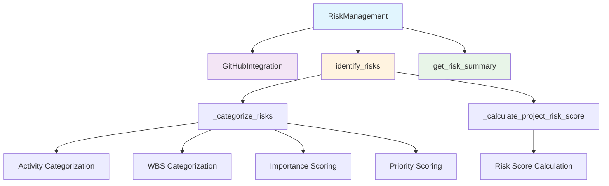

# Risk Management Module Documentation

*Last updated: 2025-08-14*

## Overview

The `risk_management.py` module provides comprehensive risk identification, assessment, and management capabilities for the AutoProjectManagement system. It integrates with GitHub issues to identify risks, categorizes them by activity and WBS elements, calculates risk scores, and provides mitigation strategies.

## Architecture Diagram



## Module Structure

### Class Hierarchy

| Class | Description | Dependencies |
|-------|-------------|--------------|
| `RiskManagement` | Main risk management class | `GitHubIntegration` |

### Standalone Functions
| Function | Description | Purpose |
|----------|-------------|---------|
| `identify_risks` | Backward compatibility function | Extract risks from project data |
| `assess_risk_impact` | Risk impact assessment | Calculate quantitative risk impact |
| `mitigate_risk` | Risk mitigation | Implement mitigation strategies |

## Detailed Method Documentation

### RiskManagement Class

#### Constructor
```python
def __init__(self, github_integration: GitHubIntegration) -> None
```

**Purpose:** Initializes the risk management system with GitHub integration.

**Parameters:**
| Parameter | Type | Required | Description |
|-----------|------|----------|-------------|
| `github_integration` | `GitHubIntegration` | Yes | GitHub integration instance for API access |

**Internal State Initialization:**
- `risk_issues`: List of identified risk issues
- `project_risk_score`: Overall project risk score (0.0 initially)
- `activity_risks`: Risks categorized by activity
- `wbs_risks`: Risks categorized by WBS elements
- `activity_importance`: Importance scores for activities
- `activity_priority`: Priority scores for activities

#### identify_risks Method
```python
def identify_risks(self) -> List[Dict[str, Any]]
```

**Purpose:** Identifies and categorizes risks from GitHub issues labeled as 'risk'.

**Process Flow:**
1. Fetch all open GitHub issues
2. Filter issues with 'risk' label (case-insensitive)
3. Categorize risks by activity and WBS
4. Calculate overall project risk score

**Returns:** `List[Dict[str, Any]]` - List of risk issues with complete details

**Example Output:**
```json
[
  {
    "number": 123,
    "title": "Security vulnerability in authentication",
    "labels": [
      {"name": "risk", "color": "d73a4a"},
      {"name": "activity:authentication", "color": "7057ff"},
      {"name": "importance:0.8", "color": "ffffff"}
    ],
