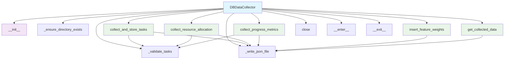

# Database Data Collector Module Documentation

*Last updated: 2025-08-14*

## Overview

The `db_data_collector.py` module is a core component of the AutoProjectManagement system that provides comprehensive data collection and storage capabilities for project management data. This module handles the collection, validation, serialization, and storage of various project data types including tasks, resource allocation, progress metrics, and feature weights.

## Architecture Diagram



## Module Structure

### Class Hierarchy

| Class | Description | Inheritance |
|-------|-------------|-------------|
| `DBDataCollector` | Database data collection and storage | - |

### Key Components

| Component | Type | Purpose |
|-----------|------|---------|
| `data_dir` | Configuration | Directory path for storing JSON files |
| `tasks_file` | Configuration | Path to tasks JSON file |
| `resource_allocation_file` | Configuration | Path to resource allocation JSON file |
| `progress_metrics_file` | Configuration | Path to progress metrics JSON file |
| `feature_weights_file` | Configuration | Path to feature weights JSON file |

## Detailed Method Documentation

### DBDataCollector Class

#### Constructor
```python
def __init__(self, data_dir: str = DEFAULT_DATA_DIR) -> None
```

**Purpose:** Initializes the Database Data Collector with the specified data directory.

**Parameters:**
| Parameter | Type | Required | Description | Default |
|-----------|------|----------|-------------|---------|
| `data_dir` | `str` | No | Directory path for storing JSON files | `'SystemInputs/user_inputs'` |

**Validation Rules:**
- `data_dir` must be a non-empty string
- Directory will be created if it doesn't exist

**Raises:**
- `ValueError`: If data_dir is empty or None
- `OSError`: If directory creation fails

#### _ensure_directory_exists Method
```python
def _ensure_directory_exists(self) -> None
```

**Purpose:** Ensures the data directory exists, creating it if necessary.

**Error Handling:**
- `OSError`: If directory creation fails, error is logged and exception is raised

#### _validate_tasks Method
```python
def _validate_tasks(self, tasks: List[Any]) -> bool
```

**Purpose:** Validates the tasks list for data integrity and proper structure.

**Parameters:**
| Parameter | Type | Required | Description |
|-----------|------|----------|-------------|
| `tasks` | `List[Any]` | Yes | List of task objects to validate |

**Returns:** `bool` - True if all tasks are valid, False otherwise

**Validation Rules:**
- Tasks must be a list
- Each task must have `__dict__` attribute for serialization
- Empty lists are considered valid (warning logged)

#### _write_json_file Method
```python
def _write_json_file(self, file_path: str, data: Any) -> bool
```

**Purpose:** Writes data to a JSON file with comprehensive error handling.

**Parameters:**
| Parameter | Type | Required | Description |
|-----------|------|----------|-------------|
| `file_path` | `str` | Yes | Path to the JSON file |
| `data` | `Any` | Yes | Data to write to the file |

**Returns:** `bool` - True if successful, False otherwise

**Error Handling:**
- `IOError`: File access errors
- `OSError`: Operating system errors
- `json.JSONEncodeError`: JSON serialization errors

#### collect_and_store_tasks Method
```python
def collect_and_store_tasks(self, tasks: List[Any]) -> bool
```

**Purpose:** Collects task data including progress, resource allocation, and stores it in JSON format.

**Parameters:**
| Parameter | Type | Required | Description |
|-----------|------|----------|-------------|
| `tasks` | `List[Any]` | Yes | List of task objects to collect and store |

**Returns:** `bool` - True if successful, False otherwise

**Process:**
1. Validates task list structure
2. Serializes task objects to dictionaries
3. Writes to JSON file with proper formatting
4. Handles errors gracefully with detailed logging

**Output Structure:**
```json
[
  {
    "id": "task_001",
    "title": "Complete documentation",
    "assigned_to": ["user1", "user2"],
    "progress": 75,
    "deadline": "2025-08-20"
  }
]
```

#### collect_resource_allocation Method
```python
def collect_resource_allocation(self, tasks: List[Any]) -> bool
```

**Purpose:** Analyzes resource allocation across tasks and stores summary data.

**Parameters:**
| Parameter | Type | Required | Description |
|-----------|------|----------|-------------|
| `tasks` | `List[Any]` | Yes | List of task objects to analyze |

**Returns:** `bool` - True if successful, False otherwise

**Analysis:**
- Counts tasks assigned to each user/team member
- Creates resource usage summary
- Handles various assignment formats

**Output Structure:**
```json
{
  "user1": 5,
  "user2": 3,
  "team_alpha": 8
}
```

#### collect_progress_metrics Method
```python
def collect_progress_metrics(self, tasks: List[Any]) -> bool
```

**Purpose:** Collects progress percentages from tasks and stores them for analysis.

**Parameters:**
| Parameter | Type | Required | Description |
|-----------|------|----------|-------------|
| `tasks` | `List[Any]` | Yes | List of task objects to collect progress from |

**Returns:** `bool` - True if successful, False otherwise

**Validation:**
- Progress values must be between 0 and 100
- Tasks must have `id` and `workflow_progress_percentage` methods
- Invalid progress values are logged as warnings

**Output Structure:**
```json
{
  "task_001": 75,
  "task_002": 50,
  "task_003": 100
}
```

#### insert_feature_weights Method
```python
def insert_feature_weights(self, urgency_weights: Dict[str, float], 
                          importance_weights: Dict[str, float]) -> bool
```

**Purpose:** Stores predefined weights for urgency and importance feature calculations.

**Parameters:**
| Parameter | Type | Required | Description |
|-----------|------|----------|-------------|
| `urgency_weights` | `Dict[str, float]` | Yes | Dictionary of urgency feature weights |
| `importance_weights` | `Dict[str, float]` | Yes | Dictionary of importance feature weights |

**Returns:** `bool` - True if successful, False otherwise

**Validation Rules:**
- Weights must be dictionaries
- Each weight value must be between 0 and 1
- Invalid weights are rejected with detailed error messages

**Output Structure:**
```json
{
  "urgency_weights": {
    "deadline": 0.4,
    "priority": 0.6
  },
  "importance_weights": {
    "impact": 0.5,
    "effort": 0.5
  },
  "metadata": {
    "created_at": "2025-08-14 10:30:00",
    "version": "1.0.0"
  }
}
```

#### get_collected_data Method
```python
def get_collected_data(self, data_type: str) -> Optional[Dict[str, Any]]
```

**Purpose:** Retrieves previously collected data from JSON files.

**Parameters:**
| Parameter | Type | Required | Description |
|-----------|------|----------|-------------|
