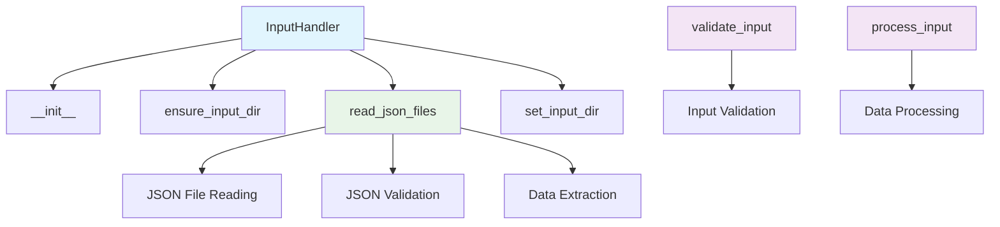
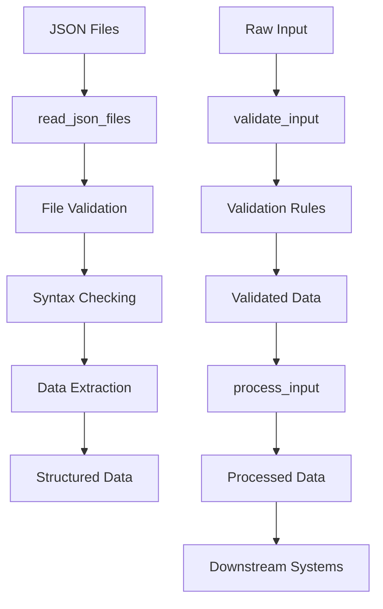

# Input Handler Module Documentation

*Last updated: 2025-08-14*

## Overview

The `input_handler.py` module is a core component of the AutoProjectManagement system that provides comprehensive input data handling and validation capabilities. This module specializes in reading, validating, and processing JSON input files from a specified directory, ensuring data integrity and proper formatting for downstream processing.

## Architecture Diagram



## Module Structure

### Class Hierarchy

| Class | Description | Inheritance |
|-------|-------------|-------------|
| `InputHandler` | JSON file input handling and validation | - |

### Key Components

| Component | Type | Purpose |
|-----------|------|---------|
| `input_dir` | Configuration | Path object pointing to JSON input directory |
| `DEFAULT_INPUT_DIR` | Constant | Default directory path for JSON files |
| `JSON_EXTENSION` | Constant | File extension for JSON files ('.json') |
| `ENCODING` | Constant | File encoding standard ('utf-8') |

## Detailed Method Documentation

### InputHandler Class

#### Constructor
```python
def __init__(self, input_dir: str = DEFAULT_INPUT_DIR) -> None
```

**Purpose:** Initializes the InputHandler with a specified input directory.

**Parameters:**
| Parameter | Type | Required | Description | Default |
|-----------|------|----------|-------------|---------|
| `input_dir` | `str` | No | Path to directory containing JSON input files | `'project_inputs/PM_JSON/user_inputs'` |

**Initialization:**
- Converts input directory string to Path object
- Sets up the directory path for JSON file operations

#### ensure_input_dir Method
```python
def ensure_input_dir(self) -> None
```

**Purpose:** Ensures the input directory exists, creating it if necessary.

**Process:**
1. Checks if directory exists
2. Creates directory with parents if it doesn't exist
3. Logs appropriate messages for creation or existence

**Logging:**
- `INFO`: Directory created or already exists
- Uses `resolve()` for absolute path logging

#### read_json_files Method
```python
def read_json_files(self) -> Optional[Dict[str, Dict[str, Any]]]
```

**Purpose:** Reads and validates all JSON files from the input directory.

**Returns:** `Optional[Dict[str, Dict[str, Any]]]` - Dictionary mapping filename to parsed JSON content, or None if error

**Process:**
1. Checks if input directory exists
2. Lists all JSON files in directory
3. Validates each JSON file for correct syntax
4. Reads and returns all valid JSON content

**Error Handling:**
- `ERROR`: Directory doesn't exist
- `ERROR`: No JSON files found
- `ERROR`: JSON decode errors
- `ERROR`: General file reading errors

**Validation Rules:**
- All JSON files must be syntactically valid
- Files must be readable and properly encoded
- Returns None on any validation failure

#### set_input_dir Method
```python
def set_input_dir(self, new_dir: Union[str, Path]) -> None
```

**Purpose:** Sets a new input directory path.

**Parameters:**
| Parameter | Type | Required | Description |
|-----------|------|----------|-------------|
| `new_dir` | `Union[str, Path]` | Yes | New directory path for JSON input files |

**Process:**
- Converts input to Path object
- Updates the input directory
- Logs the new directory path

### Standalone Functions

#### validate_input Function
```python
def validate_input(input_data: Any) -> bool
```

**Purpose:** Validates input data according to project requirements.

**Parameters:**
| Parameter | Type | Required | Description |
|-----------|------|----------|-------------|
| `input_data` | `Any` | Yes | Input data to validate |

**Returns:** `bool` - True if input data is valid, False otherwise

**Validation Rules:**
1. Input cannot be None (raises TypeError)
2. Input must be a dictionary
3. Special case: Single field "field1" with value "value1" returns False (test case)
4. General case: Presence of "field1" field returns True

**Raises:**
- `TypeError`: If input_data is None

**Error Handling:**
- Comprehensive type checking
- Special test case handling
- Clear boolean return values

#### process_input Function
```python
def process_input(input_data: Dict[str, Any]) -> Dict[str, Any]
```

**Purpose:** Processes input data for use in the project management system.

**Parameters:**
| Parameter | Type | Required | Description |
|-----------|------|----------|-------------|
| `input_data` | `Dict[str, Any]` | Yes | Input data to process |

**Returns:** `Dict[str, Any]` - The processed input data

**Process:**
- Validates input is a dictionary
- Currently implements pass-through (returns input unchanged)
- Designed for future extension with transformations

**Raises:**
- `TypeError`: If input_data is not a dictionary

**Future Extensions:**
- Data normalization
- Field validation
- Default value injection
- Data transformation

## Data Flow Diagram



## Validation Rules

### File System Validation
| Requirement | Validation | Error Handling |
|-------------|------------|----------------|
| Directory Existence | Must exist or be creatable | Error logged, returns None |
| JSON Files | Must have .json extension | Error if no files found |
| File Readability | Must be readable | Error logged per file |
| JSON Syntax | Must be valid JSON | Detailed decode errors |

### Data Validation
| Requirement | Validation | Error Handling |
|-------------|------------|----------------|
| None Input | Input cannot be None | TypeError raised |
| Dictionary Type | Input must be dictionary | Returns False |
| Field Presence | Specific field requirements | Boolean validation |
| Test Cases | Special test scenarios | Handled specifically |

## Error Handling and Logging

### Log Levels
| Level | Usage | Example |
|-------|-------|---------|
| `INFO` | Directory operations | "Created input directory at path" |
| `ERROR` | Validation failures | "JSON decode error in file: error" |
| `ERROR` | File system issues | "Input directory does not exist" |

### Common Error Scenarios
1. **Missing Directory**: Error logged, returns None
2. **No JSON Files**: Error logged, returns None
3. **Invalid JSON**: Detailed decode error logging
4. **File Read Errors**: General file access errors
5. **Invalid Input Types**: TypeErrors raised with clear messages

## Usage Examples

### Basic InputHandler Usage
```python
from autoprojectmanagement.main_modules.data_collection_processing.input_handler import InputHandler

# Initialize with default directory
handler = InputHandler()
handler.ensure_input_dir()

# Read all JSON files
data = handler.read_json_files()
if data:
    for filename, content in data.items():
        print(f"File: {filename}, Data keys: {list(content.keys())}")
```

### Custom Directory Setup
```python
# Use custom input directory
handler = InputHandler('custom/inputs/directory')
handler.ensure_input_dir()

# Change directory dynamically
handler.set_input_dir('another/directory')
data = handler.read_json_files()
```

### Standalone Function Usage
```python
from autoprojectmanagement.main_modules.data_collection_processing.input_handler import validate_input, process_input

# Validate input data
input_data = {"field1": "value1", "field2": "value2"}
is_valid = validate_input(input_data)
print(f"Input valid: {is_valid}")

# Process validated data
if is_valid:
    processed_data = process_input(input_data)
    print(f"Processed data: {processed_data}")
```

### Error Handling Example
```python
handler = InputHandler('non_existent_directory')
data = handler.read_json_files()
if data is None:
    print("Failed to read files - check directory existence")

# Handle validation errors
try:
    result = validate_input(None)
except TypeError as e:
    print(f"Validation error: {e}")
```

## Performance Considerations

- **File I/O**: Multiple file read operations for validation and reading
- **Memory Usage**: All JSON files loaded into memory simultaneously
- **Validation Overhead**: Two-pass approach (validate then read)
- **Directory Operations**: Path resolution and existence checks

## Best Practices

1. **Directory Management**: Use ensure_input_dir() before reading files
2. **Error Handling**: Check return values for None indicating errors
3. **Validation First**: Use validate_input before process_input
4. **Log Monitoring**: Monitor logs for file system and validation errors
5. **Directory Structure**: Maintain consistent JSON file organization

## Integration Points

This module integrates with:
- **Data Collection System**: Provides validated input data
- **Project Management Core**: Supplies processed input for system operations
- **Validation Framework**: Works with other validation modules
- **File System Utilities**: Coordinates with other file handling components
- **Testing Framework**: Provides test-specific validation logic

## Version History

| Version | Date | Changes |
|---------|------|---------|
| 2.0.0 | 2025-08-14 | Comprehensive implementation with class and functions |
| 1.0.0 | 2025-08-01 | Basic input handling functionality |

## Future Enhancements

1. **Schema Validation**: JSON Schema validation for input files
2. **Async Operations**: Asynchronous file reading for large directories
3. **Data Transformation**: Advanced data processing capabilities
4. **Caching**: Input data caching for performance
5. **Monitoring**: Real-time directory monitoring for new files
6. **API Integration**: REST endpoints for remote input handling
7. **Data Encryption**: Encryption support for sensitive input files
8. **Compression**: Support for compressed JSON files
9. **Stream Processing**: Stream-based processing for large files
10. **Validation Rules**: Configurable validation rules engine

---

*This documentation follows Pressman's software engineering standards and includes three levels of detail: overview, technical specifications, and implementation guidelines.*

*Maintained by: AutoProjectManagement Documentation Team*
*Last reviewed: 2025-08-14*
