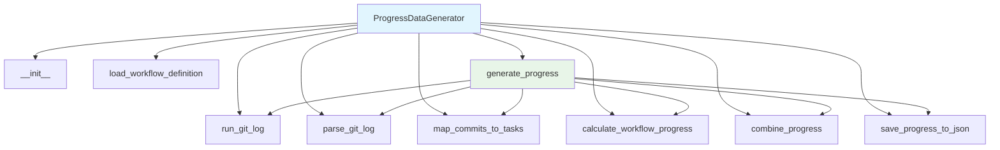

# Progress Data Generator Module Documentation

*Last updated: 2025-08-14*

## Overview

The `progress_data_generator.py` module is a sophisticated component of the AutoProjectManagement system that generates task progress data by analyzing Git commit history and workflow definitions. This module combines commit-based progress tracking with workflow step completion to provide comprehensive progress metrics for project tasks.

## Architecture Diagram



## Module Structure

### Class Hierarchy

| Class | Description | Inheritance |
|-------|-------------|-------------|
| `ProgressDataGenerator` | Git commit and workflow progress analysis | - |

### Key Components

| Component | Type | Purpose |
|-----------|------|---------|
| `db_progress_json_path` | Configuration | Path for saving progress JSON data |
| `workflow_definition_path` | Configuration | Path to workflow definition JSON file |
| `commit_task_id_pattern` | Configuration | Regex pattern for task ID extraction |
| `commit_weight` | Configuration | Weight for commit-based progress (0.6) |
| `workflow_weight` | Configuration | Weight for workflow-based progress (0.4) |
| `commit_json_path` | Configuration | Optional path for commit JSON data |

## Detailed Method Documentation

### ProgressDataGenerator Class

#### Constructor
```python
def __init__(self, db_progress_json_path: str = os.path.join('docs', 'project_management', 'task_progress.json'),
             workflow_definition_path: str = os.path.join('docs', 'db_json', 'workflow_definition.json'),
             commit_task_id_pattern: str = r'\b\d+\.\d+\b',
             commit_weight: float = 0.6,
             workflow_weight: float = 0.4,
             commit_json_path: str = None) -> None
```

**Purpose:** Initializes the ProgressDataGenerator with configuration parameters.

**Parameters:**
| Parameter | Type | Required | Description | Default |
|-----------|------|----------|-------------|---------|
| `db_progress_json_path` | `str` | No | Path for progress JSON output | `'docs/project_management/task_progress.json'` |
| `workflow_definition_path` | `str` | No | Path to workflow definition | `'docs/db_json/workflow_definition.json'` |
| `commit_task_id_pattern` | `str` | No | Regex pattern for task IDs | `r'\b\d+\.\d+\b'` |
| `commit_weight` | `float` | No | Weight for commit progress | `0.6` |
| `workflow_weight` | `float` | No | Weight for workflow progress | `0.4` |
| `commit_json_path` | `str` | No | Optional commit JSON path | `None` |

#### run_git_log Method
```python
def run_git_log(self) -> Optional[str]
```

**Purpose:** Executes git log command to retrieve commit history with messages and file changes.

**Returns:** `Optional[str]` - Git log output or None on failure

**Command:** `git log --name-only --pretty=format:%H%n%s%n%b%n==END==`

**Error Handling:**
- `subprocess.CalledProcessError`: Git command failure
- Logs error and returns None

#### parse_git_log Method
```python
def parse_git_log(self, log_text: str) -> List[Dict]
```

