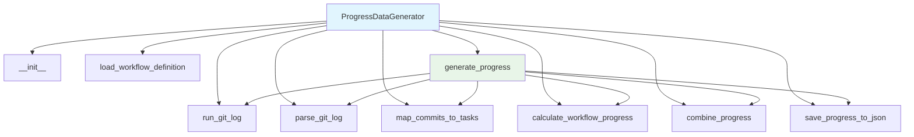

# Progress Data Generator Module Documentation

*Last updated: 2025-08-14*

## Overview

The `progress_data_generator.py` module is a sophisticated component of the AutoProjectManagement system that generates task progress data by analyzing Git commit history and workflow definitions. This module combines commit-based progress tracking with workflow step completion to provide comprehensive progress metrics for project tasks.

## Architecture Diagram

## Module Structure

### Class Hierarchy

| Class | Description | Inheritance |
|-------|-------------|-------------|
| `ProgressDataGenerator` | Git commit and workflow progress analysis | - |

### Key Components

| Component | Type | Purpose |
|-----------|------|---------|
| `db_progress_json_path` | Configuration | Path for saving progress JSON data |
| `workflow_definition_path` | Configuration | Path to workflow definition JSON file |
| `commit_task_id_pattern` | Configuration | Regex pattern for task ID extraction |
| `commit_weight` | Configuration | Weight for commit-based progress (0.6) |
