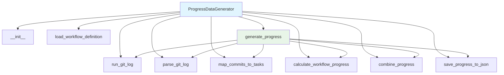
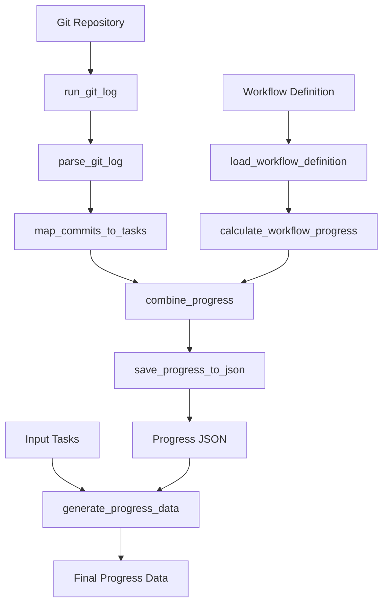

# Progress Data Generator Module Documentation

*Last updated: 2025-08-14*

## Overview

The `progress_data_generator.py` module is a sophisticated component of the AutoProjectManagement system that generates task progress data by analyzing Git commit history and workflow definitions. This module combines commit-based progress tracking with workflow step completion to provide comprehensive progress metrics for project tasks.

## Architecture Diagram



## Module Structure

### Class Hierarchy

| Class | Description | Inheritance |
|-------|-------------|-------------|
| `ProgressDataGenerator` | Git commit and workflow progress analysis | - |

### Key Components

| Component | Type | Purpose |
|-----------|------|---------|
| `db_progress_json_path` | Configuration | Path for saving progress JSON data |
| `workflow_definition_path` | Configuration | Path to workflow definition JSON file |
| `commit_task_id_pattern` | Configuration | Regex pattern for task ID extraction |
| `commit_weight` | Configuration | Weight for commit-based progress (0.6) |
| `workflow_weight` | Configuration | Weight for workflow-based progress (0.4) |
| `commit_json_path` | Configuration | Optional path for commit JSON data |

## Detailed Method Documentation

### ProgressDataGenerator Class

#### Constructor
```python
def __init__(self, db_progress_json_path: str = os.path.join('docs', 'project_management', 'task_progress.json'),
             workflow_definition_path: str = os.path.join('docs', 'db_json', 'workflow_definition.json'),
             commit_task_id_pattern: str = r'\b\d+\.\d+\b',
             commit_weight: float = 0.6,
             workflow_weight: float = 0.4,
             commit_json_path: str = None) -> None
```

**Purpose:** Initializes the ProgressDataGenerator with configuration parameters.

**Parameters:**
| Parameter | Type | Required | Description | Default |
|-----------|------|----------|-------------|---------|
| `db_progress_json_path` | `str` | No | Path for progress JSON output | `'docs/project_management/task_progress.json'` |
| `workflow_definition_path` | `str` | No | Path to workflow definition | `'docs/db_json/workflow_definition.json'` |
| `commit_task_id_pattern` | `str` | No | Regex pattern for task IDs | `r'\b\d+\.\d+\b'` |
| `commit_weight` | `float` | No | Weight for commit progress | `0.6` |
| `workflow_weight` | `float` | No | Weight for workflow progress | `0.4` |
| `commit_json_path` | `str` | No | Optional commit JSON path | `None` |

#### run_git_log Method
```python
def run_git_log(self) -> Optional[str]
```

**Purpose:** Executes git log command to retrieve commit history with messages and file changes.

**Returns:** `Optional[str]` - Git log output or None on failure

**Command:** `git log --name-only --pretty=format:%H%n%s%n%b%n==END==`

**Error Handling:**
- `subprocess.CalledProcessError`: Git command failure
- Logs error and returns None

#### parse_git_log Method
```python
def parse_git_log(self, log_text: str) -> List[Dict]
```

**Purpose:** Parses git log output into structured commit data.

**Parameters:**
| Parameter | Type | Required | Description |
|-----------|------|----------|-------------|
| `log_text` | `str` | Yes | Raw git log output |

**Returns:** `List[Dict]` - List of commit dictionaries

**Commit Structure:**
```python
{
    "hash": "commit_hash",
    "message": "commit_message",
    "files": ["file1", "file2"]
}
```

**Parsing Logic:**
- Splits on `==END==` delimiter
- Extracts commit hash, message, and changed files
- Handles multi-line commit messages

#### load_workflow_definition Method
```python
def load_workflow_definition(self) -> List[Dict]
```

**Purpose:** Loads workflow definition from JSON file.

**Returns:** `List[Dict]` - Workflow definition data or empty list on error

**Error Handling:**
- File not found or read errors
- JSON decode errors
- Returns empty list on failure

#### map_commits_to_tasks Method
```python
def map_commits_to_tasks(self, commits: List[Dict]) -> Dict[str, float]
```

**Purpose:** Maps commits to tasks using regex pattern matching on commit messages.

**Parameters:**
| Parameter | Type | Required | Description |
|-----------|------|----------|-------------|
| `commits` | `List[Dict]` | Yes | List of parsed commit data |

**Returns:** `Dict[str, float]` - Task ID to progress percentage mapping

**Process:**
1. Uses regex pattern to find task IDs in commit messages
2. Counts commits per task ID
3. Normalizes counts to 0-100 scale
4. Returns progress percentages

**Normalization:**
```python
progress = (commit_count / max_count) * 100
```

#### calculate_workflow_progress Method
```python
def calculate_workflow_progress(self) -> Dict[str, float]
```

**Purpose:** Calculates progress based on workflow step completion (placeholder implementation).

**Returns:** `Dict[str, float]` - Empty dictionary (to be implemented)

**Note:** Currently returns empty dict - requires implementation of task-step mapping

#### combine_progress Method
```python
def combine_progress(self, commit_progress: Dict[str, float], workflow_progress: Dict[str, float]) -> Dict[str, float]
```

**Purpose:** Combines commit-based and workflow-based progress using configured weights.

**Parameters:**
| Parameter | Type | Required | Description |
|-----------|------|----------|-------------|
| `commit_progress` | `Dict[str, float]` | Yes | Commit-based progress data |
| `workflow_progress` | `Dict[str, float]` | Yes | Workflow-based progress data |

**Returns:** `Dict[str, float]` - Combined progress data

**Formula:**
```python
combined = (commit_progress * commit_weight) + (workflow_progress * workflow_weight)
```

#### save_progress_to_json Method
```python
def save_progress_to_json(self, progress_data: Dict[str, float]) -> None
```

**Purpose:** Saves progress data to JSON file with proper directory creation.

**Parameters:**
| Parameter | Type | Required | Description |
|-----------|------|----------|-------------|
| `progress_data` | `Dict[str, float]` | Yes | Progress data to save |

**Process:**
- Creates directory if it doesn't exist
- Saves JSON with proper formatting
- Handles file write errors

#### generate_progress Method
```python
def generate_progress(self) -> None
```

**Purpose:** Main method to generate progress data from Git and workflow sources.

**Process Flow:**
1. Run git log command
2. Parse commit data
3. Map commits to tasks
4. Calculate workflow progress
5. Combine progress metrics
6. Save to JSON file

### Standalone Function

#### generate_progress_data Function
```python
def generate_progress_data(input_data) -> Dict[str, Any]
```

**Purpose:** Generates progress data and merges with input task data.

**Parameters:**
| Parameter | Type | Required | Description |
|-----------|------|----------|-------------|
| `input_data` | `Dict` | Yes | Input data containing tasks |

**Returns:** `Dict[str, Any]` - Combined progress data

**Validation:**
- Input must be a dictionary
- Tasks must be a list
- Each task must be a dictionary with id and status

**Process:**
1. Generates progress from Git and workflow
2. Loads generated progress data
3. Merges with input task statuses
4. Returns combined progress data

## Data Flow Diagram



## Progress Calculation Formulas

### Commit-Based Progress
```
commit_count = number of commits mentioning task ID
max_count = maximum commit count across all tasks
progress = (commit_count / max_count) * 100
```

### Combined Progress
```
combined_progress = (commit_progress * commit_weight) + (workflow_progress * workflow_weight)
```

### Default Weights
- Commit weight: 0.6 (60%)
- Workflow weight: 0.4 (40%)

## Error Handling and Logging

### Log Levels
| Level | Usage | Example |
|-------|-------|---------|
| `INFO` | Successful operations | "Task progress data saved to path" |
| `WARNING` | Non-critical issues | "No git log data available" |
| `ERROR` | Critical failures | "Git log command failed: error" |

### Common Error Scenarios
1. **Git Command Failure**: subprocess errors logged
2. **File Not Found**: Workflow definition loading errors
3. **JSON Errors**: File read/write failures
4. **Input Validation**: Type errors in generate_progress_data

## Usage Examples

### Basic Progress Generation
```python
from autoprojectmanagement.main_modules.data_collection_processing.progress_data_generator import ProgressDataGenerator

# Initialize with default settings
generator = ProgressDataGenerator()
generator.generate_progress()

# Custom configuration
custom_generator = ProgressDataGenerator(
    db_progress_json_path='custom/progress.json',
    commit_weight=0.7,
    workflow_weight=0.3
)
custom_generator.generate_progress()
```

### Standalone Function Usage
```python
from autoprojectmanagement.main_modules.data_collection_processing.progress_data_generator import generate_progress_data

input_data = {
    "tasks": [
        {"id": "1.1", "status": "in_progress"},
        {"id": "1.2", "status": "completed"}
    ]
}

progress_data = generate_progress_data(input_data)
print(f"Generated progress: {progress_data}")
