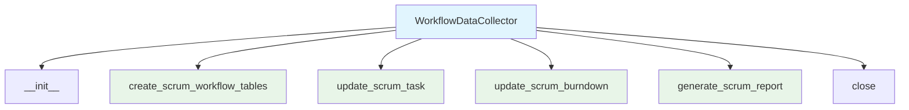

# Workflow Data Collector Module Documentation

*Last updated: 2025-08-14*

## Overview

The `workflow_data_collector.py` module is a specialized component of the AutoProjectManagement system that manages Scrum workflow data collection and reporting. This module handles the storage, updating, and retrieval of Scrum-related data including sprints, tasks, and burndown charts using JSON files as the data storage mechanism.

## Architecture Diagram

## Module Structure

### Class Hierarchy

| Class | Description | Inheritance |
|-------|-------------|-------------|
| `WorkflowDataCollector` | Scrum workflow data management | - |

### Key Components

| Component | Type | Purpose |
|-----------|------|---------|
| `data_dir` | Configuration | Directory path for JSON file storage |
| `scrum_sprints_file` | Configuration | Path to Scrum sprints JSON file |
| `scrum_tasks_file` | Configuration | Path to Scrum tasks JSON file |
| `scrum_burndown_file` | Configuration | Path to Scrum burndown JSON file |

## Detailed Method Documentation

