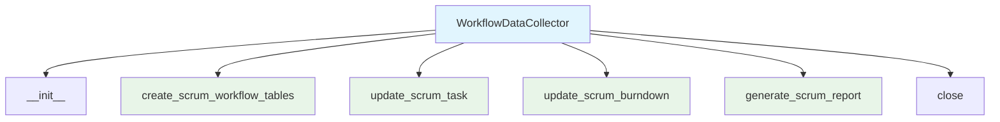
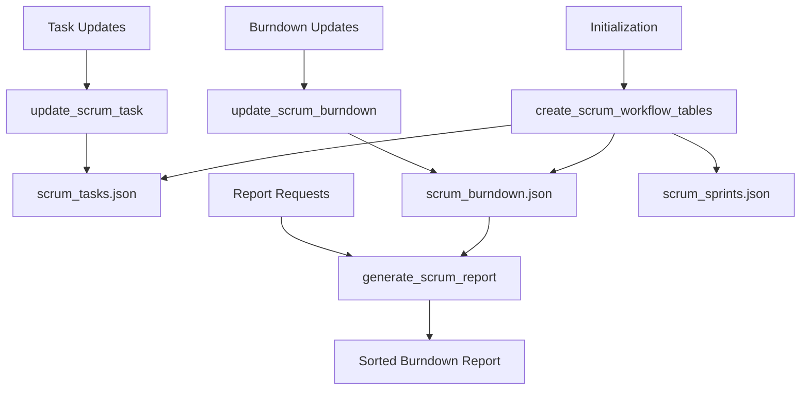

# Workflow Data Collector Module Documentation

*Last updated: 2025-08-14*

## Overview

The `workflow_data_collector.py` module is a specialized component of the AutoProjectManagement system that manages Scrum workflow data collection and reporting. This module handles the storage, updating, and retrieval of Scrum-related data including sprints, tasks, and burndown charts using JSON files as the data storage mechanism.

## Architecture Diagram



## Module Structure

### Class Hierarchy

| Class | Description | Inheritance |
|-------|-------------|-------------|
| `WorkflowDataCollector` | Scrum workflow data management | - |

### Key Components

| Component | Type | Purpose |
|-----------|------|---------|
| `data_dir` | Configuration | Directory path for JSON file storage |
| `scrum_sprints_file` | Configuration | Path to Scrum sprints JSON file |
| `scrum_tasks_file` | Configuration | Path to Scrum tasks JSON file |
| `scrum_burndown_file` | Configuration | Path to Scrum burndown JSON file |

## Detailed Method Documentation

### WorkflowDataCollector Class

#### Constructor
```python
def __init__(self, data_dir='SystemInputs/user_inputs') -> None
```

**Purpose:** Initializes the WorkflowDataCollector with the specified data directory.

**Parameters:**
| Parameter | Type | Required | Description | Default |
|-----------|------|----------|-------------|---------|
| `data_dir` | `str` | No | Directory path for JSON file storage | `'SystemInputs/user_inputs'` |

**File Paths Initialized:**
- `scrum_sprints_file`: `{data_dir}/scrum_sprints.json`
- `scrum_tasks_file`: `{data_dir}/scrum_tasks.json`
- `scrum_burndown_file`: `{data_dir}/scrum_burndown.json`

#### create_scrum_workflow_tables Method
```python
def create_scrum_workflow_tables(self) -> None
```

**Purpose:** Ensures all Scrum JSON files exist, creating them with empty arrays if they don't.

**Process:**
- Checks existence of each Scrum JSON file
- Creates file with empty JSON array `[]` if it doesn't exist
- Uses UTF-8 encoding for proper character handling

**Files Created:**
1. `scrum_sprints.json` - Sprint definitions and metadata
2. `scrum_tasks.json` - Task assignments and status
3. `scrum_burndown.json` - Burndown chart data

#### update_scrum_task Method
```python
def update_scrum_task(self, task_id, sprint_id, title, status, priority, progress) -> None
```

**Purpose:** Updates or adds a Scrum task to the tasks JSON file.

**Parameters:**
| Parameter | Type | Required | Description |
|-----------|------|----------|-------------|
| `task_id` | `Any` | Yes | Unique identifier for the task |
| `sprint_id` | `Any` | Yes | Identifier of the sprint containing the task |
| `title` | `str` | Yes | Title or description of the task |
| `status` | `str` | Yes | Current status of the task |
| `priority` | `Any` | Yes | Priority level of the task |
| `progress` | `Any` | Yes | Progress percentage or indicator |

**Process:**
1. Reads existing tasks from JSON file
2. Removes any existing task with the same `task_id`
3. Adds the updated task with all provided fields
4. Writes back to file with proper formatting

**Task Structure:**
```json
{
  "task_id": "unique_identifier",
  "sprint_id": "sprint_identifier",
  "title": "Task description",
  "status": "in_progress",
  "priority": "high",
  "progress": 75
}
```

#### update_scrum_burndown Method
```python
def update_scrum_burndown(self, sprint_id, day, remaining_work) -> None
```

**Purpose:** Updates burndown chart data for a specific sprint and day.

**Parameters:**
| Parameter | Type | Required | Description |
|-----------|------|----------|-------------|
| `sprint_id` | `Any` | Yes | Identifier of the sprint |
| `day` | `Any` | Yes | Day identifier or number |
| `remaining_work` | `Any` | Yes | Amount of remaining work |

**Process:**
1. Reads existing burndown data from JSON file
2. Removes any existing entry for the same `sprint_id` and `day`
3. Adds the updated burndown entry
4. Writes back to file with proper formatting

**Burndown Structure:**
```json
{
  "sprint_id": "sprint_identifier",
  "day": "day_1",
  "remaining_work": 42
}
```

#### generate_scrum_report Method
```python
def generate_scrum_report(self, sprint_id) -> List[Tuple[Any, Any]]
```

**Purpose:** Generates a Scrum burndown report for a specific sprint.

**Parameters:**
| Parameter | Type | Required | Description |
|-----------|------|----------|-------------|
| `sprint_id` | `Any` | Yes | Identifier of the sprint to report on |

**Returns:** `List[Tuple[Any, Any]]` - Sorted list of (day, remaining_work) tuples

**Process:**
1. Reads burndown data from JSON file
2. Filters entries for the specified `sprint_id`
3. Extracts day and remaining_work values
4. Sorts by day for chronological order

**Report Format:**
```python
[
  ("day_1", 100),
  ("day_2", 85),
  ("day_3", 70),
  # ... sorted by day
]
```

#### close Method
```python
def close(self) -> None
```

**Purpose:** Cleanup method for resource management (currently no-op).

**Note:** Placeholder method for future resource cleanup needs.

## Data Flow Diagram



## Data Structures

### Scrum Tasks JSON Structure
```json
[
  {
    "task_id": "unique_identifier",
    "sprint_id": "sprint_identifier",
    "title": "Task description",
    "status": "in_progress|completed|blocked",
