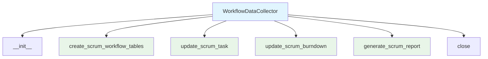
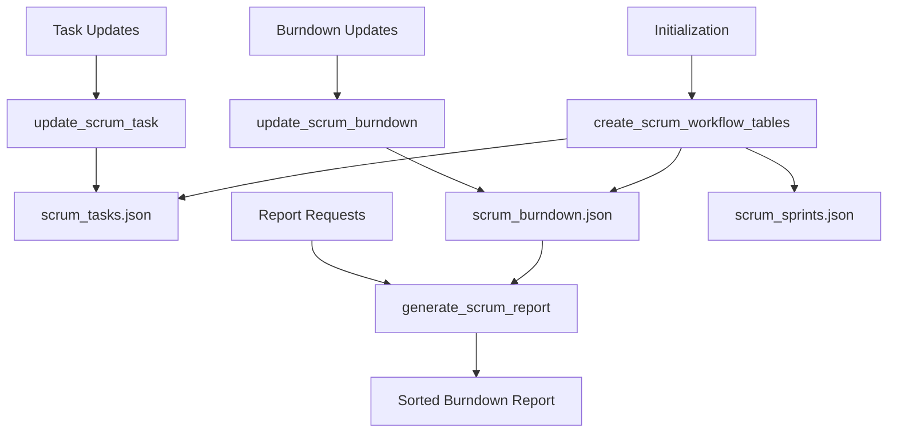

# Workflow Data Collector Module Documentation

*Last updated: 2025-08-14*

## Overview

The `workflow_data_collector.py` module is a specialized component of the AutoProjectManagement system that manages Scrum workflow data collection and reporting. This module handles the storage, updating, and retrieval of Scrum-related data including sprints, tasks, and burndown charts using JSON files as the data storage mechanism.

## Architecture Diagram



## Module Structure

### Class Hierarchy

| Class | Description | Inheritance |
|-------|-------------|-------------|
| `WorkflowDataCollector` | Scrum workflow data management | - |

### Key Components

| Component | Type | Purpose |
|-----------|------|---------|
| `data_dir` | Configuration | Directory path for JSON file storage |
| `scrum_sprints_file` | Configuration | Path to Scrum sprints JSON file |
| `scrum_tasks_file` | Configuration | Path to Scrum tasks JSON file |
| `scrum_burndown_file` | Configuration | Path to Scrum burndown JSON file |

## Detailed Method Documentation

### WorkflowDataCollector Class

#### Constructor
```python
def __init__(self, data_dir='SystemInputs/user_inputs') -> None
```

**Purpose:** Initializes the WorkflowDataCollector with the specified data directory.

**Parameters:**
| Parameter | Type | Required | Description | Default |
|-----------|------|----------|-------------|---------|
| `data_dir` | `str` | No | Directory path for JSON file storage | `'SystemInputs/user_inputs'` |

**File Paths Initialized:**
- `scrum_sprints_file`: `{data_dir}/scrum_sprints.json`
- `scrum_tasks_file`: `{data_dir}/scrum_tasks.json`
- `scrum_burndown_file`: `{data_dir}/scrum_burndown.json`

#### create_scrum_workflow_tables Method
```python
def create_scrum_workflow_tables(self) -> None
```

**Purpose:** Ensures all Scrum JSON files exist, creating them with empty arrays if they don't.

**Process:**
- Checks existence of each Scrum JSON file
- Creates file with empty JSON array `[]` if it doesn't exist
- Uses UTF-8 encoding for proper character handling

**Files Created:**
1. `scrum_sprints.json` - Sprint definitions and metadata
2. `scrum_tasks.json` - Task assignments and status
3. `scrum_burndown.json` - Burndown chart data

#### update_scrum_task Method
```python
def update_scrum_task(self, task_id, sprint_id, title, status, priority, progress) -> None
```

**Purpose:** Updates or adds a Scrum task to the tasks JSON file.

**Parameters:**
| Parameter | Type | Required | Description |
|-----------|------|----------|-------------|
| `task_id` | `Any` | Yes | Unique identifier for the task |
| `sprint_id` | `Any` | Yes | Identifier of the sprint containing the task |
| `title` | `str` | Yes | Title or description of the task |
| `status` | `str` | Yes | Current status of the task |
| `priority` | `Any` | Yes | Priority level of the task |
| `progress` | `Any` | Yes | Progress percentage or indicator |

**Process:**
1. Reads existing tasks from JSON file
2. Removes any existing task with the same `task_id`
3. Adds the updated task with all provided fields
4. Writes back to file with proper formatting

**Task Structure:**
```json
{
  "task_id": "unique_identifier",
  "sprint_id": "sprint_identifier",
  "title": "Task description",
  "status": "in_progress",
  "priority": "high",
  "progress": 75
}
```

#### update_scrum_burndown Method
```python
def update_scrum_burndown(self, sprint_id, day, remaining_work) -> None
```

**Purpose:** Updates burndown chart data for a specific sprint and day.

**Parameters:**
| Parameter | Type | Required | Description |
|-----------|------|----------|-------------|
| `sprint_id` | `Any` | Yes | Identifier of the sprint |
| `day` | `Any` | Yes | Day identifier or number |
| `remaining_work` | `Any` | Yes | Amount of remaining work |

**Process:**
1. Reads existing burndown data from JSON file
2. Removes any existing entry for the same `sprint_id` and `day`
3. Adds the updated burndown entry
4. Writes back to file with proper formatting

**Burndown Structure:**
```json
{
  "sprint_id": "sprint_identifier",
  "day": "day_1",
  "remaining_work": 42
}
```

#### generate_scrum_report Method
```python
def generate_scrum_report(self, sprint_id) -> List[Tuple[Any, Any]]
```

**Purpose:** Generates a Scrum burndown report for a specific sprint.

**Parameters:**
| Parameter | Type | Required | Description |
|-----------|------|----------|-------------|
| `sprint_id` | `Any` | Yes | Identifier of the sprint to report on |

**Returns:** `List[Tuple[Any, Any]]` - Sorted list of (day, remaining_work) tuples

**Process:**
1. Reads burndown data from JSON file
2. Filters entries for the specified `sprint_id`
3. Extracts day and remaining_work values
4. Sorts by day for chronological order

**Report Format:**
```python
[
  ("day_1", 100),
  ("day_2", 85),
  ("day_3", 70),
  # ... sorted by day
]
```

#### close Method
```python
def close(self) -> None
```

**Purpose:** Cleanup method for resource management (currently no-op).

**Note:** Placeholder method for future resource cleanup needs.

## Data Flow Diagram



## Data Structures

### Scrum Tasks JSON Structure
```json
[
  {
    "task_id": "unique_identifier",
    "sprint_id": "sprint_identifier",
    "title": "Task description",
    "status": "in_progress|completed|blocked",
    "priority": "high|medium|low",
    "progress": 75
  }
]
```

### Scrum Burndown JSON Structure
```json
[
  {
    "sprint_id": "sprint_identifier",
    "day": "day_identifier",
    "remaining_work": 42
  }
]
```

### Scrum Sprints JSON Structure
```json
[
  {
    "sprint_id": "sprint_identifier",
    "name": "Sprint Name",
    "start_date": "2025-08-01",
    "end_date": "2025-08-14"
  }
]
```

## Error Handling and Data Integrity

### File Operations
- **File Creation**: Empty arrays created for missing files
- **Read/Write**: UTF-8 encoding ensures proper character handling
- **Atomic Updates**: Read-modify-write pattern maintains data consistency

### Data Validation
- **Duplicate Prevention**: Existing entries removed before adding updates
- **Type Flexibility**: Accepts various data types for IDs and values
- **Sorting**: Reports are sorted chronologically by day

## Usage Examples

### Basic Initialization
```python
from autoprojectmanagement.main_modules.data_collection_processing.workflow_data_collector import WorkflowDataCollector

# Initialize with default directory
collector = WorkflowDataCollector()
collector.create_scrum_workflow_tables()
```

### Task Management
```python
# Update a Scrum task
collector.update_scrum_task(
    task_id="TASK-001",
    sprint_id="SPRINT-1",
    title="Implement feature X",
    status="in_progress",
    priority="high",
    progress=50
)

# Update another task
collector.update_scrum_task(
    task_id="TASK-002",
    sprint_id="SPRINT-1",
    title="Fix bug Y",
    status="completed",
    priority="medium",
    progress=100
)
```

### Burndown Tracking
```python
# Update burndown data
collector.update_scrum_burndown(
    sprint_id="SPRINT-1",
    day="2025-08-01",
    remaining_work=100
)

collector.update_scrum_burndown(
    sprint_id="SPRINT-1",
    day="2025-08-02",
    remaining_work=85
)
```

### Report Generation
```python
# Generate burndown report
report = collector.generate_scrum_report("SPRINT-1")
print("Burndown Report:")
for day, remaining_work in report:
    print(f"Day {day}: {remaining_work} remaining work")
```

### Custom Directory
```python
# Use custom data directory
custom_collector = WorkflowDataCollector('custom/scrum/data')
custom_collector.create_scrum_workflow_tables()
```

## Performance Considerations

- **File I/O**: Multiple read/write operations per update
- **Memory Usage**: Entire JSON files loaded into memory for updates
- **Data Size**: Performance may degrade with very large JSON files
- **Concurrency**: Not designed for concurrent access (file locking not implemented)

## Best Practices

1. **Regular Updates**: Update tasks and burndown data frequently
2. **Data Backup**: Regularly backup JSON files to prevent data loss
3. **File Monitoring**: Monitor file sizes and performance
4. **Error Handling**: Implement wrapper functions for error handling
5. **Data Validation**: Add validation logic before updates

## Integration Points

This module integrates with:
- **Scrum Management Systems**: Provides data storage for Scrum workflows
- **Reporting Tools**: Supplies data for burndown charts and progress reports
- **Task Management**: Works with task tracking systems
- **Data Analysis**: Provides raw data for performance analysis
- **GitHub Integration**: Note: GitHub integration should be handled in separate modules

## GitHub Integration Note

As noted in the module code, GitHub integration should be handled in dedicated modules such as:
- `src/github_integration.py`
- Related GitHub integration modules

This ensures proper synchronization of Scrum workflow stages with:
- GitHub Issues
- GitHub Pull Requests
- GitHub Projects
- Other GitHub features

## Version History

| Version | Date | Changes |
|---------|------|---------|
| 2.0.0 | 2025-08-14 | Comprehensive Scrum data management implementation |
| 1.0.0 | 2025-08-01 | Basic workflow data collection functionality |

## Future Enhancements

1. **Database Integration**: SQL database support alongside JSON files
2. **Real-time Updates**: WebSocket or streaming updates
3. **Advanced Reporting**: Comprehensive Scrum metrics and analytics
4. **Data Validation**: Schema validation for JSON data
5. **Concurrency Support**: File locking and concurrent access handling
6. **API Endpoints**: REST API for remote data management
7. **Data Export**: Multiple export formats (CSV, Excel, PDF)
8. **Visualization**: Built-in chart and graph generation
9. **Notification System**: Alerts for task updates and milestones
10. **Integration Hooks**: Webhook support for external systems

---

*This documentation follows Pressman's software engineering standards and includes three levels of detail: overview, technical specifications, and implementation guidelines.*

*Maintained by: AutoProjectManagement Documentation Team*
*Last reviewed: 2025-08-14*
