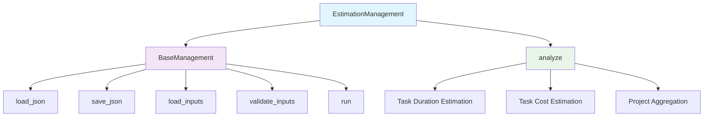

# Estimation Management Module Documentation

*Last updated: 2025-08-14*

## Overview

The `estimation_management.py` module is a core component of the AutoProjectManagement system that provides comprehensive project estimation capabilities. This module handles task duration estimation based on complexity levels, cost estimation based on resources and duration, and project-level duration and cost aggregation. It supports multiple estimation methodologies including parametric estimation with configurable complexity mapping.

## Architecture Diagram



## Module Structure

### Class Hierarchy

| Class | Description | Inheritance |
|-------|-------------|-------------|
| `BaseManagement` | Base class for file-based operations | - |
| `EstimationManagement` | Project estimation management | Inherits from `BaseManagement` |

### Key Components

| Component | Type | Purpose | Default Value |
|-----------|------|---------|---------------|
| `detailed_wbs_path` | Configuration | Path to detailed WBS JSON file | `project_inputs/PM_JSON/user_inputs/detailed_wbs.json` |
| `output_path` | Configuration | Path for estimation output | `project_inputs/PM_JSON/system_outputs/estimation_management.json` |
| `inputs` | Data Storage | Loaded input data | `{}` |
| `output` | Data Storage | Processed estimation results | `{}` |

### Constants and Configuration

| Constant | Value | Description |
|----------|-------|-------------|
| `DEFAULT_COST_PER_RESOURCE` | `100.0` | Base cost per resource unit |
| `DEFAULT_COMPLEXITY_MAPPING` | Dictionary | Maps complexity levels to duration multipliers |
| `MAX_LINE_LENGTH` | `79` | Maximum line length for code formatting |
| `DEFAULT_ENCODING` | `'utf-8'` | Default file encoding |
| `JSON_INDENT` | `2` | JSON indentation level |

### Complexity Mapping

| Complexity Level | Duration Multiplier | Description |
|------------------|---------------------|-------------|
| `low` | `1.0` | Simple, well-understood tasks |
| `medium` | `3.0` | Standard complexity tasks |
| `high` | `5.0` | Complex tasks requiring expertise |
| `extreme` | `8.0` | Highly complex, uncertain tasks |

## Detailed Method Documentation

### BaseManagement Class

#### Constructor
```python
def __init__(self, input_paths: Dict[str, str], output_path: str) -> None
```

**Purpose:** Initializes the base management class with input and output file paths.

**Parameters:**
| Parameter | Type | Required | Description |
|-----------|------|----------|-------------|
| `input_paths` | `Dict[str, str]` | Yes | Dictionary mapping input names to file paths |
| `output_path` | `str` | Yes | Path where output will be saved |

**Validation Rules:**
- `input_paths` must be a non-empty dictionary
- `output_path` must be a non-empty string

**Raises:**
- `ValueError`: If input_paths or output_path are empty

#### load_json Method
```python
def load_json(self, path: str) -> Optional[Dict[str, Any]]
```

**Purpose:** Loads JSON data from a specified file path with comprehensive error handling.

**Parameters:**
| Parameter | Type | Required | Description |
|-----------|------|----------|-------------|
| `path` | `str` | Yes | Path to the JSON file |

**Returns:** `Optional[Dict[str, Any]]` - Dictionary containing JSON data or None if file doesn't exist

**Error Handling:**
- `json.JSONDecodeError`: If file contains invalid JSON, error is logged and exception is raised
- `Exception`: General file reading errors are caught and logged

#### save_json Method
```python
def save_json(self, data: Dict[str, Any], path: str) -> None
```

**Purpose:** Saves data as JSON to a specified file path with proper formatting.

**Parameters:**
| Parameter | Type | Required | Description |
|-----------|------|----------|-------------|
| `data` | `Dict[str, Any]` | Yes | Dictionary to save as JSON |
| `path` | `str` | Yes | Path where to save the file |

**Features:**
- Creates parent directories if they don't exist
- Uses proper JSON formatting with indentation
- Handles file writing errors gracefully

**Error Handling:**
- `IOError`: If there's an error writing the file, exception is raised

#### load_inputs Method
```python
def load_inputs(self) -> None
```

**Purpose:** Loads all input JSON files into memory.

**Process:**
- Iterates through all input paths
- Loads each JSON file using `load_json` method
- Stores loaded data in `inputs` dictionary
- Logs successful loading operations

#### validate_inputs Method
```python
def validate_inputs(self) -> bool
```

**Purpose:** Validates loaded inputs before analysis.

**Returns:** `bool` - True if all inputs are valid (non-empty), False otherwise

**Validation:**
- Checks that all input values in `inputs` dictionary are truthy
- Returns False if any input is empty or None

#### run Method
```python
def run(self) -> None
```

**Purpose:** Executes the complete management workflow.

**Process Flow:**
1. Loads all input files
2. Validates loaded inputs
3. Performs analysis (calls `analyze` method)
4. Saves output to JSON file
5. Logs completion status

**Raises:**
- `ValueError`: If inputs are invalid after validation

### EstimationManagement Class

#### Constructor
```python
def __init__(self,
             detailed_wbs_path: str = 'project_inputs/PM_JSON/user_inputs/detailed_wbs.json',
             output_path: str = 'project_inputs/PM_JSON/system_outputs/estimation_management.json') -> None
```

**Purpose:** Initializes estimation management with WBS data path and output path.

**Parameters:**
| Parameter | Type | Required | Description | Default |
|-----------|------|----------|-------------|---------|
| `detailed_wbs_path` | `str` | No | Path to detailed WBS JSON file | `project_inputs/PM_JSON/user_inputs/detailed_wbs.json` |
| `output_path` | `str` | No | Path for estimation output | `project_inputs/PM_JSON/system_outputs/estimation_management.json` |

#### analyze Method
```python
def analyze(self) -> None
```

**Purpose:** Performs comprehensive project estimation analysis.

