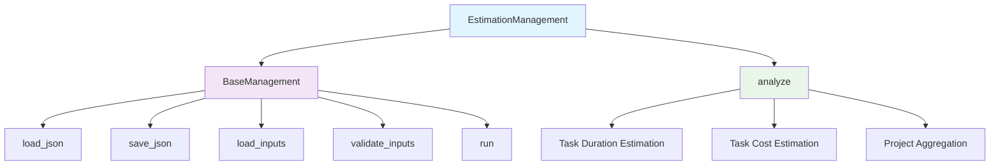

# Estimation Management Module Documentation

*Last updated: 2025-08-14*

## Overview

The `estimation_management.py` module is a core component of the AutoProjectManagement system that provides comprehensive project estimation capabilities. This module handles task duration estimation based on complexity levels, cost estimation based on resources and duration, and project-level duration and cost aggregation. It supports multiple estimation methodologies including parametric estimation with configurable complexity mapping.

## Architecture Diagram

## Module Structure

### Class Hierarchy

| Class | Description | Inheritance |
|-------|-------------|-------------|
| `BaseManagement` | Base class for file-based operations | - |
| `EstimationManagement` | Project estimation management | Inherits from `BaseManagement` |

### Key Components

| Component | Type | Purpose | Default Value |
|-----------|------|---------|---------------|
| `detailed_wbs_path` | Configuration | Path to detailed WBS JSON file | `project_inputs/PM_JSON/user_inputs/detailed_wbs.json` |
| `output_path` | Configuration | Path for estimation output | `project_inputs/PM_JSON/system_outputs/estimation_management.json` |
| `inputs` | Data Storage | Loaded input data | `{}` |
| `output` | Data Storage | Processed estimation results | `{}` |

