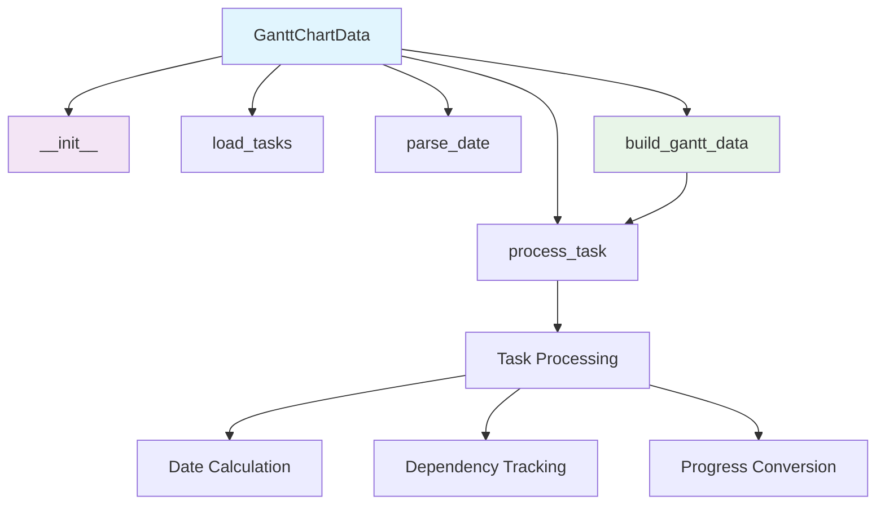
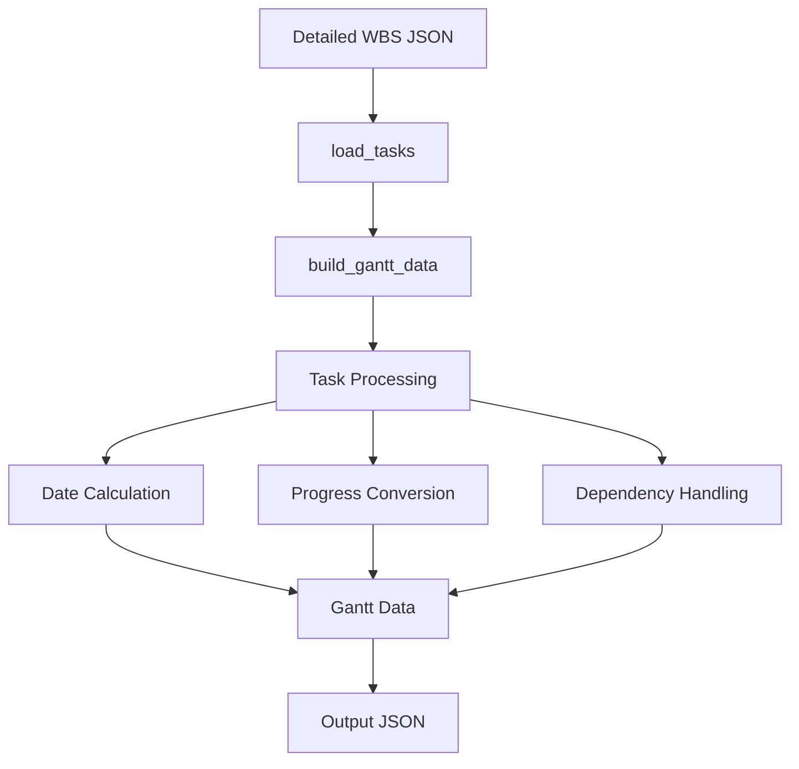

# Gantt Chart Data Module Documentation

*Last updated: 2025-08-14*

## Overview

The `gantt_chart_data.py` module is a core component of the AutoProjectManagement system that provides comprehensive Gantt chart data generation capabilities. This module processes task data from WBS structures and converts it into Gantt chart-compatible format with proper date calculations, dependency tracking, and progress visualization.

## Architecture Diagram



## Module Structure

### Class Hierarchy

| Class | Description | Inheritance |
|-------|-------------|-------------|
| `GanttChartData` | Gantt chart data generation and processing | - |

### Key Components

| Component | Type | Purpose | Default Value |
|-----------|------|---------|---------------|
| `input_dir` | Configuration | Directory path for input JSON files | `project_inputs/PM_JSON/user_inputs` |
| `tasks` | Data Storage | Loaded task data from WBS | `[]` |

## Detailed Method Documentation

### GanttChartData Class

#### Constructor
```python
def __init__(self, input_dir: str = 'project_inputs/PM_JSON/user_inputs')
```

**Purpose:** Initializes the Gantt chart data generator with input directory.

**Parameters:**
| Parameter | Type | Required | Description | Default |
|-----------|------|----------|-------------|---------|
| `input_dir` | `str` | No | Directory path for input JSON files | `project_inputs/PM_JSON/user_inputs` |

#### load_tasks Method
```python
def load_tasks(self) -> None
```

**Purpose:** Loads task data from the detailed WBS JSON file.

**Process:**
- Constructs file path: `input_dir/detailed_wbs.json`
- Loads JSON data with UTF-8 encoding
- Handles file reading errors gracefully
- Stores loaded tasks in `self.tasks`

**Error Handling:**
- File not found: Empty tasks list with error message
- Invalid JSON: Empty tasks list with error message
- General exceptions: Caught and logged

#### parse_date Method
```python
def parse_date(self, date_str: Optional[str]) -> Optional[datetime.date]
```

**Purpose:** Parses date strings into datetime.date objects with validation.

**Parameters:**
| Parameter | Type | Required | Description |
|-----------|------|----------|-------------|
| `date_str` | `Optional[str]` | No | Date string in ISO format (YYYY-MM-DD) |

**Returns:** `Optional[datetime.date]` - Parsed date object or None if invalid

**Validation:**
- Returns None for empty or None input
- Uses `datetime.date.fromisoformat()` for parsing
- Returns None for invalid date formats

#### build_gantt_data Method
```python
def build_gantt_data(self) -> List[Dict[str, Any]]
```

**Purpose:** Builds Gantt chart compatible data structure from loaded tasks.

**Returns:** `List[Dict[str, Any]]` - List of Gantt chart task objects

**Output Structure:**
```json
[
  {
    "id": "task_001",
    "name": "Design Phase",
    "start_date": "2025-01-15",
    "end_date": "2025-01-22",
    "dependencies": ["task_002"],
    "progress": 75
  }
]
```

**Process:**
1. Recursively processes all tasks and subtasks
2. Calculates end dates from start dates and durations
3. Handles date inheritance for subtasks
4. Converts progress to percentage format
5. Preserves task dependencies

#### process_task Method (Internal)
```python
def process_task(self, task, parent_start: Optional[datetime.date] = None) -> None
```

**Purpose:** Internal recursive method to process individual tasks for Gantt chart.

**Parameters:**
| Parameter | Type | Required | Description |
|-----------|------|----------|-------------|
| `task` | `Dict[str, Any]` | Yes | Task dictionary to process |
| `parent_start` | `Optional[datetime.date]` | No | Start date inherited from parent task |

**Process:**
- Extracts task ID, name, and metadata
- Calculates start date (inherits from parent if not specified)
- Calculates end date from duration
- Handles progress conversion (0-100 scale)
- Processes all subtasks recursively

### Utility Functions

#### generate_gantt_chart Function
```python
def generate_gantt_chart(tasks) -> Dict[str, Any]
```

**Purpose:** Generates Gantt chart data from a list of tasks with comprehensive validation.

**Parameters:**
| Parameter | Type | Required | Description |
|-----------|------|----------|-------------|
| `tasks` | `List[Dict[str, Any]]` | Yes | List of task dictionaries |

**Returns:** `Dict[str, Any]` - Gantt chart data structure

**Validation Rules:**
- Tasks must be a non-None list
- Each task must be a non-None dictionary
- Each task must have 'id', 'start', and 'end' fields
- Dates must be valid ISO format strings
- Start date cannot be after end date
- Task name must be string or None

**Raises:**
- `TypeError`: For invalid input types
- `KeyError`: For missing required fields
- `ValueError`: For invalid date formats or logic

## Data Flow Diagram



## Gantt Chart Data Structure

### Required Fields
| Field | Type | Description | Validation |
|-------|------|-------------|------------|
| `id` | `str` | Unique task identifier | Required, must be present |
| `name` | `str` | Task name/description | Optional, defaults to "Task {id}" |
| `start_date` | `str` | Start date in ISO format | Required, valid date |
| `end_date` | `str` | End date in ISO format | Calculated from start + duration |
| `dependencies` | `List[str]` | List of dependent task IDs | Optional, list of valid task IDs |
| `progress` | `int` | Progress percentage (0-100) | Optional, defaults to 0 |

### Date Calculation Logic
```
end_date = start_date + datetime.timedelta(days=duration_days)
```

Where:
- `duration_days` is extracted from task['duration_days'] or task['duration'] or defaults to 1
- If no start_date specified, inherits from parent task or uses current date

### Progress Conversion
- Float progress (0.0-1.0) is converted to percentage (0-100)
- Integer progress is used as-is
- Defaults to 0 if not specified

## Validation Rules

### Input Validation
| Requirement | Validation | Error Handling |
|-------------|------------|----------------|
| Tasks List | Must be a list | TypeError raised |
| Task Structure | Must be dictionary | TypeError raised |
| Required Fields | Must have id, start, end | KeyError raised |
| Date Format | Must be ISO format | ValueError raised |
| Date Logic | Start ≤ End | ValueError raised |

### Data Processing
| Requirement | Validation | Default Behavior |
|-------------|------------|------------------|
| Missing Start Date | Inherit from parent or use today | Current date used |
| Missing Duration | Default to 1 day | 1 day duration used |
| Missing Progress | Default to 0% | 0 progress used |
| Invalid Dates | Use fallback dates | Current date used |

## Error Handling and Logging

### Log Levels
| Level | Usage | Example |
|-------|-------|---------|
| `INFO` | Successful operations | (Console output for file operations) |
| `ERROR` | Critical failures | "Error loading tasks for Gantt chart: {e}" |

### Common Error Scenarios
1. **File Not Found**: Error logged, empty tasks list returned
2. **Invalid JSON**: Error logged, empty tasks list returned
3. **Missing Required Fields**: Exception raised with detailed message
4. **Invalid Date Formats**: Exception raised or fallback used
5. **Type Errors**: Exception raised with type information

## Usage Examples

### Basic Usage
```python
from autoprojectmanagement.main_modules.planning_estimation.gantt_chart_data import GanttChartData

# Initialize with default directory
generator = GanttChartData()
generator.load_tasks()
gantt_data = generator.build_gantt_data()
