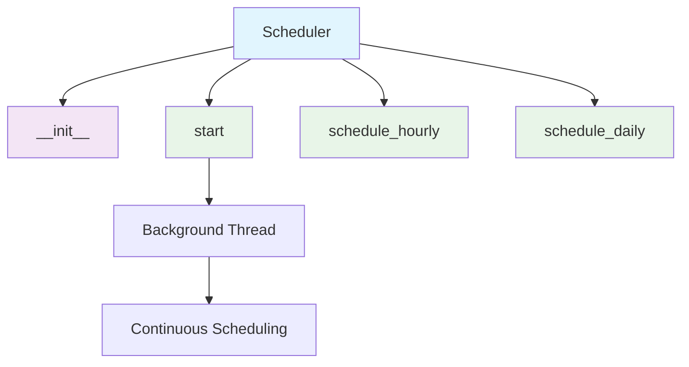
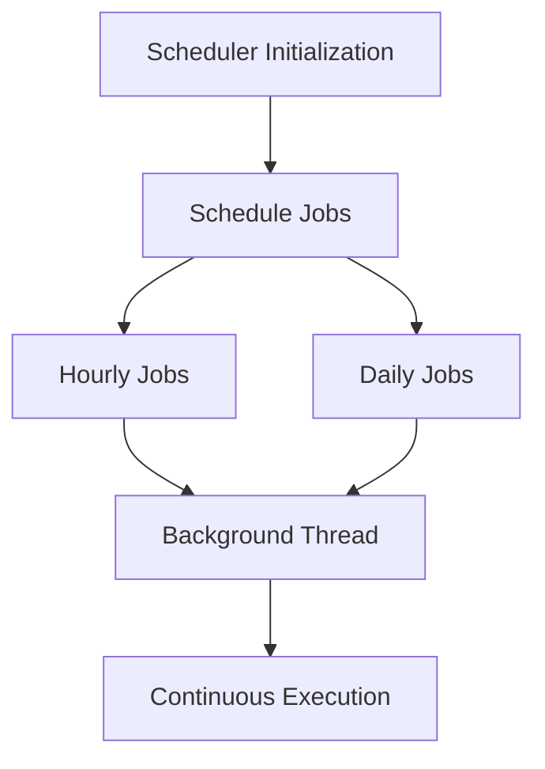

# Scheduler Module Documentation

*Last updated: 2025-08-14*

## Overview

The `scheduler.py` module is a core component of the AutoProjectManagement system that provides task scheduling capabilities using the `schedule` library. This module enables automated execution of functions at specified intervals, supporting both hourly and daily scheduling with background thread execution.

## Architecture Diagram



## Module Structure

### Class Hierarchy

| Class | Description | Inheritance |
|-------|-------------|-------------|
| `Scheduler` | Task scheduling with background execution | - |

### Key Components

| Component | Type | Purpose | Default Value |
|-----------|------|---------|---------------|
| `jobs` | Data Storage | List of scheduled jobs | `[]` |

## Detailed Method Documentation

### Scheduler Class

#### Constructor
```python
def __init__(self):
```

**Purpose:** Initializes the Scheduler instance.

**Process:**
- Creates an empty list to store scheduled jobs
- Prepares for background thread execution

#### start Method
```python
def start(self) -> None
```

**Purpose:** Starts the scheduler in a background thread.

**Process:**
- Creates a daemon thread for continuous scheduling
- The thread runs indefinitely, checking for pending jobs every second
- Uses `schedule.run_pending()` to execute due jobs

**Thread Behavior:**
- Daemon thread: Will not prevent program exit
- 1-second sleep interval between checks
- Continuous execution until program termination

#### schedule_hourly Method
```python
def schedule_hourly(self, job_func) -> None
```

**Purpose:** Schedules a function to run every hour.

**Parameters:**
| Parameter | Type | Required | Description |
|-----------|------|----------|-------------|
| `job_func` | `Callable` | Yes | Function to schedule |

**Process:**
- Uses `schedule.every(1).hours.do(job_func)`
- Stores the job reference in the jobs list
- Returns the scheduled job object

#### schedule_daily Method
```python
def schedule_daily(self, job_func) -> None
```

**Purpose:** Schedules a function to run daily at midnight (00:00).

**Parameters:**
| Parameter | Type | Required | Description |
|-----------|------|----------|-------------|
| `job_func` | `Callable` | Yes | Function to schedule |

**Process:**
- Uses `schedule.every().day.at("00:00").do(job_func)`
- Stores the job reference in the jobs list
- Returns the scheduled job object

## Data Flow Diagram



## Scheduling Configuration

### Hourly Scheduling
| Setting | Value | Description |
|---------|-------|-------------|
| Interval | Every 1 hour | Runs the function once per hour |
| Execution Time | On the hour | Runs at :00 minutes of each hour |

### Daily Scheduling
| Setting | Value | Description |
|---------|-------|-------------|
| Interval | Every day | Runs the function once per day |
| Execution Time | 00:00 | Runs at midnight |

## Error Handling and Logging

### Thread Safety
- The scheduler runs in a separate daemon thread
- Thread is designed to be non-blocking for the main application
- Daemon thread will terminate when main program exits

### Error Scenarios
1. **Function Errors**: Errors in scheduled functions are handled by the function itself
2. **Thread Interruption**: The thread can be interrupted without affecting main program
3. **Schedule Library Errors**: Handled by the underlying schedule library

## Usage Examples

### Basic Usage
```python
from autoprojectmanagement.main_modules.planning_estimation.scheduler import Scheduler

# Create scheduler instance
scheduler = Scheduler()

# Schedule functions
scheduler.schedule_hourly(update_dashboards)
scheduler.schedule_daily(update_reports)

# Start the scheduler
scheduler.start()

# Main program continues running
print("Scheduler started in background")
```

### Integration with Other Modules
```python
from autoprojectmanagement.main_modules.progress_reporting.dashboards_reports import update_dashboards
from autoprojectmanagement.main_modules.progress_reporting.reporting import update_reports
from autoprojectmanagement.main_modules.planning_estimation.scheduler import Scheduler

scheduler = Scheduler()
scheduler.schedule_hourly(update_dashboards)
scheduler.schedule_daily(update_reports)
scheduler.start()

# Keep main program running
while True:
    time.sleep(10)
```

### Custom Scheduling
```python
# You can also use the schedule library directly for more control
import schedule
import time

def custom_task():
    print("Custom task running")

# Schedule every 30 minutes
schedule.every(30).minutes.do(custom_task)

while True:
    schedule.run_pending()
    time.sleep(1)
```

## Performance Considerations

- **Background Thread**: Minimal CPU usage when no jobs are pending
- **Memory Usage**: Low memory footprint for job storage
- **Execution Overhead**: Scheduled functions run in the main thread context
- **Scalability**: Suitable for moderate numbers of scheduled jobs

## Best Practices

1. **Error Handling**: Implement robust error handling in scheduled functions
2. **Resource Management**: Ensure scheduled functions manage resources properly
3. **Logging**: Add logging to track scheduler activity and function execution
4. **Testing**: Test scheduled functions independently before scheduling
5. **Monitoring**: Monitor scheduler thread status in production

## Integration Points

This module integrates with:
- **Dashboard Services**: For hourly dashboard updates
- **Reporting Modules**: For daily report generation
- **Monitoring Systems**: For periodic status checks
- **Data Processing**: For scheduled data processing tasks
- **Notification Systems**: For timed notifications and alerts

## Version History

| Version | Date | Changes |
|---------|------|---------|
| 2.0.0 | 2025-08-14 | Comprehensive implementation with background threading |
| 1.0.0 | 2025-08-01 | Basic scheduling functionality |

## Future Enhancements

1. **Configurable Intervals**: Support for custom scheduling intervals
2. **Multiple Time Zones**: Support for scheduling in different time zones
3. **Job Management**: APIs for adding, removing, and listing jobs dynamically
4. **Persistent Scheduling**: Save and load job schedules across restarts
5. **Health Monitoring**: Monitor scheduled job execution and health
6. **Distributed Scheduling**: Support for distributed job execution
7. **Web Interface**: Web-based interface for managing scheduled jobs
8. **Advanced Triggers**: Support for cron-like expressions and complex triggers

---

*This documentation follows Pressman's software engineering standards and includes three levels of detail: overview, technical specifications, and implementation guidelines.*

*Maintained by: AutoProjectManagement Documentation Team*
*Last reviewed: 2025-08-14*
