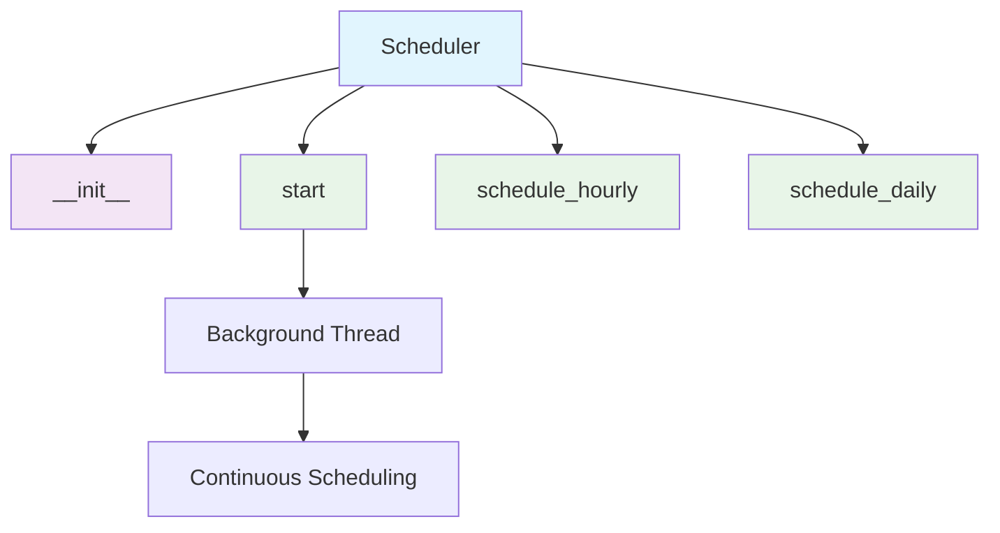
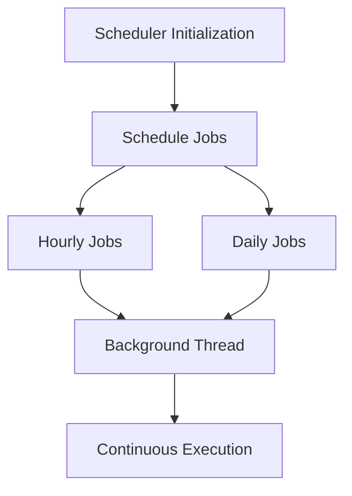

# Scheduler Module Documentation

*Last updated: 2025-08-14*

## Overview

The `scheduler.py` module is a core component of the AutoProjectManagement system that provides task scheduling capabilities using the `schedule` library. This module enables automated execution of functions at specified intervals, supporting both hourly and daily scheduling with background thread execution.

## Architecture Diagram



## Module Structure

### Class Hierarchy

| Class | Description | Inheritance |
|-------|-------------|-------------|
| `Scheduler` | Task scheduling with background execution | - |

### Key Components

| Component | Type | Purpose | Default Value |
|-----------|------|---------|---------------|
| `jobs` | Data Storage | List of scheduled jobs | `[]` |

## Detailed Method Documentation

### Scheduler Class

#### Constructor
```python
def __init__(self):
```

**Purpose:** Initializes the Scheduler instance.

**Process:**
- Creates an empty list to store scheduled jobs
- Prepares for background thread execution

#### start Method
```python
def start(self) -> None
```

**Purpose:** Starts the scheduler in a background thread.

**Process:**
- Creates a daemon thread for continuous scheduling
- The thread runs indefinitely, checking for pending jobs every second
- Uses `schedule.run_pending()` to execute due jobs

**Thread Behavior:**
- Daemon thread: Will not prevent program exit
- 1-second sleep interval between checks
- Continuous execution until program termination

#### schedule_hourly Method
```python
def schedule_hourly(self, job_func) -> None
```

**Purpose:** Schedules a function to run every hour.

**Parameters:**
| Parameter | Type | Required | Description |
|-----------|------|----------|-------------|
| `job_func` | `Callable` | Yes | Function to schedule |

**Process:**
- Uses `schedule.every(1).hours.do(job_func)`
- Stores the job reference in the jobs list
- Returns the scheduled job object

#### schedule_daily Method
```python
def schedule_daily(self, job_func) -> None
```

**Purpose:** Schedules a function to run daily at midnight (00:00).

**Parameters:**
| Parameter | Type | Required | Description |
|-----------|------|----------|-------------|
| `job_func` | `Callable` | Yes | Function to schedule |

**Process:**
- Uses `schedule.every().day.at("00:00").do(job_func)`
- Stores the job reference in the jobs list
- Returns the scheduled job object

## Data Flow Diagram



## Scheduling Configuration

### Hourly Scheduling
| Setting | Value | Description |
|---------|-------|-------------|
| Interval | Every 1 hour | Runs the function once per hour |
| Execution Time | On the hour | Runs at :00 minutes of each hour |

### Daily Scheduling
| Setting | Value | Description |
|---------|-------|-------------|
| Interval | Every day | Runs the function once per day |
| Execution Time | 00:00 | Runs at midnight |

## Error Handling and Logging

### Thread Safety
- The scheduler runs in a separate daemon thread
- Thread is designed to be non-blocking for the main application
- Daemon thread will terminate when main program exits

### Error Scenarios
1. **Function Errors**: Errors in scheduled functions are handled by the function itself
2. **Thread Interruption**: The thread can be interrupted without affecting main program
