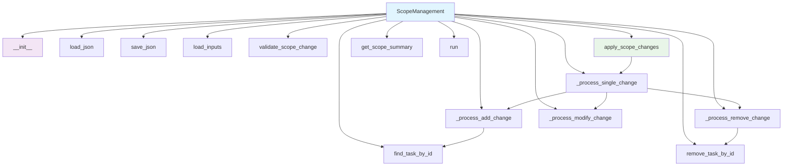
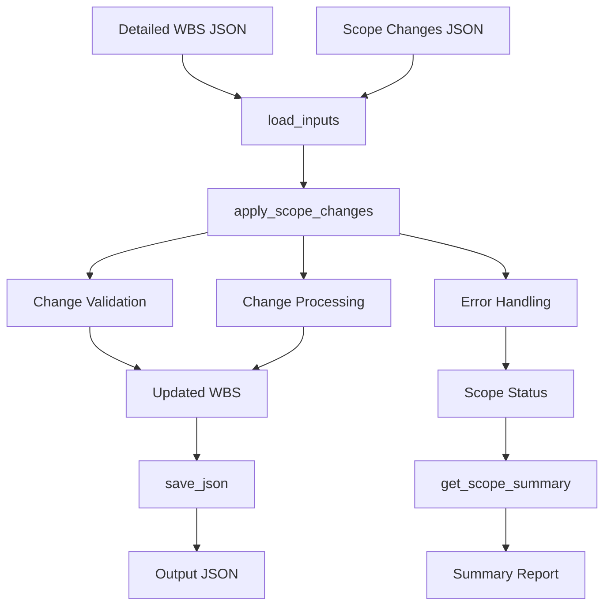

# Scope Management Module Documentation

*Last updated: 2025-08-14*

## Overview

The `scope_management.py` module is a core component of the AutoProjectManagement system that provides comprehensive scope change management capabilities. This module handles the complete lifecycle of scope management including loading WBS data, processing scope changes with impact analysis, generating detailed scope management reports, and maintaining audit trails for all scope modifications.

## Architecture Diagram



## Module Structure

### Class Hierarchy

| Class | Description | Inheritance |
|-------|-------------|-------------|
| `ScopeManagementError` | Base exception for scope management errors | `Exception` |
| `InvalidScopeChangeError` | Raised when invalid scope change is detected | `ScopeManagementError` |
| `FileNotFoundError` | Raised when required files are not found | `ScopeManagementError` |
| `ScopeManagement` | Comprehensive scope management system | - |

### Key Components

| Component | Type | Purpose | Default Value |
|-----------|------|---------|---------------|
| `detailed_wbs_path` | Configuration | Path to detailed WBS JSON file | `JSonDataBase/Inputs/UserInputs/detailed_wbs.json` |
| `scope_changes_path` | Configuration | Path to scope changes JSON file | `JSonDataBase/Inputs/UserInputs/scope_changes.json` |
| `output_path` | Configuration | Path for scope management output | `JSonDataBase/OutPuts/scope_management.json` |
| `detailed_wbs` | Data Storage | Loaded WBS data structure | `{}` |
| `scope_changes` | Data Storage | List of scope change requests | `[]` |
| `scope_status` | Data Storage | Current status of scope changes | Dictionary with status arrays |

## Detailed Method Documentation

### ScopeManagement Class

#### Constructor
```python
def __init__(self,
             detailed_wbs_path: str = DEFAULT_DETAILED_WBS_PATH,
             scope_changes_path: str = DEFAULT_SCOPE_CHANGES_PATH,
             output_path: str = DEFAULT_OUTPUT_PATH) -> None
```

**Purpose:** Initializes the ScopeManagement instance with file paths for WBS data, scope changes, and output.

**Parameters:**
| Parameter | Type | Required | Description | Default |
|-----------|------|----------|-------------|---------|
| `detailed_wbs_path` | `str` | No | Path to detailed WBS JSON file | `JSonDataBase/Inputs/UserInputs/detailed_wbs.json` |
| `scope_changes_path` | `str` | No | Path to scope changes JSON file | `JSonDataBase/Inputs/UserInputs/scope_changes.json` |
| `output_path` | `str` | No | Path for scope management output | `JSonDataBase/OutPuts/scope_management.json` |

**Validation Rules:**
- All file paths must be provided and non-empty
- Paths are converted to `Path` objects for cross-platform compatibility

**Raises:**
- `ValueError`: If any path is empty or invalid

#### load_json Method
```python
def load_json(self, path: Path) -> Optional[Union[Dict[str, Any], List[Any]]]
```

**Purpose:** Loads JSON data from file with comprehensive error handling.

**Parameters:**
| Parameter | Type | Required | Description |
|-----------|------|----------|-------------|
| `path` | `Path` | Yes | Path to JSON file |

**Returns:** `Optional[Union[Dict[str, Any], List[Any]]]` - Parsed JSON data or None if file doesn't exist

**Error Handling:**
- `json.JSONDecodeError`: If file contains invalid JSON, error is logged and `ScopeManagementError` is raised
- `Exception`: General file reading errors are caught and `FileNotFoundError` is raised

#### save_json Method
```python
def save_json(self, data: Union[Dict[str, Any], List[Any]], path: Path) -> None
```

**Purpose:** Saves data to JSON file with proper formatting and directory creation.

**Parameters:**
| Parameter | Type | Required | Description |
|-----------|------|----------|-------------|
| `data` | `Union[Dict[str, Any], List[Any]]` | Yes | Data to save (dict or list) |
| `path` | `Path` | Yes | Output file path |

**Features:**
- Creates parent directories if they don't exist
- Uses UTF-8 encoding with proper JSON formatting
- Includes error handling for file writing operations

**Raises:**
- `ScopeManagementError`: If file cannot be written

#### load_inputs Method
```python
def load_inputs(self) -> None
```

**Purpose:** Loads and validates input files (WBS data and scope changes).

**Process:**
1. Loads detailed WBS data from JSON file
2. Loads scope changes list from JSON file
3. Validates that scope changes is a list structure
4. Handles missing files gracefully (empty data structures)

**Raises:**
- `InvalidScopeChangeError`: If scope changes is not a list

#### validate_scope_change Method
```python
def validate_scope_change(self, change: Dict[str, Any]) -> bool
```

**Purpose:** Validates a scope change request for required fields and valid values.

**Parameters:**
| Parameter | Type | Required | Description |
|-----------|------|----------|-------------|
| `change` | `Dict[str, Any]` | Yes | Scope change dictionary to validate |

**Returns:** `bool` - True if valid, False otherwise

**Validation Rules:**
- Must contain required keys: `task_id`, `change_type`, `details`
- `change_type` must be one of: `add`, `remove`, `modify`
- `details` must be a dictionary for appropriate change types

**Raises:**
- `InvalidScopeChangeError`: If change is missing required keys or has invalid change type

#### apply_scope_changes Method
```python
def apply_scope_changes(self) -> None
```

**Purpose:** Applies validated scope changes to the detailed WBS with comprehensive error handling.

**Process:**
1. Resets scope status tracking
2. Iterates through all scope changes
3. Validates each change individually
4. Processes valid changes using appropriate change handler
5. Captures errors for invalid changes
6. Maintains audit trail of all operations

**Error Handling:**
- Invalid changes are logged as errors but don't stop processing
- Each change is processed independently
- Complete error information is preserved in scope status

#### _process_single_change Method
```python
def _process_single_change(self, change: Dict[str, Any]) -> None
```

**Purpose:** Processes a single validated scope change by routing to appropriate handler.

**Parameters:**
| Parameter | Type | Required | Description |
|-----------|------|----------|-------------|
| `change` | `Dict[str, Any]` | Yes | Validated scope change dictionary |

**Routing Logic:**
- `add` → `_process_add_change`
- `remove` → `_process_remove_change` 
- `modify` → `_process_modify_change`

#### _process_add_change Method
```python
def _process_add_change(self, task_id: str, details: Dict[str, Any]) -> None
```

**Purpose:** Processes an 'add' type scope change by adding a new task to the WBS.

**Parameters:**
| Parameter | Type | Required | Description |
|-----------|------|----------|-------------|
| `task_id` | `str` | Yes | ID of the parent task |
| `details` | `Dict[str, Any]` | Yes | Details containing parent_id and new task |

**Process:**
1. Finds parent task by ID
2. Creates subtasks list if it doesn't exist
3. Appends new task to parent's subtasks
4. Updates scope status with added task ID

#### _process_remove_change Method
```python
def _process_remove_change(self, task_id: str) -> None
```

**Purpose:** Processes a 'remove' type scope change by removing a task from the WBS.

**Parameters:**
| Parameter | Type | Required | Description |
|-----------|------|----------|-------------|
| `task_id` | `str` | Yes | ID of the task to remove |

**Process:**
1. Recursively searches for task by ID
2. Removes task from its parent's subtasks list
3. Updates scope status with removed task ID

#### _process_modify_change Method
```python
def _process_modify_change(self, task_id: str, details: Dict[str, Any]) -> None
```

**Purpose:** Processes a 'modify' type scope change by updating task properties.

**Parameters:**
| Parameter | Type | Required | Description |
|-----------|------|----------|-------------|
| `task_id` | `str` | Yes | ID of the task to modify |
| `details` | `Dict[str, Any]` | Yes | New properties to update |

**Process:**
1. Finds task by ID
2. Updates task properties with provided details
3. Updates scope status with modified task ID

#### find_task_by_id Method
```python
def find_task_by_id(self, task_id: Union[str, int], node: Optional[Dict[str, Any]] = None) -> Optional[Dict[str, Any]]
```

**Purpose:** Recursively finds a task by its ID in the WBS hierarchy.

**Parameters:**
| Parameter | Type | Required | Description |
|-----------|------|----------|-------------|
| `task_id` | `Union[str, int]` | Yes | ID of the task to find |
| `node` | `Optional[Dict[str, Any]]` | No | Starting node for search (defaults to root) |

**Returns:** `Optional[Dict[str, Any]]` - Found task or None if not found

**Algorithm:**
- Depth-first search through WBS hierarchy
- Checks current node, then recursively checks all subtasks
- Returns first matching task found

#### remove_task_by_id Method
```python
def remove_task_by_id(self, task_id: Union[str, int], node: Optional[Dict[str, Any]] = None) -> bool
```

**Purpose:** Recursively removes a task by its ID from the WBS hierarchy.

**Parameters:**
| Parameter | Type | Required | Description |
|-----------|------|----------|-------------|
| `task_id` | `Union[str, int]` | Yes | ID of the task to remove |
| `node` | `Optional[Dict[str, Any]]` | No | Starting node for search (defaults to root) |

**Returns:** `bool` - True if task was found and removed, False otherwise

**Algorithm:**
- Depth-first search through WBS hierarchy
- Removes task from parent's subtasks list when found
- Returns success status

#### get_scope_summary Method
```python
def get_scope_summary(self) -> Dict[str, Any]
```

**Purpose:** Generates a comprehensive summary of scope management operations.

**Returns:** `Dict[str, Any]` - Summary containing counts and lists of changes

**Summary Structure:**
```json
{
  "total_tasks_added": 3,
  "total_tasks_removed": 1,
  "total_tasks_modified": 2,
  "total_errors": 0,
  "added_tasks": ["task_101", "task_102", "task_103"],
  "removed_tasks": ["task_201"],
  "modified_tasks": ["task_301", "task_302"],
  "errors": []
}
```

#### run Method
```python
def run(self) -> None
```

**Purpose:** Executes the complete scope management workflow.

**Process Flow:**
1. Loads input files (WBS data and scope changes)
2. Applies all scope changes with validation
3. Saves updated WBS to output file
4. Generates and logs comprehensive summary
5. Prints results to console

## Data Flow Diagram



## Validation Rules

### Scope Change Validation
| Requirement | Validation | Error Handling |
|-------------|------------|----------------|
| Required Keys | Must contain task_id, change_type, details | `InvalidScopeChangeError` |
| Change Type | Must be 'add', 'remove', or 'modify' | `InvalidScopeChangeError` |
| Details Structure | Must be dict for appropriate changes | Validation continues, error logged |

### File Operations
| Operation | Validation | Error Handling |
|-----------|------------|----------------|
| JSON Loading | File existence and valid JSON format | `ScopeManagementError` on failure |
| JSON Saving | Directory creation and file writing | `ScopeManagementError` on failure |
| Data Integrity | WBS structure maintenance | Errors logged, processing continues |

## Error Handling and Logging

### Log Levels
| Level | Usage | Example |
|-------|-------|---------|
| `INFO` | Successful operations | "Scope management completed" |
