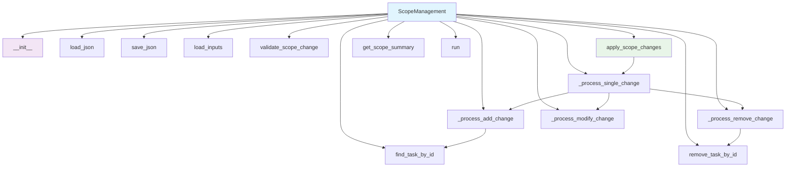

# Scope Management Module Documentation

*Last updated: 2025-08-14*

## Overview

The `scope_management.py` module is a core component of the AutoProjectManagement system that provides comprehensive scope change management capabilities. This module handles the complete lifecycle of scope management including loading WBS data, processing scope changes with impact analysis, generating detailed scope management reports, and maintaining audit trails for all scope modifications.

## Architecture Diagram



## Module Structure

### Class Hierarchy

| Class | Description | Inheritance |
|-------|-------------|-------------|
| `ScopeManagementError` | Base exception for scope management errors | `Exception` |
| `InvalidScopeChangeError` | Raised when invalid scope change is detected | `ScopeManagementError` |
| `FileNotFoundError` | Raised when required files are not found | `ScopeManagementError` |
| `ScopeManagement` | Comprehensive scope management system | - |

### Key Components

| Component | Type | Purpose | Default Value |
|-----------|------|---------|---------------|
| `detailed_wbs_path` | Configuration | Path to detailed WBS JSON file | `JSonDataBase/Inputs/UserInputs/detailed_wbs.json` |
| `scope_changes_path` | Configuration | Path to scope changes JSON file | `JSonDataBase/Inputs/UserInputs/scope_changes.json` |
| `output_path` | Configuration | Path for scope management output | `JSonDataBase/OutPuts/scope_management.json` |
| `detailed_wbs` | Data Storage | Loaded WBS data structure | `{}` |
| `scope_changes` | Data Storage | List of scope change requests | `[]` |
| `scope_status` | Data Storage | Current status of scope changes | Dictionary with status arrays |

## Detailed Method Documentation

### ScopeManagement Class

#### Constructor
```python
def __init__(self,
             detailed_wbs_path: str = DEFAULT_DETAILED_WBS_PATH,
             scope_changes_path: str = DEFAULT_SCOPE_CHANGES_PATH,
             output_path: str = DEFAULT_OUTPUT_PATH) -> None
```

**Purpose:** Initializes the ScopeManagement instance with file paths for WBS data, scope changes, and output.

**Parameters:**
| Parameter | Type | Required | Description | Default |
|-----------|------|----------|-------------|---------|
| `detailed_wbs_path` | `str` | No | Path to detailed WBS JSON file | `JSonDataBase/Inputs/UserInputs/detailed_wbs.json` |
| `scope_changes_path` | `str` | No | Path to scope changes JSON file | `JSonDataBase/Inputs/UserInputs/scope_changes.json` |
| `output_path` | `str` | No | Path for scope management output | `JSonDataBase/OutPuts/scope_management.json` |

**Validation Rules:**
- All file paths must be provided and non-empty
- Paths are converted to `Path` objects for cross-platform compatibility

**Raises:**
- `ValueError`: If any path is empty or invalid

#### load_json Method
```python
def load_json(self, path: Path) -> Optional[Union[Dict[str, Any], List[Any]]]
```

**Purpose:** Loads JSON data from file with comprehensive error handling.

**Parameters:**
| Parameter | Type | Required | Description |
|-----------|------|----------|-------------|
| `path` | `Path` | Yes | Path to JSON file |

**Returns:** `Optional[Union[Dict[str, Any], List[Any]]]` - Parsed JSON data or None if file doesn't exist

**Error Handling:**
- `json.JSONDecodeError`: If file contains invalid JSON, error is logged and `ScopeManagementError` is raised
- `Exception`: General file reading errors are caught and `FileNotFoundError` is raised

#### save_json Method
```python
def save_json(self, data: Union[Dict[str, Any], List[Any]], path: Path) -> None
```

**Purpose:** Saves data to JSON file with proper formatting and directory creation.

**Parameters:**
| Parameter | Type | Required | Description |
|-----------|------|----------|-------------|
