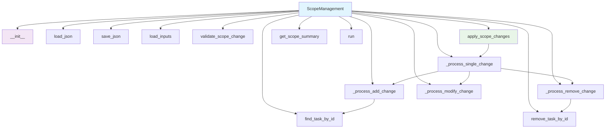

# Scope Management Module Documentation

*Last updated: 2025-08-14*

## Overview

The `scope_management.py` module is a core component of the AutoProjectManagement system that provides comprehensive scope change management capabilities. This module handles the complete lifecycle of scope management including loading WBS data, processing scope changes with impact analysis, generating detailed scope management reports, and maintaining audit trails for all scope modifications.

## Architecture Diagram

## Module Structure

### Class Hierarchy

| Class | Description | Inheritance |
|-------|-------------|-------------|
| `ScopeManagementError` | Base exception for scope management errors | `Exception` |
| `InvalidScopeChangeError` | Raised when invalid scope change is detected | `ScopeManagementError` |
| `FileNotFoundError` | Raised when required files are not found | `ScopeManagementError` |
| `ScopeManagement` | Comprehensive scope management system | - |

### Key Components

| Component | Type | Purpose | Default Value |
|-----------|------|---------|---------------|
| `detailed_wbs_path` | Configuration | Path to detailed WBS JSON file | `JSonDataBase/Inputs/UserInputs/detailed_wbs.json` |
| `scope_changes_path` | Configuration | Path to scope changes JSON file | `JSonDataBase/Inputs/UserInputs/scope_changes.json` |
