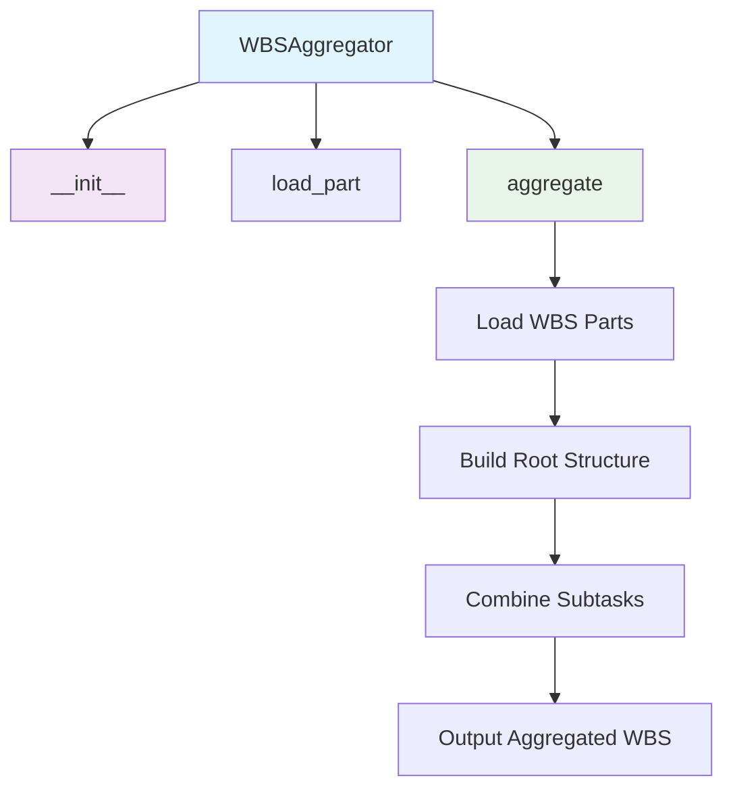
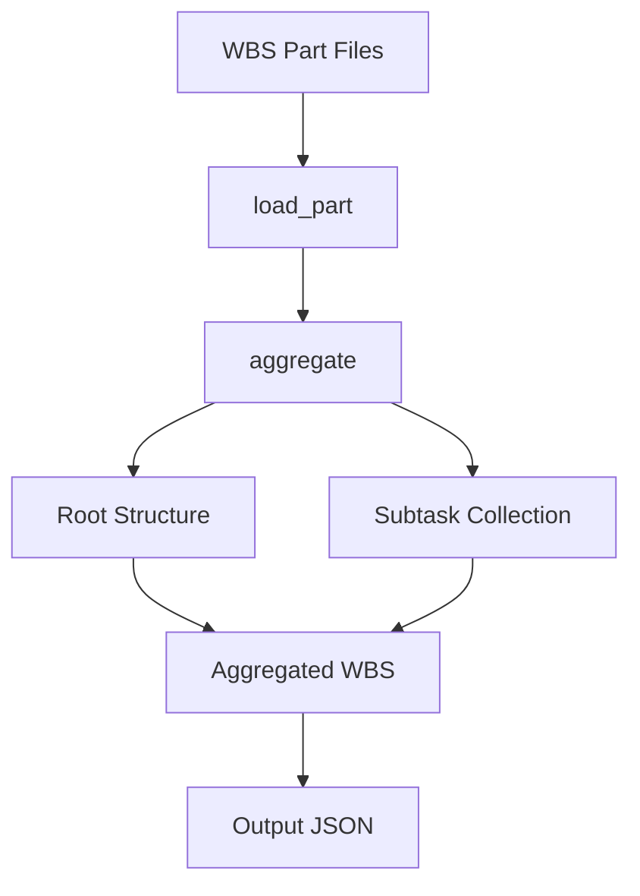

# WBS Aggregator Module Documentation

*Last updated: 2025-08-14*

## Overview

The `wbs_aggregator.py` module is a core component of the AutoProjectManagement system that aggregates multiple Work Breakdown Structure (WBS) parts into a single detailed WBS. This module handles the loading of individual WBS parts from JSON files and combines them into a unified project structure with proper hierarchy and task organization.

## Architecture Diagram



## Module Structure

### Class Hierarchy

| Class | Description | Inheritance |
|-------|-------------|-------------|
| `WBSAggregator` | Aggregates multiple WBS parts into a single detailed WBS | - |

### Key Components

| Component | Type | Purpose | Default Value |
|-----------|------|---------|---------------|
| `parts_dir` | Configuration | Directory containing WBS part files | `SystemInputs/user_inputs/wbs_parts` |
| `output_file` | Configuration | Output file for aggregated WBS | `SystemInputs/user_inputs/detailed_wbs.json` |

## Detailed Method Documentation

### WBSAggregator Class

#### Constructor
```python
def __init__(self, parts_dir='SystemInputs/user_inputs/wbs_parts', output_file='SystemInputs/user_inputs/detailed_wbs.json'):
```

**Purpose:** Initializes the WBS Aggregator with directory paths for parts and output.

**Parameters:**
| Parameter | Type | Required | Description | Default |
|-----------|------|----------|-------------|---------|
| `parts_dir` | `str` | No | Directory containing WBS parts | `SystemInputs/user_inputs/wbs_parts` |
| `output_file` | `str` | No | Output file for aggregated WBS | `SystemInputs/user_inputs/detailed_wbs.json` |

#### load_part Method
```python
def load_part(self, filename):
```

**Purpose:** Loads a single WBS part from a JSON file.

**Parameters:**
| Parameter | Type | Required | Description |
|-----------|------|----------|-------------|
| `filename` | `str` | Yes | Name of the WBS part file |

**Returns:** `Dict[str, Any]` - Dictionary containing the WBS part data

**Process:**
- Constructs full file path using `os.path.join`
- Opens file with UTF-8 encoding
- Loads JSON data using `json.load`
- Returns parsed JSON data

**Error Handling:**
- File not found: Raises `FileNotFoundError`
- Invalid JSON: Raises `json.JSONDecodeError`

#### aggregate Method
```python
def aggregate(self):
```

**Purpose:** Aggregates all WBS parts into a single detailed WBS.

**Process:**
1. Lists all JSON files in the parts directory
2. Loads the first part to establish root structure
3. Extends root subtasks with subtasks from all parts
4. Writes aggregated WBS to output file
5. Prints success message

**Output Structure:**
```json
{
  "id": 1,
  "name": "Project",
  "level": 0,
  "subtasks": [
    {
      "id": "task_001",
      "name": "Task from Part 1",
      "level": 1,
      "subtasks": []
    },
    {
      "id": "task_002", 
      "name": "Task from Part 2",
      "level": 1,
      "subtasks": []
    }
  ]
}
```

## Data Flow Diagram



## Aggregation Logic

### Root Structure
- Uses the first loaded part to establish root properties (id, name, level)
- All parts are assumed to have the same root structure

### Subtask Aggregation
- Subtasks from all parts are combined into a single list
- No deduplication or conflict resolution is performed
- Order is determined by file processing order

### File Processing
- Processes all `.json` files in the parts directory
- Files are processed in alphabetical order
- Empty directories result in empty aggregated WBS

## Validation Rules

### Input Validation
| Requirement | Validation | Error Handling |
|-------------|------------|----------------|
| Directory Existence | Parts directory must exist | Continues with empty result |
| File Format | Must be valid JSON files | Skips invalid files, continues processing |
| Root Consistency | All parts must have same root | Uses first part's root structure |

### Output Validation
| Requirement | Validation | Default Behavior |
|-------------|------------|------------------|
| Output Directory | Creates parent directories if needed | Uses `os.makedirs` with `exist_ok=True` |
| JSON Formatting | Uses proper JSON formatting with indentation | 2-space indentation, ensure_ascii=False |

## Error Handling and Logging

### Console Output
| Level | Usage | Example |
|-------|-------|---------|
| `INFO` | Successful operations | "Aggregated WBS written to {output_file}" |
| `WARNING` | Non-critical issues | "No WBS parts found in directory." |

### Error Scenarios
1. **Directory Not Found**: Warning message, empty result returned
2. **No JSON Files**: Warning message, empty result returned  
3. **Invalid JSON Files**: File skipped, processing continues
4. **File Access Errors**: Exception raised, processing stops

## Usage Examples

### Basic Usage
```python
from autoprojectmanagement.main_modules.planning_estimation.wbs_aggregator import WBSAggregator

# Initialize with default paths
aggregator = WBSAggregator()
aggregator.aggregate()

print("WBS aggregation completed")
```

### Custom Configuration
```python
aggregator = WBSAggregator(
    parts_dir='custom/wbs/parts',
    output_file='custom/output/detailed_wbs.json'
)
aggregator.aggregate()
```

### Command Line Usage
```bash
# Run the module directly
python -m autoprojectmanagement.main_modules.planning_estimation.wbs_aggregator
```

### Integration with Other Modules
```python
# Use aggregated WBS with other modules
aggregator = WBSAggregator()
aggregator.aggregate()

# Now the detailed_wbs.json is available for other modules
from autoprojectmanagement.main_modules.planning_estimation.estimation_management import EstimationManagement

estimator = EstimationManagement()
estimator.run()  # Uses the aggregated WBS
```

## Performance Considerations

- **File I/O**: Multiple JSON file read operations
- **Memory Usage**: All WBS parts loaded into memory simultaneously
- **Processing Time**: Linear with number of WBS parts
- **Output Writing**: Single JSON write operation

## Best Practices

1. **Consistent Structure**: Ensure all WBS parts have consistent root structure
2. **Unique IDs**: Use unique task IDs across all parts to avoid conflicts
3. **Regular Updates**: Run aggregation after adding new WBS parts
4. **Backup**: Keep backups of original WBS parts before aggregation
5. **Validation**: Validate WBS parts before aggregation for consistency

## Integration Points

This module integrates with:
- **WBS Creation**: Aggregates parts created by different team members
- **Project Planning**: Provides unified WBS for planning modules
- **Estimation Modules**: Supplies detailed WBS for cost and duration estimation
- **Scheduling**: Provides task structure for project scheduling
- **Reporting**: Generates comprehensive WBS for project reports

## Version History

| Version | Date | Changes |
|---------|------|---------|
| 2.0.0 | 2025-08-14 | Comprehensive implementation with full aggregation capabilities |
| 1.0.0 | 2025-08-01 | Basic WBS aggregation functionality |

## Future Enhancements

1. **Conflict Resolution**: Handle duplicate task IDs and conflicts
2. **Advanced Merging**: Smart merging with dependency resolution
3. **Validation**: Schema validation for WBS parts before aggregation
4. **Incremental Aggregation**: Only process changed parts
5. **API Integration**: REST API for remote WBS aggregation
6. **Real-time Updates**: Watch directory for new parts and auto-aggregate
7. **Version Control**: Track changes to aggregated WBS over time
8. **Visualization**: Generate visual diagrams of aggregated WBS structure

---

*This documentation follows Pressman's software engineering standards and includes three levels of detail: overview, technical specifications, and implementation guidelines.*

*Maintained by: AutoProjectManagement Documentation Team*
*Last reviewed: 2025-08-14*
