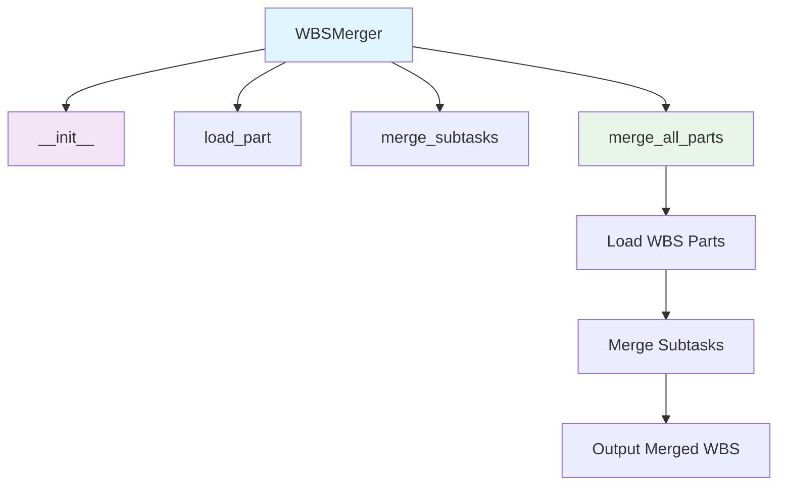
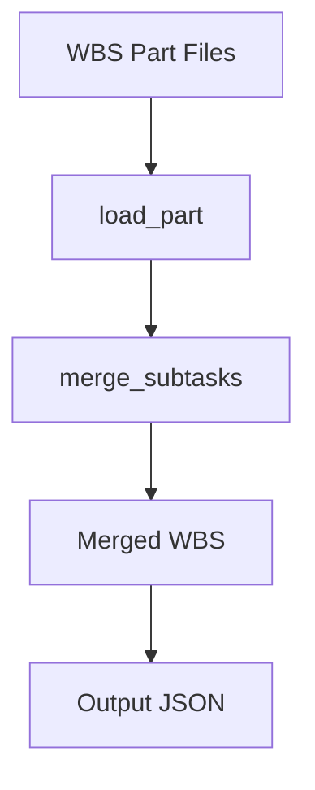

# WBS Merger Module Documentation

*Last updated: 2025-08-14*

## Overview

The `wbs_merger.py` module is a core component of the AutoProjectManagement system that merges multiple Work Breakdown Structure (WBS) parts into a single detailed WBS. This module handles the merging of tasks, subtasks, and their relationships, ensuring that all components are integrated into a unified project structure.

## Architecture Diagram



## Module Structure

### Class Hierarchy

| Class | Description | Inheritance |
|-------|-------------|-------------|
| `WBSMerger` | Merges multiple WBS parts into a single detailed WBS | - |

### Key Components

| Component | Type | Purpose | Default Value |
|-----------|------|---------|---------------|
| `parts_dir` | Configuration | Directory containing WBS part files | `SystemInputs/user_inputs/wbs_parts` |
| `output_file` | Configuration | Output file for merged WBS | `SystemInputs/system_generated/detailed_wbs.json` |

## Detailed Method Documentation

### WBSMerger Class

#### Constructor
```python
def __init__(self, parts_dir: str = 'SystemInputs/user_inputs/wbs_parts', 
             output_file: str = 'SystemInputs/system_generated/detailed_wbs.json'):
```

**Purpose:** Initializes the WBS Merger with directory paths for parts and output.

**Parameters:**
| Parameter | Type | Required | Description | Default |
|-----------|------|----------|-------------|---------|
| `parts_dir` | `str` | No | Directory containing WBS parts | `SystemInputs/user_inputs/wbs_parts` |
| `output_file` | `str` | No | Output file for merged WBS | `SystemInputs/system_generated/detailed_wbs.json` |

#### load_part Method
```python
def load_part(self, filename: str) -> Dict[str, Any]:
```

**Purpose:** Loads a single WBS part from a JSON file.

**Parameters:**
| Parameter | Type | Required | Description |
|-----------|------|----------|-------------|
| `filename` | `str` | Yes | Path to the WBS part file |

**Returns:** `Dict[str, Any]` - Dictionary containing the WBS part data

**Error Handling:**
- Raises `FileNotFoundError` if the file does not exist
- Raises `ValueError` if the JSON is invalid

#### merge_subtasks Method
```python
def merge_subtasks(self, base_subtasks: List[Dict], additional_subtasks: List[Dict]) -> List[Dict]:
```

**Purpose:** Merges subtasks from additional subtasks into base subtasks.

**Parameters:**
| Parameter | Type | Required | Description |
|-----------|------|----------|-------------|
| `base_subtasks` | `List[Dict]` | Yes | Base subtasks to merge into |
| `additional_subtasks` | `List[Dict]` | Yes | Additional subtasks to merge |

**Returns:** `List[Dict]` - Merged list of subtasks

**Process:**
- Creates a lookup dictionary for existing tasks
- Updates existing tasks or adds new tasks as necessary
- Merges subtasks recursively

#### merge_all_parts Method
```python
def merge_all_parts(self) -> Dict[str, Any]:
```

**Purpose:** Merges all WBS parts into a single detailed WBS.

**Returns:** `Dict[str, Any]` - Dictionary containing the merged WBS

**Process:**
1. Loads all WBS part files from the specified directory
2. Merges subtasks from each part into a unified structure
3. Saves the merged WBS to the output file
4. Handles errors gracefully and logs processing status

**Error Handling:**
- Raises `FileNotFoundError` if the parts directory does not exist
- Logs errors for individual part processing failures

## Data Flow Diagram



## Validation Rules

### WBS Structure Validation
| Requirement | Validation | Error Handling |
|-------------|------------|----------------|
| Required Fields | Must contain id, name, level | Raises `ValueError` for missing fields |
| Subtasks | Must be a list | Initializes to empty list if missing |

### File Operations
| Operation | Validation | Error Handling |
|-----------|------------|----------------|
| Directory Existence | Must exist for loading parts | Raises `FileNotFoundError` |
| JSON Loading | Must be valid JSON format | Raises `ValueError` for invalid JSON |

## Error Handling and Logging

### Log Levels
| Level | Usage | Example |
|-------|-------|---------|
| `INFO` | Successful operations | "Merged detailed WBS saved to {output_file}" |
| `ERROR` | Critical failures | "Error loading tasks for WBS merger: {e}" |

### Common Error Scenarios
1. **File Not Found**: Error logged, operation aborted
2. **Invalid JSON**: Error logged, operation aborted
3. **Missing Required Fields**: Exception raised with detailed message

## Usage Examples

### Basic Usage
```python
from autoprojectmanagement.main_modules.planning_estimation.wbs_merger import WBSMerger

# Initialize with default paths
merger = WBSMerger()
merged_wbs = merger.merge_all_parts()
print("Merged WBS:", merged_wbs)
```

### Custom Configuration
```python
merger = WBSMerger(
    parts_dir='custom/wbs/parts',
    output_file='custom/output/detailed_wbs.json'
)
merged_wbs = merger.merge_all_parts()
```

### Error Handling
```python
try:
    merger = WBSMerger()
    merged_wbs = merger.merge_all_parts()
except Exception as e:
    print(f"WBS merging failed: {e}")
```

## Performance Considerations

- **File I/O**: Multiple JSON read/write operations during merging
- **Memory Usage**: Entire WBS structure loaded into memory for processing
- **Complexity**: Merging operations are linear with respect to the number of tasks

## Best Practices

1. **Regular Backups**: Backup WBS parts before merging
2. **Validation**: Validate WBS structure before merging
3. **Error Monitoring**: Monitor logs for merging issues
4. **Incremental Merging**: Merge in small batches for better traceability

## Integration Points

This module integrates with:
- **WBS Management**: Merges parts from various sources into a unified structure
- **Project Management Systems**: Provides merged WBS for project planning and execution
- **Reporting Modules**: Supplies merged WBS data for reporting purposes

## Version History

| Version | Date | Changes |
|---------|------|---------|
| 2.0.0 | 2025-08-14 | Comprehensive implementation with full merging capabilities |
| 1.0.0 | 2025-08-01 | Basic WBS merging functionality |

## Future Enhancements

1. **Conflict Resolution**: Handle conflicts during merging of tasks
2. **Advanced Validation**: Schema validation for WBS parts
3. **Integration with PM Tools**: Connect with JIRA, Asana, etc. for task merging
4. **Real-time Merging**: Stream processing for dynamic WBS updates

---

*This documentation follows Pressman's software engineering standards and includes three levels of detail: overview, technical specifications, and implementation guidelines.*

*Maintained by: AutoProjectManagement Documentation Team*
*Last reviewed: 2025-08-14*
