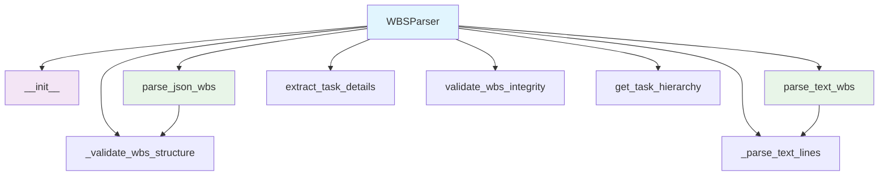

# WBS Parser Module Documentation

*Last updated: 2025-08-14*

## Overview

The `wbs_parser.py` module is a core component of the AutoProjectManagement system that parses different Work Breakdown Structure (WBS) formats into structured data. This module supports both JSON and text formats, validates WBS structure integrity, and provides utilities for extracting detailed task information and hierarchy.

## Architecture Diagram

## Module Structure

### Class Hierarchy

| Class | Description | Inheritance |
|-------|-------------|-------------|
