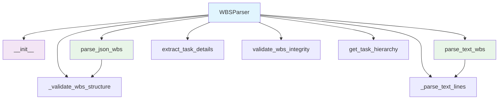
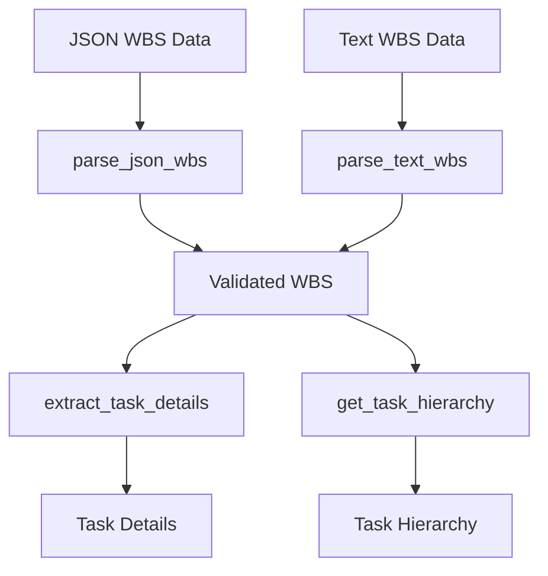

# WBS Parser Module Documentation

*Last updated: 2025-08-14*

## Overview

The `wbs_parser.py` module is a core component of the AutoProjectManagement system that parses different Work Breakdown Structure (WBS) formats into structured data. This module supports both JSON and text formats, validates WBS structure integrity, and provides utilities for extracting detailed task information and hierarchy.

## Architecture Diagram



## Module Structure

### Class Hierarchy

| Class | Description | Inheritance |
|-------|-------------|-------------|
| `WBSParser` | Parses different WBS formats into structured data | - |

## Detailed Method Documentation

### WBSParser Class

#### Constructor
```python
def __init__(self):
```

**Purpose:** Initializes the WBS Parser.

#### parse_json_wbs Method
```python
def parse_json_wbs(self, data: Dict[str, Any]) -> Dict[str, Any]:
```

**Purpose:** Parses JSON format WBS data.

**Parameters:**
| Parameter | Type | Required | Description |
|-----------|------|----------|-------------|
| `data` | `Dict[str, Any]` | Yes | JSON data containing WBS structure |

**Returns:** `Dict[str, Any]` - Parsed WBS structure

**Process:**
- Validates the WBS structure using `_validate_wbs_structure`
- Ensures required fields are present
- Normalizes the structure for consistency

#### parse_text_wbs Method
```python
def parse_text_wbs(self, text: str) -> Dict[str, Any]:
```

**Purpose:** Parses text format WBS data.

**Parameters:**
| Parameter | Type | Required | Description |
|-----------|------|----------|-------------|
| `text` | `str` | Yes | Text containing WBS structure |

**Returns:** `Dict[str, Any]` - Parsed WBS structure

**Process:**
- Splits text into lines and processes each line
- Determines task levels based on indentation
- Builds hierarchical WBS structure

#### _validate_wbs_structure Method
```python
def _validate_wbs_structure(self, data: Dict[str, Any]) -> Dict[str, Any]:
```

**Purpose:** Validates and normalizes WBS structure.

**Parameters:**
| Parameter | Type | Required | Description |
|-----------|------|----------|-------------|
| `data` | `Dict[str, Any]` | Yes | WBS data to validate |

**Returns:** `Dict[str, Any]` - Validated WBS structure

**Validation Rules:**
- Data must be a dictionary
- Required fields: `id`, `name`, `level`
- Ensures `subtasks` is a list
- Recursively validates all subtasks

**Raises:**
- `ValueError`: If data is not a dictionary or missing required fields

#### _parse_text_lines Method
```python
def _parse_text_lines(self, lines: List[str]) -> Dict[str, Any]:
```

**Purpose:** Parses text lines into WBS structure.

**Parameters:**
| Parameter | Type | Required | Description |
|-----------|------|----------|-------------|
| `lines` | `List[str]` | Yes | List of text lines |

**Returns:** `Dict[str, Any]` - Parsed WBS structure

**Process:**
- Creates root task with default values
- Processes each line to determine task level and name
- Builds hierarchical structure using a stack

#### extract_task_details Method
```python
def extract_task_details(self, task: Dict[str, Any]) -> Dict[str, Any]:
```

**Purpose:** Extracts detailed information from a task.

**Parameters:**
| Parameter | Type | Required | Description |
|-----------|------|----------|-------------|
| `task` | `Dict[str, Any]` | Yes | Task dictionary |

**Returns:** `Dict[str, Any]` - Detailed task information

**Extracted Fields:**
- `id`: Task identifier
- `name`: Task name
- `level`: Task level in hierarchy
- `description`: Task description
- `deadline`: Task deadline
- `assigned_to`: List of assignees
- `dependencies`: List of task dependencies
- `status`: Task status
- `priority`: Task priority
- `subtasks_count`: Number of subtasks

#### validate_wbs_integrity Method
```python
def validate_wbs_integrity(self, wbs: Dict[str, Any]) -> bool:
```

**Purpose:** Validates WBS structure integrity.

**Parameters:**
| Parameter | Type | Required | Description |
|-----------|------|----------|-------------|
| `wbs` | `Dict[str, Any]` | Yes | WBS structure to validate |

**Returns:** `bool` - True if valid, False otherwise

**Process:**
- Uses `_validate_wbs_structure` for validation
- Returns True if validation succeeds, False if it fails

#### get_task_hierarchy Method
```python
def get_task_hierarchy(self, wbs: Dict[str, Any]) -> List[Dict[str, Any]:
```

**Purpose:** Gets a flat list of all tasks in hierarchy.

**Parameters:**
| Parameter | Type | Required | Description |
|-----------|------|----------|-------------|
| `wbs` | `Dict[str, Any]` | Yes | WBS structure |

**Returns:** `List[Dict[str, Any]]` - Flat list of all tasks

**Process:**
- Recursively collects all tasks and subtasks
- Includes level information for each task
- Returns tasks in hierarchical order

## Data Flow Diagram



## Validation Rules

### WBS Structure Validation
| Requirement | Validation | Error Handling |
|-------------|------------|----------------|
| Data Type | Must be a dictionary | Raises `ValueError` |
| Required Fields | Must contain id, name, level | Raises `ValueError` for missing fields |
| Subtasks | Must be a list | Initializes to empty list if missing |

### Text Parsing
| Requirement | Validation | Default Behavior |
|-------------|------------|------------------|
| Line Format | Determines level by indentation | Assumes 2 spaces per level |
| Task Naming | Uses stripped line content | Empty lines are skipped |

## Error Handling and Logging

### Common Error Scenarios
1. **Invalid JSON Data**: Raises `ValueError` with detailed message
2. **Missing Required Fields**: Raises `ValueError` with field information
3. **Invalid Text Format**: Uses default values and continues processing

## Usage Examples

### Basic Usage with JSON
```python
from autoprojectmanagement.main_modules.planning_estimation.wbs_parser import WBSParser

parser = WBSParser()
wbs_data = {
    "id": 1,
    "name": "Project",
    "level": 0,
    "subtasks": [
        {"id": 2, "name": "Task 1", "level": 1}
    ]
}
parsed_wbs = parser.parse_json_wbs(wbs_data)
```

### Basic Usage with Text
```python
parser = WBSParser()
text_wbs = """
Project
  Task 1
    Subtask 1.1
  Task 2
"""
parsed_wbs = parser.parse_text_wbs(text_wbs)
```

### Extracting Task Details
```python
task_details = parser.extract_task_details(parsed_wbs)
print("Task Details:", task_details)
```

### Validating WBS Integrity
```python
is_valid = parser.validate_wbs_integrity(parsed_wbs)
print("WBS is valid:", is_valid)
```

### Getting Task Hierarchy
```python
hierarchy = parser.get_task_hierarchy(parsed_wbs)
print("Task Hierarchy:", hierarchy)
```

## Performance Considerations

- **Recursive Processing**: Validation and hierarchy extraction are recursive operations
- **Text Parsing**: Line-by-line processing for text format WBS
- **Memory Usage**: Entire WBS structure loaded into memory for processing

## Best Practices

1. **Validation First**: Validate WBS structure before further processing
2. **Consistent Formatting**: Use consistent indentation for text format WBS
3. **Error Handling**: Implement proper error handling for parsing operations
4. **Data Integrity**: Regularly validate WBS integrity to ensure consistency

## Integration Points

This module integrates with:
- **WBS Management**: Parses WBS data from various sources
- **Project Planning**: Provides structured WBS data for planning
- **Reporting**: Supplies task details and hierarchy for reporting
- **Data Analysis**: Enables analysis of WBS structure and task relationships

## Version History

| Version | Date | Changes |
|---------|------|---------|
