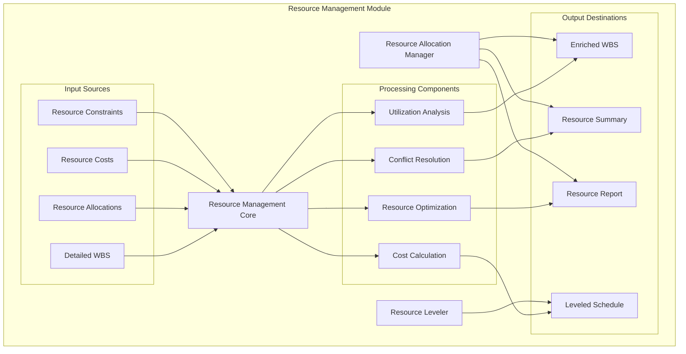
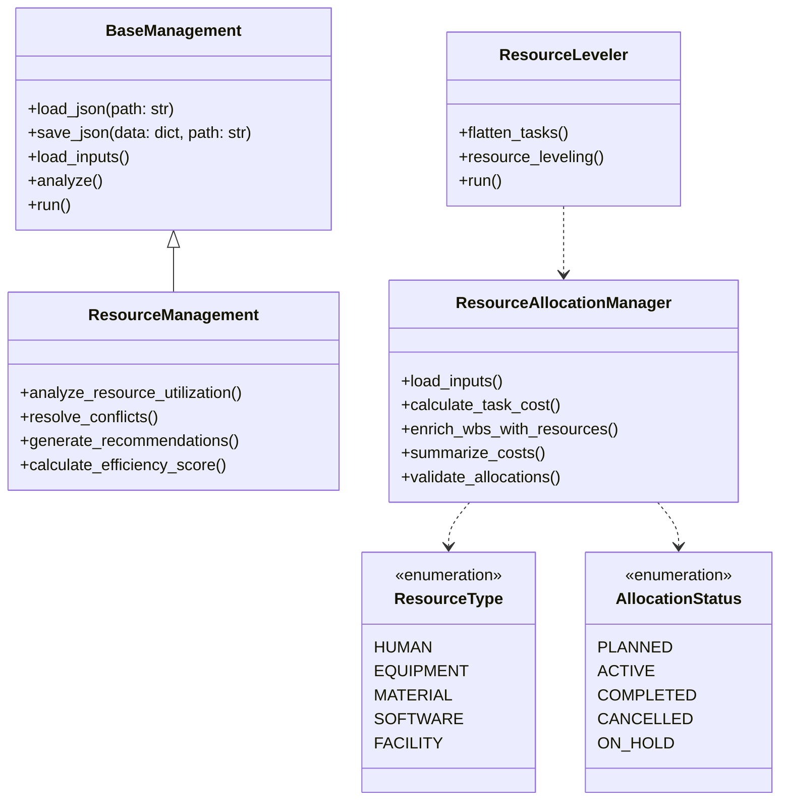
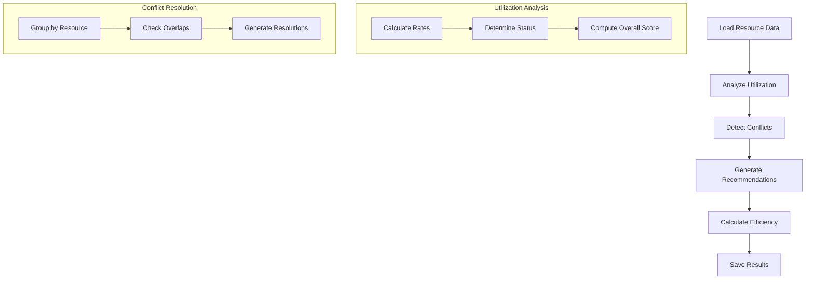
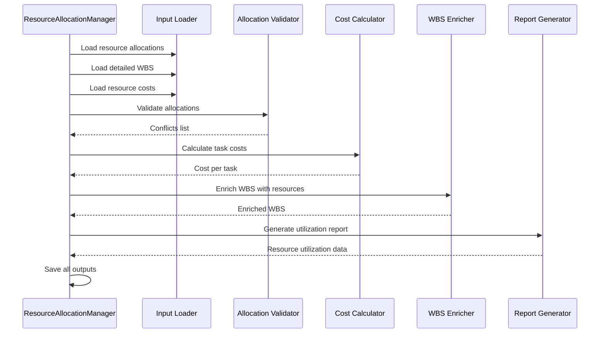
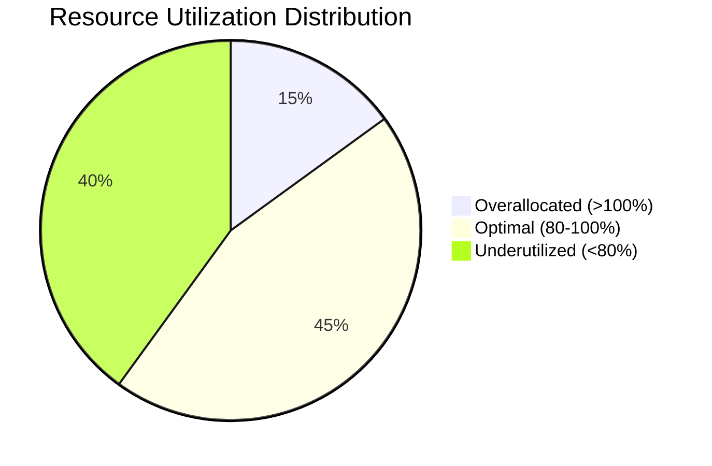
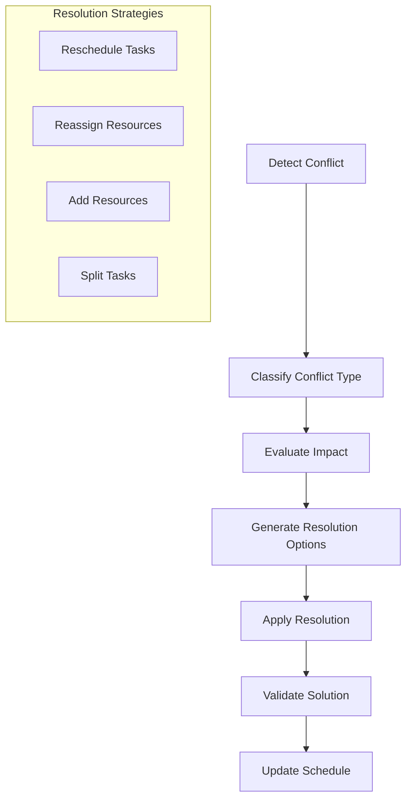
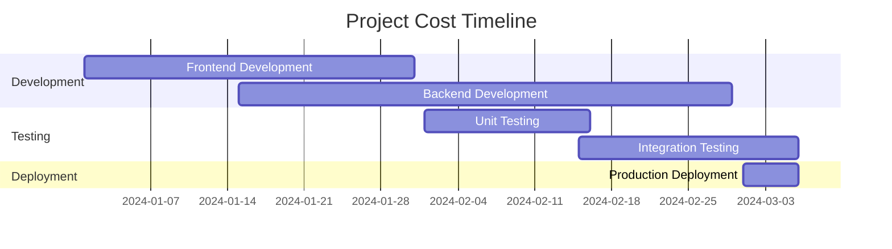
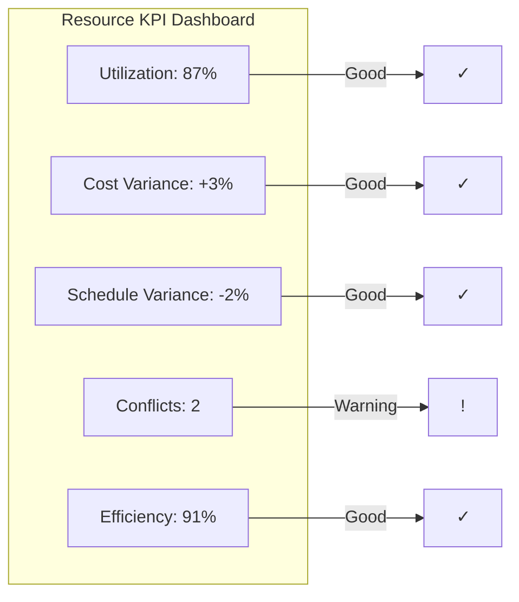
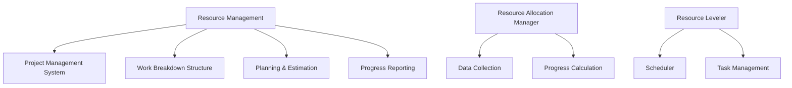

# Resource Management Module Documentation

## Overview

The **Resource Management Module** is a comprehensive component of the AutoProjectManagement system that provides advanced capabilities for managing project resources throughout the entire project lifecycle. This module handles resource allocation, leveling, optimization, and utilization analysis to ensure efficient resource utilization while preventing conflicts and over-allocation.

## Module Architecture

### High-Level Architecture



### Component Relationships



## Core Components

### 1. Resource Management (resource_management.py)

The main resource management class that provides comprehensive analysis and optimization capabilities.

#### Key Features:
- **Resource Utilization Analysis**: Calculates utilization rates and efficiency scores
- **Conflict Detection**: Identifies overlapping resource allocations
- **Optimization Recommendations**: Provides actionable recommendations for resource optimization
- **Performance Metrics**: Tracks overall resource performance

#### Data Flow



### 2. Resource Allocation Manager (resource_allocation_manager.py)

Handles detailed resource allocation with cost tracking and validation.

#### Resource Allocation Process



### 3. Resource Leveler (resource_leveling.py)

Optimizes resource scheduling to prevent conflicts and ensure smooth project execution.

#### Leveling Algorithm


## Data Structures

### Resource Allocation Schema

| Field | Type | Description | Required |
|-------|------|-------------|----------|
| `task_id` | string | Unique identifier for the task | Yes |
| `resource_id` | string | Unique identifier for the resource | Yes |
| `allocation_percent` | number | Percentage of resource allocated (0-100) | Yes |
| `start_date` | string | Start date in YYYY-MM-DD format | Yes |
| `end_date` | string | End date in YYYY-MM-DD format | Yes |
| `status` | string | Allocation status (planned/active/completed/cancelled/on_hold) | Yes |
| `notes` | string | Additional notes or comments | No |
| `calculated_cost` | number | Auto-calculated cost for the allocation | Auto |

### Resource Cost Schema

| Field | Type | Description | Required |
|-------|------|-------------|----------|
| `resource_id` | string | Unique identifier for the resource | Yes |
| `resource_name` | string | Human-readable resource name | Yes |
| `resource_type` | string | Type of resource (human/equipment/material/software/facility) | Yes |
| `hourly_cost` | number | Cost per hour in USD | Yes |
| `daily_cost` | number | Cost per day in USD | Yes |
| `currency` | string | Currency code (default: USD) | No |
| `effective_date` | string | Date when cost becomes effective | No |
| `expiry_date` | string | Date when cost expires | No |

## Utilization Analysis Framework

### Utilization Categories



### Efficiency Calculation

The efficiency score is calculated using the following formula:

```
Efficiency Score = Σ(Individual Resource Scores) / Number of Resources

Where:
- Optimal range (80-100%): Score = 100
- Overallocated (>100%): Score = max(0, 100 - (utilization - 100) * 2)
- Underutilized (<80%): Score = utilization
```

### Utilization Status Matrix

| Utilization Rate | Status | Action Required |
|------------------|--------|-----------------|
| > 100% | Overallocated | Immediate reallocation needed |
| 90-100% | Optimal High | Monitor closely |
| 80-90% | Optimal | Maintain current allocation |
| 60-80% | Underutilized | Consider additional tasks |
| < 60% | Significantly Underutilized | Reassign or reduce resource |

## Conflict Detection and Resolution

### Conflict Types

1. **Time Overlap Conflicts**
   - Definition: Multiple allocations for the same resource on the same date
   - Detection: Compare start/end dates for same resource
   - Resolution: Reschedule conflicting allocations

2. **Capacity Conflicts**
   - Definition: Total allocation exceeds resource capacity
   - Detection: Sum allocation percentages > 100%
   - Resolution: Redistribute workload or add resources

3. **Skill Mismatch Conflicts**
   - Definition: Resource assigned to incompatible task
   - Detection: Compare resource skills with task requirements
   - Resolution: Reassign to appropriate resource

### Conflict Resolution Process



## Cost Calculation Methodology

### Task Cost Formula

```
Task Cost = Duration (days) × Working Hours per Day × Allocation Percentage × Hourly Rate
```

### Cost Components

| Component | Calculation Method | Notes |
|-----------|-------------------|--------|
| **Direct Labor Cost** | Hours × Hourly Rate | Based on resource allocation |
| **Equipment Cost** | Usage Hours × Equipment Rate | Includes depreciation |
| **Material Cost** | Quantity × Unit Price | Based on task requirements |
| **Overhead Cost** | Direct Cost × Overhead Rate | Typically 15-25% |

### Cost Summary Example



## Input/Output Specifications

### Input Files

| File | Path | Description | Format |
|------|------|-------------|--------|
| `task_resource_allocation.json` | `JSonDataBase/Inputs/UserInputs/` | Resource allocation data | JSON |
| `detailed_wbs.json` | `JSonDataBase/Inputs/UserInputs/` | Work breakdown structure | JSON |
| `resource_costs.json` | `JSonDataBase/Inputs/UserInputs/` | Resource cost information | JSON |
| `resource_constraints.json` | `JSonDataBase/Inputs/UserInputs/` | Resource constraints (optional) | JSON |

### Output Files

| File | Path | Description | Format |
|------|------|-------------|--------|
| `resource_allocation_enriched.json` | `JSonDataBase/OutPuts/` | WBS with resource info | JSON |
| `resource_allocation_summary.json` | `JSonDataBase/OutPuts/` | Cost summary by task | JSON |
| `resource_allocation_report.json` | `JSonDataBase/OutPuts/` | Comprehensive report | JSON |
| `resource_management.json` | `JSonDataBase/OutPuts/` | Resource management analysis | JSON |
| `leveled_resource_schedule.json` | `JSonDataBase/OutPuts/` | Optimized schedule | JSON |

## Usage Examples

### Basic Resource Management

```python
from autoprojectmanagement.main_modules.resource_management import ResourceManagement

# Initialize resource management
manager = ResourceManagement()

# Run complete analysis
manager.run()

# Access results
results = manager.output
print(f"Overall utilization: {results['utilization_analysis']['overall_utilization']}%")
```

### Advanced Resource Allocation

```python
from autoprojectmanagement.main_modules.resource_management import ResourceAllocationManager

# Initialize with custom paths
manager = ResourceAllocationManager(
    resource_allocation_path='custom/allocations.json',
    detailed_wbs_path='custom/wbs.json',
    resource_costs_path='custom/costs.json',
    output_path='custom/enriched_wbs.json'
)

# Execute process
manager.run()
```

### Resource Leveling

```python
from autoprojectmanagement.main_modules.resource_management import ResourceLeveler

# Initialize leveler
leveler = ResourceLeveler(
    tasks_filepath='tasks.json',
    allocations_filepath='allocations.json',
    output_filepath='leveled_schedule.json',
    duration_type='normal'
)

# Generate leveled schedule
leveler.run()
```

## Performance Metrics

### Key Performance Indicators (KPIs)

| KPI | Formula | Target | Description |
|-----|---------|--------|-------------|
| **Resource Utilization Rate** | (Allocated Hours / Available Hours) × 100 | 80-95% | Optimal resource usage |
| **Cost Variance** | (Actual Cost - Planned Cost) / Planned Cost × 100 | ±10% | Budget adherence |
| **Schedule Variance** | (Actual Duration - Planned Duration) / Planned Duration × 100 | ±5% | Schedule adherence |
| **Resource Conflict Rate** | Conflicts / Total Allocations × 100 | <5% | Conflict frequency |
| **Efficiency Score** | See efficiency calculation | >85% | Overall performance |

### Performance Dashboard



## Error Handling and Validation

### Validation Rules

1. **Date Validation**
   - Start date must be before end date
   - Dates must be in valid YYYY-MM-DD format
   - No allocations in the past (unless historical data)

2. **Resource Validation**
   - Resource must exist in resource costs file
   - Allocation percentage must be between 0-100
   - Resource type must be valid

3. **Task Validation**
   - Task must exist in WBS
   - Task must have valid duration
   - Task dependencies must be resolvable

### Error Recovery Strategies

| Error Type | Recovery Action | Log Level |
|------------|------------------|-----------|
| **Missing File** | Use default values | WARNING |
| **Invalid JSON** | Skip file, continue processing | ERROR |
| **Date Format Error** | Use current date, flag for review | WARNING |
| **Resource Not Found** | Skip allocation, continue | WARNING |
| **Circular Dependencies** | Break cycle, use manual override | ERROR |

## Integration Points

### Module Dependencies



### API Endpoints

| Endpoint | Method | Description | Parameters |
|----------|--------|-------------|------------|
| `/api/resources/allocate` | POST | Create new resource allocation | allocation data |
| `/api/resources/analyze` | GET | Get resource analysis | resource_id (optional) |
| `/api/resources/level` | POST | Perform resource leveling | project_id |
| `/api/resources/report` | GET | Generate resource report | date_range |

## Best Practices

### Resource Allocation Guidelines

1. **Planning Phase**
   - Define resource types and costs upfront
   - Establish resource constraints early
   - Create realistic allocation percentages

2. **Monitoring Phase**
   - Review utilization weekly
   - Address conflicts immediately
   - Track cost variances closely

3. **Optimization Phase**
   - Rebalance overallocated resources
   - Identify underutilized resources
   - Update cost rates regularly

### Configuration Recommendations

```json
{
  "resource_management": {
    "working_hours_per_day": 8,
    "default_currency": "USD",
    "utilization_thresholds": {
      "optimal_min": 80,
      "optimal_max": 95,
      "warning_threshold": 100
    },
    "validation": {
      "enable_date_validation": true,
      "enable_capacity_check": true,
      "enable_skill_matching": true
    }
  }
}
```

## Troubleshooting

### Common Issues and Solutions

| Issue | Symptom | Solution |
|-------|---------|----------|
| **Resource Overallocation** | Utilization > 100% | Redistribute workload or add resources |
| **Missing Resource Costs** | Zero cost calculations | Add resource cost data |
| **Date Conflicts** | Overlapping allocations | Adjust start/end dates |
| **Invalid Percentages** | Allocation > 100% | Correct allocation percentages |
| **Missing Tasks** | Tasks not found in WBS | Verify task IDs in allocation file |

### Debug Mode

Enable debug logging for detailed analysis:

```python
import logging
logging.basicConfig(level=logging.DEBUG)

# Run with debug output
manager = ResourceManagement()
manager.run()
```

## Version History

| Version | Date | Changes |
|---------|------|---------|
| 2.0.0 | 2025-08-14 | Initial comprehensive implementation |
| 2.0.1 | Planned | Add resource skill matching |
| 2.1.0 | Planned | Implement predictive analytics |
| 2.2.0 | Planned | Add resource capacity forecasting |

## Support and Maintenance

### Regular Maintenance Tasks

1. **Weekly**
   - Review resource utilization reports
   - Update resource costs if needed
   - Check for new conflicts

2. **Monthly**
   - Validate all resource data
   - Update resource availability
   - Review and optimize allocations

3. **Quarterly**
   - Analyze long-term trends
   - Update resource types and categories
   - Review cost calculation parameters

### Contact Information

For support and questions regarding the Resource Management Module:
- **Documentation**: This file and associated module documentation
- **Issues**: Report through the project issue tracking system
- **Updates**: Check the project repository for latest versions
