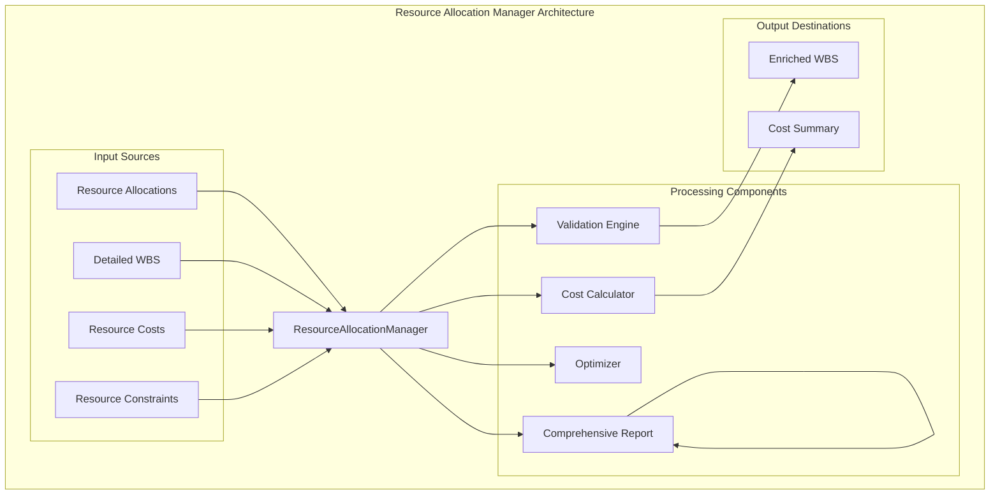
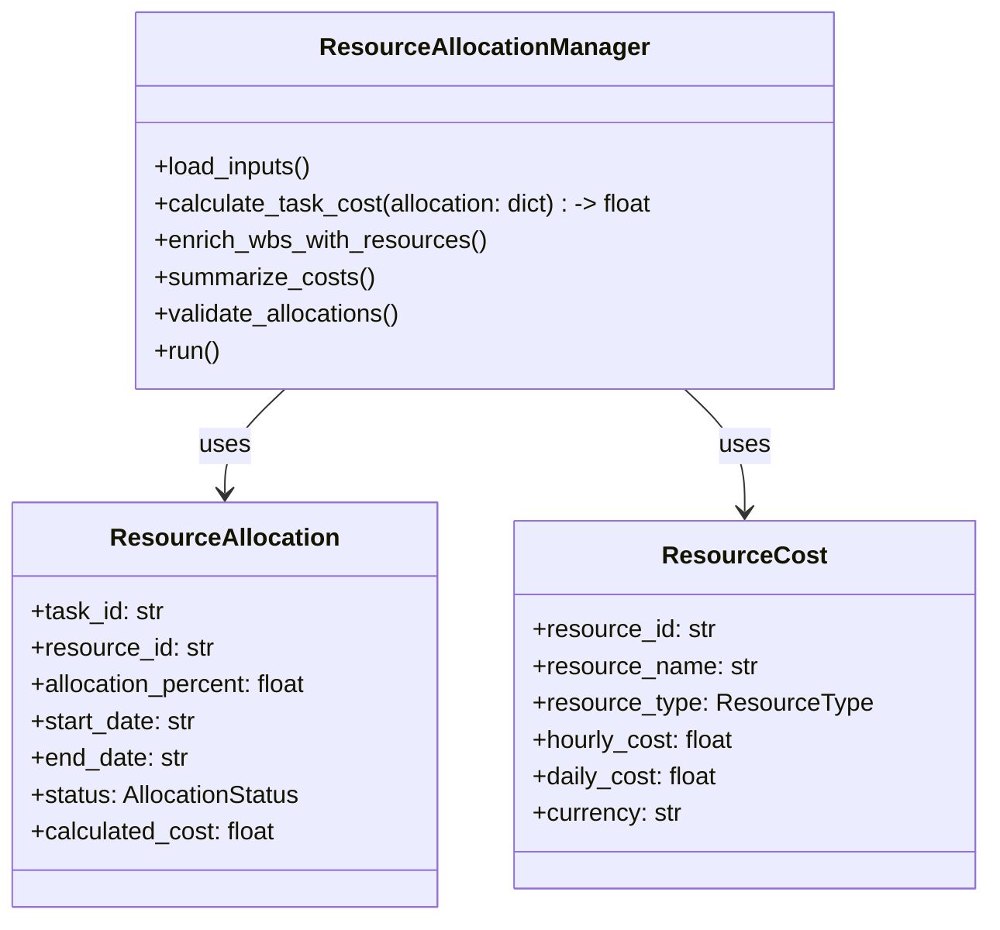
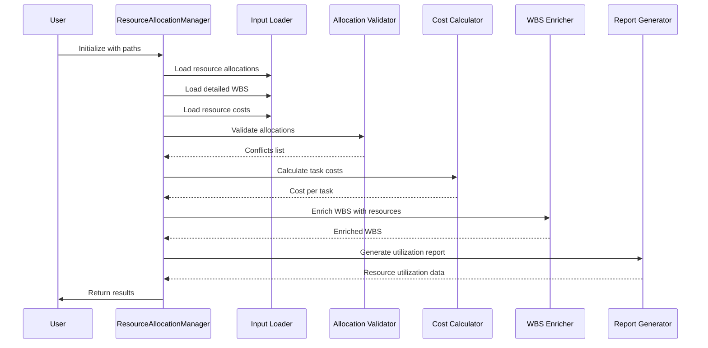

# Resource Allocation Manager Documentation

## Overview

The **Resource Allocation Manager** is a core component of the AutoProjectManagement system's Resource Management Module. It provides comprehensive resource allocation management with advanced cost tracking, resource optimization, and detailed reporting capabilities. This module handles the complete lifecycle of resource allocation from initial planning through to final cost analysis and optimization.

## Table of Contents

1. [Overview](#overview)
2. [Architecture](#architecture)
3. [Core Components](#core-components)
4. [Data Structures](#data-structures)
5. [Workflow](#workflow)
6. [API Reference](#api-reference)
7. [Usage Examples](#usage-examples)
8. [Best Practices](#best-practices)
9. [Troubleshooting](#troubleshooting)

## Architecture

### High-Level Architecture



### Component Relationships



## Core Components

### 1. ResourceAllocationManager Class

The main class that orchestrates the entire resource allocation process.

#### Key Features:
- **Comprehensive Input Loading**: Loads and validates all input data sources
- **Advanced Cost Calculation**: Calculates detailed costs for resource allocations
- **Resource Optimization**: Identifies and resolves resource conflicts
- **Detailed Reporting**: Generates comprehensive reports and summaries
- **Performance Tracking**: Tracks resource utilization and efficiency metrics

#### Class Definition

```python
class ResourceAllocationManager:
    """
    Enhanced resource allocation manager with comprehensive cost tracking,
    resource optimization, and detailed reporting capabilities.
    """
    
    def __init__(self,
                 resource_allocation_path: str = 'JSonDataBase/Inputs/UserInputs/task_resource_allocation.json',
                 detailed_wbs_path: str = 'JSonDataBase/Inputs/UserInputs/detailed_wbs.json',
                 resource_costs_path: str = 'JSonDataBase/Inputs/UserInputs/resource_costs.json',
                 output_path: str = 'JSonDataBase/OutPuts/resource_allocation_enriched.json',
                 summary_output_path: str = 'JSonDataBase/OutPuts/resource_allocation_summary.json',
                 report_output_path: str = 'JSonDataBase/OutPuts/resource_allocation_report.json') -> None:
        """
        Initialize the Resource Allocation Manager.
        """
        pass
    
    def load_inputs(self) -> None:
        """Load and validate all input data."""
        pass
    
    def calculate_task_cost(self, allocation: Dict[str, Any]) -> float:
        """Calculate the cost of a task based on its resource allocation."""
        pass
    
    def enrich_wbs_with_resources(self) -> None:
        """Enrich WBS tasks with resource allocation and cost information."""
        pass
    
    def summarize_costs(self, node: Optional[Dict[str, Any]] = None) -> float:
        """Recursively summarize costs for a task and all subtasks."""
        pass
    
    def validate_allocations(self) -> List[Dict[str, Any]]:
        """Validate resource allocations for conflicts and issues."""
        pass
    
    def run(self) -> None:
        """Execute the complete resource allocation process."""
        pass
```

### 2. Data Classes

#### ResourceAllocation
```python
@dataclass
class ResourceAllocation:
    """Data class for resource allocation details."""
    task_id: str
    resource_id: str
    allocation_percent: float
    start_date: str
    end_date: str
    status: AllocationStatus
    notes: Optional[str] = None
    calculated_cost: Optional[float] = None
```

#### ResourceCost
```python
@dataclass
class ResourceCost:
    """Data class for resource cost information."""
    resource_id: str
    resource_name: str
    resource_type: ResourceType
    hourly_cost: float
    daily_cost: float
    currency: str = "USD"
    effective_date: Optional[str] = None
    expiry_date: Optional[str] = None
```

## Data Structures

### Resource Allocation Schema

| Field | Type | Description | Required |
|-------|------|-------------|----------|
| `task_id` | string | Unique identifier for the task | Yes |
| `resource_id` | string | Unique identifier for the resource | Yes |
| `allocation_percent` | float | Percentage of resource allocated (0-100) | Yes |
| `start_date` | string | Start date in YYYY-MM-DD format | Yes |
| `end_date` | string | End date in YYYY-MM-DD format | Yes |
| `status` | string | Allocation status (planned/active/completed/cancelled/on_hold) | Yes |
| `notes` | string | Additional notes or comments | No |
| `calculated_cost` | float | Auto-calculated cost for the allocation | Auto |

### Resource Cost Schema

| Field | Type | Description | Required |
|-------|------|-------------|----------|
| `resource_id` | string | Unique identifier for the resource | Yes |
| `resource_name` | string | Human-readable resource name | Yes |
| `resource_type` | string | Type of resource (human/equipment/material/software/facility) | Yes |
| `hourly_cost` | float | Cost per hour in USD | Yes |
| `daily_cost` | float | Cost per day in USD | Yes |
| `currency` | string | Currency code (default: USD) | No |
| `effective_date` | string | Date when cost becomes effective | No |
| `expiry_date` | string | Date when cost expires | No |

## Workflow

### Resource Allocation Process Flow



### Detailed Process Steps

1. **Initialization**
   - Set up file paths and configuration
   - Initialize data containers
   - Configure logging

2. **Input Loading**
   - Load resource allocation data
   - Load detailed WBS data
   - Load resource cost information
   - Validate all input data

3. **Validation**
   - Check for overlapping allocations
   - Verify resource existence
   - Validate date formats
   - Ensure allocation percentages are valid

4. **Cost Calculation**
   - Calculate cost for each resource allocation
   - Apply resource rates and allocation percentages
   - Handle edge cases and errors

5. **Enrichment**
   - Add resource information to WBS tasks
   - Calculate total costs for each task
   - Generate summary information

6. **Reporting**
   - Generate comprehensive reports
   - Create utilization analysis
   - Export results in required formats

## API Reference

### ResourceAllocationManager Methods

#### `__init__(...)`
Initialize the Resource Allocation Manager with specified file paths.

**Parameters:**
- `resource_allocation_path` (str): Path to resource allocation JSON file
- `detailed_wbs_path` (str): Path to detailed WBS JSON file
- `resource_costs_path` (str): Path to resource costs JSON file
- `output_path` (str): Path for enriched WBS output
- `summary_output_path` (str): Path for cost summary output
- `report_output_path` (str): Path for comprehensive report output

#### `load_inputs()`
Load and validate all input data sources.

**Returns:** None

#### `calculate_task_cost(allocation: Dict[str, Any]) -> float`
Calculate the cost of a task based on its resource allocation.

**Parameters:**
- `allocation` (dict): Resource allocation dictionary

**Returns:** float - Calculated cost for the allocation

#### `enrich_wbs_with_resources()`
Enrich WBS tasks with resource allocation and cost information.

**Returns:** None

#### `summarize_costs(node: Optional[Dict[str, Any]] = None) -> float`
Recursively summarize costs for a task and all subtasks.

**Parameters:**
- `node` (dict, optional): Task node to summarize

**Returns:** float - Total cost for the task and all subtasks

#### `validate_allocations() -> List[Dict[str, Any]]`
Validate resource allocations for conflicts and issues.

**Returns:** List[Dict[str, Any]] - List of conflicts found

#### `run()`
Execute the complete resource allocation process.

**Returns:** None

## Usage Examples

### Basic Resource Allocation

```python
from autoprojectmanagement.main_modules.resource_management import ResourceAllocationManager

# Initialize with default paths
manager = ResourceAllocationManager()

# Run the complete process
manager.run()

# Access results
print(f"Total project cost: ${manager.total_cost}")
print(f"Number of tasks: {len(manager.task_cost_summary)}")
```

### Custom Configuration

```python
from autoprojectmanagement.main_modules.resource_management import ResourceAllocationManager

# Initialize with custom paths
manager = ResourceAllocationManager(
    resource_allocation_path='custom/allocations.json',
    detailed_wbs_path='custom/wbs.json',
    resource_costs_path='custom/costs.json',
    output_path='custom/enriched_wbs.json'
)

# Run the process
manager.run()
```

### Working with Resource Data

```python
from autoprojectmanagement.main_modules.resource_management import ResourceAllocationManager

# Create manager instance
manager = ResourceAllocationManager()

# Load specific data
manager.load_inputs()

# Calculate cost for a specific allocation
allocation = {
    "task_id": "TASK-001",
    "resource_id": "RES-001",
    "allocation_percent": 75,
    "start_date": "2024-01-01",
    "end_date": "2024-01-31",
    "status": "planned"
}

cost = manager.calculate_task_cost(allocation)
print(f"Cost for allocation: ${cost}")
```

## Best Practices

### Resource Allocation Guidelines

1. **Planning Phase**
   - Define resource types and costs upfront
   - Establish resource constraints early
   - Create realistic allocation percentages

2. **Monitoring Phase**
   - Review utilization weekly
   - Address conflicts immediately
   - Track cost variances closely

3. **Optimization Phase**
   - Rebalance overallocated resources
   - Identify underutilized resources
   - Update cost rates regularly

### Configuration Recommendations

```json
{
  "resource_management": {
    "working_hours_per_day": 8,
    "default_currency": "USD",
    "utilization_thresholds": {
      "optimal_min": 80,
      "optimal_max": 95,
      "warning_threshold": 100
    },
    "validation": {
      "enable_date_validation": true,
      "enable_capacity_check": true,
      "enable_skill_matching": true
    }
  }
}
```

## Troubleshooting

### Common Issues and Solutions

| Issue | Symptom | Solution |
|-------|---------|----------|
| **Missing Resource Costs** | Zero cost calculations | Add resource cost data |
| **Date Conflicts** | Overlapping allocations | Adjust start/end dates |
| **Invalid Percentages** | Allocation > 100% | Correct allocation percentages |
| **Missing Tasks** | Tasks not found in WBS | Verify task IDs in allocation file |

### Debug Mode

Enable debug logging for detailed analysis:

```python
import logging
logging.basicConfig(level=logging.DEBUG)

# Run with debug output
manager = ResourceAllocationManager()
manager.run()
```

## Support and Maintenance

### Regular Maintenance Tasks

1. **Weekly**
   - Review resource utilization reports
   - Update resource costs if needed
   - Check for new conflicts

2. **Monthly**
   - Validate all resource data
   - Update resource availability
   - Review and optimize allocations

3. **Quarterly**
   - Analyze long-term trends
   - Update resource types and categories
   - Review cost calculation parameters

### Contact Information

For support and questions regarding the Resource Allocation Manager:
- **Documentation**: This file and associated module documentation
- **Issues**: Report through the project issue tracking system
- **Updates**: Check the project repository for latest versions

---

*This documentation is part of the AutoProjectManagement system. For more information, visit: https://github.com/autoprojectmanagement/autoprojectmanagement*
