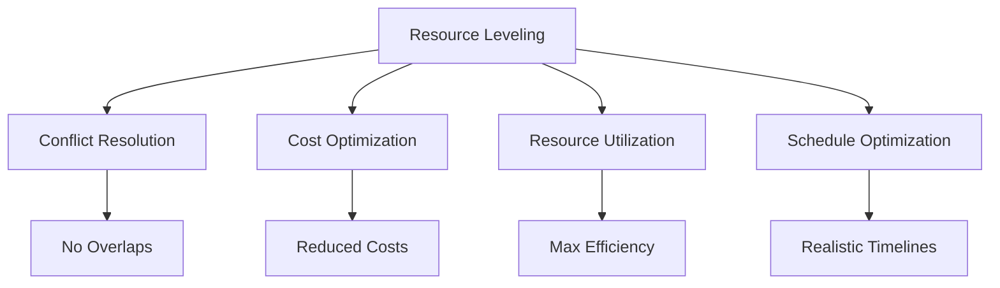
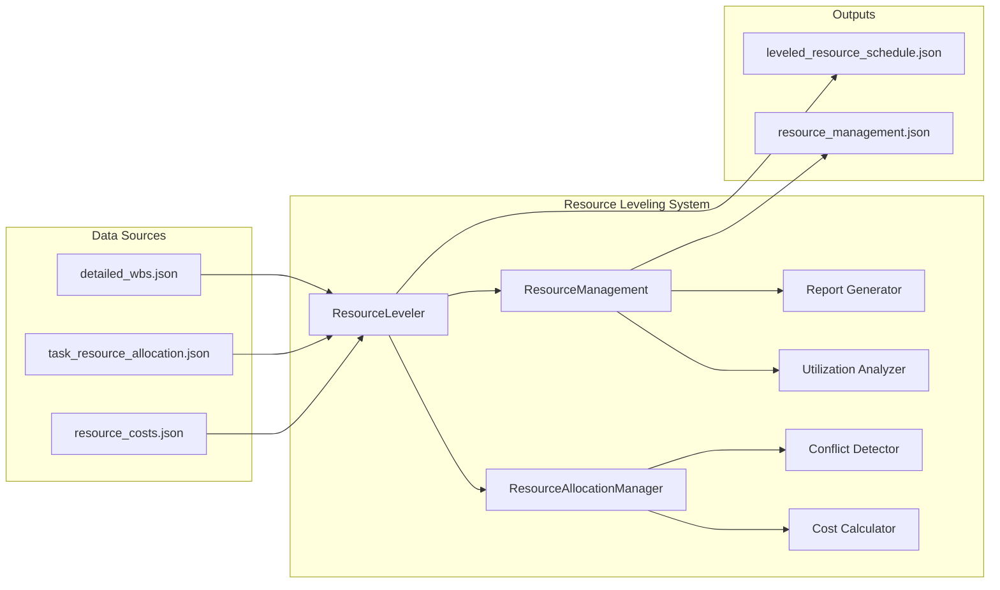
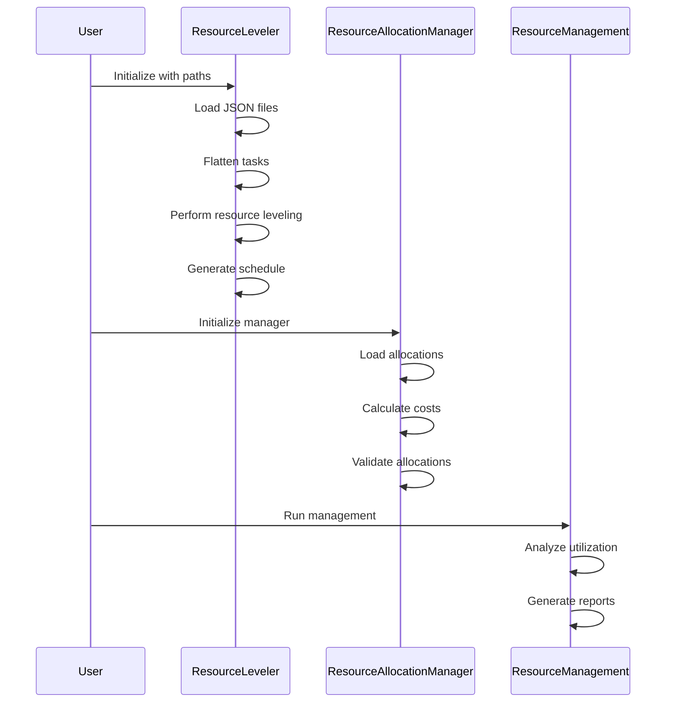
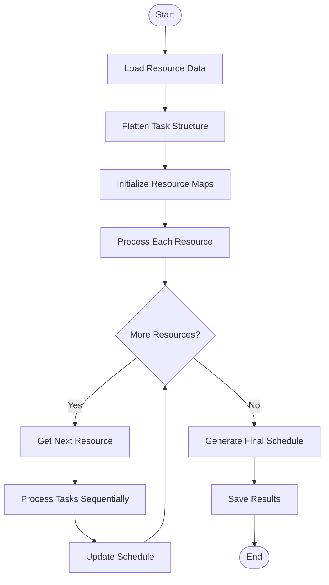

# Resource Leveling Documentation

## Overview

Resource leveling is a critical component of the AutoProjectManagement system that optimizes resource allocation to prevent conflicts and ensure efficient utilization. This documentation provides comprehensive guidance on implementing resource leveling strategies within the AutoProjectManagement framework.

## Table of Contents

1. [Introduction](#introduction)
2. [System Architecture](#system-architecture)
3. [Resource Leveling Algorithms](#resource-leveling-algorithms)
4. [Implementation Guide](#implementation-guide)
5. [Configuration](#configuration)
6. [API Reference](#api-reference)
7. [Best Practices](#best-practices)
8. [Troubleshooting](#troubleshooting)
9. [Performance Optimization](#performance-optimization)
10. [Examples](#examples)

---

## Introduction

Resource leveling is the process of adjusting project schedules to resolve resource conflicts and optimize resource utilization. In the AutoProjectManagement system, this involves:

- **Conflict Resolution**: Identifying and resolving overlapping resource allocations
- **Optimization**: Maximizing resource utilization while maintaining project constraints
- **Balancing**: Distributing workload evenly across available resources
- **Cost Management**: Minimizing resource-related costs through efficient allocation

### Key Benefits



---

## System Architecture

### Component Overview

The resource leveling system consists of the following main components:



### Data Flow



---

## Resource Leveling Algorithms

### 1. Sequential Resource Leveling

The primary algorithm used is sequential resource leveling, which processes resources one at a time:



### 2. Conflict Detection Algorithm

```python
def detect_conflicts(self, allocations: List[Dict[str, Any]]) -> List[Dict[str, Any]]:
    """
    Detect resource allocation conflicts.
    
    Args:
        allocations: List of resource allocations
        
    Returns:
        List of detected conflicts
    """
    conflicts = []
    resource_time_map = defaultdict(list)
    
    for allocation in allocations:
        resource_id = allocation['resource_id']
        start_date = datetime.strptime(allocation['start_date'], "%Y-%m-%d")
        end_date = datetime.strptime(allocation['end_date'], "%Y-%m-%d")
        
        # Check for overlaps
        for existing in resource_time_map[resource_id]:
            if not (end_date < existing['start_date'] or start_date > existing['end_date']):
                conflicts.append({
                    'type': 'overlap',
                    'resource_id': resource_id,
                    'allocation1': allocation,
                    'allocation2': existing
                })
        
        resource_time_map[resource_id].append({
            'start_date': start_date,
            'end_date': end_date,
            'allocation': allocation
        })
    
    return conflicts
```

### 3. Optimization Strategies

| Strategy | Description | Use Case |
|----------|-------------|----------|
| **Time Shifting** | Move tasks to resolve conflicts | When resources are overallocated |
| **Resource Substitution** | Replace resources with alternatives | When primary resource unavailable |
| **Task Splitting** | Break tasks into smaller units | To improve resource utilization |
| **Parallel Processing** | Run tasks concurrently | When resources allow |

---

## Implementation Guide

### Step 1: Initialize the Resource Leveler

```python
from autoprojectmanagement.main_modules.resource_management.resource_leveling import ResourceLeveler

# Initialize with file paths
leveler = ResourceLeveler(
    tasks_filepath='path/to/detailed_wbs.json',
    allocations_filepath='path/to/task_resource_allocation.json',
    output_filepath='path/to/leveled_resource_schedule.json',
    duration_type='normal'  # or 'optimistic', 'pessimistic'
)
```

### Step 2: Run Resource Leveling

```python
# Execute the leveling process
leveler.run()
```

### Step 3: Access Results

```python
# Access the generated schedule
schedule = leveler.task_schedules
for task_id, schedule_info in schedule.items():
    print(f"Task {task_id}: {schedule_info}")
```

### Step 4: Use Resource Management

```python
from autoprojectmanagement.main_modules.resource_management.resource_management import ResourceManagement

# Initialize resource management
manager = ResourceManagement()
manager.run()

# Access results
results = manager.output
print(f"Total cost: ${results['utilization_analysis']['overall_utilization']}")
```

---

## Configuration

### Configuration Files

| File | Purpose | Format |
|------|---------|--------|
| `detailed_wbs.json` | Task hierarchy and details | JSON |
| `task_resource_allocation.json` | Resource assignments | JSON |
| `resource_costs.json` | Resource cost information | JSON |
| `resource_constraints.json` | Resource availability constraints | JSON |

### Configuration Schema

#### detailed_wbs.json
```json
{
  "id": "task-001",
  "name": "Project Planning",
  "estimated_hours": 40,
  "normal_hours": 40,
  "optimistic_hours": 32,
  "pessimistic_hours": 48,
  "subtasks": [
    {
      "id": "task-001-1",
      "name": "Requirements Analysis",
      "estimated_hours": 16,
      "subtasks": []
    }
  ]
}
```

#### task_resource_allocation.json
```json
[
  {
    "task_id": "task-001",
    "resource_id": "dev-001",
    "allocation_percent": 100,
    "start_date": "2025-01-01",
    "end_date": "2025-01-15",
    "status": "planned"
  }
]
```

#### resource_costs.json
```json
{
  "dev-001": {
    "name": "Senior Developer",
    "hourly_cost": 75.0,
    "resource_type": "human"
  }
}
```

---

## API Reference

### ResourceLeveler Class

#### Constructor
```python
ResourceLeveler(
    tasks_filepath: str,
    allocations_filepath: str,
    output_filepath: str,
    duration_type: str = 'normal'
)
```

#### Methods

| Method | Description | Returns |
|--------|-------------|---------|
| `run()` | Execute resource leveling | None |
| `resource_leveling()` | Perform leveling algorithm | Dict[str, Dict[str, Any]] |
| `flatten_tasks()` | Flatten nested task structure | List[Dict[str, Any]] |

### ResourceAllocationManager Class

#### Constructor
```python
ResourceAllocationManager(
    resource_allocation_path: str,
    detailed_wbs_path: str,
    resource_costs_path: str,
    output_path: str
)
```

#### Methods

| Method | Description | Returns |
|--------|-------------|---------|
| `run()` | Execute allocation process | None |
| `calculate_task_cost()` | Calculate task cost | float |
| `validate_allocations()` | Validate allocations | List[Dict[str, Any]] |

---

## Best Practices

### 1. Data Quality

- **Validate Input Data**: Ensure all JSON files are properly formatted
- **Consistent IDs**: Use consistent task and resource IDs across files
- **Realistic Estimates**: Provide accurate time estimates for tasks

### 2. Resource Planning

- **Buffer Time**: Include 10-15% buffer time for unexpected issues
- **Skill Matching**: Match resources to tasks based on skills
- **Availability Checks**: Verify resource availability before allocation

### 3. Monitoring

- **Regular Updates**: Update resource allocations as project progresses
- **Performance Tracking**: Monitor actual vs. planned utilization
- **Cost Tracking**: Track actual costs against budget

### 4. Optimization

- **Review Cycles**: Conduct weekly resource review meetings
- **Rebalancing**: Rebalance allocations when conflicts arise
- **Continuous Improvement**: Use historical data to improve estimates

---

## Troubleshooting

### Common Issues and Solutions

| Issue | Symptom | Solution |
|-------|---------|----------|
| **Invalid JSON** | JSONDecodeError | Validate JSON syntax |
| **Missing Resources** | KeyError | Check resource_costs.json |
| **Date Conflicts** | Overlapping allocations | Adjust dates or resources |
| **High Utilization** | >100% utilization | Redistribute workload |
| **Zero Costs** | All costs = 0 | Check resource_costs.json |

### Debug Mode

Enable debug logging:

```python
import logging
logging.basicConfig(level=logging.DEBUG)
```

### Validation Script

```python
def validate_inputs():
    """Validate all input files."""
    errors = []
    
    # Check file existence
    files = ['detailed_wbs.json', 'task_resource_allocation.json', 'resource_costs.json']
    for file in files:
        if not os.path.exists(file):
            errors.append(f"Missing file: {file}")
    
    # Check JSON validity
    for file in files:
        try:
            with open(file) as f:
                json.load(f)
        except json.JSONDecodeError as e:
            errors.append(f"Invalid JSON in {file}: {e}")
    
    return errors
```

---

## Performance Optimization

### 1. Algorithm Optimization

- **Batch Processing**: Process resources in batches for large datasets
- **Caching**: Cache calculated costs to avoid recalculation
- **Parallel Processing**: Use multiprocessing for independent calculations

### 2. Memory Management

- **Streaming**: Process large files in chunks
- **Garbage Collection**: Explicitly clear large data structures
- **Efficient Data Structures**: Use appropriate data structures for operations

### 3. Database Optimization

- **Indexing**: Create indexes on frequently accessed fields
- **Query Optimization**: Optimize database queries for performance
- **Connection Pooling**: Use connection pooling for database operations

### Performance Metrics

| Metric | Target | Measurement |
|--------|--------|-------------|
| **Processing Time** | < 5 seconds | Time to process 1000 tasks |
| **Memory Usage** | < 100MB | Peak memory usage |
| **Accuracy** | > 99% | Comparison with manual calculation |

---

## Examples

### Example 1: Basic Resource Leveling

```python
# Create sample data
tasks = [
    {
        "id": "task-001",
        "name": "Design Phase",
        "estimated_hours": 40,
        "subtasks": []
    }
]

allocations = [
    {
        "task_id": "task-001",
        "resource_id": "designer-001",
        "allocation_percent": 100,
        "start_date": "2025-01-01",
        "end_date": "2025-01-10"
    }
]

# Run leveling
leveler = ResourceLeveler(
    tasks_filepath='tasks.json',
    allocations_filepath='allocations.json',
    output_filepath='schedule.json'
)
leveler.run()
```

### Example 2: Complex Project with Multiple Resources

```python
# Complex project structure
project = {
    "tasks": [
        {
            "id": "project-001",
            "name": "Web Application",
            "estimated_hours": 200,
            "subtasks": [
                {
                    "id": "frontend-001",
                    "name": "Frontend Development",
                    "estimated_hours": 80,
                    "subtasks": []
                },
                {
                    "id": "backend-001",
                    "name": "Backend Development",
                    "estimated_hours": 120,
                    "subtasks": []
                }
            ]
        }
    ]
}

# Resource allocations
allocations = [
    {
        "task_id": "frontend-001",
        "resource_id": "frontend-dev-001",
        "allocation_percent": 100,
        "start_date": "2025-01-01",
        "end_date": "2025-01-20"
    },
    {
        "task_id": "backend-001",
        "resource_id": "backend-dev-001",
        "allocation_percent": 100,
        "start_date": "2025-01-15",
        "end_date": "2025-02-15"
    }
]
```

### Example 3: Cost Analysis Report

```python
# Generate cost report
manager = ResourceAllocationManager()
manager.run()

# Access results
summary = manager.task_cost_summary
for task_id, info in summary.items():
    print(f"Task {task_id}: ${info['total_cost']}")
```

---

## Integration with Other Modules

### Planning & Estimation Module

Resource leveling integrates seamlessly with the planning and estimation module:


### Quality Commit Management

Resource leveling affects quality commitments:

- **Resource Quality**: Ensure skilled resources are assigned to critical tasks
- **Timeline Quality**: Maintain realistic timelines through proper leveling
- **Cost Quality**: Balance cost optimization with quality requirements

---

## Conclusion

Resource leveling is a fundamental capability of the AutoProjectManagement system that ensures optimal resource utilization while maintaining project constraints. By following this documentation, users can effectively implement resource leveling strategies to improve project outcomes and reduce resource-related risks.

### Next Steps

1. **Review Examples**: Study the provided examples
2. **Test Implementation**: Implement in a test environment
3. **Customize Configuration**: Adapt to your specific needs
4. **Monitor Performance**: Track key metrics
5. **Iterate Improvements**: Continuously improve based on results

### Support

For additional support or questions:
- Review the troubleshooting section
- Check the GitHub repository for updates
- Submit issues through the project issue tracker
