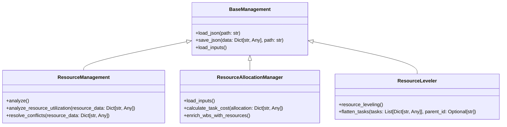
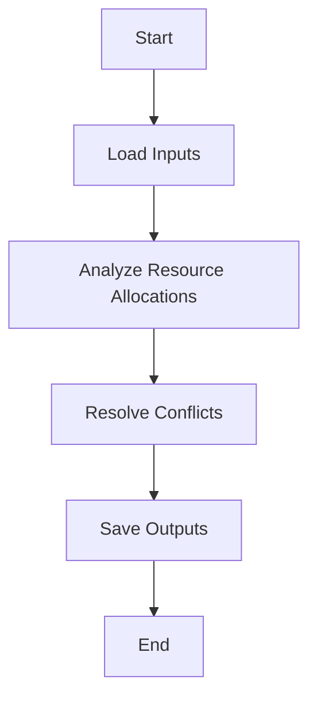
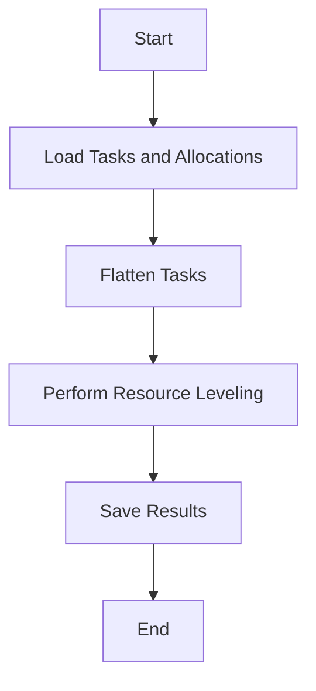

# Resource Management Module Documentation

## Overview of Resource Management Module
The Resource Management Module is a critical component of the AutoProjectManagement system, designed to provide comprehensive resource management capabilities, including:
- Resource allocation and tracking
- Resource leveling and optimization
- Resource utilization analysis
- Conflict resolution for resource constraints

## Class Descriptions

### BaseManagement
The `BaseManagement` class serves as a foundation for management operations, providing common functionality for loading inputs, processing data, and saving outputs.

#### Key Methods
- `load_json(path: str)`: Loads JSON data from the specified file path.
- `save_json(data: Dict[str, Any], path: str)`: Saves data to a JSON file with proper formatting.
- `load_inputs()`: Loads all input files specified in `input_paths`.

### ResourceManagement
The `ResourceManagement` class extends `BaseManagement` and implements comprehensive resource management, including allocation analysis and conflict detection.

#### Key Methods
- `analyze()`: Performs comprehensive resource management analysis.
- `analyze_resource_utilization(resource_data: Dict[str, Any])`: Analyzes resource utilization patterns and efficiency.
- `resolve_conflicts(resource_data: Dict[str, Any])`: Detects and resolves resource allocation conflicts.

### ResourceAllocationManager
The `ResourceAllocationManager` class manages resource allocation, including cost tracking and optimization.

#### Key Methods
- `load_inputs()`: Loads and validates all input data.
- `calculate_task_cost(allocation: Dict[str, Any])`: Calculates the cost of a task based on its resource allocation.
- `enrich_wbs_with_resources()`: Enriches WBS tasks with resource allocation and cost information.

### ResourceLeveler
The `ResourceLeveler` class handles resource leveling for project tasks, ensuring that tasks assigned to the same resource do not overlap in time.

#### Key Methods
- `resource_leveling()`: Performs resource leveling to prevent resource conflicts.
- `flatten_tasks(tasks: List[Dict[str, Any]], parent_id: Optional[str] = None)`: Flattens nested tasks into a list with parent-child relationships.

## Diagrams

### Class Diagram

### Flowchart for Resource Allocation Process

### Flowchart for Resource Leveling Process

## Tables

### Summary of Resource Types
| Resource Type | Description         |
|---------------|---------------------|
| HUMAN         | Human resources      |
| EQUIPMENT     | Equipment resources   |
| MATERIAL      | Material resources    |
| SOFTWARE      | Software resources    |
| FACILITY      | Facility resources    |

### Summary of Allocation Statuses
| Status     | Description                       |
|------------|-----------------------------------|
| PLANNED    | Allocation is planned             |
| ACTIVE     | Allocation is currently active     |
| COMPLETED  | Allocation has been completed      |
| CANCELLED  | Allocation has been cancelled      |
| ON_HOLD    | Allocation is on hold              |

## Conclusion
The Resource Management Module provides essential capabilities for managing resources effectively within the AutoProjectManagement system. By utilizing this module, users can optimize resource allocation, analyze utilization, and resolve conflicts efficiently.
