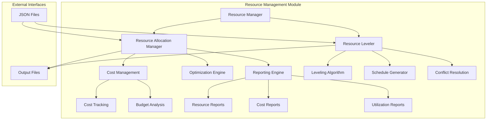
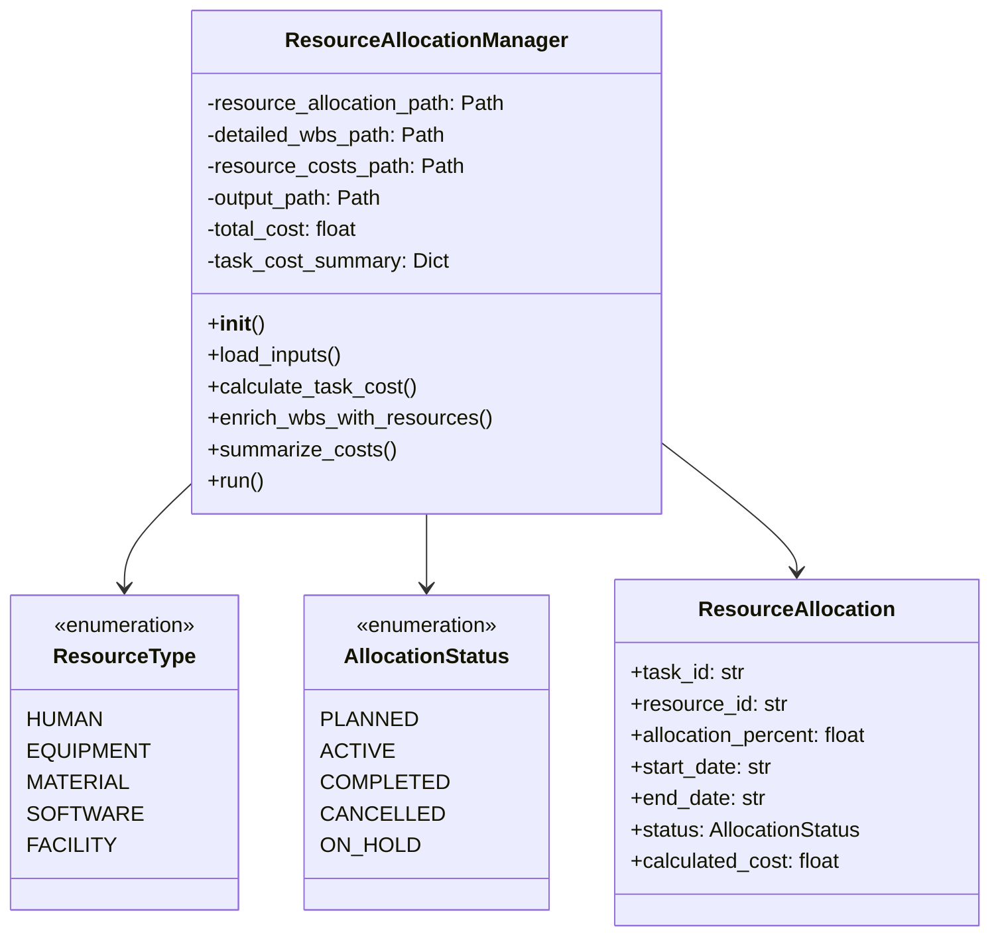
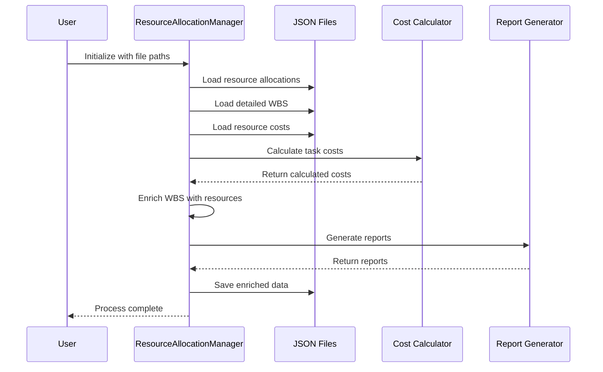
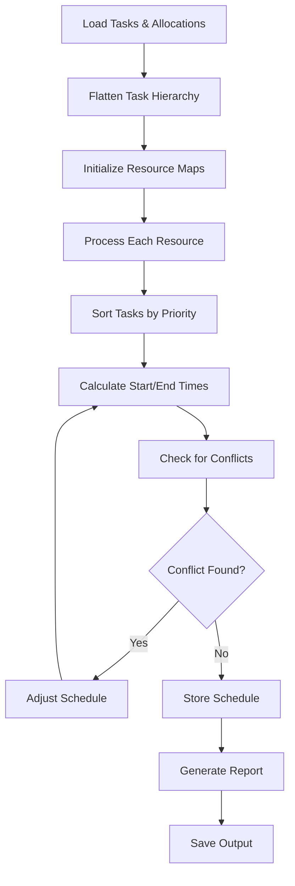
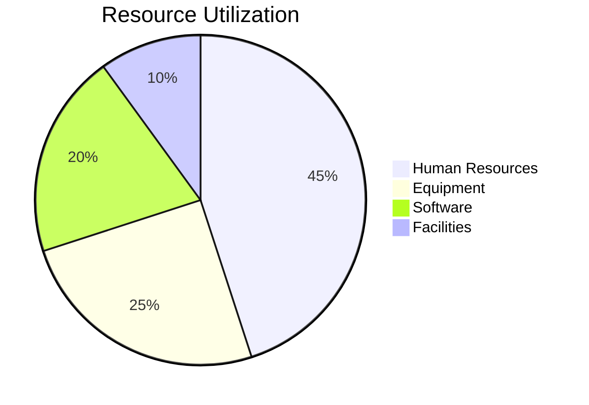
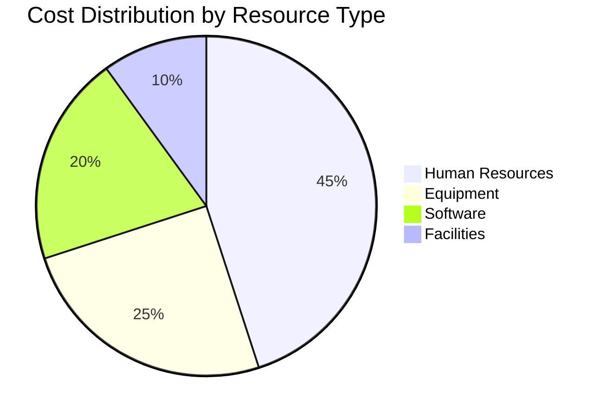
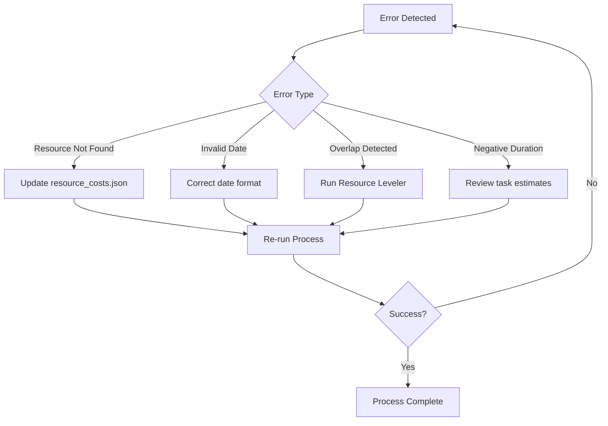

# Resource Management Module Documentation

## Overview

The **Resource Management Module** is a critical component of the AutoProjectManagement system that provides comprehensive resource allocation, leveling, and optimization capabilities. This module ensures optimal utilization of project resources while maintaining cost efficiency and preventing resource conflicts.

## Architecture Overview

### System Architecture Diagram



## Core Components

### 1. Resource Allocation Manager (`resource_allocation_manager.py`)

#### Purpose
Manages comprehensive resource allocation with cost tracking, optimization, and detailed reporting capabilities.

#### Key Features
- **Cost Calculation**: Calculates detailed costs for resource allocations
- **Resource Optimization**: Optimizes resource utilization
- **Conflict Detection**: Identifies and reports resource conflicts
- **Comprehensive Reporting**: Generates detailed resource and cost reports

#### Class Structure



#### Data Flow Diagram



### 2. Resource Leveler (`resource_leveling.py`)

#### Purpose
Performs resource leveling optimization to prevent resource conflicts and ensure smooth project execution.

#### Key Features
- **Conflict Prevention**: Prevents resource conflicts through intelligent scheduling
- **Schedule Optimization**: Optimizes task schedules for maximum efficiency
- **Resource Balancing**: Balances resource utilization across the project
- **Flexible Duration Types**: Supports optimistic, normal, and pessimistic duration estimates

#### Algorithm Flow



## Data Models

### Resource Types

| Resource Type | Description | Examples |
|--------------|-------------|----------|
| **HUMAN** | Human resources | Developers, Designers, Project Managers |
| **EQUIPMENT** | Physical equipment | Servers, Laptops, Testing devices |
| **MATERIAL** | Consumable materials | Paper, Office supplies, Hardware components |
| **SOFTWARE** | Software licenses | Development tools, Productivity software |
| **FACILITY** | Physical spaces | Office space, Meeting rooms, Data centers |

### Allocation Status

| Status | Description | Color Code |
|--------|-------------|------------|
| **PLANNED** | Scheduled but not started | 🟡 Yellow |
| **ACTIVE** | Currently in progress | 🟢 Green |
| **COMPLETED** | Finished successfully | ✅ Blue |
| **CANCELLED** | Cancelled or aborted | ❌ Red |
| **ON_HOLD** | Temporarily paused | ⏸️ Orange |

### Resource Cost Structure

```json
{
  "resource_costs": {
    "dev_001": {
      "resource_name": "Senior Developer",
      "resource_type": "HUMAN",
      "hourly_cost": 75.0,
      "daily_cost": 600.0,
      "currency": "USD",
      "effective_date": "2025-01-01",
      "expiry_date": "2025-12-31"
    },
    "server_001": {
      "resource_name": "Production Server",
      "resource_type": "EQUIPMENT",
      "hourly_cost": 5.0,
      "daily_cost": 120.0,
      "currency": "USD",
      "effective_date": "2025-01-01"
    }
  }
}
```

## Configuration Parameters

### ResourceAllocationManager Configuration

| Parameter | Type | Default Value | Description |
|-----------|------|---------------|-------------|
| `resource_allocation_path` | str | `task_resource_allocation.json` | Path to resource allocation data |
| `detailed_wbs_path` | str | `detailed_wbs.json` | Path to detailed WBS data |
| `resource_costs_path` | str | `resource_costs.json` | Path to resource cost data |
| `output_path` | str | `resource_allocation_enriched.json` | Output file for enriched data |
| `summary_output_path` | str | `resource_allocation_summary.json` | Output file for cost summary |

### ResourceLeveler Configuration

| Parameter | Type | Default Value | Description |
|-----------|------|---------------|-------------|
| `tasks_filepath` | str | `detailed_wbs.json` | Path to tasks data |
| `allocations_filepath` | str | `task_resource_allocation.json` | Path to allocations data |
| `output_filepath` | str | `leveled_resource_schedule.json` | Output file for leveled schedule |
| `duration_type` | str | `normal` | Duration type for calculations |

## Usage Examples

### Basic Resource Allocation

```python
from autoprojectmanagement.main_modules.resource_management import ResourceAllocationManager

# Initialize the manager
manager = ResourceAllocationManager(
    resource_allocation_path='my_project/task_allocations.json',
    detailed_wbs_path='my_project/detailed_wbs.json',
    resource_costs_path='my_project/resource_costs.json'
)

# Run the allocation process
manager.run()

# Access results
print(f"Total project cost: ${manager.total_cost}")
print(f"Number of tasks: {len(manager.task_cost_summary)}")
```

### Resource Leveling

```python
from autoprojectmanagement.main_modules.resource_management import ResourceLeveler

# Initialize the leveler
leveler = ResourceLeveler(
    tasks_filepath='project/tasks.json',
    allocations_filepath='project/allocations.json',
    output_filepath='project/leveled_schedule.json',
    duration_type='normal'
)

# Run leveling
leveler.run()
```

## Performance Metrics

### Key Performance Indicators (KPIs)

| Metric | Formula | Target Value |
|--------|---------|--------------|
| **Resource Utilization** | `(Actual Hours / Available Hours) × 100` | 80-90% |
| **Cost Variance** | `(Actual Cost - Planned Cost) / Planned Cost × 100` | ±10% |
| **Schedule Variance** | `(Actual Duration - Planned Duration) / Planned Duration × 100` | ±5% |
| **Resource Conflict Rate** | `(Conflicts / Total Allocations) × 100` | <5% |

### Performance Dashboard





## Integration Points

### Input Files

| File Name | Purpose | Schema |
|-----------|---------|--------|
| `task_resource_allocation.json` | Resource assignments to tasks | [Schema](#task-allocation-schema) |
| `detailed_wbs.json` | Work Breakdown Structure | [Schema](#wbs-schema) |
| `resource_costs.json` | Resource cost information | [Schema](#cost-schema) |

### Output Files

| File Name | Purpose | Format |
|-----------|---------|--------|
| `resource_allocation_enriched.json` | Enriched WBS with resource data | JSON |
| `resource_allocation_summary.json` | Cost summary by task | JSON |
| `leveled_resource_schedule.json` | Optimized schedule | JSON |

## Error Handling

### Common Error Types

| Error Code | Description | Resolution |
|------------|-------------|------------|
| `RESOURCE_NOT_FOUND` | Resource ID not found in costs | Check resource_costs.json |
| `INVALID_DATE_FORMAT` | Date format not recognized | Use YYYY-MM-DD format |
| `OVERLAP_DETECTED` | Resource allocation conflict | Run resource leveling |
| `NEGATIVE_DURATION` | Invalid task duration | Check task estimates |

### Error Recovery Process



## Best Practices

### Resource Planning
1. **Start with accurate estimates**: Use historical data for better accuracy
2. **Consider resource constraints**: Account for availability and skills
3. **Plan for contingencies**: Include buffer time for unexpected issues
4. **Regular reviews**: Update allocations based on project progress

### Cost Management
1. **Track actual vs planned**: Monitor cost variances regularly
2. **Use realistic rates**: Update resource costs based on market rates
3. **Include all costs**: Don't forget overhead and indirect costs
4. **Budget for changes**: Allow for scope changes and adjustments

### Schedule Optimization
1. **Critical path analysis**: Focus on tasks that impact project timeline
2. **Resource smoothing**: Balance resource utilization across time
3. **Parallel execution**: Identify tasks that can run concurrently
4. **Regular updates**: Adjust schedules based on actual progress

## Troubleshooting Guide

### Common Issues and Solutions

#### Issue: High Resource Conflicts
**Symptoms**: Multiple tasks assigned to same resource simultaneously
**Solution**: 
1. Run ResourceLeveler to detect conflicts
2. Adjust task priorities
3. Consider additional resources
4. Re-sequence tasks

#### Issue: Budget Overrun
**Symptoms**: Actual costs exceed planned budget
**Solution**:
1. Review resource rates
2. Identify cost drivers
3. Negotiate better rates
4. Optimize resource allocation

#### Issue: Schedule Delays
**Symptoms**: Tasks taking longer than estimated
**Solution**:
1. Review task estimates
2. Check resource availability
3. Identify bottlenecks
4. Add parallel tasks

## API Reference

### ResourceAllocationManager Methods

| Method | Parameters | Returns | Description |
|--------|------------|---------|-------------|
| `__init__()` | file_paths: dict | None | Initialize with configuration |
| `load_inputs()` | None | None | Load all input data |
| `calculate_task_cost()` | allocation: dict | float | Calculate task cost |
| `run()` | None | None | Execute complete process |

### ResourceLeveler Methods

| Method | Parameters | Returns | Description |
|--------|------------|---------|-------------|
| `__init__()` | file_paths: dict, duration_type: str | None | Initialize leveler |
| `flatten_tasks()` | tasks: list, parent_id: str | list | Flatten task hierarchy |
| `resource_leveling()` | None | dict | Perform leveling |
| `run()` | None | None | Execute complete process |

## Support and Maintenance

### Regular Maintenance Tasks
- [ ] Update resource costs monthly
- [ ] Review resource allocations weekly
- [ ] Generate performance reports monthly
- [ ] Update documentation quarterly
- [ ] Backup configuration files daily

### Support Contact
For technical support or questions about the Resource Management Module:
- **Documentation**: See this file and related documentation
- **Issues**: Report via GitHub issues
- **Updates**: Check for updates in the AutoProjectManagement repository

---

*This documentation is part of the AutoProjectManagement system. For the latest updates and additional information, please refer to the official repository.*
