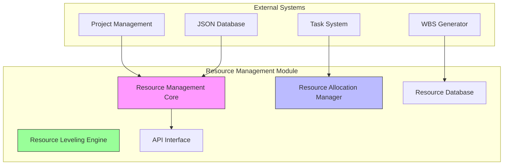
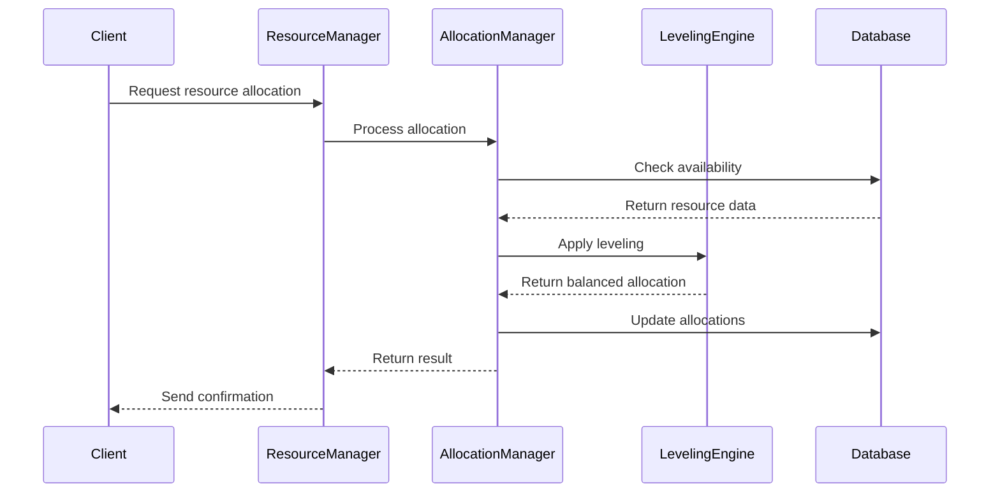
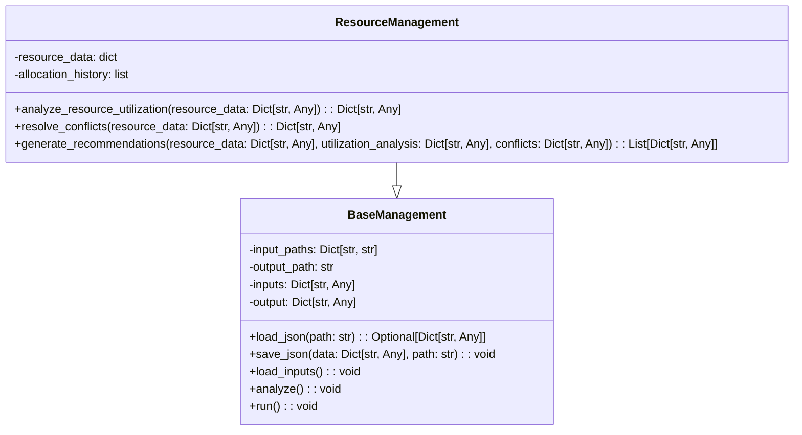
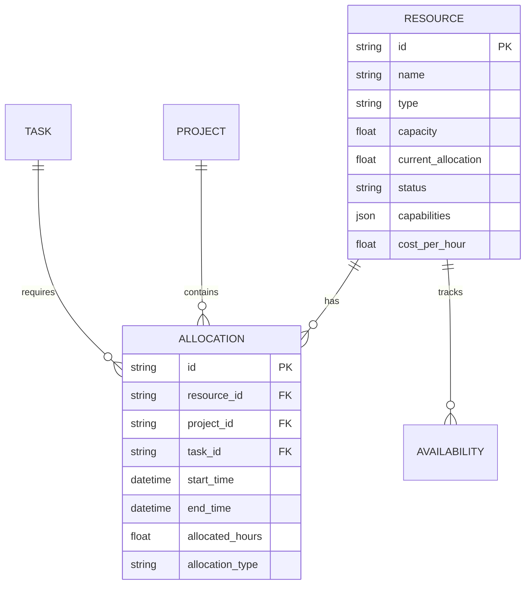
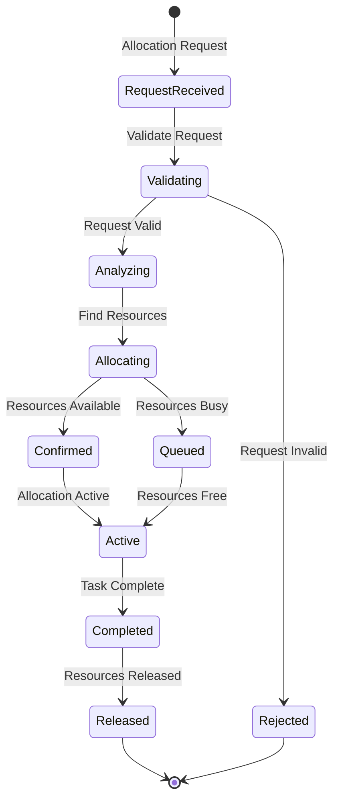

# Resource Management Module Documentation

## Table of Contents
1. [Overview](#overview)
2. [Architecture](#architecture)
3. [Core Components](#core-components)
4. [Data Models](#data-models)
5. [Resource Allocation Process](#resource-allocation-process)
6. [Analysis and Optimization](#analysis-and-optimization)
7. [API Reference](#api-reference)
8. [Usage Examples](#usage-examples)
9. [Configuration](#configuration)
10. [Best Practices](#best-practices)

---

## Overview

The Resource Management Module is a comprehensive system designed to handle project resource allocation, tracking, and optimization within the AutoProjectManagement system. It provides intelligent resource allocation algorithms, real-time capacity monitoring, and resource leveling capabilities to ensure optimal resource utilization across projects.

### Key Features
- **Dynamic Resource Allocation**: Automatic allocation based on availability and requirements
- **Resource Leveling**: Balances resource loads to prevent over-allocation
- **Multi-project Support**: Handle resources across multiple concurrent projects
- **Real-time Monitoring**: Track resource utilization and availability
- **Conflict Resolution**: Intelligent resolution of resource allocation conflicts
- **Performance Optimization**: Optimize resource distribution for maximum efficiency

### Module Structure
```
autoprojectmanagement/main_modules/resource_management/
├── resource_management.py              # Core resource management
├── resource_allocation_manager.py      # Allocation algorithms
├── resource_leveling.py               # Load balancing engine
```

---

## Architecture

### High-Level Architecture



### Component Interaction Flow



---

## Core Components

### 1. Resource Management Core (`resource_management.py`)

The central component that manages all resource-related operations.

#### Key Classes:



#### Key Methods:

| Method | Description | Parameters | Returns |
|---|---|---|---|
| `analyze_resource_utilization()` | Analyzes resource utilization patterns | `resource_data: Dict[str, Any]` | Utilization analysis results |
| `resolve_conflicts()` | Detects and resolves allocation conflicts | `resource_data: Dict[str, Any]` | Conflict resolution results |
| `generate_recommendations()` | Generates optimization recommendations | Multiple analysis results | List of recommendations |

### 2. Resource Allocation Manager (`resource_allocation_manager.py`)

Handles the allocation of resources to tasks and projects based on availability and requirements.

### 3. Resource Leveling Engine (`resource_leveling.py`)

Provides load balancing and optimization capabilities to prevent resource over-allocation.

---

## Data Models

### Resource Entity Structure



### Resource Types

| Type | Description | Attributes | Examples |
|---|---|---|---|
| **Human** | Team members and stakeholders | skills, availability, cost_rate | Developers, Designers, PMs |
| **Equipment** | Physical tools and machinery | capacity, maintenance_schedule | Servers, Laptops, Licenses |
| **Digital** | Software and digital assets | version, capacity, access_rights | APIs, Databases, Cloud Services |

---

## Resource Allocation Process

### Allocation Workflow



### Allocation Request Structure

```json
{
  "request_id": "req_12345",
  "project_id": "proj_67890",
  "task_id": "task_54321",
  "resource_requirements": {
    "type": "human",
    "skills": ["python", "react"],
    "experience_level": "senior",
    "availability_window": {
      "start": "2024-01-15T09:00:00Z",
      "end": "2024-01-20T17:00:00Z"
    },
    "allocation_hours": 40,
    "priority": "high"
  }
}
```

---

## Analysis and Optimization

### Utilization Analysis

```mermaid
ganttChart
    title Resource Utilization Timeline
    dateFormat  YYYY-MM-DD
    section Developer Resources
    Alice           :active, dev1, 2024-01-01, 30d
    Bob             :dev2, after dev1, 20d
    Charlie         :dev3, 2024-01-15
    
    section Equipment Resources
    Server1         :active, srv1, 2024-01-01, 45d
    Server2         :srv2, after srv1, 15d
```

### Performance Metrics

| Metric | Description | Target Value | Calculation |
|---|---|---|---|
| **Utilization Rate** | Percentage of resource capacity used | 80-100% | (Allocated Hours / Capacity) × 100 |
| **Efficiency Score** | Overall resource efficiency | >85% | Weighted average of utilization rates |
| **Conflict Rate** | Percentage of allocations with conflicts | <5% | (Conflicts / Total Allocations) × 100 |
| **Optimization Score** | Resource optimization effectiveness | >90% | (Optimized Allocations / Total Allocations) × 100 |

---

## API Reference

### ResourceManagement Class

#### Constructor
```python
manager = ResourceManagement(
    resource_allocation_path: str = "path/to/allocations.json",
    output_path: str = "path/to/output.json"
)
```

#### Methods

| Method | Description | Parameters | Returns |
|---|---|---|---|
| `run()` | Execute complete resource management process | None | None |
| `analyze_resource_utilization()` | Analyze resource utilization patterns | `resource_data: Dict[str, Any]` | Utilization analysis |
| `resolve_conflicts()` | Detect and resolve conflicts | `resource_data: Dict[str, Any]` | Conflict resolution |
| `generate_recommendations()` | Generate optimization recommendations | Multiple analysis results | List of recommendations |

---

## Usage Examples

### Basic Usage

```python
from autoprojectmanagement.main_modules.resource_management.resource_management import ResourceManagement

# Initialize resource manager
manager = ResourceManagement()

# Run resource management analysis
manager.run()

# Results will be saved to JSonDataBase/OutPuts/resource_management.json
```

### Custom Configuration

```python
# Use custom paths
manager = ResourceManagement(
    resource_allocation_path="custom/path/allocations.json",
    output_path="custom/path/output.json"
)
manager.run()
```

### Integration with Other Modules

```python
# Integrate with project management
from autoprojectmanagement.main_modules.resource_management.resource_management import ResourceManagement

# After project planning
manager = ResourceManagement(
    resource_allocation_path="JSonDataBase/OutPuts/resource_allocation_enriched.json"
)
manager.run()
```

---

## Configuration

### Environment Variables

| Variable | Description | Default Value |
|---|---|---|
| `RESOURCE_ALLOCATION_PATH` | Path to resource allocation JSON | `JSonDataBase/OutPuts/resource_allocation_enriched.json` |
| `OUTPUT_PATH` | Path for output JSON | `JSonDataBase/OutPuts/resource_management.json` |
| `LOG_LEVEL` | Logging level | `INFO` |

### JSON Configuration

```json
{
  "resource_management": {
    "input_paths": {
      "resource_allocations": "JSonDataBase/OutPuts/resource_allocation_enriched.json"
    },
    "output_path": "JSonDataBase/OutPuts/resource_management.json",
    "analysis_options": {
      "include_utilization_analysis": true,
      "include_conflict_detection": true,
      "include_recommendations": true
    }
  }
}
```

---

## Best Practices

### Resource Planning
1. **Regular Analysis**: Run resource analysis weekly to identify trends
2. **Capacity Planning**: Always maintain 20% buffer capacity for unexpected demands
3. **Skill Matching**: Ensure resource skills match task requirements
4. **Load Balancing**: Distribute work evenly across available resources

### Conflict Prevention
1. **Early Detection**: Monitor resource conflicts daily
2. **Proactive Scheduling**: Schedule resources with buffer time
3. **Communication**: Maintain clear communication about resource availability
4. **Flexibility**: Build flexibility into resource allocation plans

### Performance Optimization
1. **Continuous Monitoring**: Track resource performance metrics
2. **Regular Reviews**: Conduct monthly resource utilization reviews
3. **Optimization**: Implement recommendations from analysis
4. **Feedback Loop**: Use feedback to improve resource allocation strategies

---

## Troubleshooting

### Common Issues

| Issue | Cause | Solution |
|---|---|---|
| **No resource data** | Missing input file | Check file path and permissions |
| **Permission errors** | File system permissions | Ensure write access to output directory |
| **JSON parsing errors** | Invalid JSON format | Validate JSON structure |
| **Resource conflicts** | Overlapping allocations | Use conflict resolution methods |

### Debug Mode

Enable debug logging:
```python
import logging
logging.basicConfig(level=logging.DEBUG)
```

---

## Support and Maintenance

### Regular Maintenance Tasks
- [ ] Weekly resource utilization analysis
- [ ] Monthly conflict resolution review
- [ ] Quarterly optimization recommendations update
- [ ] Annual resource capacity planning

### Contact Information
For support and questions, please refer to the AutoProjectManagement documentation or contact the development team.

---

*This documentation is automatically generated and maintained by the AutoProjectManagement system. Last updated: 2024-01-15*
