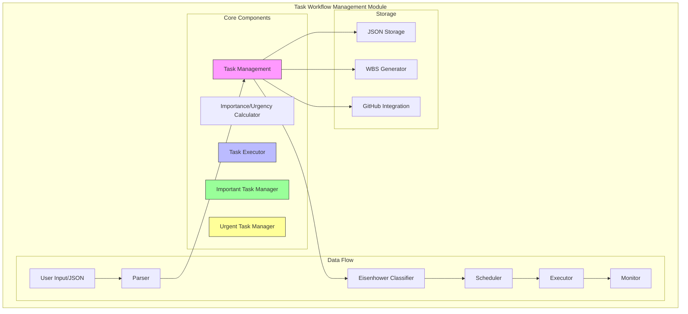
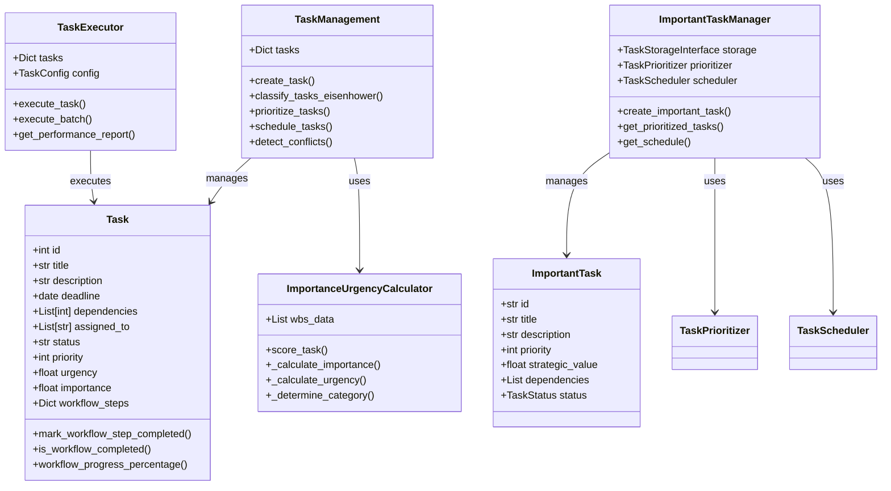
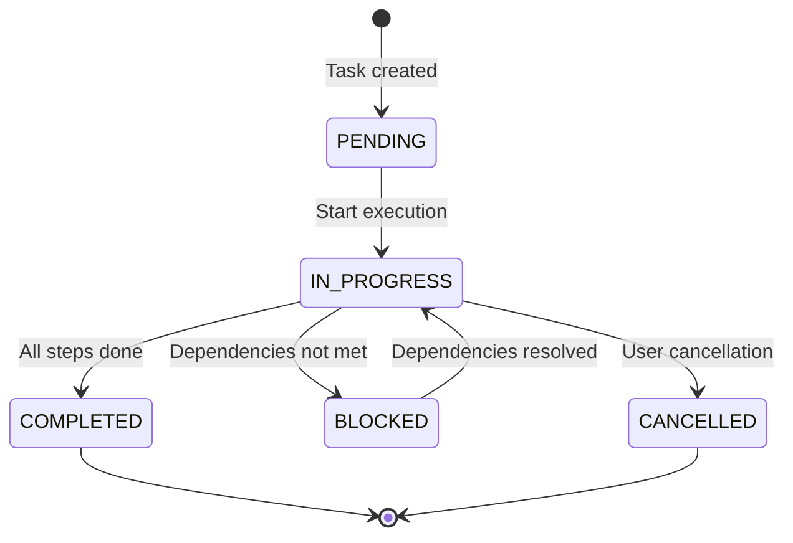
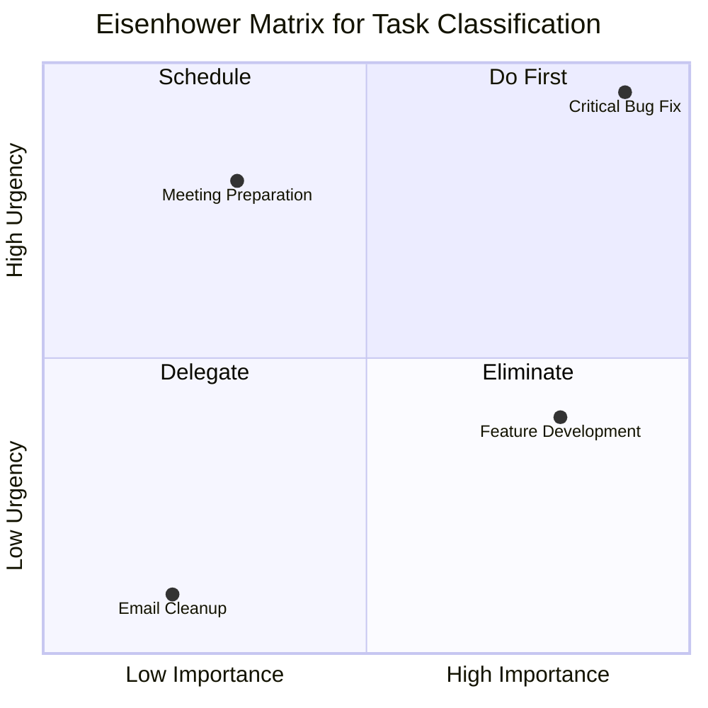
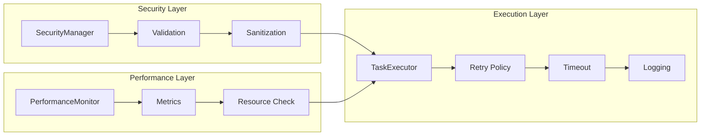
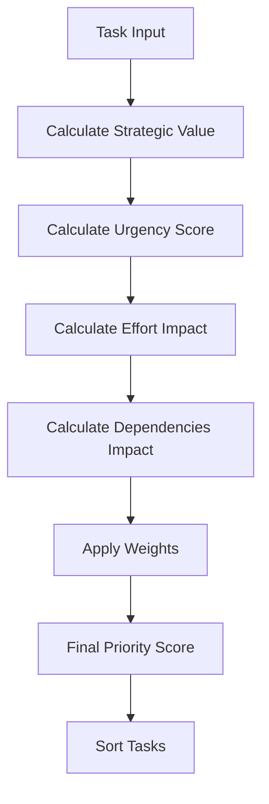
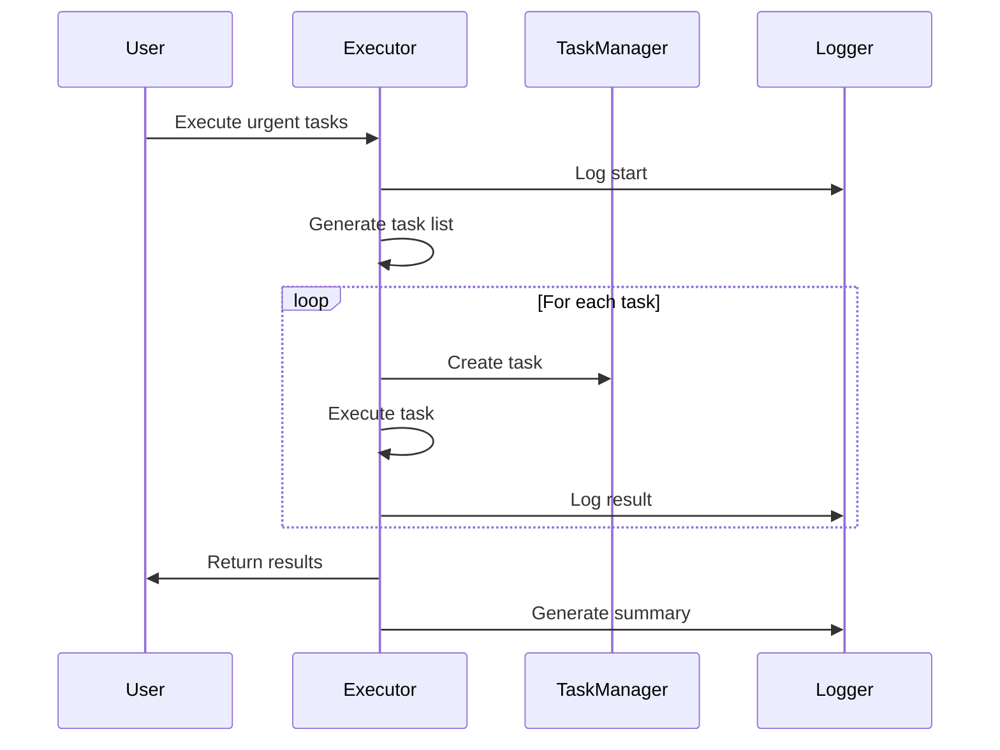

# Task Workflow Management Module Documentation

## Overview

The **Task Workflow Management Module** is a comprehensive system within the AutoProjectManagement framework that handles task creation, prioritization, execution, and monitoring. This module implements advanced task management capabilities including Eisenhower Matrix classification, workflow step tracking, GitHub integration, and sophisticated scheduling algorithms.

## System Architecture

### High-Level Architecture



### Component Relationships



## Core Components

### 1. Task Management System (`task_management.py`)

The central task management system provides comprehensive task lifecycle management.

#### Key Features:
- **Task Creation**: Create tasks with full metadata
- **Workflow Tracking**: Track progress through predefined workflow steps
- **GitHub Integration**: Parse commit messages to update task status
- **Eisenhower Matrix**: Automatic task classification
- **Dependency Management**: Handle task dependencies and conflicts

#### Task Status Lifecycle



#### Workflow Steps Tracking

| Step Name | Description | Completion Criteria |
|-----------|-------------|-------------------|
| **Coding** | Implementation of the feature | Code committed and pushed |
| **Testing** | Unit and integration tests | All tests passing |
| **Documentation** | Code documentation | Docstrings and README updated |
| **Code Review** | Peer review process | Review approved |
| **Merge and Deployment** | Integration and deployment | Successfully deployed |
| **Verification** | Final validation | Acceptance criteria met |

### 2. Importance/Urgency Calculator (`importance_urgency_calculator.py`)

Implements the Eisenhower Matrix methodology for task prioritization.

#### Calculation Factors

| Factor | Weight | Description |
|--------|--------|-------------|
| **Dependencies** | 30% | Number of dependent tasks |
| **Critical Path** | 30% | Whether task is on critical path |
| **Cost Impact** | 20% | Financial impact of task |
| **Priority** | 20% | User-defined priority level |

#### Urgency Factors

| Factor | Weight | Description |
|--------|--------|-------------|
| **Deadline Proximity** | 50% | Days until deadline |
| **Risk of Delay** | 30% | Likelihood of delays |
| **Stakeholder Pressure** | 20% | External pressure indicators |

#### Eisenhower Matrix Classification



### 3. Task Executor (`task_executor.py`)

Advanced task execution engine with security, performance, and reliability features.

#### Architecture Overview



#### Security Features

| Feature | Implementation | Purpose |
|---------|----------------|---------|
| **Input Sanitization** | Remove dangerous characters | Prevent injection attacks |
| **Data Validation** | Schema validation | Ensure data integrity |
| **Secure ID Generation** | Cryptographic randomness | Prevent ID prediction |
| **Access Control** | Thread-safe operations | Prevent race conditions |

#### Performance Monitoring

| Metric | Description | Threshold |
|--------|-------------|-----------|
| **CPU Usage** | System CPU utilization | < 80% |
| **Memory Usage** | RAM utilization | < 80% |
| **Task Duration** | Execution time per task | < 300s |
| **Success Rate** | Percentage of successful tasks | > 95% |

### 4. Important Task Manager (`do_important_tasks.py`)

Specialized manager for strategic and high-value tasks.

#### Task Categories

| Category | Description | Examples |
|----------|-------------|----------|
| **Strategic** | Long-term impact tasks | Roadmap development, architecture decisions |
| **Operational** | Day-to-day operations | Process improvements, system maintenance |
| **Tactical** | Short-term objectives | Sprint planning, feature releases |
| **Development** | Technical implementation | Code development, testing, deployment |
| **Research** | Investigation and analysis | Technology evaluation, feasibility studies |

#### Priority Calculation Algorithm



### 5. Urgent Task Manager (`do_urgent_tasks.py`)

Handles time-sensitive tasks with immediate execution requirements.

#### Execution Flow



## Data Models

### Task Data Structure

```json
{
  "task": {
    "id": "unique_identifier",
    "title": "Task title",
    "description": "Detailed description",
    "deadline": "2024-12-31",
    "dependencies": [1, 2, 3],
    "assigned_to": ["user1", "user2"],
    "status": "pending|in_progress|completed|blocked|cancelled",
    "priority": 1,
    "urgency": 85.5,
    "importance": 92.3,
    "github_issue_number": 123,
    "workflow_steps": {
      "Coding": true,
      "Testing": false,
      "Documentation": false,
      "Code Review": false,
      "Merge and Deployment": false,
      "Verification": false
    }
  }
}
```

### Configuration Structure

```json
{
  "task_workflow_config": {
    "storage_path": "tasks.json",
    "max_concurrent_tasks": 10,
    "timeout_seconds": 300,
    "retry_policy": {
      "max_retries": 3,
      "backoff_factor": 2.0,
      "max_wait": 60.0
    },
    "priority_weights": {
      "strategic_value": 0.4,
      "urgency": 0.3,
      "effort": 0.2,
      "dependencies": 0.1
    },
    "working_hours_per_day": 8,
    "resource_threshold": 80.0
  }
}
```

## API Reference

### Task Management API

#### Creating Tasks
```python
from autoprojectmanagement.main_modules.task_workflow_management.task_management import TaskManagement

tm = TaskManagement()
task = tm.create_task(
    title="Implement new feature",
    description="Add user authentication system",
    deadline=datetime.date(2024, 12, 31),
    priority=90,
    assigned_to=["developer1", "developer2"]
)
```

#### Classifying Tasks
```python
# Calculate importance and urgency
tm.calculate_urgency_importance()

# Get Eisenhower matrix classification
quadrants = tm.classify_tasks_eisenhower()
do_first_tasks = quadrants["do_now"]
schedule_tasks = quadrants["schedule"]
```

#### Scheduling Tasks
```python
# Get prioritized task list
prioritized_tasks = tm.prioritize_tasks()

# Generate schedule
scheduled_tasks = tm.schedule_tasks()
```

### Task Execution API

#### Basic Task Execution
```python
from autoprojectmanagement.main_modules.task_workflow_management.task_executor import TaskExecutor

executor = TaskExecutor()
task = Task("task_123", "Critical bug fix", "Fix authentication issue")
executor.add_task(task)

# Execute single task
result = await executor.execute_task("task_123")

# Execute multiple tasks
results = await executor.execute_batch(["task_123", "task_124"])
```

#### Advanced Configuration
```python
from autoprojectmanagement.main_modules.task_workflow_management.task_executor import TaskConfig, RetryPolicy

config = TaskConfig(
    timeout_seconds=600,
    retry_policy=RetryPolicy(max_retries=5, backoff_factor=1.5),
    max_concurrent_tasks=5,
    resource_threshold=75.0
)

executor = TaskExecutor(config=config)
```

### Important Task Management

#### Creating Strategic Tasks
```python
from autoprojectmanagement.main_modules.task_workflow_management.do_important_tasks import ImportantTaskManager

manager = await ImportantTaskManager.create()
task_id = await manager.create_important_task(
    title="Develop Strategic Roadmap",
    description="Create 6-month project roadmap",
    priority=1,
    estimated_hours=8.0,
    strategic_value=95.0,
    deadline=datetime.now() + timedelta(days=14),
    category="strategic"
)
```

#### Getting Insights
```python
# Get prioritized tasks
prioritized = await manager.get_prioritized_tasks(limit=10)

# Get schedule
schedule = await manager.get_schedule()

# Get strategic insights
insights = await manager.get_strategic_insights()
```

## Integration Examples

### GitHub Integration

#### Commit Message Parsing
```python
# Parse commit messages to update workflow steps
commit_message = "Task 123: Code Review done - fixed all review comments"
tm.update_workflow_steps_from_commit_message(commit_message)
```

#### GitHub Issue Linking
```python
# Link tasks to GitHub issues
task.github_issue_number = 456
```

### WBS Generation

#### From Creative Input
```python
# Generate Work Breakdown Structure from idea
tasks = tm.generate_wbs_from_idea(
    "Build a web application with user authentication",
    max_depth=4
)
```

### Resource Allocation

#### Task Assignment
```python
# Assign tasks to team members
tm.assign_task(task.id, ["developer1", "developer2"])

# Check resource conflicts
conflicts = tm.detect_conflicts()
```

## Performance Metrics

### Task Statistics Dashboard

| Metric | Formula | Target |
|--------|---------|--------|
| **Completion Rate** | (Completed / Total) × 100 | > 90% |
| **Average Duration** | Total Duration / Completed Tasks | < 2 hours |
| **Success Rate** | Successful / Total Attempts | > 95% |
| **Overdue Tasks** | Tasks past deadline | < 5% |
| **Resource Utilization** | CPU/Memory usage | < 80% |

### Performance Monitoring

```mermaid
gantt
    title Task Execution Timeline
    dateFormat HH:mm:ss
    section Critical Tasks
    Task 1           :a1, 00:00:00, 30s
    Task 2           :a2, after a1, 45s
    Task 3           :a3, after a2, 60s
    
    section Important Tasks
    Strategic Task   :b1, 00:00:00, 90s
    Research Task    :b2, after b1, 120s
    
    section Urgent Tasks
    Bug Fix          :c1, 00:00:00, 15s
    Hotfix           :c2, after c1, 20s
```



## Error Handling

### Exception Handling Strategy

| Exception Type | Handling Strategy | Recovery Action |
|----------------|-------------------|-----------------|
| **ValidationError** | Input validation | Provide user feedback |
| **TimeoutError** | Retry with backoff | Increase timeout |
| **ResourceError** | Resource monitoring | Queue for later |
| **DependencyError** | Check dependencies | Resolve dependencies |
| **NetworkError** | Retry with exponential backoff | Alert user |

### Logging Strategy

```python
# Configure comprehensive logging
import logging

logging.basicConfig(
    level=logging.INFO,
    format='%(asctime)s - %(name)s - %(levelname)s - %(message)s',
    handlers=[
        logging.FileHandler('task_workflow.log'),
        logging.StreamHandler()
    ]
)

# Module-specific logging
task_logger = logging.getLogger('task_management')
executor_logger = logging.getLogger('task_executor')
```

## Testing Strategy

### Unit Test Coverage

| Component | Test Coverage | Key Test Areas |
|-----------|---------------|----------------|
| Task Creation | 100% | Validation, defaults, edge cases |
| Priority Calculation | 95% | Algorithm accuracy, boundary values |
| Workflow Steps | 90% | State transitions, completion tracking |
| Error Handling | 100% | Exception handling, recovery mechanisms |
| Performance | 85% | Resource usage, timeout handling |

### Integration Test Scenarios

1. **End-to-End Task Lifecycle**
   - Create task → Update status → Complete workflow → Archive

2. **GitHub Integration**
   - Commit message parsing → Workflow step updates

3. **Concurrent Execution**
   - Multiple tasks executing simultaneously → Resource management

4. **Error Recovery**
   - Network failure → Retry → Success

## Deployment Considerations

### System Requirements

| Requirement | Minimum | Recommended |
|-------------|---------|-------------|
| **Python** | 3.8+ | 3.10+ |
| **Memory** | 512MB | 2GB |
| **Storage** | 100MB | 1GB |
| **CPU** | 1 core | 2+ cores |
| **Network** | Stable connection | High-speed |

### Configuration Management

```yaml
# production_config.yaml
task_workflow:
  storage:
    type: "json"
    path: "/var/lib/autoproject/tasks.json"
    backup_path: "/var/backups/autoproject/"
  
  execution:
    max_concurrent_tasks: 20
    timeout_seconds: 600
    retry_attempts: 5
    
  monitoring:
    enable_performance_monitoring: true
    log_level: "INFO"
    metrics_endpoint: "/metrics"
    
  security:
    enable_input_validation: true
    sanitize_inputs: true
    max_task_size: 1048576  # 1MB
```

## Best Practices

### Task Design Guidelines

1. **Granularity**: Break large tasks into smaller, manageable subtasks
2. **Dependencies**: Clearly define task dependencies
3. **Deadlines**: Set realistic deadlines with buffer time
4. **Priorities**: Use consistent priority scales across the team
5. **Workflow**: Define clear completion criteria for each step

### Performance Optimization

1. **Batch Processing**: Group similar tasks for efficient execution
2. **Resource Monitoring**: Monitor system resources continuously
3. **Caching**: Cache frequently accessed task data
4. **Async Operations**: Use async/await for I/O operations
5. **Connection Pooling**: Reuse database connections

### Security Best Practices

1. **Input Validation**: Always validate and sanitize user inputs
2. **Access Control**: Implement proper authentication and authorization
3. **Data Encryption**: Encrypt sensitive task data at rest
4. **Audit Logging**: Log all task modifications and access
5. **Rate Limiting**: Prevent abuse with rate limiting

## Troubleshooting

### Common Issues and Solutions

| Issue | Symptoms | Solution |
|-------|----------|----------|
| **Task Stuck** | Status not updating | Check dependencies and workflow steps |
| **High Resource Usage** | System slowdown | Reduce concurrent tasks |
| **Failed Executions** | High error rate | Check configuration and dependencies |
| **Data Corruption** | Invalid task data | Restore from backup |
| **Performance Degradation** | Slow response times | Optimize queries and add caching |

### Debug Mode

```python
# Enable debug mode
import logging
logging.getLogger('task_workflow').setLevel(logging.DEBUG)

# Enable performance profiling
from autoprojectmanagement.main_modules.task_workflow_management.task_executor import PerformanceMonitor

monitor = PerformanceMonitor()
monitor.start_monitoring("debug_session")
```

## Future Enhancements

### Planned Features

1. **AI-Powered Prioritization**: Machine learning for task prioritization
2. **Real-time Collaboration**: Multi-user task editing
3. **Advanced Analytics**: Predictive task completion
4. **Mobile Support**: Mobile app for task management
5. **Integration Hub**: Connect with more external services

### API Roadmap

| Version | Features | Timeline |
|---------|----------|----------|
| **2.1** | WebSocket support, real-time updates | Q1 2025 |
| **2.2** | GraphQL API, advanced queries | Q2 2025 |
| **2.3** | AI recommendations, smart scheduling | Q3 2025 |
| **3.0** | Microservices architecture | Q4 2025 |

## Support and Maintenance

### Documentation Updates

- **Version Control**: All documentation changes tracked in Git
- **Review Process**: Peer review for all documentation updates
- **User Feedback**: Regular collection of user feedback
- **Training Materials**: Video tutorials and workshops

### Community Support

- **GitHub Issues**: Bug reports and feature requests
- **Discussions**: Community forum for questions
- **Contributing**: Guidelines for code contributions
- **Security**: Responsible disclosure process

---

*This documentation is maintained by the AutoProjectManagement Team. For questions or contributions, please visit our [GitHub repository](https://github.com/autoprojectmanagement/autoprojectmanagement).*
