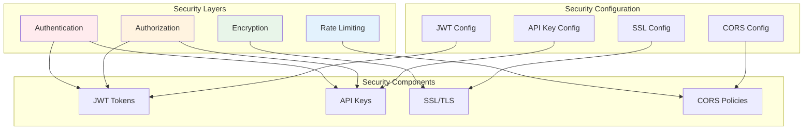
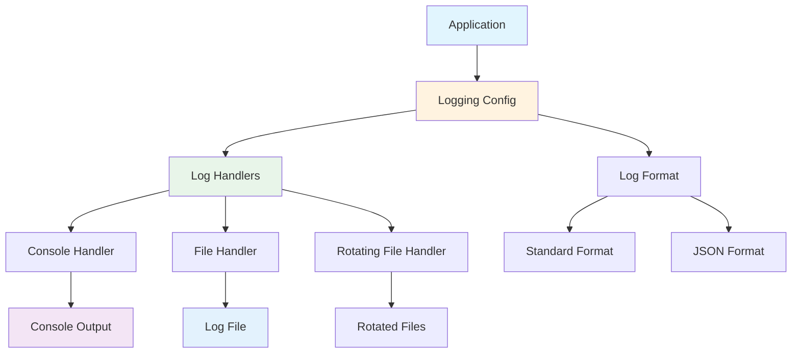
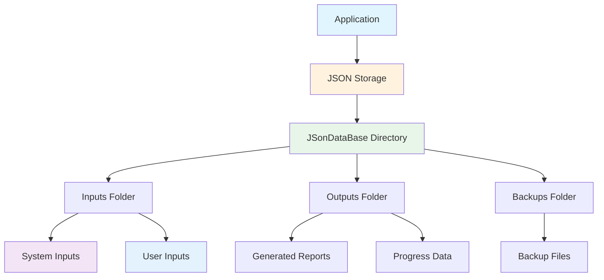
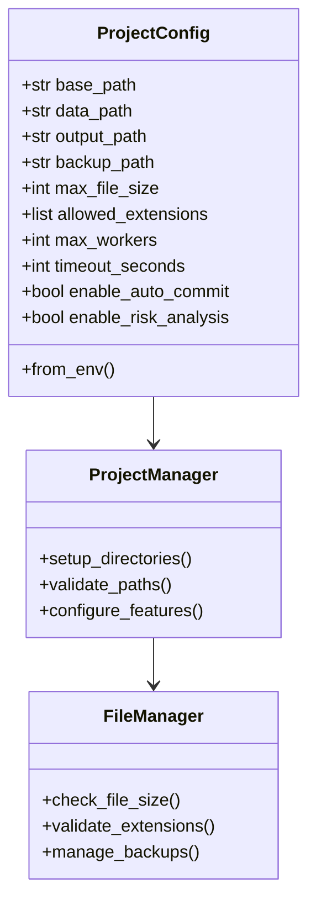
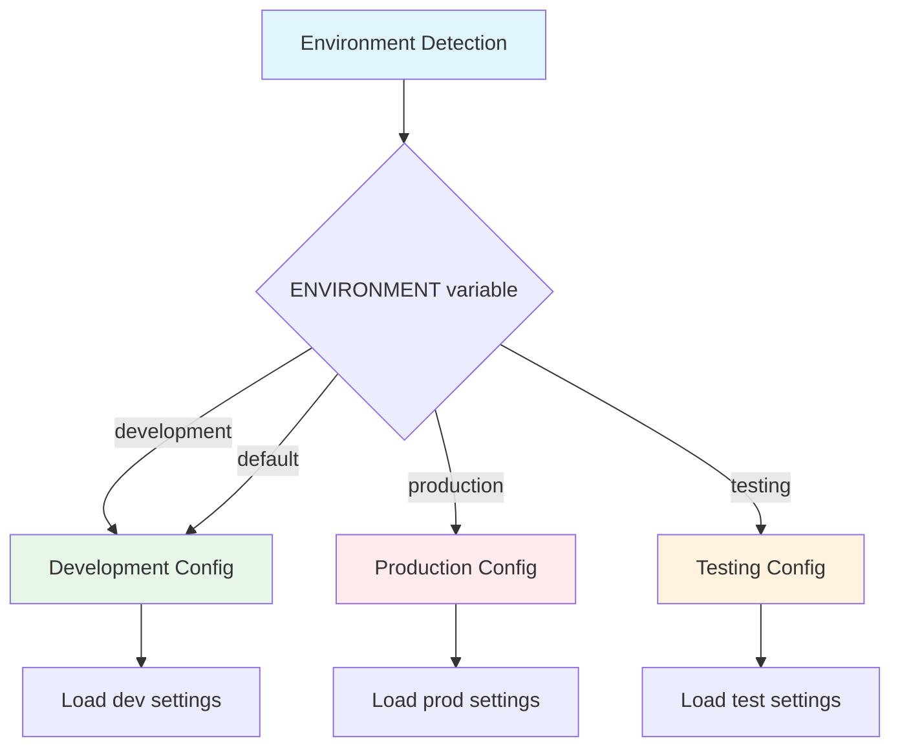
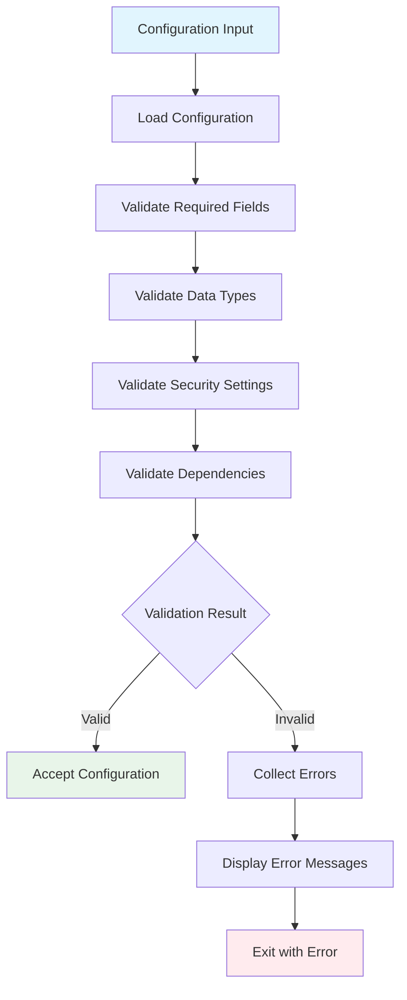
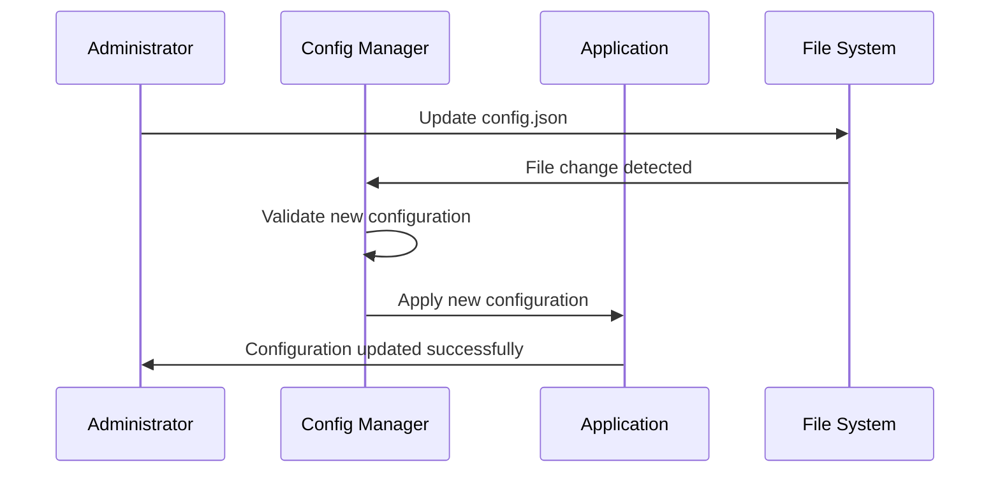

# AutoProjectManagement Configuration Guide - Complete

## GitHub Integration (Continued)

#### 2. Configure Environment Variables
To configure environment variables for GitHub integration, set the following variables in your environment:

- **GITHUB_TOKEN**: Your personal access token for GitHub
- **GITHUB_USERNAME**: Your GitHub username
- **GITHUB_DEFAULT_REPO**: The default repository to use for operations

This setup allows the AutoProjectManagement system to interact with GitHub securely and efficiently.

#### 3. Configuration Example
The GitHub integration configuration includes several key settings:

- **Token**: Authentication token for GitHub API access
- **Username**: GitHub username for repository operations
- **Default Repository**: Primary repository for automated operations
- **Default Branch**: Main branch for commit operations
- **Auto Sync**: Automatic synchronization with GitHub
- **Sync Interval**: Frequency of synchronization operations

These settings ensure seamless integration between the AutoProjectManagement system and GitHub repositories.

---

## Security Configuration

### Security Architecture



### Security Configuration Options

| Setting | Type | Default | Description |
|---------|------|---------|-------------|
| `jwt_secret_key` | string | change-this | JWT signing secret key |
| `jwt_algorithm` | string | HS256 | JWT algorithm (HS256/RS256) |
| `jwt_expiration_minutes` | integer | 60 | Token expiration time |
| `api_key_header` | string | X-API-Key | API key header name |
| `api_key_required` | boolean | false | Require API key |
| `cors_allowed_origins` | list | ["*"] | CORS allowed origins |
| `ssl_cert_path` | string | - | SSL certificate file path |
| `ssl_key_path` | string | - | SSL private key file path |

### Security Best Practices

#### 1. JWT Configuration
JWT (JSON Web Token) configuration includes several security-critical settings:

- **Secret Key**: A secure, unique key used for signing JWT tokens
- **Algorithm**: The cryptographic algorithm used for token signing (typically HS256)
- **Expiration Time**: The duration in minutes before tokens expire for security

These settings ensure secure authentication and authorization within the AutoProjectManagement system.

#### 2. API Key Configuration
API Key configuration provides an additional layer of security for API access:

- **API Key Requirement**: Whether API keys are required for authentication
- **API Key Header**: The HTTP header used to pass API keys in requests

This configuration allows for flexible security policies based on deployment requirements.

#### 3. SSL/TLS Configuration
SSL/TLS configuration is essential for securing communications between clients and the server:

- **SSL Certificate Path**: The file path to the SSL certificate used for secure connections
- **SSL Key Path**: The file path to the private key associated with the SSL certificate

This configuration ensures that all data transmitted over the network is encrypted and secure.

---

## Logging Configuration

### Logging Architecture



### Logging Configuration Options

| Setting | Type | Default | Description |
|---------|------|---------|-------------|
| `level` | string | INFO | Logging level (DEBUG, INFO, WARNING, ERROR) |
| `format` | string | standard | Log format string |
| `file_path` | string | - | Log file path |
| `max_file_size` | string | 10MB | Maximum log file size |
| `backup_count` | integer | 5 | Number of backup files |
| `json_format` | boolean | false | Use JSON format |
| `include_extra` | boolean | true | Include extra fields |

### Logging Configuration Examples

#### 1. Basic Console Logging
Basic console logging configuration includes:

- **Logging Level**: The severity level of logs (e.g., DEBUG, INFO, WARNING, ERROR)
- **Log Format**: The format string for log messages, which can include timestamps, log levels, and messages

This configuration allows for easy monitoring of application behavior during development and production.

#### 2. File Logging with Rotation
File logging configuration with rotation includes:

- **Logging Level**: The severity level of logs (e.g., DEBUG, INFO)
- **File Path**: The location where log files are stored
- **Max File Size**: The maximum size of a log file before it is rotated
- **Backup Count**: The number of backup log files to keep

This configuration ensures that log files do not consume excessive disk space while retaining important log history.

#### 3. JSON Structured Logging
JSON structured logging configuration allows for logs to be formatted in JSON, which is useful for structured logging systems:

- **Logging Level**: The severity level of logs (e.g., INFO, DEBUG)
- **JSON Format**: Whether to output logs in JSON format
- **Include Extra Fields**: Option to include additional contextual information in logs

This configuration enhances log analysis and integration with log management systems.

---

## JSON Storage Configuration

### JSON Storage Architecture



### JSON Storage Configuration Options

| Setting | Type | Default | Description |
|---------|------|---------|-------------|
| `type` | string | json | Storage type (always 'json') |
| `json_path` | string | autoproject.json | Main JSON configuration file |
| `data_directory` | string | JSonDataBase | Directory for JSON data files |
| `inputs_path` | string | JSonDataBase/Inputs | Input JSON files directory |
| `outputs_path` | string | JSonDataBase/OutPuts | Output JSON files directory |
| `backup_enabled` | boolean | true | Enable automatic backups |
| `backup_count` | integer | 5 | Number of backup files to keep |
| `max_file_size` | integer | 10485760 | Maximum JSON file size (10MB) |
| `encoding` | string | utf-8 | File encoding for JSON files |

### JSON Storage Configuration Examples

#### 1. Basic JSON Storage
```json
{
  "database": {
    "type": "json",
    "json_path": "autoproject.json",
    "data_directory": "JSonDataBase",
    "backup_enabled": true
  }
}
```

#### 2. Custom Directory Structure
```json
{
  "database": {
    "type": "json",
    "json_path": "config/project_data.json",
    "data_directory": "project_data",
    "inputs_path": "project_data/inputs",
    "outputs_path": "project_data/outputs",
    "backup_enabled": true,
    "backup_count": 10
  }
}
```

#### 3. Production JSON Storage
```json
{
  "database": {
    "type": "json",
    "json_path": "/opt/autoproject/data/main.json",
    "data_directory": "/opt/autoproject/data",
    "backup_enabled": true,
    "backup_count": 20,
    "max_file_size": 52428800
  }
}
```

---

## Project Configuration

### Project Configuration Structure



### Project Configuration Options

| Setting | Type | Default | Description |
|---------|------|---------|-------------|
| `base_path` | string | current directory | Project base directory |
| `data_path` | string | JSonDataBase | Data directory path |
| `output_path` | string | JSonDataBase/OutPuts | Output directory path |
| `backup_path` | string | project_management/PM_Backups | Backup directory path |
| `max_file_size` | integer | 10485760 | Maximum file size (10MB) |
| `allowed_extensions` | list | [...] | Allowed file extensions |
| `max_workers` | integer | 4 | Maximum worker threads |
| `timeout_seconds` | integer | 300 | Operation timeout |
| `enable_auto_commit` | boolean | true | Enable automatic commits |
| `enable_risk_analysis` | boolean | true | Enable risk analysis |
| `enable_progress_tracking` | boolean | true | Enable progress tracking |
| `enable_github_integration` | boolean | true | Enable GitHub integration |

### Project Configuration Example

```json
{
  "project": {
    "base_path": "/path/to/project",
    "data_path": "JSonDataBase",
    "output_path": "JSonDataBase/OutPuts",
    "backup_path": "project_management/PM_Backups",
    "max_file_size": 10485760,
    "allowed_extensions": [".py", ".js", ".json", ".md"],
    "max_workers": 8,
    "timeout_seconds": 300,
    "enable_auto_commit": true,
    "enable_risk_analysis": true,
    "enable_progress_tracking": true,
    "enable_github_integration": true
  }
}
```

---

## Environment-Specific Configurations

### Environment Configuration Matrix

| Feature | Development | Production | Testing |
|---------|-------------|------------|---------|
| **API Debug** | true | false | true |
| **Storage Type** | JSON files | JSON files | JSON files |
| **Logging Level** | DEBUG | INFO | DEBUG |
| **GitHub Integration** | true | true | false |
| **SSL Required** | false | true | false |
| **Rate Limiting** | relaxed | strict | disabled |

### Environment Configuration Examples

#### Development Configuration
```json
{
  "api": {
    "host": "127.0.0.1",
    "port": 8000,
    "debug": true,
    "reload": true
  },
  "database": {
    "type": "json",
    "json_path": "dev.json"
  },
  "logging": {
    "level": "DEBUG"
  },
  "security": {
    "api_key_required": false
  }
}
```

#### Production Configuration
```json
{
  "api": {
    "host": "0.0.0.0",
    "port": 8080,
    "debug": false,
    "reload": false
  },
  "database": {
    "type": "json",
    "json_path": "prod.json"
  },
  "logging": {
    "level": "INFO",
    "file_path": "/var/log/autoproject.log"
  },
  "security": {
    "api_key_required": true,
    "ssl_cert_path": "/certs/server.crt",
    "ssl_key_path": "/certs/server.key"
  }
}
```

#### Testing Configuration
```json
{
  "api": {
    "host": "127.0.0.1",
    "port": 8001,
    "debug": true,
    "reload": true
  },
  "database": {
    "type": "json",
    "json_path": ":memory:"
  },
  "logging": {
    "level": "DEBUG"
  },
  "project": {
    "enable_github_integration": false
  }
}
```

### Environment Detection



---

## Configuration Validation

### Validation Process



### Validation Rules

| Section | Required Fields | Validation Rules |
|---------|-----------------|------------------|
| **API** | host, port | host must be valid IP/domain, port 1-65535 |
| **Database** | type | must be 'json' |
| **GitHub** | token (if enabled) | must be valid GitHub token format |
| **Security** | jwt_secret_key | must not be default value |
| **Logging** | level | must be valid log level |
| **Project** | base_path | must be valid directory path |

### Validation Error Examples

```json
{
  "errors": [
    {
      "field": "github.token",
      "message": "GitHub token is required when GitHub integration is enabled",
      "type": "missing_required"
    },
    {
      "field": "security.jwt_secret_key",
      "message": "JWT secret key must be changed from default value",
      "type": "security_risk"
    },
    {
      "field": "api.port",
      "message": "Port must be between 1 and 65535",
      "type": "invalid_value"
    }
  ]
}
```

### Validation Methods

#### 1. Programmatic Validation
```python
from autoproject_configuration import Config

config = Config()
try:
    config.validate()
    print("Configuration is valid")
except ValueError as e:
    print(f"Configuration error: {e}")
```

#### 2. Command Line Validation
```bash
python -c "from autoproject_configuration import config; config.validate()"
```

#### 3. Configuration Checker Script
```bash
python -m autoprojectmanagement.configuration.check_config --config config.json
```

---

## Configuration Management

### Configuration Management Commands

| Command | Description | Example |
|---------|-------------|---------|
| `config.validate()` | Validate current configuration | Python API |
| `print_config()` | Display current configuration | Python API |
| `reload_config()` | Reload configuration from files | Python API |
| `--config` | Specify configuration file | CLI argument |
| `--validate` | Validate configuration | CLI argument |

### Configuration Management Tools

#### 1. Configuration CLI
```bash
# Validate configuration
python -m autoprojectmanagement.configuration validate --config config.json

# Show current configuration
python -m autoprojectmanagement.configuration show

# Reload configuration
python -m autoprojectmanagement.configuration reload

# Generate sample configuration
python -m autoprojectmanagement.configuration generate --env development
```

#### 2. Configuration Management Script
```python
from autoprojectmanagement.configuration.manager import ConfigManager

manager = ConfigManager()
manager.load_config('config.json')
manager.validate_config()
manager.apply_config()
```

### Configuration Hot-Reload



### Configuration Backup and Restore

#### Backup Configuration
```bash
# Backup current configuration
cp config.json config.backup.json

# Backup with timestamp
cp config.json config.backup.$(date +%Y%m%d_%H%M%S).json
```

#### Restore Configuration
```bash
# Restore from backup
cp config.backup.json config.json

# Validate after restore
python -m autoprojectmanagement.configuration validate
```

---

## Troubleshooting

### Common Configuration Issues

| Issue | Symptom | Solution |
|-------|---------|----------|
| **Invalid JSON** | JSON parsing error | Use JSON validator |
| **Missing required field** | Validation error | Add missing configuration |
| **Invalid port** | Port already in use | Change port number |
| **JSON file not found** | File not found error | Check file paths |
| **GitHub token invalid** | 401 Unauthorized | Regenerate GitHub token |
| **SSL certificate error** | SSL handshake failed | Check certificate paths |

### Configuration Debugging

#### 1. Enable Debug Logging
```json
{
  "logging": {
    "level": "DEBUG"
  }
}
```

#### 2. Configuration Test Script
```python
import json
from autoproject_configuration import Config

# Test configuration loading
config = Config()
print("Configuration loaded successfully")

# Test validation
try:
    config.validate()
    print("Configuration is valid")
except ValueError as e:
    print(f"Validation error: {e}")

# Test JSON storage
print(f"Storage type: {config.database.type}")
print(f"JSON path: {config.database.json_path}")
```

#### 3. Environment Variable Check
```bash
# Check environment variables
env | grep -E "(API_|DB_|GITHUB_|SECURITY_|LOG_|PROJECT_)"

# Check specific variable
echo $API_PORT
echo $GITHUB_TOKEN
```

### Configuration Diagnostic Commands

```bash
# Check configuration syntax
python -m json.tool config.json

# Validate configuration
python -c "from autoproject_configuration import config; config.validate()"

# Test JSON storage
python -c "from autoproject_configuration import config; print(f'Storage: {config.database.type}')"

# Test GitHub integration
python -c "from autoprojectmanagement.services.github_integration import GitHubIntegration; print('GitHub ready')"
```

### Getting Help

#### 1. Configuration Documentation
- Full configuration reference: [Configuration Guide](Configuration_Guide.md)
- API documentation: [API Reference](API_Reference.md)
- Environment setup: [Installation Guide](Installation_Guide.md)

#### 2. Community Support
- GitHub Issues: [Report configuration issues](https://github.com/autoprojectmanagement/autoprojectmanagement/issues)
- Discussions: [Configuration discussions](https://github.com/autoprojectmanagement/autoprojectmanagement/discussions)
- Documentation: [Wiki pages](https://github.com/autoprojectmanagement/autoprojectmanagement/wiki)

#### 3. Professional Support
- Email: support@autoprojectmanagement.com
- Documentation: docs@autoprojectmanagement.com
- Consulting: consulting@autoprojectmanagement.com

---

## Quick Reference

### Configuration File Template

```json
{
  "api": {
    "host": "127.0.0.1",
    "port": 8000,
    "debug": false,
    "reload": true,
    "cors_origins": ["http://localhost:3000"]
  },
  "database": {
    "type": "json",
    "json_path": "autoproject.json",
    "data_directory": "JSonDataBase",
    "backup_enabled": true
  },
  "github": {
    "token": "your-github-token",
    "default_repo": "username/repository",
    "default_branch": "main"
  },
  "security": {
    "jwt_secret_key": "your-secret-key",
    "jwt_expiration_minutes": 60
  },
  "logging": {
    "level": "INFO",
    "file_path": "logs/autoproject.log"
  },
  "project": {
    "base_path": "/path/to/project",
    "enable_auto_commit": true,
    "enable_risk_analysis": true
  }
}
```

### Environment Variables Quick Setup

```bash
# Development
export API_HOST=127.0.0.1
export API_PORT=8000
export API_DEBUG=true
export DB_TYPE=json
export GITHUB_TOKEN=your-token

# Production
export API_HOST=0.0.0.0
export API_PORT=8080
export API_DEBUG=false
export DB_TYPE=json
```

### Configuration Validation Checklist

- [ ] JSON syntax is valid
- [ ] All required fields are present
- [ ] JSON file paths are correct
- [ ] GitHub token has correct permissions
- [ ] Security settings are properly configured
- [ ] File paths exist and are accessible
- [ ] Port numbers are available
- [ ] Environment variables are set

---

## External Database Integration (Optional)

### Overview
While AutoProjectManagement uses JSON files as its primary storage mechanism, users can integrate with external databases if needed. This is completely optional and external to the core system.

### Integration Approaches

#### 1. Data Export/Import
- Export JSON data to external databases
- Import data from external databases into JSON format
- Use the `JSONDataLinker` service for data transformation

#### 2. Custom Adapters
- Create custom database adapters
- Implement JSON-to-database mapping
- Use external ETL tools for data synchronization

#### 3. Hybrid Storage
- Keep core configuration in JSON files
- Store large datasets in external databases
- Maintain JSON as the primary configuration format

### Example Integration
```python
# Example: Export JSON data to external database
from autoprojectmanagement.services.json_data_linker import JSONDataLinker
import sqlite3

def export_to_sqlite(json_files, db_path):
    linker = JSONDataLinker()
    linker.link_files(json_files)
    
    conn = sqlite3.connect(db_path)
    # Custom export logic here
    conn.close()
```

---

*This configuration guide is continuously updated. For the latest information, please check the [official documentation](https://autoprojectmanagement.com/docs).*
