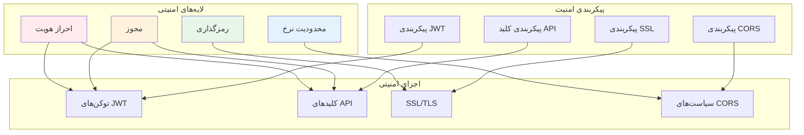
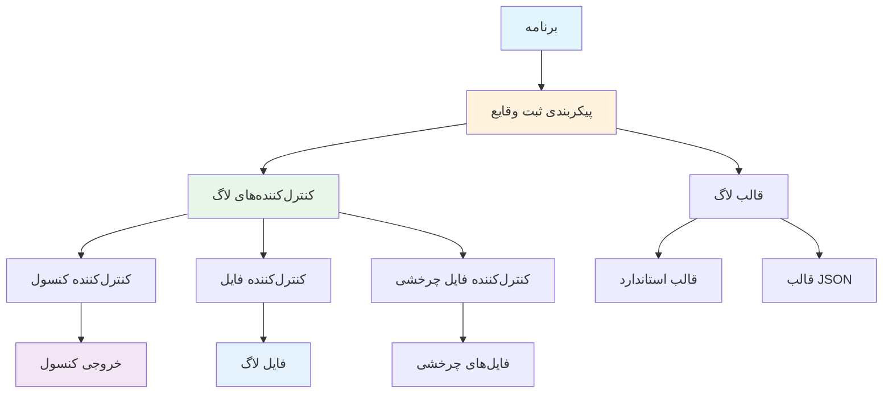
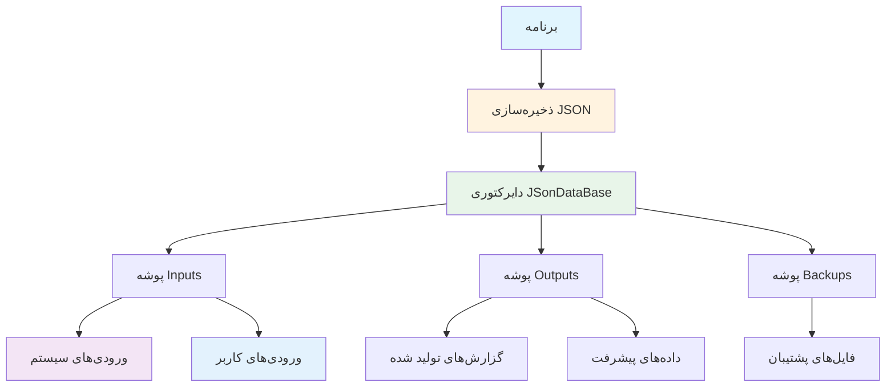
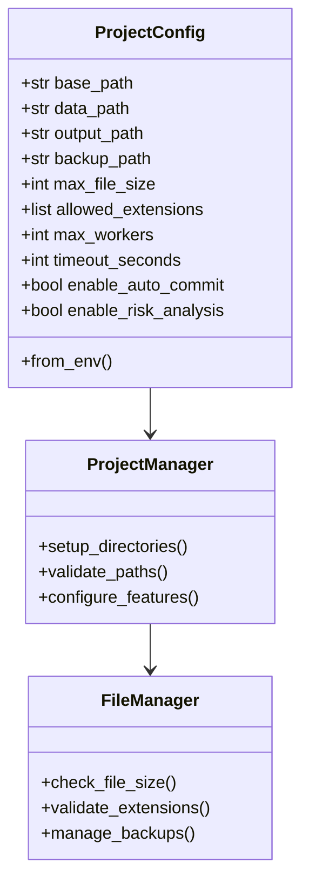
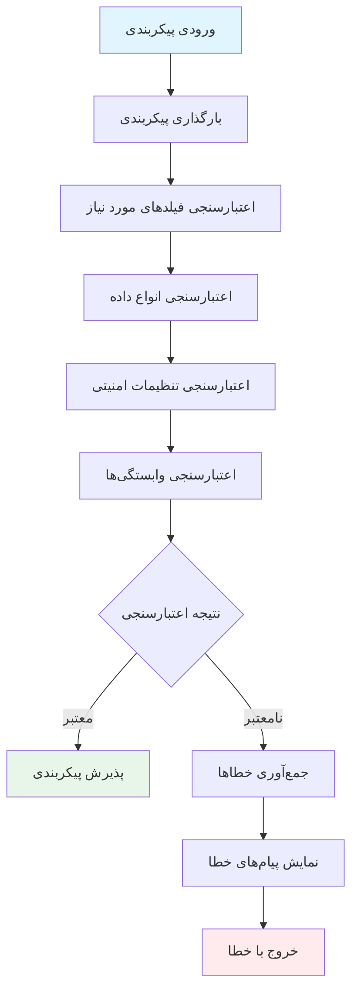

# راهنمای پیکربندی AutoProjectManagement - کامل

<div dir="rtl">

## ادغام با GitHub (ادامه)

### ۲. پیکربندی متغیرهای محیطی
```bash
export GITHUB_TOKEN=ghp_xxxxxxxxxxxxxxxxxxxx
export GITHUB_USERNAME=نامکاربریشما
export GITHUB_DEFAULT_REPO=نامکاربری/مخزن
```

### ۳. نمونه پیکربندی
```json
{
  "github": {
    "token": "ghp_xxxxxxxxxxxxxxxxxxxx",
    "username": "نامکاربریشما",
    "default_repo": "نامکاربری/مخزن",
    "default_branch": "main",
    "auto_sync": true,
    "sync_interval": 300
  }
}
```

---

## پیکربندی امنیت

### معماری امنیت



### گزینه‌های پیکربندی امنیت

| تنظیمات | نوع | مقدار پیش‌فرض | توضیحات |
|---------|------|---------------|----------|
| `jwt_secret_key` | string | change-this | کلید مخفی امضای JWT |
| `jwt_algorithm` | string | HS256 | الگوریتم JWT (HS256/RS256) |
| `jwt_expiration_minutes` | integer | 60 | زمان انقضای توکن |
| `api_key_header` | string | X-API-Key | نام هدر کلید API |
| `api_key_required` | boolean | false | نیاز به کلید API |
| `cors_allowed_origins` | list | ["*"] | منابع مجاز CORS |
| `ssl_cert_path` | string | - | مسیر فایل گواهی SSL |
| `ssl_key_path` | string | - | مسیر کلید خصوصی SSL |

### بهترین روش‌های امنیتی

#### ۱. پیکربندی JWT
```json
{
  "security": {
    "jwt_secret_key": "کلید-مخفی-فوق-العاده-شما-این-را-تغییر-دهید",
    "jwt_algorithm": "HS256",
    "jwt_expiration_minutes": 60
  }
}
```

#### ۲. پیکربندی کلید API
```json
{
  "security": {
    "api_key_required": true,
    "api_key_header": "X-API-Key"
  }
}
```

#### ۳. پیکربندی SSL/TLS
```json
{
  "security": {
    "ssl_cert_path": "/certs/server.crt",
    "ssl_key_path": "/certs/server.key"
  }
}
```

---

## پیکربندی ثبت وقایع (Logging)

### معماری ثبت وقایع



### گزینه‌های پیکربندی ثبت وقایع

| تنظیمات | نوع | مقدار پیش‌فرض | توضیحات |
|---------|------|---------------|----------|
| `level` | string | INFO | سطح ثبت وقایع (DEBUG, INFO, WARNING, ERROR) |
| `format` | string | standard | رشته قالب لاگ |
| `file_path` | string | - | مسیر فایل لاگ |
| `max_file_size` | string | 10MB | حداکثر اندازه فایل لاگ |
| `backup_count` | integer | 5 | تعداد فایل‌های پشتیبان |
| `json_format` | boolean | false | استفاده از قالب JSON |
| `include_extra` | boolean | true | شامل فیلدهای اضافی |

### نمونه‌های پیکربندی ثبت وقایع

#### ۱. ثبت وقایع پایه در کنسول
```json
{
  "logging": {
    "level": "INFO",
    "format": "%(asctime)s - %(name)s - %(levelname)s - %(message)s"
  }
}
```

#### ۲. ثبت وقایع در فایل با چرخش
```json
{
  "logging": {
    "level": "DEBUG",
    "file_path": "logs/autoproject.log",
    "max_file_size": "10MB",
    "backup_count": 5
  }
}
```

#### ۳. ثبت وقایع ساختاریافته JSON
```json
{
  "logging": {
    "level": "INFO",
    "json_format": true,
    "include_extra": true
  }
}
```

---

## پیکربندی ذخیره‌سازی JSON

### معماری ذخیره‌سازی JSON



### گزینه‌های پیکربندی ذخیره‌سازی JSON

| تنظیمات | نوع | مقدار پیش‌فرض | توضیحات |
|---------|------|---------------|----------|
| `type` | string | json | نوع ذخیره‌سازی (همیشه 'json') |
| `json_path` | string | autoproject.json | فایل اصلی پیکربندی JSON |
| `data_directory` | string | JSonDataBase | دایرکتوری برای فایل‌های داده JSON |
| `inputs_path` | string | JSonDataBase/Inputs | دایرکتوری فایل‌های JSON ورودی |
| `outputs_path` | string | JSonDataBase/OutPuts | دایرکتوری فایل‌های JSON خروجی |
| `backup_enabled` | boolean | true | فعال‌سازی پشتیبان‌گیری خودکار |
| `backup_count` | integer | 5 | تعداد فایل‌های پشتیبان برای نگهداری |
| `max_file_size` | integer | 10485760 | حداکثر اندازه فایل JSON (10MB) |
| `encoding` | string | utf-8 | رمزگذاری فایل برای فایل‌های JSON |

### نمونه‌های پیکربندی ذخیره‌سازی JSON

#### ۱. ذخیره‌سازی JSON پایه
```json
{
  "database": {
    "type": "json",
    "json_path": "autoproject.json",
    "data_directory": "JSonDataBase",
    "backup_enabled": true
  }
}
```

#### ۲. ساختار دایرکتوری سفارشی
```json
{
  "database": {
    "type": "json",
    "json_path": "config/project_data.json",
    "data_directory": "project_data",
    "inputs_path": "project_data/inputs",
    "outputs_path": "project_data/outputs",
    "backup_enabled": true,
    "backup_count": 10
  }
}
```

#### ۳. ذخیره‌سازی JSON در محیط تولید
```json
{
  "database": {
    "type": "json",
    "json_path": "/opt/autoproject/data/main.json",
    "data_directory": "/opt/autoproject/data",
    "backup_enabled": true,
    "backup_count": 20,
    "max_file_size": 52428800
  }
}
```

---

## پیکربندی پروژه

### ساختار پیکربندی پروژه



### گزینه‌های پیکربندی پروژه

| تنظیمات | نوع | مقدار پیش‌فرض | توضیحات |
|---------|------|---------------|----------|
| `base_path` | string | دایرکتوری فعلی | دایرکتوری پایه پروژه |
| `data_path` | string | JSonDataBase | مسیر دایرکتوری داده |
| `output_path` | string | JSonDataBase/OutPuts | مسیر دایرکتوری خروجی |
| `backup_path` | string | project_management/PM_Backups | مسیر دایرکتوری پشتیبان |
| `max_file_size` | integer | 10485760 | حداکثر اندازه فایل (10MB) |
| `allowed_extensions` | list | [...] | پسوندهای فایل مجاز |
| `max_workers` | integer | 4 | حداکثر تردهای کارگر |
| `timeout_seconds` | integer | 300 | زمان‌سنج عملیات |
| `enable_auto_commit` | boolean | true | فعال‌سازی کامیت‌های خودکار |
| `enable_risk_analysis` | boolean | true | فعال‌سازی تحلیل ریسک |
| `enable_progress_tracking` | boolean | true | فعال‌سازی ردیابی پیشرفت |
| `enable_github_integration` | boolean | true | فعال‌سازی ادغام GitHub |

### نمونه پیکربندی پروژه

```json
{
  "project": {
    "base_path": "/مسیر/به/پروژه",
    "data_path": "JSonDataBase",
    "output_path": "JSonDataBase/OutPuts",
    "backup_path": "project_management/PM_Backups",
    "max_file_size": 10485760,
    "allowed_extensions": [".py", ".js", ".json", ".md"],
    "max_workers": 8,
    "timeout_seconds": 300,
    "enable_auto_commit": true,
    "enable_risk_analysis": true,
    "enable_progress_tracking": true,
    "enable_github_integration": true
  }
}
```

---

## پیکربندی‌های خاص محیط

### ماتریس پیکربندی محیط

| ویژگی | توسعه | تولید | تست |
|-------|--------|--------|------|
| **اشکال‌زدایی API** | true | false | true |
| **نوع ذخیره‌سازی** | فایل‌های JSON | فایل‌های JSON | فایل‌های JSON |
| **سطح ثبت وقایع** | DEBUG | INFO | DEBUG |
| **ادغام GitHub** | true | true | false |
| **نیاز به SSL** | false | true | false |
| **محدودیت نرخ** | آزاد | سختگیرانه | غیرفعال |

### نمونه‌های پیکربندی محیط

#### پیکربندی توسعه
```json
{
  "api": {
    "host": "127.0.0.1",
    "port": 8000,
    "debug": true,
    "reload": true
  },
  "database": {
    "type": "json",
    "json_path": "dev.json"
  },
  "logging": {
    "level": "DEBUG"
  },
  "security": {
    "api_key_required": false
  }
}
```

#### پیکربندی تولید
```json
{
  "api": {
    "host": "0.0.0.0",
    "port": 8080,
    "debug": false,
    "reload": false
  },
  "database": {
    "type": "json",
    "json_path": "prod.json"
  },
  "logging": {
    "level": "INFO",
    "file_path": "/var/log/autoproject.log"
  },
  "security": {
    "api_key_required": true,
    "ssl_cert_path": "/certs/server.crt",
    "ssl_key_path": "/certs/server.key"
  }
}
```

#### پیکربندی تست
```json
{
  "api": {
    "host": "127.0.0.1",
    "port": 8001,
    "debug": true,
    "reload": true
  },
  "database": {
    "type": "json",
    "json_path": ":memory:"
  },
  "logging": {
    "level": "DEBUG"
  },
  "project": {
    "enable_github_integration": false
  }
}
```

---

## اعتبارسنجی پیکربندی

### فرآیند اعتبارسنجی



### قوانین اعتبارسنجی

| بخش | فیلدهای مورد نیاز | قوانین اعتبارسنجی |
|-------|-----------------|------------------|
| **API** | host, port | host باید IP/دامنه معتبر باشد، پورت 1-65535 |
| **پایگاه داده** | type | باید 'json' باشد |
| **GitHub** | token (در صورت فعال بودن) | باید فرمت توکن GitHub معتبر باشد |
| **امنیت** | jwt_secret_key | نباید مقدار پیش‌فرض باشد |
| **ثبت وقایع** | level | باید سطح لاگ معتبر باشد |
| **پروژه** | base_path | باید مسیر دایرکتوری معتبر باشد |

### نمونه خطاهای اعتبارسنجی

```json
{
  "errors": [
    {
      "field": "github.token",
      "message": "توکن GitHub زمانی که ادغام GitHub فعال است مورد نیاز است",
      "type": "missing_required"
    },
    {
      "field": "security.jwt_secret_key",
      "message": "کلید مخفی JWT باید از مقدار پیش‌فرض تغییر کند",
      "type": "security_risk"
    },
    {
      "field": "api.port",
      "message": "پورت باید بین 1 و 65535 باشد",
      "type": "invalid_value"
    }
  ]
}
```

---

## مدیریت پیکربندی

### دستورات مدیریت پیکربندی

| دستور | توضیحات | مثال |
|---------|-------------|---------|
| `config.validate()` | اعتبارسنجی پیکربندی فعلی | API پایتون |
| `print_config()` | نمایش پیکربندی فعلی | API پایتون |
| `reload_config()` | بارگذاری مجدد پیکربندی از فایل‌ها | API پایتون |
| `--config` | مشخص کردن فایل پیکربندی | آرگومان CLI |
| `--validate` | اعتبارسنجی پیکربندی | آرگومان CLI |

### ابزارهای مدیریت پیکربندی

#### ۱. CLI پیکربندی
```bash
# اعتبارسنجی پیکربندی
python -m autoprojectmanagement.configuration validate --config config.json

# نمایش پیکربندی فعلی
python -m autoprojectmanagement.configuration show

# بارگذاری مجدد پیکربندی
python -m autoprojectmanagement.configuration reload

# تولید پیکربندی نمونه
python -m autoprojectmanagement.configuration generate --env development
```

---

## عیب‌یابی

### مشکلات رایج پیکربندی

| مشکل | علامت | راه‌حل |
|-------|---------|----------|
| **JSON نامعتبر** | خطای تجزیه JSON | استفاده از اعتبارسنج JSON |
| **فیلد مورد نیاز گمشده** | خطای اعتبارسنجی | افزودن پیکربندی گمشده |
| **پورت نامعتبر** | پورت در حال استفاده است | تغییر شماره پورت |
| **فایل JSON یافت نشد** | خطای یافت نشدن فایل | بررسی مسیرهای فایل |
| **توکن GitHub نامعتبر** | 401 Unauthorized | بازتولید توکن GitHub |
| **خطای گواهی SSL** | خطای دست‌دادن SSL | بررسی مسیرهای گواهی |

### بررسی عیب‌یابی

#### ۱. فعال‌سازی ثبت وقایع اشکال‌زدایی
```json
{
  "logging": {
    "level": "DEBUG"
  }
}
```

#### ۲. اسکریپت تست پیکربندی
```python
import json
from autoproject_configuration import Config

# تست بارگذاری پیکربندی
config = Config()
print("پیکربندی با موفقیت بارگذاری شد")

# تست اعتبارسنجی
try:
    config.validate()
    print("پیکربندی معتبر است")
except ValueError as e:
    print(f"خطای اعتبارسنجی: {e}")

# تست ذخیره‌سازی JSON
print(f"نوع ذخیره‌سازی: {config.database.type}")
print(f"مسیر JSON: {config.database.json_path}")
```

---

## مرجع سریع

### قالب فایل پیکربندی

```json
{
  "api": {
    "host": "127.0.0.1",
    "port": 8000,
    "debug": false,
    "reload": true,
    "cors_origins": ["http://localhost:3000"]
  },
  "database": {
    "type": "json",
    "json_path": "autoproject.json",
    "data_directory": "JSonDataBase",
    "backup_enabled": true
  },
  "github": {
    "token": "توکن-شما",
    "default_repo": "نامکاربری/مخزن",
    "default_branch": "main"
  },
  "security": {
    "jwt_secret_key": "کلید-مخفی-شما",
    "jwt_expiration_minutes": 60
  },
  "logging": {
    "level": "INFO",
    "file_path": "logs/autoproject.log"
  },
  "project": {
    "base_path": "/مسیر/به/پروژه",
    "enable_auto_commit": true,
    "enable_risk_analysis": true
  }
}
```

### متغیرهای محیطی تنظیم سریع

```bash
# توسعه
export API_HOST=127.0.0.1
export API_PORT=8000
export API_DEBUG=true
export DB_TYPE=json
export GITHUB_TOKEN=توکن-شما

# تولید
export API_HOST=0.0.0.0
export API_PORT=8080
export API_DEBUG=false
export DB_TYPE=json
```

### چک‌لیست اعتبارسنجی پیکربندی

- [ ] نحو JSON معتبر است
- [ ] تمام فیلدهای مورد نیاز وجود دارند
- [ ] مسیرهای فایل JSON درست هستند
- [ ] توکن GitHub مجوزهای صحیح دارد
- [ ] تنظیمات امنیتی به درستی پیکربندی شده‌اند
- [ ] مسیرهای فای
