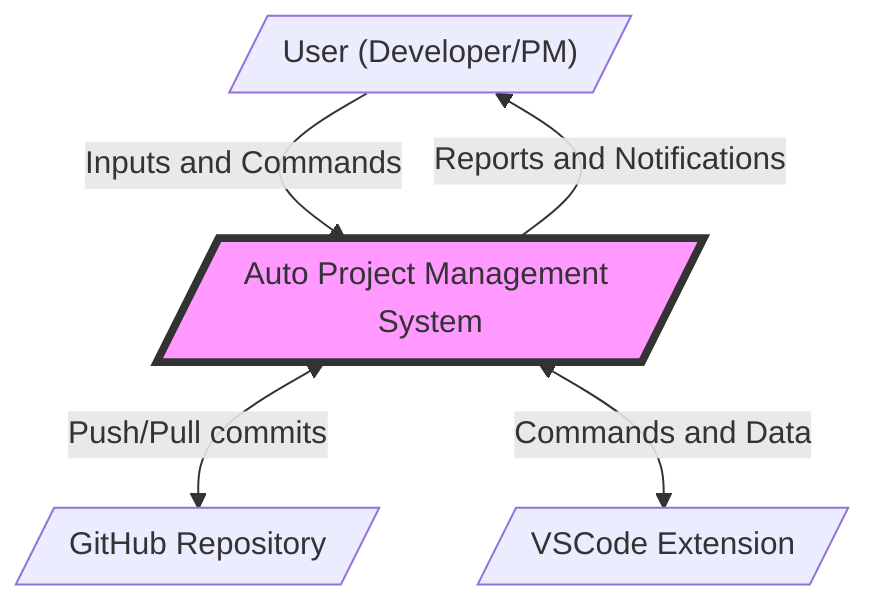
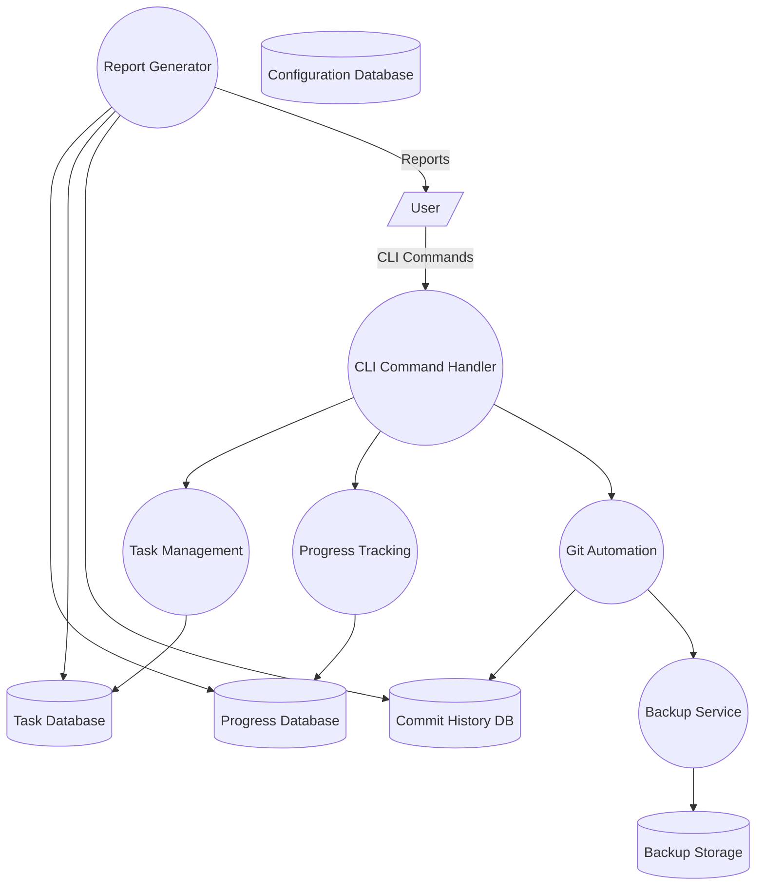
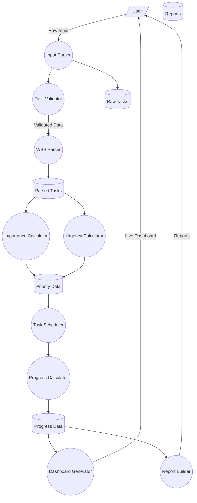
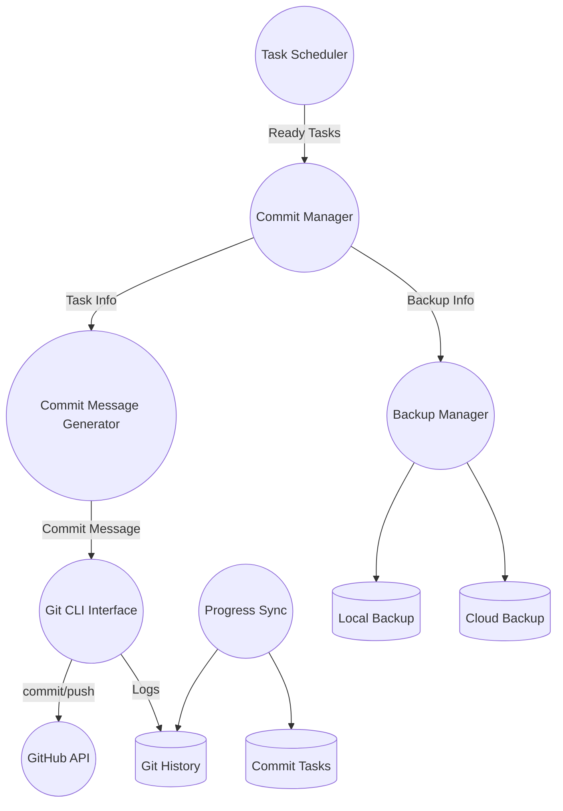
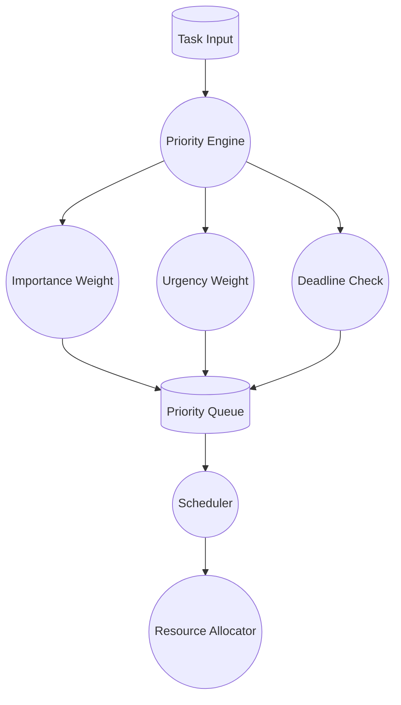
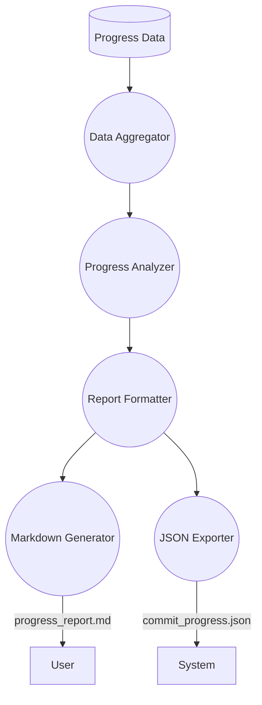
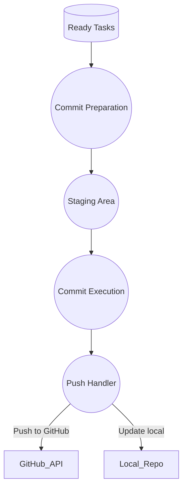

# Data Flow Diagrams (DFD) - Auto Project Management System

This document provides Data Flow Diagrams (DFD) for the Auto Project Management System based on the actual implementation.

---

## Level 0 - Context Diagram

---

## Level 1 - High-Level Processes

---

## Level 2 - Task Management and Progress Tracking

---

## Level 2 - Git Automation and Commit Management

---

## Level 3 - Task Management Details

### 3.1 - Priority Calculation and Scheduling

### 3.2 - Progress Reporting

### 3.3 - Commit Automation and Sync

---

## Data Flows and Descriptions

| Data Flow Name       | Source           | Destination       | Description                      |
|----------------------|------------------|-------------------|---------------------------------|
| raw_task_input       | User             | Input_Parser      | Raw task input from user         |
| validated_tasks      | Task_Validator   | WBS_Parser        | Validated tasks                  |
| parsed_wbs           | WBS_Parser       | Task_Scheduler    | Parsed WBS structure             |
| priority_scores      | Priority_Calc    | Task_Queue        | Calculated priority scores       |
| scheduled_tasks      | Scheduler        | Progress_Calc     | Scheduled tasks                  |
| progress_updates     | Progress_Calc    | Report_Generator  | Progress updates                 |
| commit_messages      | Message_Generator| Git_CLI           | Generated commit messages        |
| git_operations       | Git_CLI          | GitHub_API        | Git operations (push/pull)       |
| backup_data          | Backup_Manager   | Cloud_Storage     | Backup data                     |
| reports              | Report_Generator | User              | Final reports                   |

---

## Databases and Storage

### 1. Task Database
- **Path**: `JSonDataBase/Inputs/UserInputs/`
- **Content**: Raw tasks input by user
- **Format**: JSON

### 2. Progress Database
- **Path**: `JSonDataBase/OutPuts/`
- **Content**: Calculated progress data
- **Files**: 
  - `commit_progress.json`
  - `commit_task_database.json`

---

This documentation now fully uses English language and accurately reflects the actual implementation of the Auto Project Management System.
