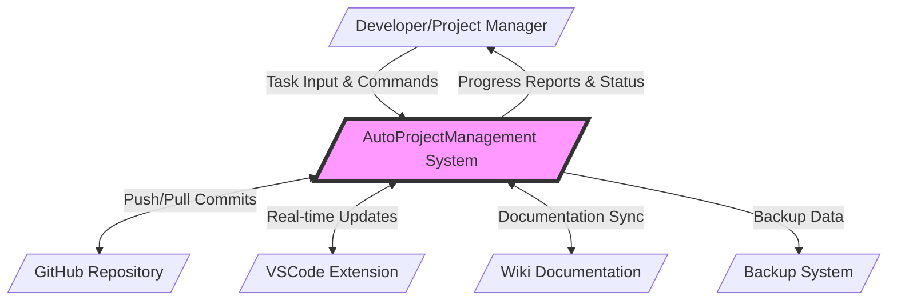
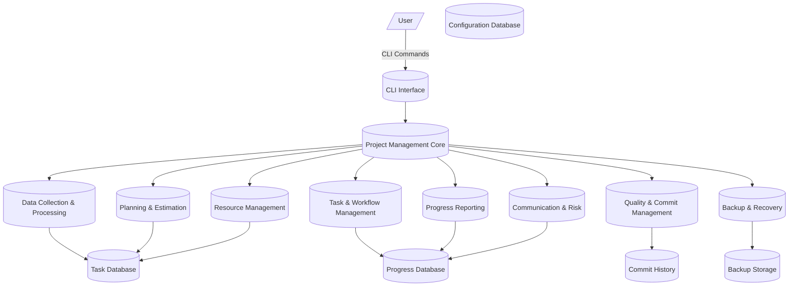
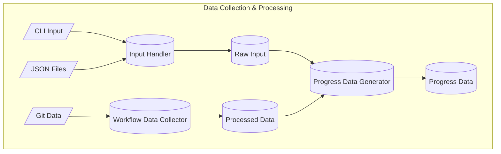
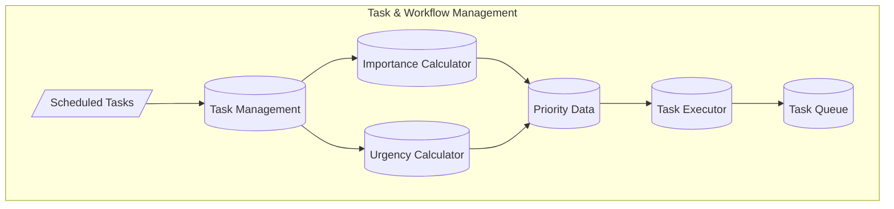
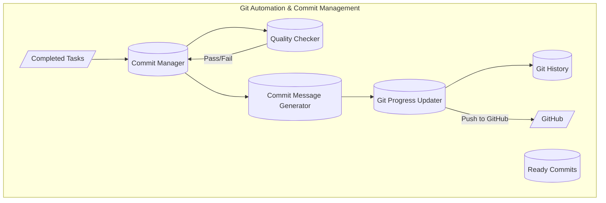
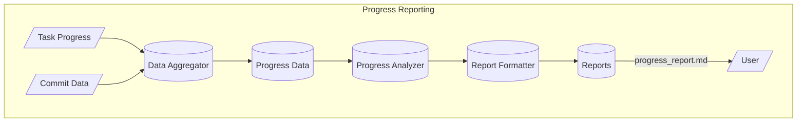
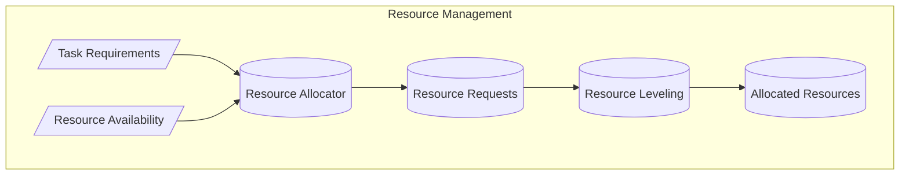

# Data Flow Diagrams (DFD) - AutoProjectManagement System

## Overview
This document provides comprehensive Data Flow Diagrams for the AutoProjectManagement system, illustrating how data moves through various components and modules based on the actual implementation.

## Table of Contents
1. [Context Diagram (Level 0)](#context-diagram-level-0)
2. [Level 1 DFD - System Overview](#level-1-dfd-system-overview)
3. [Level 2 DFD - Core Modules](#level-2-dfd-core-modules)
4. [Level 3 DFD - Detailed Module Flows](#level-3-dfd-detailed-module-flows)
5. [Data Stores](#data-stores)
6. [Data Flow Descriptions](#data-flow-descriptions)

---

## Context Diagram (Level 0)



---

## Level 1 DFD - System Overview

### Major Processes
| Process ID | Process Name | Description |
|------------|--------------|-------------|
| P1 | **CLI Interface** | Command-line interface for user interaction |
| P2 | **Project Management Core** | Central orchestrator managing all project activities |
| P3 | **Data Collection & Processing** | Collects and processes project data from various sources |
| P4 | **Planning & Estimation** | Creates project plans, schedules, and estimates |
| P5 | **Task & Workflow Management** | Manages task execution and workflow automation |
| P6 | **Progress Reporting** | Generates progress reports and dashboards |
| P7 | **Quality & Commit Management** | Handles code quality and automated commits |
| P8 | **Resource Management** | Manages resource allocation and leveling |
| P9 | **Communication & Risk** | Handles communication and risk management |
| P10 | **Backup & Recovery** | Manages system backups and recovery |



---

## Level 2 DFD - Core Modules

### 2.1 - Data Collection & Processing


### 2.2 - Task & Workflow Management


### 2.3 - Git Automation & Commit Management


---

## Level 3 DFD - Detailed Module Flows

### 3.1 - Progress Reporting


### 3.2 - Resource Management


---

## Data Stores

### Primary Data Stores
| Data Store | Location | Description | Format |
|------------|----------|-------------|---------|
| **Task Database** | `JSonDataBase/Inputs/UserInputs/` | User-defined tasks and configurations | JSON |
| **Progress Database** | `JSonDataBase/OutPuts/` | Calculated progress and status data | JSON |
| **Configuration Database** | `autoproject_configuration.py` | System configuration parameters | Python |
| **Commit History** | `.git/` directory | Git commit history and metadata | Git |
| **Backup Storage** | `backups/` | System backups and archives | ZIP/JSON |

### Data Store Schemas

#### Task Database Schema
```json
{
  "task_id": "string",
  "task_name": "string",
  "description": "string",
  "priority": "integer",
  "urgency": "integer",
  "importance": "integer",
  "estimated_hours": "float",
  "actual_hours": "float",
  "status": "string",
  "dependencies": ["task_id"],
  "assigned_resources": ["resource_id"],
  "due_date": "date"
}
```

#### Progress Database Schema
```json
{
  "progress_id": "string",
  "task_id": "string",
  "completion_percentage": "float",
  "hours_spent": "float",
  "status": "string",
  "last_updated": "datetime"
}
```

---

## Data Flow Descriptions

### Primary Data Flows

| Flow ID | Flow Name | Source | Destination | Data Elements | Frequency |
|---------|-----------|--------|-------------|---------------|-----------|
| F1 | Task Input | CLI Interface | Task Management | Raw task data, commands | On-demand |
| F2 | Validated Tasks | Task Validator | WBS Parser | Validated task objects | Real-time |
| F3 | WBS Structure | WBS Parser | Scheduler | Hierarchical task structure | On task creation |
| F4 | Progress Update | Task Executor | Progress Reporting | Task completion data | Continuous |
| F5 | Commit Data | Commit Manager | Git History | Commit information | On task completion |
| F6 | Backup Request | System Monitor | Backup Manager | Backup trigger | Scheduled |
| F7 | Resource Allocation | Resource Allocator | Task System | Resource assignments | On task scheduling |

### Implementation Mapping
- **CLI Interface**: `autoprojectmanagement/cli.py`
- **Project Management Core**: `autoprojectmanagement/main_modules/project_management_system.py`
- **Data Collection**: `autoprojectmanagement/main_modules/data_collection_processing/`
- **Task Management**: `autoprojectmanagement/main_modules/task_workflow_management/`
- **Progress Reporting**: `autoprojectmanagement/main_modules/progress_reporting/`
- **Quality Management**: `autoprojectmanagement/main_modules/quality_commit_management/`
- **Resource Management**: `autoprojectmanagement/main_modules/resource_management/`
- **Backup System**: `autoprojectmanagement/services/automation_services/backup_manager.py`

---

This document provides a complete and accurate representation of the AutoProjectManagement system's data flow based on the actual implementation.
