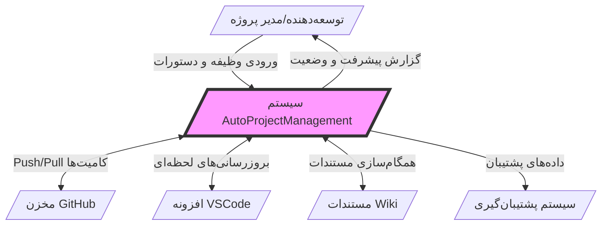
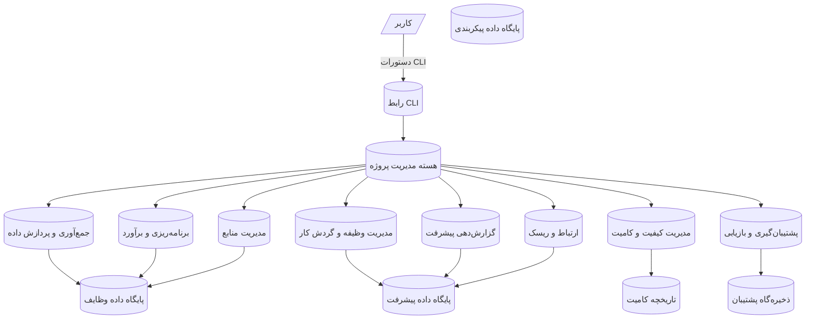
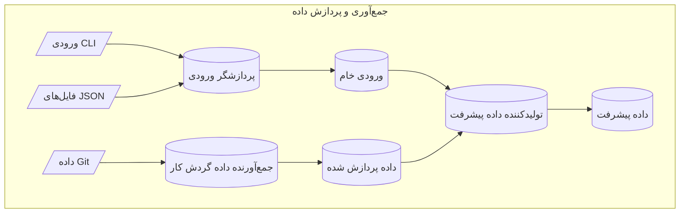
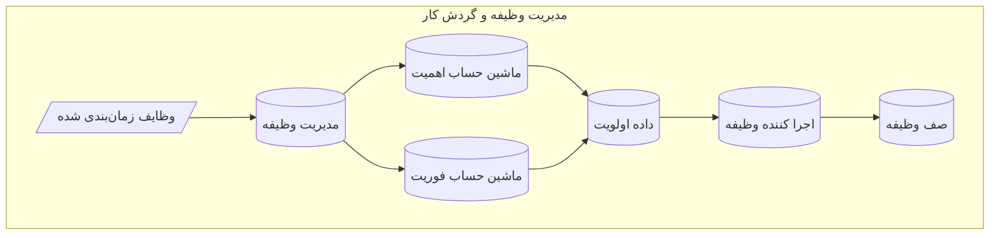
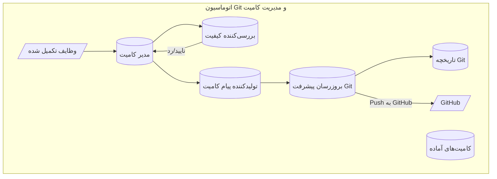
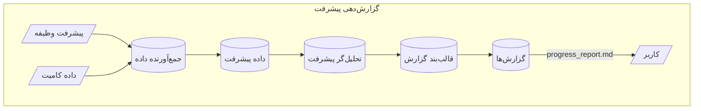
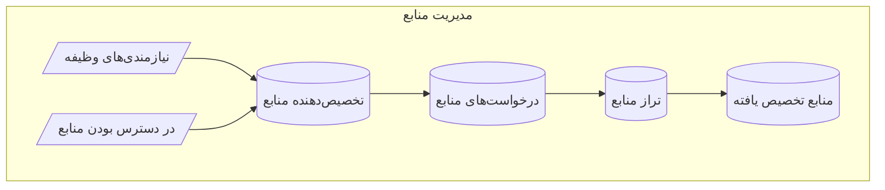

# نمودارهای جریان داده (DFD) - سیستم AutoProjectManagement

## مرور کلی
این سند نمودارهای جامع جریان داده را برای سیستم AutoProjectManagement ارائه می‌دهد که نشان می‌دهد داده‌ها چگونه از طریق اجزا و ماژول‌های مختلف بر اساس پیاده‌سازی واقعی حرکت می‌کنند.

## فهرست مطالب
۱. [نمودار زمینه (سطح ۰)](#نمودار-زمینه-سطح-۰)
۲. [سطح ۱ DFD - مرور کلی سیستم](#سطح-۱-dfd-مرور-کلی-سیستم)
۳. [سطح ۲ DFD - ماژول‌های اصلی](#سطح-۲-dfd-ماژول‌های-اصلی)
۴. [سطح ۳ DFD - جریان‌های دقیق ماژول](#سطح-۳-dfd-جریان‌های-دقیق-ماژول)
۵. [ذخیره‌گاه‌های داده](#ذخیره-گاه‌های-داده)
۶. [توصیف جریان‌های داده](#توصیف-جریان‌های-داده)

---

## نمودار زمینه (سطح ۰)



---

## سطح ۱ DFD - مرور کلی سیستم

### فرآیندهای اصلی
| شناسه فرآیند | نام فرآیند | توضیحات |
|------------|--------------|-------------|
| P1 | **رابط CLI** | رابط خط فرمان برای تعامل کاربر |
| P2 | **هسته مدیریت پروژه** | هماهنگ‌کننده مرکزی که تمام فعالیت‌های پروژه را مدیریت می‌کند |
| P3 | **جمع‌آوری و پردازش داده** | جمع‌آوری و پردازش داده‌های پروژه از منابع مختلف |
| P4 | **برنامه‌ریزی و برآورد** | ایجاد برنامه‌های پروژه، زمان‌بندی و برآوردها |
| P5 | **مدیریت وظیفه و گردش کار** | مدیریت اجرای وظایف و اتوماسیون گردش کار |
| P6 | **گزارش‌دهی پیشرفت** | تولید گزارش‌های پیشرفت و داشبوردها |
| P7 | **مدیریت کیفیت و کامیت** | مدیریت کیفیت کد و کامیت‌های خودکار |
| P8 | **مدیریت منابع** | مدیریت تخصیص منابع و تراز منابع |
| P9 | **ارتباط و ریسک** | مدیریت ارتباطات و ریسک |
| P10 | **پشتیبان‌گیری و بازیابی** | مدیریت پشتیبان‌گیری و بازیابی سیستم |



---

## سطح ۲ DFD - ماژول‌های اصلی

### ۲.۱ - جمع‌آوری و پردازش داده


### ۲.۲ - مدیریت وظیفه و گردش کار


### ۲.۳ - اتوماسیون Git و مدیریت کامیت


---

## سطح ۳ DFD - جریان‌های دقیق ماژول

### ۳.۱ - گزارش‌دهی پیشرفت


### ۳.۲ - مدیریت منابع


---

## ذخیره‌گاه‌های داده

### ذخیره‌گاه‌های داده اصلی
| ذخیره‌گاه داده | محل | توضیحات | قالب |
|------------|----------|-------------|---------|
| **پایگاه داده وظایف** | `JSonDataBase/Inputs/UserInputs/` | وظایف و پیکربندی‌های تعریف شده توسط کاربر | JSON |
| **پایگاه داده پیشرفت** | `JSonDataBase/OutPuts/` | داده‌های پیشرفت محاسبه شده و وضعیت | JSON |
| **پایگاه داده پیکربندی** | `autoproject_configuration.py` | پارامترهای پیکربندی سیستم | Python |
| **تاریخچه کامیت** | `.git/` directory | تاریخچه کامیت Git و متاداده | Git |
| **ذخیره‌گاه پشتیبان** | `backups/` | پشتیبان‌ها و آرشیوهای سیستم | ZIP/JSON |

### طرح‌های ذخیره‌گاه داده

#### طرح پایگاه داده وظایف
```json
{
  "task_id": "string",
  "task_name": "string",
  "description": "string",
  "priority": "integer",
  "urgency": "integer",
  "importance": "integer",
  "estimated_hours": "float",
  "actual_hours": "float",
  "status": "string",
  "dependencies": ["task_id"],
  "assigned_resources": ["resource_id"],
  "due_date": "date"
}
```

#### طرح پایگاه داده پیشرفت
```json
{
  "progress_id": "string",
  "task_id": "string",
  "completion_percentage": "float",
  "hours_spent": "float",
  "status": "string",
  "last_updated": "datetime"
}
```

---

## توصیف جریان‌های داده

### جریان‌های داده اصلی

| شناسه جریان | نام جریان | منبع | مقصد | عناصر داده | فرکانس |
|---------|-----------|--------|-------------|---------------|-----------|
| F1 | ورودی وظیفه | رابط CLI | مدیریت وظیفه | داده خام وظیفه، دستورات | در صورت نیاز |
| F2 | وظایف معتبر | اعتبارسنج وظیفه | تجزیه‌گر WBS | اشیاء وظیفه معتبر | در زمان واقعی |
| F3 | ساختار WBS | تجزیه‌گر WBS | زمان‌بند | ساختار سلسله‌مراتبی وظیفه | در ایجاد وظیفه |
| F4 | بروزرسانی پیشرفت | اجرا کننده وظیفه | گزارش‌دهی پیشرفت | داده تکمیل وظیفه | مداوم |
| F5 | داده کامیت | مدیر کامیت | تاریخچه Git | اطلاعات کامیت | در تکمیل وظیفه |
| F6 | درخواست پشتیبان | نمایشگر سیستم | مدیر پشتیبان | ماشه پشتیبان‌گیری | زمان‌بندی شده |
| F7 | تخصیص منابع | تخصیص‌دهنده منابع | سیستم وظیفه | تخصیص‌های منابع | در زمان‌بندی وظیفه |

### نگاشت پیاده‌سازی
- **رابط CLI**: `autoprojectmanagement/cli.py`
- **هسته مدیریت پروژه**: `autoprojectmanagement/main_modules/project_management_system.py`
- **جمع‌آوری داده**: `autoprojectmanagement/main_modules/data_collection_processing/`
- **مدیریت وظیفه**: `autoprojectmanagement/main_modules/task_workflow_management/`
- **گزارش‌دهی پیشرفت**: `autoprojectmanagement/main_modules/progress_reporting/`
- **مدیریت کیفیت**: `autoprojectmanagement/main_modules/quality_commit_management/`
- **مدیریت منابع**: `autoprojectmanagement/main_modules/resource_management/`
- **سیستم پشتیبان‌گیری**: `autoprojectmanagement/services/automation_services/backup_manager.py`

---

این سند یک نمایش کامل و دقیق از جریان داده سیستم AutoProjectManagement بر اساس پیاده‌سازی واقعی ارائه می‌دهد.
