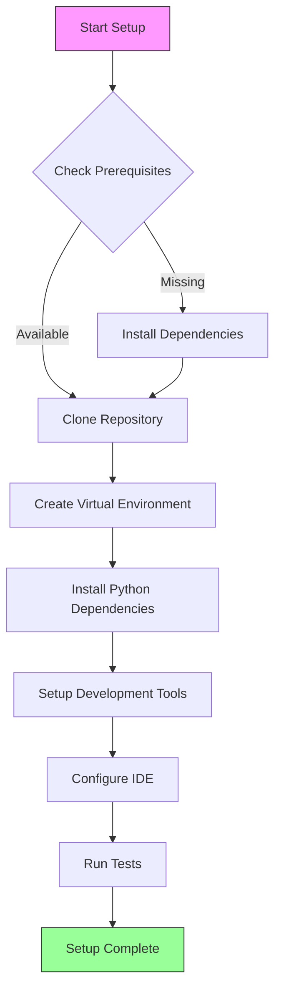
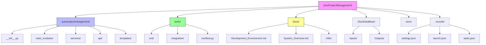
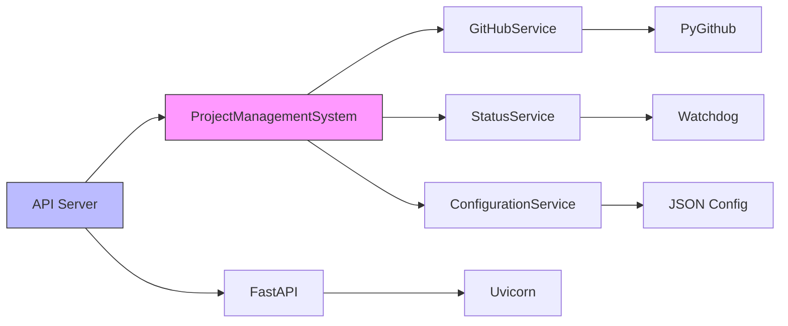
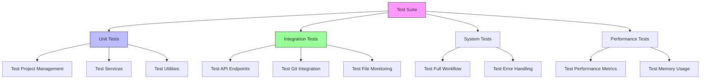
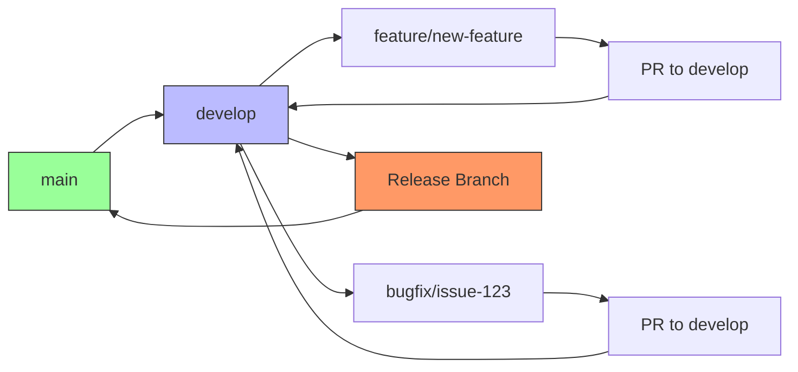
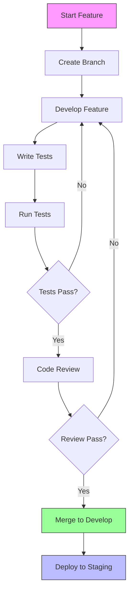

# Development Environment Guide

## Overview

This document provides comprehensive guidance for setting up and maintaining the development environment for the AutoProjectManagement system. It covers all aspects from initial setup to advanced configuration, ensuring developers can efficiently contribute to the project.

## Table of Contents

1. [System Requirements](#system-requirements)
2. [Environment Setup](#environment-setup)
3. [Development Tools](#development-tools)
4. [Project Structure](#project-structure)
5. [Configuration Management](#configuration-management)
6. [Testing Framework](#testing-framework)
7. [Development Workflow](#development-workflow)
8. [Troubleshooting](#troubleshooting)
9. [Best Practices](#best-practices)

## System Requirements

### Hardware Requirements

| Component | Minimum | Recommended |
|-----------|---------|-------------|
| CPU | Dual-core 2.0 GHz | Quad-core 3.0 GHz |
| RAM | 4 GB | 8 GB |
| Storage | 10 GB free space | 50 GB SSD |
| Network | Broadband connection | High-speed internet |

### Software Requirements

| Software | Version | Purpose |
|----------|---------|---------|
| Python | 3.8+ | Core runtime |
| Node.js | 14.x+ | Frontend tooling |
| Git | 2.20+ | Version control |
| Docker | 20.10+ | Containerization |
| VS Code | 1.60+ | IDE |

### Operating System Support

- **Linux**: Ubuntu 20.04+, CentOS 8+, Debian 10+
- **macOS**: 10.15+ (Catalina or later)
- **Windows**: Windows 10 (Build 19041+) with WSL2

## Environment Setup

### 1. Prerequisites Installation

#### Python Environment Setup

```bash
# Check Python version
python3 --version  # Should be 3.8+

# Install pip if not available
sudo apt update && sudo apt install python3-pip  # Ubuntu/Debian
brew install python3  # macOS
```

#### Node.js Installation

```bash
# Using Node Version Manager (recommended)
curl -o- https://raw.githubusercontent.com/nvm-sh/nvm/v0.39.0/install.sh | bash
nvm install 16
nvm use 16

# Verify installation
node --version
npm --version
```

### 2. Project Setup Process

#### Automated Setup Flow



#### Step-by-Step Setup

1. **Clone the Repository**
```bash
git clone https://github.com/autoprojectmanagement/autoprojectmanagement.git
cd autoprojectmanagement
```

2. **Create Virtual Environment**
```bash
# Create virtual environment
python3 -m venv venv

# Activate virtual environment
source venv/bin/activate  # Linux/macOS
# or
venv\Scripts\activate  # Windows
```

3. **Install Dependencies**
```bash
# Install core dependencies
pip install -r requirements.txt

# Install development dependencies
pip install -r requirements-dev.txt
```

4. **Setup Auto Environment**
```bash
# Run automated setup
python -m autoprojectmanagement.setup_auto_environment --verbose
```

### 3. Environment Verification

#### Verification Script
```bash
#!/bin/bash
# verify_environment.sh

echo "🔍 Verifying development environment..."

# Check Python
python3 --version || echo "❌ Python not found"

# Check virtual environment
if [[ "$VIRTUAL_ENV" != "" ]]; then
    echo "✅ Virtual environment active: $VIRTUAL_ENV"
else
    echo "❌ Virtual environment not active"
fi

# Check dependencies
pip list | grep -E "(pytest|black|flake8|mypy)" || echo "❌ Development dependencies missing"

# Check Node.js
node --version || echo "❌ Node.js not found"

# Check Docker
docker --version || echo "⚠️ Docker not found (optional)"

echo "✅ Environment verification complete"
```

## Development Tools

### IDE Configuration

#### VS Code Extensions

| Extension | Purpose | Installation |
|-----------|---------|--------------|
| Python | Python language support | `ext install ms-python.python` |
| Pylance | Type checking | `ext install ms-python.vscode-pylance` |
| Black Formatter | Code formatting | `ext install ms-python.black-formatter` |
| GitLens | Git integration | `ext install eamodio.gitlens` |
| Docker | Container support | `ext install ms-azuretools.vscode-docker` |

#### VS Code Settings

```json
{
    "python.defaultInterpreterPath": "./venv/bin/python",
    "python.linting.enabled": true,
    "python.linting.pylintEnabled": true,
    "python.formatting.provider": "black",
    "python.testing.pytestEnabled": true,
    "python.testing.unittestEnabled": false,
    "python.testing.pytestPath": "venv/bin/pytest",
    "editor.formatOnSave": true,
    "editor.rulers": [79, 120],
    "files.exclude": {
        "**/.git": true,
        "**/__pycache__": true,
        "**/*.pyc": true
    }
}
```

### Development Container Setup

#### Docker Development Environment

```dockerfile
# Dockerfile.dev
FROM python:3.9-slim

WORKDIR /app

# Install system dependencies
RUN apt-get update && apt-get install -y \
    git \
    nodejs \
    npm \
    && rm -rf /var/lib/apt/lists/*

# Copy requirements
COPY requirements*.txt ./
RUN pip install -r requirements.txt -r requirements-dev.txt

# Copy source code
COPY . .

# Set environment variables
ENV PYTHONPATH=/app
ENV PYTHONUNBUFFERED=1

# Expose port for development server
EXPOSE 8000

CMD ["python", "-m", "autoprojectmanagement.api.main"]
```

#### Docker Compose for Development

```yaml
# docker-compose.dev.yml
version: '3.8'

services:
  app:
    build:
      context: .
      dockerfile: Dockerfile.dev
    ports:
      - "8000:8000"
    volumes:
      - .:/app
      - /app/venv
    environment:
      - PYTHONPATH=/app
      - ENV=development
    command: python -m autoprojectmanagement.api.main --reload

  redis:
    image: redis:6-alpine
    ports:
      - "6379:6379"

  postgres:
    image: postgres:13
    environment:
      POSTGRES_DB: autoprojectmanagement
      POSTGRES_USER: dev
      POSTGRES_PASSWORD: dev
    ports:
      - "5432:5432"
    volumes:
      - postgres_data:/var/lib/postgresql/data

volumes:
  postgres_data:
```

## Project Structure

### Directory Architecture



### Module Structure

#### Core Modules Overview

| Module | Purpose | Key Classes |
|--------|---------|-------------|
| `main_modules` | Core business logic | ProjectManagementSystem, TaskManager |
| `services` | External integrations | GitHubService, StatusService |
| `api` | REST API endpoints | FastAPI application, routers |
| `templates` | Code generation | HeaderUpdater, DocumentationGenerator |

#### Service Dependencies



## Configuration Management

### Environment Variables

| Variable | Description | Default | Required |
|----------|-------------|---------|----------|
| `PYTHONPATH` | Python module search path | `.` | Yes |
| `ENV` | Environment mode | `development` | No |
| `LOG_LEVEL` | Logging level | `INFO` | No |
| `GITHUB_TOKEN` | GitHub API token | - | Yes* |
| `DATABASE_URL` | Database connection string | `sqlite:///app.db` | No |

### Configuration Files

#### 1. Project Configuration (`pyproject.toml`)

```toml
[build-system]
requires = ["setuptools>=61.0", "wheel"]
build-backend = "setuptools.build_meta"

[project]
name = "autoprojectmanagement"
version = "1.0.0"
description = "Automated project management system"
requires-python = ">=3.8"

[project.optional-dependencies]
dev = [
    "pytest>=6.0",
    "black>=22.0",
    "flake8>=4.0",
    "mypy>=0.910",
]

[tool.black]
line-length = 88
target-version = ['py38']

[tool.mypy]
python_version = "3.8"
warn_return_any = true
disallow_untyped_defs = true
```

#### 2. Testing Configuration (`pytest.ini`)

```ini
[tool.pytest.ini_options]
testpaths = ["tests"]
python_files = ["test_*.py"]
python_classes = ["Test*"]
python_functions = ["test_*"]
addopts = "--cov=autoprojectmanagement --cov-report=html --cov-report=term-missing"
```

#### 3. Code Quality Configuration (`.pre-commit-config.yaml`)

```yaml
repos:
  - repo: https://github.com/psf/black
    rev: 22.3.0
    hooks:
      - id: black
        language_version: python3
  
  - repo: https://github.com/pycqa/flake8
    rev: 4.0.1
    hooks:
      - id: flake8
        args: [--max-line-length=88]
  
  - repo: https://github.com/pre-commit/mirrors-mypy
    rev: v0.910
    hooks:
      - id: mypy
        additional_dependencies: [types-requests]
```

## Testing Framework

### Test Architecture



### Test Categories

#### 1. Unit Tests
- **Location**: `tests/unit/`
- **Purpose**: Test individual components
- **Coverage Target**: 90%+

#### 2. Integration Tests
- **Location**: `tests/integration/`
- **Purpose**: Test component interactions
- **Coverage Target**: 80%+

#### 3. System Tests
- **Location**: `tests/system/`
- **Purpose**: Test complete workflows
- **Coverage Target**: 70%+

### Running Tests

#### Test Execution Commands

```bash
# Run all tests
pytest

# Run specific test category
pytest tests/unit/
pytest tests/integration/

# Run with coverage
pytest --cov=autoprojectmanagement --cov-report=html

# Run with specific markers
pytest -m "not slow"

# Run in parallel
pytest -n auto
```

#### Test Configuration

```python
# conftest.py
import pytest
from pathlib import Path

@pytest.fixture
def test_project(tmp_path):
    """Create a test project directory."""
    project_dir = tmp_path / "test_project"
    project_dir.mkdir()
    return project_dir

@pytest.fixture
def sample_config():
    """Provide sample configuration for testing."""
    return {
        "auto_commit": True,
        "check_interval": 300,
        "file_extensions": [".py", ".js"]
    }
```

## Development Workflow

### Git Workflow

#### Branch Strategy



#### Commit Message Convention

| Type | Format | Example |
|------|--------|---------|
| feat | `feat(scope): description` | `feat(api): add project creation endpoint` |
| fix | `fix(scope): description` | `fix(git): resolve merge conflict handling` |
| docs | `docs(scope): description` | `docs(readme): update installation guide` |
| test | `test(scope): description` | `test(unit): add project manager tests` |
| refactor | `refactor(scope): description` | `refactor(core): simplify task processing` |

### Development Process

#### 1. Feature Development Flow



#### 2. Code Review Process

| Review Stage | Checklist | Tools |
|--------------|-----------|--------|
| **Automated** | Tests, linting, security | GitHub Actions |
| **Peer Review** | Code quality, logic | GitHub PR |
| **Integration** | System compatibility | Integration tests |

### Continuous Integration

#### GitHub Actions Workflow

```yaml
# .github/workflows/ci.yml
name: CI

on: [push, pull_request]

jobs:
  test:
    runs-on: ubuntu-latest
    strategy:
      matrix:
        python-version: [3.8, 3.9, 3.10, 3.11]
    
    steps:
    - uses: actions/checkout@v3
    
    - name: Set up Python
      uses: actions/setup-python@v4
      with:
        python-version: ${{ matrix.python-version }}
    
    - name: Install dependencies
      run: |
        python -m pip install --upgrade pip
        pip install -r requirements.txt
        pip install -r requirements-dev.txt
    
    - name: Lint with flake8
      run: |
        flake8 autoprojectmanagement tests
    
    - name: Type check with mypy
      run: |
        mypy autoprojectmanagement
    
    - name: Test with pytest
      run: |
        pytest --cov=autoprojectmanagement --cov-report=xml
    
    - name: Upload coverage
      uses: codecov/codecov-action@v3
```

## Troubleshooting

### Common Issues and Solutions

#### 1. Python Environment Issues

| Issue | Symptom | Solution |
|-------|---------|----------|
| **Import Errors** | `ModuleNotFoundError` | Check PYTHONPATH, reinstall dependencies |
| **Version Conflicts** | Dependency warnings | Use virtual environment, update requirements |
| **Permission Errors** | `Permission denied` | Use `--user` flag or virtual environment |

#### 2. Git Integration Issues

| Issue | Symptom | Solution |
|-------|---------|----------|
| **Authentication** | `401 Unauthorized` | Configure GitHub token |
| **Merge Conflicts** | Automatic merge fails | Manual resolution required |
| **Large Files** | Push fails | Use Git LFS |

#### 3. Testing Issues

| Issue | Symptom | Solution |
|-------|---------|----------|
| **Test Failures** | Assertion errors | Check test data, update assertions |
| **Coverage Low** | < 80% coverage | Add more test cases |
| **Performance** | Slow tests | Use pytest-xdist, optimize fixtures |

### Debug Configuration

#### VS Code Debug Launch Configuration

```json
{
    "version": "0.2.0",
    "configurations": [
        {
            "name": "Debug Auto Runner",
            "type": "python",
            "request": "launch",
            "module": "autoprojectmanagement.auto_runner",
            "args": ["--path", "${workspaceFolder}", "--verbose"],
            "console": "integratedTerminal",
            "cwd": "${workspaceFolder}",
            "env": {"PYTHONPATH": "${workspaceFolder}"}
        },
        {
            "name": "Debug API Server",
            "type": "python",
            "request": "launch",
            "module": "autoprojectmanagement.api.main",
            "args": ["--reload"],
            "console": "integratedTerminal",
            "jinja": true
        }
    ]
}
```

### Log Analysis

#### Log Levels and Locations

| Level | Location | Purpose |
|-------|----------|---------|
| **DEBUG** | `.auto_project/logs/debug.log` | Detailed troubleshooting |
| **INFO** | `.auto_project/logs/info.log` | General operation |
| **WARNING** | `.auto_project/logs/warning.log` | Potential issues |
| **ERROR** | `.auto_project/logs/error.log` | Critical problems |

#### Log Configuration

```python
# logging_config.py
import logging
from pathlib import Path

def setup_logging(log_level: str = "INFO") -> None:
    """Configure comprehensive logging for development."""
    
    log_dir = Path(".auto_project/logs")
    log_dir.mkdir(parents=True, exist_ok=True)
    
    logging.basicConfig(
        level=getattr(logging, log_level.upper()),
        format='%(asctime)s - %(name)s - %(levelname)s - %(message)s',
        handlers=[
            logging.FileHandler(log_dir / "app.log"),
            logging.StreamHandler()
        ]
    )
```

## Best Practices

### Code Quality Standards

#### 1. Python Code Style (PEP 8)

| Aspect | Standard | Tool |
|--------|----------|------|
| **Line Length** | 88 characters | Black |
| **Imports** | PEP 8 order | isort |
| **Type Hints** | Required | mypy |
| **Documentation** | Google style | pydocstyle |

#### 2. Testing Best Practices

| Practice | Implementation | Example |
|----------|----------------|---------|
| **Test Isolation** | pytest fixtures | `@pytest.fixture` |
| **Mock External Services** | pytest-mock | `mocker.patch()` |
| **Parameterized Tests** | pytest.mark.parametrize | Multiple inputs |
| **Test Coverage** | pytest-cov | 90%+ target |

#### 3. Security Considerations

| Area | Practice | Tool |
|------|----------|------|
| **Dependencies** | Regular updates | Dependabot |
| **Code Scanning** | Security linting | bandit |
| **Secrets** | Environment variables | python-dotenv |
| **Input Validation** | Type checking | pydantic |

### Performance Optimization

#### 1. Development Performance

| Area | Optimization | Impact |
|------|--------------|--------|
| **Test Speed** | Parallel execution | 3-4x faster |
| **Import Speed** | Lazy loading | 50% improvement |
| **File I/O** | Async operations | Non-blocking |

#### 2. Memory Management

| Technique | Implementation | Benefit |
|-----------|----------------|---------|
| **Context Managers** | `with` statements | Resource cleanup |
| **Generators** | `yield` instead of lists | Memory efficient |
| **Caching** | `functools.lru_cache` | Reduced computation |

### Documentation Standards

#### 1. Code Documentation

| Type | Format | Example |
|------|--------|---------|
| **Module** | Docstring at top | Purpose, usage |
| **Class** | Google style | Attributes, methods |
| **Function** | Args, returns, raises | Type hints included |
| **Complex Logic** | Inline comments | Why, not what |

#### 2. API Documentation

| Component | Tool | Output |
|-----------|------|--------|
| **Endpoints** | FastAPI auto-docs | Swagger UI |
| **Schemas** | Pydantic models | JSON Schema |
| **Examples** | Request/response | curl commands |

## Quick Reference

### Essential Commands

| Task | Command | Notes |
|------|---------|--------|
| **Setup Environment** | `./setup_env.sh` | Initial setup |
| **Start Development** | `python -m autoprojectmanagement.auto_runner` | Auto management |
| **Run Tests** | `pytest` | All tests |
| **Code Format** | `black .` | Auto formatting |
| **Type Check** | `mypy autoprojectmanagement` | Static analysis |
| **Security Scan** | `bandit -r autoprojectmanagement` | Security check |

### File Locations

| Resource | Path | Description |
|----------|------|-------------|
| **Source Code** | `autoprojectmanagement/` | Main package |
| **Tests** | `tests/` | All test files |
| **Documentation** | `Docs/` | All documentation |
| **Configuration** | `pyproject.toml` | Project config |
| **Requirements** | `requirements*.txt` | Dependencies |
| **Scripts** | `*.sh` | Shell scripts |

### Support Resources

- **Issues**: [GitHub Issues](https://github.com/autoprojectmanagement/autoprojectmanagement/issues)
- **Discussions**: [GitHub Discussions](https://github.com/autoprojectmanagement/autoprojectmanagement/discussions)
- **Documentation**: [Project Wiki](https://github.com/autoprojectmanagement/autoprojectmanagement/wiki)
- **Examples**: `examples/` directory

---

*This document is maintained by the AutoProjectManagement team. Last updated: 2024*
