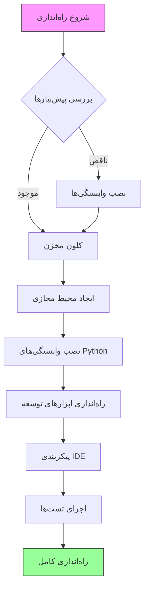
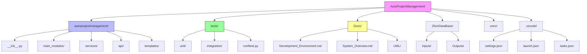
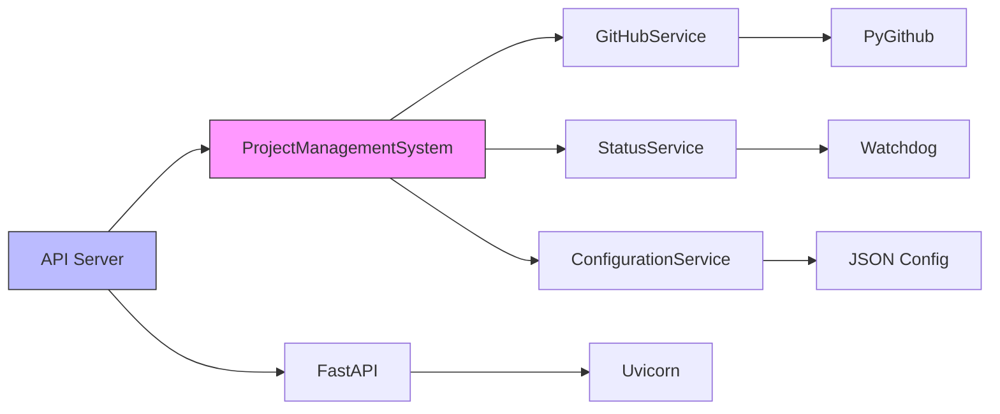
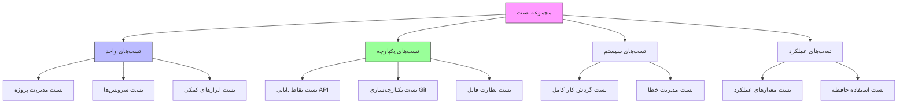
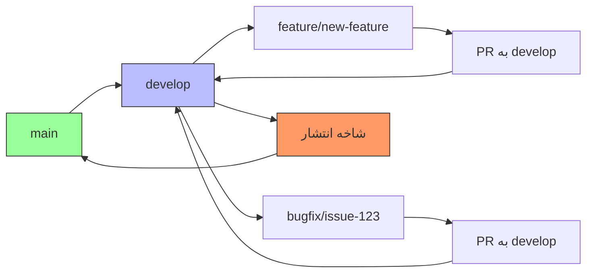
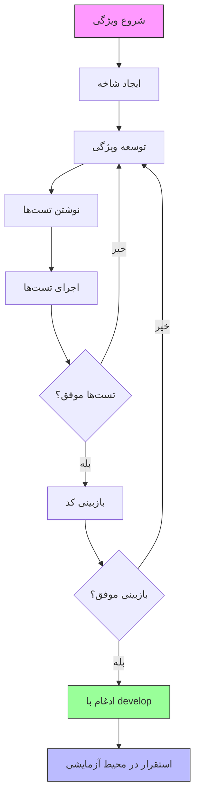

# راهنمای محیط توسعه - فارسی

## نمای کلی
این سند راهنمای جامعی برای راه‌اندازی و نگهداری محیط توسعه سیستم AutoProjectManagement فراهم می‌کند. تمام جنبه‌ها از راه‌اندازی اولیه تا پیکربندی پیشرفته را پوشش می‌دهد تا اطمینان حاصل شود که توسعه‌دهندگان می‌توانند به‌طور کارآمد در پروژه مشارکت کنند.

## فهرست مطالب
1. [نیازمندی‌های سیستم](#نیازمندیهای-سیستم)
2. [راه‌اندازی محیط](#راهاندازی-محیط)
3. [ابزارهای توسعه](#ابزارهای-توسعه)
4. [ساختار پروژه](#ساختار-پروژه)
5. [مدیریت پیکربندی](#مدیریت-پیکربندی)
6. [چارچوب تست](#چارچوب-تست)
7. [گردش کار توسعه](#گردش-کار-توسعه)
8. [عیب‌یابی](#عیبیابی)
9. [بهترین روش‌ها](#بهترین-روشها)

## نیازمندی‌های سیستم

### نیازمندی‌های سخت‌افزاری

| مولفه | حداقل | توصیه‌شده |
|-------|---------|-------------|
| CPU | دو هسته 2.0 گیگاهرتز | چهار هسته 3.0 گیگاهرتز |
| RAM | 4 گیگابایت | 8 گیگابایت |
| فضای ذخیره‌سازی | 10 گیگابایت فضای آزاد | 50 گیگابایت SSD |
| شبکه | اتصال پهن‌باند | اینترنت پرسرعت |

### نیازمندی‌های نرم‌افزاری

| نرم‌افزار | نسخه | هدف |
|-----------|---------|---------|
| Python | 3.8+ | زمان اجرای اصلی |
| Node.js | 14.x+ | ابزارهای فرانت‌اند |
| Git | 2.20+ | کنترل نسخه |
| Docker | 20.10+ | کانتینریزاسیون |
| VS Code | 1.60+ | IDE |

### پشتیبانی سیستم‌عامل

- **لینوکس**: Ubuntu 20.04+, CentOS 8+, Debian 10+
- **macOS**: 10.15+ (کاتالینا یا بالاتر)
- **ویندوز**: ویندوز 10 (ساخت 19041+) با WSL2

## راه‌اندازی محیط

### 1. نصب پیش‌نیازها

#### راه‌اندازی محیط Python

```bash
# بررسی نسخه Python
python3 --version  # باید 3.8+ باشد

# نصب pip در صورت عدم وجود
sudo apt update && sudo apt install python3-pip  # Ubuntu/Debian
brew install python3  # macOS
```

#### نصب Node.js

```bash
# استفاده از Node Version Manager (توصیه‌شده)
curl -o- https://raw.githubusercontent.com/nvm-sh/nvm/v0.39.0/install.sh | bash
nvm install 16
nvm use 16

# تأیید نصب
node --version
npm --version
```

### 2. فرآیند راه‌اندازی پروژه

#### جریان راه‌اندازی خودکار



#### راه‌اندازی گام‌به‌گام

1. **کلون مخزن**
```bash
git clone https://github.com/autoprojectmanagement/autoprojectmanagement.git
cd autoprojectmanagement
```

2. **ایجاد محیط مجازی**
```bash
# ایجاد محیط مجازی
python3 -m venv venv

# فعال‌سازی محیط مجازی
source venv/bin/activate  # لینوکس/macOS
# یا
venv\Scripts\activate  # ویندوز
```

3. **نصب وابستگی‌ها**
```bash
# نصب وابستگی‌های اصلی
pip install -r requirements.txt

# نصب وابستگی‌های توسعه
pip install -r requirements-dev.txt
```

4. **راه‌اندازی محیط خودکار**
```bash
# اجرای راه‌اندازی خودکار
python -m autoprojectmanagement.setup_auto_environment --verbose
```

### 3. تأیید محیط

#### اسکریپت تأیید
```bash
#!/bin/bash
# verify_environment.sh

echo "🔍 بررسی محیط توسعه..."

# بررسی Python
python3 --version || echo "❌ Python یافت نشد"

# بررسی محیط مجازی
if [[ "$VIRTUAL_ENV" != "" ]]; then
    echo "✅ محیط مجازی فعال: $VIRTUAL_ENV"
else
    echo "❌ محیط مجازی فعال نیست"
fi

# بررسی وابستگی‌ها
pip list | grep -E "(pytest|black|flake8|mypy)" || echo "❌ وابستگی‌های توسعه یافت نشد"

# بررسی Node.js
node --version || echo "❌ Node.js یافت نشد"

# بررسی Docker
docker --version || echo "⚠️ Docker یافت نشد (اختیاری)"

echo "✅ تأیید محیط کامل شد"
```

## ابزارهای توسعه

### پیکربندی IDE

#### افزونه‌های VS Code

| افزونه | هدف | نصب |
|-----------|---------|--------------|
| Python | پشتیبانی زبان Python | `ext install ms-python.python` |
| Pylance | بررسی نوع | `ext install ms-python.vscode-pylance` |
| Black Formatter | قالب‌بندی کد | `ext install ms-python.black-formatter` |
| GitLens | یکپارچه‌سازی Git | `ext install eamodio.gitlens` |
| Docker | پشتیبانی کانتینر | `ext install ms-azuretools.vscode-docker` |

#### تنظیمات VS Code

```json
{
    "python.defaultInterpreterPath": "./venv/bin/python",
    "python.linting.enabled": true,
    "python.linting.pylintEnabled": true,
    "python.formatting.provider": "black",
    "python.testing.pytestEnabled": true,
    "python.testing.unittestEnabled": false,
    "python.testing.pytestPath": "venv/bin/pytest",
    "editor.formatOnSave": true,
    "editor.rulers": [79, 120],
    "files.exclude": {
        "**/.git": true,
        "**/__pycache__": true,
        "**/*.pyc": true
    }
}
```

### راه‌اندازی کانتینر توسعه

#### محیط توسعه Docker

```dockerfile
# Dockerfile.dev
FROM python:3.9-slim

WORKDIR /app

# نصب وابستگی‌های سیستم
RUN apt-get update && apt-get install -y \
    git \
    nodejs \
    npm \
    && rm -rf /var/lib/apt/lists/*

# کپی کردن نیازمندی‌ها
COPY requirements*.txt ./
RUN pip install -r requirements.txt -r requirements-dev.txt

# کپی کردن کد منبع
COPY . .

# تنظیم متغیرهای محیط
ENV PYTHONPATH=/app
ENV PYTHONUNBUFFERED=1

# باز کردن پورت برای سرور توسعه
EXPOSE 8000

CMD ["python", "-m", "autoprojectmanagement.api.main"]
```

#### Docker Compose برای توسعه

```yaml
# docker-compose.dev.yml
version: '3.8'

services:
  app:
    build:
      context: .
      dockerfile: Dockerfile.dev
    ports:
      - "8000:8000"
    volumes:
      - .:/app
      - /app/venv
    environment:
      - PYTHONPATH=/app
      - ENV=development
    command: python -m autoprojectmanagement.api.main --reload

  redis:
    image: redis:6-alpine
    ports:
      - "6379:6379"

  postgres:
    image: postgres:13
    environment:
      POSTGRES_DB: autoprojectmanagement
      POSTGRES_USER: dev
      POSTGRES_PASSWORD: dev
    ports:
      - "5432:5432"
    volumes:
      - postgres_data:/var/lib/postgresql/data

volumes:
  postgres_data:
```

## ساختار پروژه

### معماری دایرکتوری



### ساختار ماژول‌ها

#### نمای کلی ماژول‌های اصلی

| ماژول | هدف | کلاس‌های کلیدی |
|--------|---------|-------------|
| `main_modules` | منطق تجاری اصلی | ProjectManagementSystem, TaskManager |
| `services` | یکپارچه‌سازی‌های خارجی | GitHubService, StatusService |
| `api` | نقاط پایانی REST API | برنامه FastAPI، روترها |
| `templates` | تولید کد | HeaderUpdater, DocumentationGenerator |

#### وابستگی‌های سرویس



## مدیریت پیکربندی

### متغیرهای محیط

| متغیر | توضیحات | پیش‌فرض | الزامی |
|----------|-------------|---------|----------|
| `PYTHONPATH` | مسیر جستجوی ماژول Python | `.` | بله |
| `ENV` | حالت محیط | `development` | خیر |
| `LOG_LEVEL` | سطح لاگ‌گیری | `INFO` | خیر |
| `GITHUB_TOKEN` | توکن API GitHub | - | بله* |
| `DATABASE_URL` | رشته اتصال پایگاه داده | `sqlite:///app.db` | خیر |

### فایل‌های پیکربندی

#### 1. پیکربندی پروژه (`pyproject.toml`)

```toml
[build-system]
requires = ["setuptools>=61.0", "wheel"]
build-backend = "setuptools.build_meta"

[project]
name = "autoprojectmanagement"
version = "1.0.0"
description = "سیستم مدیریت پروژه خودکار"
requires-python = ">=3.8"

[project.optional-dependencies]
dev = [
    "pytest>=6.0",
    "black>=22.0",
    "flake8>=4.0",
    "mypy>=0.910",
]

[tool.black]
line-length = 88
target-version = ['py38']

[tool.mypy]
python_version = "3.8"
warn_return_any = true
disallow_untyped_defs = true
```

#### 2. پیکربندی تست (`pytest.ini`)

```ini
[tool.pytest.ini_options]
testpaths = ["tests"]
python_files = ["test_*.py"]
python_classes = ["Test*"]
python_functions = ["test_*"]
addopts = "--cov=autoprojectmanagement --cov-report=html --cov-report=term-missing"
```

#### 3. پیکربندی کیفیت کد (`.pre-commit-config.yaml`)

```yaml
repos:
  - repo: https://github.com/psf/black
    rev: 22.3.0
    hooks:
      - id: black
        language_version: python3
  
  - repo: https://github.com/pycqa/flake8
    rev: 4.0.1
    hooks:
      - id: flake8
        args: [--max-line-length=88]
  
  - repo: https://github.com/pre-commit/mirrors-mypy
    rev: v0.910
    hooks:
      - id: mypy
        additional_dependencies: [types-requests]
```

## چارچوب تست

### معماری تست



### دسته‌بندی تست‌ها

#### 1. تست‌های واحد
- **مکان**: `tests/unit/`
- **هدف**: تست اجزای فردی
- **هدف پوشش**: 90%+

#### 2. تست‌های یکپارچه
- **مکان**: `tests/integration/`
- **هدف**: تست تعاملات اجزا
- **هدف پوشش**: 80%+

#### 3. تست‌های سیستم
- **مکان**: `tests/system/`
- **هدف**: تست گردش کارهای کامل
- **هدف پوشش**: 70%+

### اجرای تست‌ها

#### دستورات اجرای تست

```bash
# اجرای تمام تست‌ها
pytest

# اجرای دسته خاصی از تست‌ها
pytest tests/unit/
pytest tests/integration/

# اجرا با پوشش
pytest --cov=autoprojectmanagement --cov-report=html

# اجرا با نشان‌گذاری خاص
pytest -m "not slow"

# اجرا به‌صورت موازی
pytest -n auto
```

#### پیکربندی تست

```python
# conftest.py
import pytest
from pathlib import Path

@pytest.fixture
def test_project(tmp_path):
    """ایجاد یک دایرکتوری پروژه تست."""
    project_dir = tmp_path / "test_project"
    project_dir.mkdir()
    return project_dir

@pytest.fixture
def sample_config():
    """ارائه پیکربندی نمونه برای تست."""
    return {
        "auto_commit": True,
        "check_interval": 300,
        "file_extensions": [".py", ".js"]
    }
```

## گردش کار توسعه

### گردش کار Git

#### استراتژی شاخه‌ها



#### قرارداد پیام کامیت

| نوع | قالب | مثال |
|------|--------|---------|
| feat | `feat(scope): description` | `feat(api): افزودن نقطه پایانی ایجاد پروژه` |
| fix | `fix(scope): description` | `fix(git): حل مشکل مدیریت تداخل ادغام` |
| docs | `docs(scope): description` | `docs(readme): به‌روزرسانی راهنمای نصب` |
| test | `test(scope): description` | `test(unit): افزودن تست‌های مدیر پروژه` |
| refactor | `refactor(scope): description` | `refactor(core): ساده‌سازی پردازش وظیفه` |

### فرآیند توسعه

#### 1. جریان توسعه ویژگی



#### 2. فرآیند بازبینی کد

| مرحله بازبینی | چک‌لیست | ابزارها |
|--------------|-----------|--------|
| **خودکار** | تست‌ها، linting، امنیت | GitHub Actions |
| **بازبینی همکار** | کیفیت کد، منطق | GitHub PR |
| **یکپارچه‌سازی** | سازگاری سیستم | تست‌های یکپارچه |

### یکپارچه‌سازی مداوم

#### گردش کار GitHub Actions

```yaml
# .github/workflows/ci.yml
name: CI

on: [push, pull_request]

jobs:
  test:
    runs-on: ubuntu-latest
    strategy:
      matrix:
        python-version: [3.8, 3.9, 3.10, 3.11]
    
    steps:
    - uses: actions/checkout@v3
    
    - name: تنظیم Python
      uses: actions/setup-python@v4
      with:
        python-version: ${{ matrix.python-version }}
    
    - name: نصب وابستگی‌ها
      run: |
        python -m pip install --upgrade pip
        pip install -r requirements.txt
        pip install -r requirements-dev.txt
    
    - name: Lint با flake8
      run: |
        flake8 autoprojectmanagement tests
    
    - name: بررسی نوع با mypy
      run: |
        mypy autoprojectmanagement
    
    - name: تست با pytest
      run: |
        pytest --cov=autoprojectmanagement --cov-report=xml
    
    - name: آپلود پوشش
      uses: codecov/codecov-action@v3
```

## عیب‌یابی

### مشکلات رایج و راه‌حل‌ها

#### 1. مشکلات محیط Python

| مشکل | علامت | راه‌حل |
|-------|---------|----------|
| **خطاهای ایمپورت** | `ModuleNotFoundError` | بررسی PYTHONPATH، نصب مجدد وابستگی‌ها |
| **تداخل نسخه‌ها** | هشدارهای وابستگی | استفاده از محیط مجازی، به‌روزرسانی نیازمندی‌ها |
| **خطاهای دسترسی** | `Permission denied` | استفاده از پرچم `--user` یا محیط مجازی |

#### 2. مشکلات یکپارچه‌سازی Git

| مشکل | علامت | راه‌حل |
|-------|---------|----------|
| **احراز هویت** | `401 Unauthorized` | پیکربندی توکن GitHub |
| **تداخل‌های ادغام** | ادغام خودکار ناموفق | نیاز به حل دستی |
| **فایل‌های بزرگ** | push ناموفق | استفاده از Git LFS |

#### 3. مشکلات تست

| مشکل | علامت | راه‌حل |
|-------|---------|----------|
| **شکست تست‌ها** | خطاهای assertion | بررسی داده‌های تست، به‌روزرسانی assertionها |
| **پوشش پایین** | < 80% پوشش | افزودن موارد تست بیشتر |
| **عملکرد** | تست‌های کند | استفاده از pytest-xdist، بهینه‌سازی فیکسچرها |

### پیکربندی اشکال‌زدایی

#### پیکربندی راه‌اندازی اشکال‌زدایی VS Code

```json
{
    "version": "0.2.0",
    "configurations": [
        {
            "name": "اشکال‌زدایی Auto Runner",
            "type": "python",
            "request": "launch",
            "module": "autoprojectmanagement.auto_runner",
            "args": ["--path", "${workspaceFolder}", "--verbose"],
            "console": "integratedTerminal",
            "cwd": "${workspaceFolder}",
            "env": {"PYTHONPATH": "${workspaceFolder}"}
        },
        {
            "name": "اشکال‌زدایی سرور API",
            "type": "python",
            "request": "launch",
            "module": "autoprojectmanagement.api.main",
            "args": ["--reload"],
            "console": "integratedTerminal",
            "jinja": true
        }
    ]
}
```

### تحلیل لاگ

#### سطوح و مکان‌های لاگ

| سطح | مکان | هدف |
|-------|----------|---------|
| **DEBUG** | `.auto_project/logs/debug.log` | عیب‌یابی دقیق |
| **INFO** | `.auto_project/logs/info.log` | عملیات عمومی |
| **WARNING** | `.auto_project/logs/warning.log` | مشکلات احتمالی |
| **ERROR** | `.auto_project/logs/error.log` | مشکلات بحرانی |

#### پیکربندی لاگ

```python
# logging_config.py
import logging
from pathlib import Path

def setup_logging(log_level: str = "INFO") -> None:
    """پیکربندی جامع لاگ‌گیری برای توسعه."""
    
    log_dir = Path(".auto_project/logs")
    log_dir.mkdir(parents=True, exist_ok=True)
    
    logging.basicConfig(
        level=getattr(logging, log_level.upper()),
        format='%(asctime)s - %(name)s - %(levelname)s - %(message)s',
        handlers=[
            logging.FileHandler(log_dir / "app.log"),
            logging.StreamHandler()
        ]
    )
```

## بهترین روش‌ها

### استانداردهای کیفیت کد

#### 1. سبک کد Python (PEP 8)

| جنبه | استاندارد | ابزار |
|--------|----------|------|
| **طول خط** | 88 کاراکتر | Black |
| **ایمپورت‌ها** | ترتیب PEP 8 | isort |
| **راهنماهای نوع** | الزامی | mypy |
| **مستندات** | سبک Google | pydocstyle |

#### 2. بهترین روش‌های تست

| روش | پیاده‌سازی | مثال |
|----------|----------------|---------|
| **ایزولاسیون تست** | فیکسچرهای pytest | `@pytest.fixture` |
| **شبیه‌سازی سرویس‌های خارجی** | pytest-mock | `mocker.patch()` |
| **تست‌های پارامتری** | pytest.mark.parametrize | ورودی‌های متعدد |
| **پوشش تست** | pytest-cov | هدف 90%+ |

#### 3. ملاحظات امنیتی

| حوزه | روش | ابزار |
|------|----------|------|
| **وابستگی‌ها** | به‌روزرسانی منظم | Dependabot |
| **اسکن کد** | linting امنیتی | bandit |
| **رازها** | متغیرهای محیط | python-dotenv |
| **اعتبارسنجی ورودی** | بررسی نوع | pydantic |

### بهینه‌سازی عملکرد

#### 1. عملکرد توسعه

| حوزه | بهینه‌سازی | تأثیر |
|------|--------------|--------|
| **سرعت تست** | اجرای موازی | 3-4 برابر سریع‌تر |
| **سرعت ایمپورت** | بارگذاری تنبل | بهبود 50% |
| **فایل I/O** | عملیات async | غیرمسدود |

#### 2. مدیریت حافظه

| تکنیک | پیاده‌سازی | مزیت |
|-----------|----------------|---------|
| **مدیریت زمینه** | دستورات `with` | پاک‌سازی منابع |
| **ژنراتورها** | `yield` به‌جای لیست‌ها | کارآمد در حافظه |
| **کش** | `functools.lru_cache` | کاهش محاسبات |

### استانداردهای مستندات

#### 1. مستندات کد

| نوع | قالب | مثال |
|------|--------|---------|
| **ماژول** | docstring در بالا | هدف، استفاده |
| **کلاس** | سبک Google | ویژگی‌ها، متدها |
| **تابع** | آرگومان‌ها، بازگشت‌ها، خطاها | راهنماهای نوع شامل شده |
| **منطق پیچیده** | نظرات درون‌خطی | چرا، نه چه |

#### 2. مستندات API

| مولفه | ابزار | خروجی |
|-----------|------|--------|
| **نقاط پایانی** | مستندات خودکار FastAPI | Swagger UI |
| **طرح‌ها** | مدل‌های Pydantic | طرح JSON |
| **مثال‌ها** | درخواست/پاسخ | دستورات curl |

## مرجع سریع

### دستورات ضروری

| کار | دستور | یادداشت‌ها |
|------|---------|--------|
| **راه‌اندازی محیط** | `./setup_env.sh` | راه‌اندازی اولیه |
| **شروع توسعه** | `python -m autoprojectmanagement.auto_runner` | مدیریت خودکار |
| **اجرای تست‌ها** | `pytest` | تمام تست‌ها |
| **قالب‌بندی کد** | `black .` | قالب‌بندی خودکار |
| **بررسی نوع** | `mypy autoprojectmanagement` | تحلیل ایستا |
| **اسکن امنیتی** | `bandit -r autoprojectmanagement` | بررسی امنیتی |

### مکان فایل‌ها

| منبع | مسیر | توضیحات |
|----------|------|-------------|
| **کد منبع** | `autoprojectmanagement/` | بسته اصلی |
| **تست‌ها** | `tests/` | تمام فایل‌های تست |
| **مستندات** | `Docs/` | تمام مستندات |
| **پیکربندی** | `pyproject.toml` | پیکربندی پروژه |
| **نیازمندی‌ها** | `requirements*.txt` | وابستگی‌ها |
| **اسکریپت‌ها** | `*.sh` | اسکریپت‌های شل |

### منابع پشتیبانی

- **مشکلات**: [GitHub Issues](https://github.com/autoprojectmanagement/autoprojectmanagement/issues)
- **بحث‌ها**: [GitHub Discussions](https://github.com/autoprojectmanagement/autoprojectmanagement/discussions)
- **مستندات**: [Project Wiki](https://github.com/autoprojectmanagement/autoprojectmanagement/wiki)
- **مثال‌ها**: دایرکتوری `examples/`

---

*این سند توسط تیم AutoProjectManagement نگهداری می‌شود. آخرین به‌روزرسانی: 2024*
