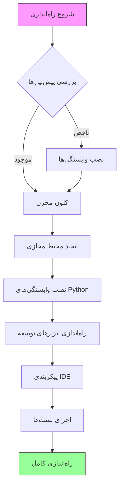

<div dir="rtl">

# راهنمای محیط توسعه

## نمای کلی
این سند راهنمای جامعی برای راه‌اندازی و نگهداری محیط توسعه سیستم AutoProjectManagement فراهم می‌کند. تمام جنبه‌ها از راه‌اندازی اولیه تا پیکربندی پیشرفته را پوشش می‌دهد تا اطمینان حاصل شود که توسعه‌دهندگان می‌توانند به‌طور کارآمد در پروژه مشارکت کنند.

## فهرست مطالب
۱. [نیازمندی‌های سیستم](#نیازمندیهای-سیستم)
۲. [راه‌اندازی محیط](#راهاندازی-محیط)
۳. [ابزارهای توسعه](#ابزارهای-توسعه)
۴. [ساختار پروژه](#ساختار-پروژه)
۵. [مدیریت پیکربندی](#مدیریت-پیکربندی)
۶. [چارچوب تست](#چارچوب-تست)
۷. [گردش کار توسعه](#گردش-کار-توسعه)
۸. [عیب‌یابی](#عیبیابی)
۹. [بهترین روش‌ها](#بهترین-روشها)

## نیازمندی‌های سیستم

### نیازمندی‌های سخت‌افزاری

| مولفه | حداقل | توصیه‌شده |
|-------|---------|-------------|
| CPU | دو هسته ۲.۰ گیگاهرتز | چهار هسته ۳.۰ گیگاهرتز |
| RAM | ۴ گیگابایت | ۸ گیگابایت |
| فضای ذخیره‌سازی | ۱۰ گیگابایت فضای آزاد | ۵۰ گیگابایت SSD |
| شبکه | اتصال پهن‌باند | اینترنت پرسرعت |

### نیازمندی‌های نرم‌افزاری

| نرم‌افزار | نسخه | هدف |
|-----------|---------|---------|
| Python | ۳.۸+ | زمان اجرای اصلی |
| Node.js | ۱۴.x+ | ابزارهای فرانت‌اند |
| Git | ۲.۲۰+ | کنترل نسخه |
| Docker | ۲۰.۱۰+ | کانتینریزاسیون |
| VS Code | ۱.۶۰+ | IDE |

### پشتیبانی سیستم‌عامل

- **لینوکس**: Ubuntu ۲۰.۰۴+, CentOS ۸+, Debian ۱۰+
- **macOS**: ۱۰.۱۵+ (کاتالینا یا بالاتر)
- **ویندوز**: ویندوز ۱۰ (ساخت ۱۹۰۴۱+) با WSL۲

## راه‌اندازی محیط

### ۱. نصب پیش‌نیازها

#### راه‌اندازی محیط Python

```bash
# بررسی نسخه Python
python3 --version  # باید ۳.۸+ باشد

# نصب pip در صورت عدم وجود
sudo apt update && sudo apt install python3-pip  # Ubuntu/Debian
brew install python3  # macOS
```

#### نصب Node.js

```bash
# استفاده از Node Version Manager (توصیه‌شده)
curl -o- https://raw.githubusercontent.com/nvm-sh/nvm/v0.39.0/install.sh | bash
nvm install 16
nvm use 16

# تأیید نصب
node --version
npm --version
```

### ۲. فرآیند راه‌اندازی پروژه

#### جریان راه‌اندازی خودکار



#### راه‌اندازی گام‌به‌گام

۱. **کلون مخزن**
```bash
git clone https://github.com/autoprojectmanagement/autoprojectmanagement.git
cd autoprojectmanagement
```

۲. **ایجاد محیط مجازی**
```bash
# ایجاد محیط مجازی
python3 -m venv venv

# فعال‌سازی محیط مجازی
source venv/bin/activate  # لینوکس/macOS
# یا
venv\Scripts\activate  # ویندوز
```

۳. **نصب وابستگی‌ها**
```bash
# نصب وابستگی‌های اصلی
pip install -r requirements.txt

# نصب وابستگی‌های توسعه
pip install -r requirements-dev.txt
```

۴. **راه‌اندازی محیط خودکار**
```bash
# اجرای راه‌اندازی خودکار
python -m autoprojectmanagement.setup_auto_environment --verbose
```

### ۳. تأیید محیط

#### اسکریپت تأیید
```bash
#!/bin/bash
# verify_environment.sh

echo "🔍 بررسی محیط توسعه..."

# بررسی Python
python3 --version || echo "❌ Python یافت نشد"

# بررسی محیط مجازی
if [[ "$VIRTUAL_ENV" != "" ]]; then
    echo "✅ محیط مجازی فعال: $VIRTUAL_ENV"
else
    echo "❌ محیط مجازی فعال نیست"
fi

# بررسی وابستگی‌ها
pip list | grep -E "(pytest|black|flake8|mypy)" || echo "❌ وابستگی‌های توسعه یافت نشد"

# بررسی Node.js
node --version || echo "❌ Node.js یافت نشد"

# بررسی Docker
docker --version || echo "⚠️ Docker یافت نشد (اختیاری)"

echo "✅ تأیید محیط کامل شد"
```

## ابزارهای توسعه

### پیکربندی IDE

#### افزونه‌های VS Code

| افزونه | هدف | نصب |
|-----------|---------|--------------|
| Python | پشتیبانی زبان Python | `ext install ms-python.python` |
| Pylance | بررسی نوع | `ext install ms-python.vscode-pylance` |
| Black Formatter | قالب‌بندی کد | `ext install ms-python.black-formatter` |
| GitLens | یکپارچه‌سازی Git | `ext install eamodio.gitlens` |
| Docker | پشتیبانی کانتینر | `ext install ms-azuretools.vscode-docker` |

#### تنظیمات VS Code

```json
{
    "python.defaultInterpreterPath": "./venv/bin/python",
    "python.linting.enabled": true,
    "python.linting.pylintEnabled": true,
    "python.formatting.provider": "black",
    "python.testing.pytestEnabled": true,
    "python.testing.unittestEnabled": false,
    "python.testing.pytestPath": "venv/bin/pytest",
    "editor.formatOnSave": true,
    "editor.rulers": [79, 120],
    "files.exclude": {
        "**/.git": true,
        "**/__pycache__": true,
        "**/*.pyc": true
    }
}
```

### راه‌اندازی کانتینر توسعه

#### محیط توسعه Docker

```dockerfile
# Dockerfile.dev
FROM python:3.9-slim

WORKDIR /app

# نصب وابستگی‌های سیستم
RUN apt-get update && apt-get install -y \
    git \
    nodejs \
    npm \
    && rm -rf /var/lib/apt/lists/*

# کپی کردن نیازمندی‌ها
COPY requirements*.txt ./
RUN pip install -r requirements.txt -r requirements-dev.txt

# کپی کردن کد منبع
COPY . .

# تنظیم متغیرهای محیط
ENV PYTHONPATH=/app
ENV PYTHONUNBUFFERED=1

# باز کردن پورت برای سرور توسعه
EXPOSE 8000

CMD ["python", "-m", "autoprojectmanagement.api.main"]
```

#### Docker Compose برای توسعه

```yaml
# docker-compose.dev.yml
version: '3.8'

services:
  app:
    build:
      context: .
      dockerfile: Dockerfile.dev
    ports:
      - "8000:8000"
    volumes:
      - .:/app
      - /app/venv
    environment:
      - PYTHONPATH=/app
      - ENV=development
    command: python -m autoprojectmanagement.api.main --reload

  redis:
    image: redis:6-alpine
    ports:
      - "6379:6379"

  postgres:
    image: postgres:13
    environment:
      POSTGRES_DB: autoprojectmanagement
      POST
