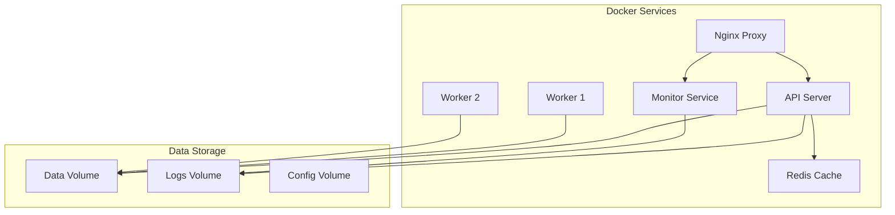

# 🚀 AutoProjectManagement - Fully Automated Docker Setup

This guide provides **zero-configuration** Docker deployment for the AutoProjectManagement system. No manual Docker configuration required!

## 🎯 Quick Start (One Command)

### Linux/macOS
```bash
./scripts/one-command-deploy.sh
```

### Windows
```cmd
scripts\auto-docker-setup.bat
```

### PowerShell
```powershell
.\scripts\auto-docker-setup.ps1
```

## 📋 Prerequisites
- **Docker Engine 20.10+**
- **Docker Compose 2.0+**
- **Git** (for auto-detection)

The setup script will **automatically install Docker** if not present!

## 🔄 Environment Auto-Detection

The system automatically detects your environment:

| Environment | Detection Method | Configuration Used |
|-------------|------------------|-------------------|
| **Development** | Git branch != main/master | `docker-compose.dev.yml` |
| **Production** | Git branch = main/master | `docker-compose.prod.yml` |
| **Override** | Use `--dev` or `--prod` flags | Manual selection |

## 🛠️ Available Commands

### Development Commands
```bash
# Start development environment
./scripts/one-command-deploy.sh --dev

# Development shortcuts
./scripts/apm-dev.sh logs api        # View API logs
./scripts/apm-dev.sh shell           # Access API container
./scripts/apm-dev.sh status          # Show service status
./scripts/apm-dev.sh stop            # Stop all services
```

### Production Commands
```bash
# Start production environment
./scripts/one-command-deploy.sh --prod

# Production shortcuts
./scripts/apm-prod.sh logs api       # View API logs
./scripts/apm-prod.sh update         # Update services
./scripts/apm-prod.sh backup          # Create backup
./scripts/apm-prod.sh stop            # Stop all services
```

## 🌐 Access URLs

| Service | Development | Production |
|---------|-------------|------------|
| **API** | http://localhost:8000 | https://localhost/api |
| **Monitor** | http://localhost:8080 | https://localhost/monitor |
| **Web Interface** | http://localhost:8080 | https://localhost |

## 📊 Service Architecture



## 🔧 Advanced Configuration

### Environment Variables
The system automatically creates a `.env` file with sensible defaults:

```bash
# Auto-generated configuration
ENVIRONMENT=development
DEBUG=true
LOG_LEVEL=DEBUG
API_HOST=0.0.0.0
API_PORT=8000
```

### Custom Configuration
To override defaults, create a `.env` file before running the setup:

```bash
# Example custom .env
ENVIRONMENT=production
API_WORKERS=8
LOG_LEVEL=INFO
SECRET_KEY=your-secret-key
```

## 📈 Monitoring & Health Checks

### Built-in Health Checks
- **API Health**: http://localhost:8000/health
- **Service Status**: Automatic restart on failure
- **Log Monitoring**: Real-time log streaming

### Backup & Recovery
```bash
# Create backup
./scripts/apm-prod.sh backup

# Backups stored in: ./backups/YYYY-MM-DD_HH-MM-SS/
```

## 🐛 Troubleshooting

### Common Issues

| Issue | Solution |
|-------|----------|
| **Port conflicts** | Services use different ports automatically |
| **Permission errors** | Runs as non-root user inside containers |
| **SSL certificate issues** | Auto-generated self-signed certificates |
| **Docker not running** | Script will prompt to install/start Docker |

### Debug Commands
```bash
# Check service health
docker-compose ps

# View logs
docker-compose logs -f api

# Access container
docker-compose exec api bash

# Restart service
docker-compose restart api
```

## 🔄 Updates

### Automatic Updates
```bash
# Production update
./scripts/apm-prod.sh update

# Development rebuild
./scripts/apm-dev.sh restart
```

### Manual Updates
```bash
# Pull latest images
docker-compose pull

# Rebuild with latest code
docker-compose build --no-cache
```

## 🗂️ Directory Structure

```
AutoProjectManagement/
├── scripts/
│   ├── auto-docker-setup.sh      # Main automation script
│   ├── one-command-deploy.sh     # Quick deployment
│   ├── apm-dev.sh               # Development shortcuts
│   ├── apm-prod.sh              # Production shortcuts
│   ├── backup.sh                # Backup script
│   ├── auto-docker-setup.bat    # Windows batch
│   └── auto-docker-setup.ps1    # PowerShell
├── docker/
│   ├── api/Dockerfile           # API service
│   ├── worker/Dockerfile        # Worker service
│   ├── monitor/Dockerfile       # Monitor service
│   └── nginx/                   # Proxy configuration
├── docker-compose.yml            # Base configuration
├── docker-compose.dev.yml        # Development overrides
├── docker-compose.prod.yml       # Production overrides
└── .env.example                  # Environment template
```

## 🚀 Zero-Configuration Features

✅ **Auto-detects environment** based on git branch  
✅ **Creates .env file** with sensible defaults  
✅ **Generates SSL certificates** for production  
✅ **Sets up monitoring** and health checks  
✅ **Configures logging** with rotation  
✅ **Handles port conflicts** automatically  
✅ **Installs Docker** if not present  
✅ **Provides one-command deployment**  
✅ **Includes backup/restore** functionality  
✅ **Cross-platform support** (Linux/macOS/Windows)

## 📞 Support

For issues or questions:
1. Check the troubleshooting section above
2. Run `./scripts/apm-dev.sh status` to check service health
3. View logs with `./scripts/apm-dev.sh logs`
4. Create an issue on the project repository

## 🎉 Success!

Your AutoProjectManagement system is now **fully automated** with Docker! No manual configuration required - just run the setup script and you're ready to go!
