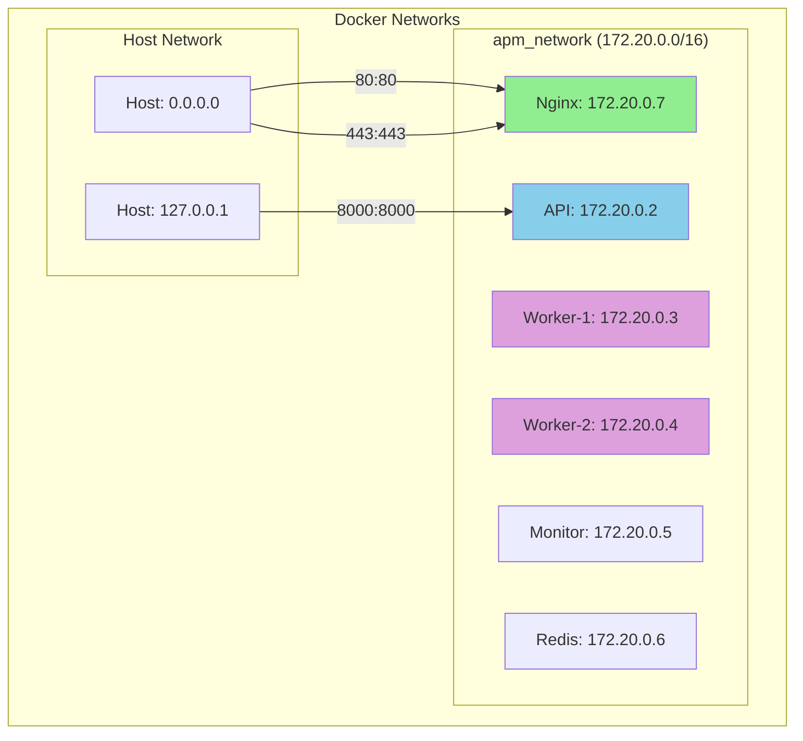
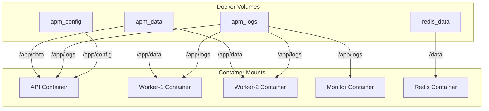
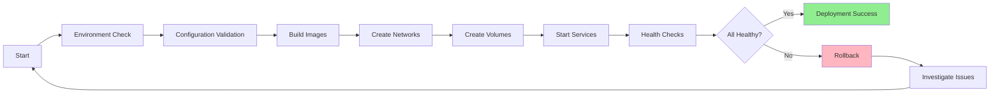
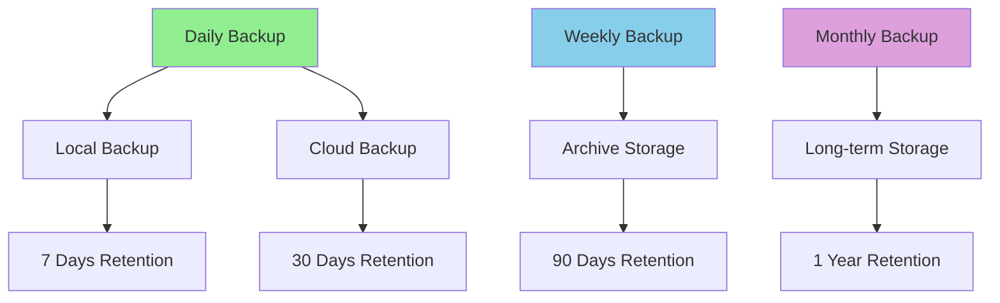

# Docker Setup Guide for AutoProjectManagement System

## Table of Contents
1. [Overview](#overview)
2. [Architecture](#architecture)
3. [Prerequisites](#prerequisites)
4. [Docker Configuration](#docker-configuration)
5. [Service Definitions](#service-definitions)
6. [Networking](#networking)
7. [Volume Management](#volume-management)
8. [Environment Configuration](#environment-configuration)
9. [Deployment Procedures](#deployment-procedures)
10. [Monitoring & Maintenance](#monitoring--maintenance)
11. [Troubleshooting](#troubleshooting)
12. [Security Considerations](#security-considerations)

## Overview

This guide provides comprehensive instructions for containerizing the AutoProjectManagement system using Docker. The system is designed to be scalable, maintainable, and production-ready with proper separation of concerns.

### System Components
- **API Server**: FastAPI-based REST API
- **Worker Services**: Background task processing
- **Database**: JSON-based data storage
- **Monitoring**: Health checks and logging
- **Reverse Proxy**: Nginx for load balancing

## Architecture

### High-Level Architecture

```mermaid
graph TB
    subgraph "Docker Host"
        subgraph "Docker Network: apm_network"
            NGINX[nginx:alpine]
            API[autoprojectmanagement-api]
            WORKER1[autoprojectmanagement-worker-1]
            WORKER2[autoprojectmanagement-worker-2]
            MONITOR[autoprojectmanagement-monitor]
        end
        
        subgraph "Volumes"
            VOL_DATA[apm_data:/app/data]
            VOL_LOGS[apm_logs:/app/logs]
            VOL_CONFIG[apm_config:/app/config]
        end
        
        subgraph "External Services"
            HOST[Host System]
            DOCKER_SOCK[/var/run/docker.sock]
        end
    end
    
    HOST -->|HTTP/HTTPS| NGINX
    NGINX -->|Proxy| API
    API -->|Read/Write| VOL_DATA
    API -->|Write| VOL_LOGS
    WORKER1 -->|Read/Write| VOL_DATA
    WORKER2 -->|Read/Write| VOL_DATA
    MONITOR -->|Monitor| DOCKER_SOCK
    
    style NGINX fill:#90EE90
    style API fill:#87CEEB
    style WORKER1 fill:#DDA0DD
    style WORKER2 fill:#DDA0DD
    style MONITOR fill:#F0E68C
```

### Container Architecture Detail


## Prerequisites

### System Requirements

| Component | Minimum | Recommended |
|-----------|---------|-------------|
| Docker Engine | 20.10+ | 24.0+ |
| Docker Compose | 2.0+ | 2.20+ |
| CPU Cores | 2 | 4+ |
| RAM | 4GB | 8GB+ |
| Storage | 20GB | 50GB+ |
| OS | Linux/macOS/Windows | Linux (Ubuntu 22.04+) |

### Required Tools

```bash
# Check Docker installation
docker --version
docker compose version

# Install Docker (Ubuntu/Debian)
curl -fsSL https://get.docker.com -o get-docker.sh
sudo sh get-docker.sh
sudo usermod -aG docker $USER

# Install Docker Compose
sudo apt-get update
sudo apt-get install docker-compose-plugin
```

## Docker Configuration

### Directory Structure

```
AutoProjectManagement/
├── docker/
│   ├── api/
│   │   ├── Dockerfile
│   │   ├── entrypoint.sh
│   │   └── healthcheck.sh
│   ├── worker/
│   │   ├── Dockerfile
│   │   └── entrypoint.sh
│   ├── monitor/
│   │   ├── Dockerfile
│   │   └── entrypoint.sh
│   └── nginx/
│       ├── Dockerfile
│       ├── nginx.conf
│       └── ssl/
├── docker-compose.yml
├── docker-compose.prod.yml
├── docker-compose.dev.yml
├── .dockerignore
└── .env.example
```

### Main Dockerfile (API Service)

```dockerfile
# docker/api/Dockerfile
FROM python:3.11-slim

# Set environment variables
ENV PYTHONUNBUFFERED=1 \
    PYTHONDONTWRITEBYTECODE=1 \
    PIP_NO_CACHE_DIR=1 \
    PIP_DISABLE_PIP_VERSION_CHECK=1

# Create app user
RUN groupadd -r apm && useradd -r -g apm apm

# Install system dependencies
RUN apt-get update && apt-get install -y \
    gcc \
    g++ \
    git \
    curl \
    && rm -rf /var/lib/apt/lists/*

# Set work directory
WORKDIR /app

# Copy requirements first for better caching
COPY requirements.txt requirements-dev.txt ./
RUN pip install --no-cache-dir -r requirements.txt

# Copy application code
COPY . .

# Create necessary directories
RUN mkdir -p /app/data /app/logs /app/config && \
    chown -R apm:apm /app

# Switch to non-root user
USER apm

# Expose port
EXPOSE 8000

# Health check
HEALTHCHECK --interval=30s --timeout=30s --start-period=5s --retries=3 \
    CMD python -c "import requests; requests.get('http://localhost:8000/health')"

# Run application
CMD ["uvicorn", "autoprojectmanagement.api.main:app", "--host", "0.0.0.0", "--port", "8000"]
```

### Worker Dockerfile

```dockerfile
# docker/worker/Dockerfile
FROM python:3.11-slim

ENV PYTHONUNBUFFERED=1 \
    PYTHONDONTWRITEBYTECODE=1

RUN groupadd -r apm && useradd -r -g apm apm

RUN apt-get update && apt-get install -y \
    gcc \
    g++ \
    cron \
    && rm -rf /var/lib/apt/lists/*

WORKDIR /app

COPY requirements.txt ./
RUN pip install --no-cache-dir -r requirements.txt

COPY . .

RUN mkdir -p /app/data /app/logs && \
    chown -R apm:apm /app

USER apm

# Setup cron for scheduled tasks
COPY docker/worker/crontab /etc/cron.d/apm-cron
RUN chmod 0644 /etc/cron.d/apm-cron && crontab /etc/cron.d/apm-cron

CMD ["python", "-m", "autoprojectmanagement.services.automation_services.auto_commit"]
```

### Monitor Dockerfile

```dockerfile
# docker/monitor/Dockerfile
FROM python:3.11-alpine

ENV PYTHONUNBUFFERED=1

RUN apk add --no-cache \
    curl \
    docker-cli

WORKDIR /app

COPY requirements.txt ./
RUN pip install --no-cache-dir -r requirements.txt

COPY . .

CMD ["python", "-m", "autoprojectmanagement.services.status_service"]
```

## Service Definitions

### Docker Compose Configuration

```yaml
# docker-compose.yml
version: '3.8'

services:
  nginx:
    build:
      context: .
      dockerfile: docker/nginx/Dockerfile
    ports:
      - "80:80"
      - "443:443"
    volumes:
      - ./docker/nginx/ssl:/etc/nginx/ssl:ro
      - apm_logs:/var/log/nginx
    depends_on:
      - api
    networks:
      - apm_network

  api:
    build:
      context: .
      dockerfile: docker/api/Dockerfile
    ports:
      - "8000:8000"
    environment:
      - PYTHONPATH=/app
      - ENVIRONMENT=production
    volumes:
      - apm_data:/app/data
      - apm_logs:/app/logs
      - apm_config:/app/config
    depends_on:
      - redis
    networks:
      - apm_network
    restart: unless-stopped
    healthcheck:
      test: ["CMD", "curl", "-f", "http://localhost:8000/health"]
      interval: 30s
      timeout: 10s
      retries: 3

  worker-1:
    build:
      context: .
      dockerfile: docker/worker/Dockerfile
    environment:
      - PYTHONPATH=/app
      - WORKER_ID=worker-1
    volumes:
      - apm_data:/app/data
      - apm_logs:/app/logs
      - /var/run/docker.sock:/var/run/docker.sock:ro
    depends_on:
      - api
    networks:
      - apm_network
    restart: unless-stopped

  worker-2:
    build:
      context: .
      dockerfile: docker/worker/Dockerfile
    environment:
      - PYTHONPATH=/app
      - WORKER_ID=worker-2
    volumes:
      - apm_data:/app/data
      - apm_logs:/app/logs
      - /var/run/docker.sock:/var/run/docker.sock:ro
    depends_on:
      - api
    networks:
      - apm_network
    restart: unless-stopped

  monitor:
    build:
      context: .
      dockerfile: docker/monitor/Dockerfile
    environment:
      - PYTHONPATH=/app
    volumes:
      - apm_logs:/app/logs
      - /var/run/docker.sock:/var/run/docker.sock:ro
    depends_on:
      - api
      - worker-1
      - worker-2
    networks:
      - apm_network
    restart: unless-stopped

  redis:
    image: redis:7-alpine
    ports:
      - "6379:6379"
    volumes:
      - redis_data:/data
    networks:
      - apm_network
    restart: unless-stopped
    command: redis-server --appendonly yes

volumes:
  apm_data:
    driver: local
  apm_logs:
    driver: local
  apm_config:
    driver: local
  redis_data:
    driver: local

networks:
  apm_network:
    driver: bridge
    ipam:
      config:
        - subnet: 172.20.0.0/16
```

## Networking

### Network Architecture



### Port Mapping Table

| Service | Internal Port | External Port | Protocol | Purpose |
|---------|---------------|---------------|----------|---------|
| Nginx | 80 | 80 | HTTP | Web traffic |
| Nginx | 443 | 443 | HTTPS | Secure web traffic |
| API | 8000 | 8000 | HTTP | API access |
| Redis | 6379 | 6379 | TCP | Caching/Queue |
| Monitor | 8080 | 8080 | HTTP | Monitoring dashboard |

## Volume Management

### Volume Structure



### Volume Details Table

| Volume Name | Path | Purpose | Backup Required | Size Estimate |
|-------------|------|---------|-----------------|---------------|
| apm_data | /app/data | JSON database files | Yes | 1-5GB |
| apm_logs | /app/logs | Application logs | Optional | 100MB-1GB |
| apm_config | /app/config | Configuration files | Yes | 10-50MB |
| redis_data | /data | Redis cache & queue | Optional | 100MB-500MB |

## Environment Configuration

### Environment Variables

```bash
# .env.example
# Application Configuration
ENVIRONMENT=production
DEBUG=false
LOG_LEVEL=INFO

# API Configuration
API_HOST=0.0.0.0
API_PORT=8000
API_WORKERS=4

# Database Configuration
DATA_PATH=/app/data
BACKUP_INTERVAL=3600
MAX_BACKUPS=10

# Redis Configuration
REDIS_URL=redis://redis:6379
REDIS_DB=0

# Monitoring Configuration
MONITOR_INTERVAL=30
ALERT_WEBHOOK_URL=https://hooks.slack.com/services/YOUR/WEBHOOK/URL

# Security Configuration
SECRET_KEY=your-secret-key-here
JWT_SECRET=your-jwt-secret-here
ALLOWED_HOSTS=localhost,127.0.0.1

# SSL Configuration (Production)
SSL_CERT_PATH=/etc/nginx/ssl/cert.pem
SSL_KEY_PATH=/etc/nginx/ssl/key.pem
```

### Configuration Files Structure

```yaml
# config/app.yml
application:
  name: "AutoProjectManagement"
  version: "1.0.0"
  environment: "${ENVIRONMENT}"

api:
  host: "${API_HOST}"
  port: "${API_PORT}"
  workers: "${API_WORKERS}"
  cors_origins: ["*"]

logging:
  level: "${LOG_LEVEL}"
  format: "json"
  file: "/app/logs/app.log"
  max_size: "100MB"
  backup_count: 5

database:
  path: "${DATA_PATH}"
  backup:
    interval: "${BACKUP_INTERVAL}"
    max_backups: "${MAX_BACKUPS}"

monitoring:
  enabled: true
  interval: "${MONITOR_INTERVAL}"
  endpoints:
    - name: "api"
      url: "http://api:8000/health"
    - name: "worker-1"
      url: "http://worker-1:8001/health"
    - name: "worker-2"
      url: "http://worker-2:8002/health"
```

## Deployment Procedures

### Development Deployment

```bash
# Clone repository
git clone <repository-url>
cd AutoProjectManagement

# Create environment file
cp .env.example .env

# Edit environment variables
nano .env

# Build and start services
docker-compose -f docker-compose.dev.yml up --build

# View logs
docker-compose logs -f api

# Scale workers
docker-compose up -d --scale worker=3
```

### Production Deployment

```bash
# Production deployment script
#!/bin/bash
set -e

# Configuration
DEPLOY_ENV=production
BACKUP_DIR="/backups/$(date +%Y%m%d_%H%M%S)"

# Create backup
mkdir -p $BACKUP_DIR
docker run --rm -v apm_data:/data -v $BACKUP_DIR:/backup alpine \
    tar czf /backup/data_backup.tar.gz -C /data .

# Deploy
docker-compose -f docker-compose.prod.yml pull
docker-compose -f docker-compose.prod.yml up -d --build

# Health check
./scripts/health_check.sh

# Cleanup old images
docker image prune -f
```

### Deployment Flow



## Monitoring & Maintenance

### Health Check Endpoints

| Service | Endpoint | Method | Expected Response | Timeout |
|---------|----------|--------|-------------------|---------|
| API | /health | GET | {"status": "healthy"} | 5s |
| Worker-1 | /health | GET | {"status": "healthy"} | 5s |
| Worker-2 | /health | GET | {"status": "healthy"} | 5s |
| Monitor | /metrics | GET | Prometheus metrics | 10s |

### Monitoring Dashboard


### Maintenance Schedule

| Task | Frequency | Command | Duration |
|------|-----------|---------|----------|
| Log rotation | Daily | docker exec api logrotate | 1 min |
| Backup creation | Daily | ./scripts/backup.sh | 5-10 min |
| Image updates | Weekly | docker-compose pull | 2-5 min |
| Volume cleanup | Monthly | docker volume prune | 1-2 min |
| Security scan | Monthly | docker scan | 5-10 min |

## Troubleshooting

### Common Issues and Solutions

| Issue | Symptoms | Solution | Prevention |
|-------|----------|----------|------------|
| Container won't start | Exit code 1 | Check logs: `docker logs container_name` | Validate configuration |
| Port conflicts | "Port already in use" | Change port mapping | Use dynamic ports |
| Volume permission denied | Permission errors | Fix volume permissions | Use proper user IDs |
| Out of disk space | "No space left on device" | Clean up images/volumes | Set up monitoring |
| Network issues | "Connection refused" | Check network configuration | Use docker networks |

### Debug Commands

```bash
# Check container status
docker ps -a

# View container logs
docker logs -f api --tail 100

# Execute commands in container
docker exec -it api bash

# Check resource usage
docker stats

# Inspect network
docker network inspect apm_network

# Check volume usage
docker system df

# Debug networking
docker run --rm -it --network apm_network nicolaka/netshoot
```

### Log Analysis

```bash
# Search for errors in logs
docker logs api 2>&1 | grep -i error

# Monitor real-time logs
docker-compose logs -f | grep -E "(ERROR|WARN)"

# Check specific service logs
docker-compose logs worker-1 | tail -50
```

## Security Considerations

### Security Architecture


### Security Checklist

- [ ] Use non-root user in containers
- [ ] Keep base images updated
- [ ] Scan images for vulnerabilities
- [ ] Use secrets management
- [ ] Enable TLS/SSL
- [ ] Implement proper authentication
- [ ] Regular security updates
- [ ] Network segmentation
- [ ] Log security events
- [ ] Backup encryption

### Security Configuration

```yaml
# docker-compose.security.yml
version: '3.8'
services:
  api:
    security_opt:
      - no-new-privileges:true
    read_only: true
    tmpfs:
      - /tmp:noexec,nosuid,size=100m
    cap_drop:
      - ALL
    cap_add:
      - CHOWN
      - SETGID
      - SETUID
    user: "1000:1000"
```

## Performance Optimization

### Resource Limits

```yaml
# Resource constraints
deploy:
  resources:
    limits:
      cpus: '2'
      memory: 2G
    reservations:
      cpus: '0.5'
      memory: 512M
```

### Performance Tuning

| Parameter | Development | Production | Impact |
|-----------|-------------|------------|---------|
| Worker processes | 2 | 4-8 | Throughput |
| Gunicorn workers | 2-4 | 4-8 | Concurrency |
| Redis maxmemory | 100mb | 1gb | Cache hit rate |
| Nginx worker processes | 1 | auto | Connection handling |

## Backup and Recovery

### Backup Strategy



### Recovery Procedures

```bash
# Restore from backup
./scripts/restore.sh backup_20240101_120000.tar.gz

# Verify restoration
./scripts/verify_restore.sh

# Update DNS if needed
./scripts/update_dns.sh
```

## Conclusion

This Docker setup provides a robust, scalable, and maintainable deployment solution for the AutoProjectManagement system. Regular monitoring, security updates, and backup procedures ensure high availability and data integrity.

For additional support or questions, please refer to:
- [Troubleshooting Guide](#troubleshooting)
- [Security Documentation](#security-considerations)
- [Performance Tuning Guide](#performance-optimization)
