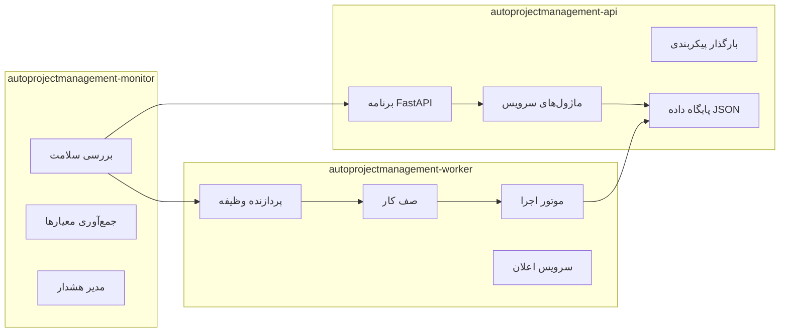

# AutoProjectManagement - راهنمای راه‌اندازی یکپارچه Docker

این راهنمای جامع **هر دو روش** استقرار خودکار بدون نیاز به پیکربندی **و** دستورالعمل‌های دقیق راه‌اندازی دستی را برای سیستم AutoProjectManagement فراهم می‌کند. روش دلخواه خود را انتخاب کنید یا در صورت نیاز از هر دو استفاده کنید.

## 🎯 ناوبری سریع

- [**🚀 راه‌اندازی خودکار**](#automated-setup) - استقرار بدون نیاز به پیکربندی
- [**📋 راه‌اندازی دستی**](#manual-setup) - دستورالعمل‌های گام‌به‌گام دقیق
- [**🏗️ معماری**](#architecture) - طراحی سیستم و اجزاء
- [**🔧 پیکربندی**](#configuration) - محیط و سفارشی‌سازی
- [**📊 نظارت**](#monitoring) - بررسی سلامت و نگهداری
- [**🐛 عیب‌یابی**](#troubleshooting) - مشکلات رایج و راه‌حل‌ها

---

## 🚀 راه‌اندازی خودکار

### استقرار با یک دستور

پلتفرم خود را انتخاب کرده و دستور مناسب را اجرا کنید:

#### لینوکس/مک
```bash
./scripts/one-command-deploy.sh
```

#### ویندوز Command Prompt
```cmd
scripts\auto-docker-setup.bat
```

#### ویندوز PowerShell
```powershell
.\scripts\auto-docker-setup.ps1
```

### تشخیص خودکار محیط

سیستم به‌طور خودکار محیط شما را تشخیص می‌دهد:

| محیط | روش تشخیص | پیکربندی استفاده شده |
|------|------------|---------------------|
| **توسعه** | شاخه Git != main/master | `docker-compose.dev.yml` |
| **تولید** | شاخه Git = main/master | `docker-compose.prod.yml` |
| **لغو** | استفاده از پرچم‌های `--dev` یا `--prod` | انتخاب دستی |

### دستورات موجود

#### دستورات توسعه
```bash
# شروع محیط توسعه
./scripts/one-command-deploy.sh --dev

# میان‌برهای توسعه
./scripts/apm-dev.sh logs api        # مشاهده لاگ‌های API
./scripts/apm-dev.sh shell           # دسترسی به کانتینر API
./scripts/apm-dev.sh status          # نمایش وضعیت سرویس‌ها
./scripts/apm-dev.sh stop            # توقف همه سرویس‌ها
```

#### دستورات تولید
```bash
# استقرار تولید
./scripts/one-command-deploy.sh --prod

# میان‌برهای تولید
./scripts/apm-prod.sh logs api       # مشاهده لاگ‌های API
./scripts/apm-prod.sh update         # بروزرسانی سرویس‌ها
./scripts/apm-prod.sh backup         # ایجاد پشتیبان
./scripts/apm-prod.sh stop           # توقف همه سرویس‌ها
```

### ویژگی‌های بدون نیاز به پیکربندی

✅ **تشخیص خودکار محیط** بر اساس شاخه git  
✅ **ایجاد فایل .env** با مقادیر پیش‌فرض منطقی  
✅ **تولید گواهینامه‌های SSL** برای تولید  
✅ **راه‌اندازی نظارت** و بررسی سلامت  
✅ **پیکربندی لاگ‌گیری** با چرخش  
✅ **مدیریت تداخل پورت‌ها** به‌طور خودکار  
✅ **نصب Docker** در صورت عدم وجود  
✅ **فراهم‌سازی استقرار با یک دستور**  
✅ **شامل عملکرد پشتیبان‌گیری/بازیابی**  
✅ **پشتیبانی چند پلتفرمی** (لینوکس/مک/ویندوز)

---

## 📋 راه‌اندازی دستی

### پیش‌نیازها

#### الزامات سیستم

| جزء | حداقل | توصیه شده |
|-----|--------|-----------|
| موتور Docker | 20.10+ | 24.0+ |
| Docker Compose | 2.0+ | 2.20+ |
| هسته‌های CPU | 2 | 4+ |
| RAM | 4GB | 8GB+ |
| فضای ذخیره‌سازی | 20GB | 50GB+ |
| سیستم‌عامل | لینوکس/مک/ویندوز | لینوکس (Ubuntu 22.04+) |

#### دستورات نصب

```bash
# بررسی نصب Docker
docker --version
docker compose version

# نصب Docker (Ubuntu/Debian)
curl -fsSL https://get.docker.com -o get-docker.sh
sudo sh get-docker.sh
sudo usermod -aG docker $USER

# نصب Docker Compose
sudo apt-get update
sudo apt-get install docker-compose-plugin
```

### ساختار دایرکتوری

```
AutoProjectManagement/
├── docker/
│   ├── api/
│   │   ├── Dockerfile
│   │   ├── entrypoint.sh
│   │   └── healthcheck.sh
│   ├── worker/
│   │   ├── Dockerfile
│   │   └── entrypoint.sh
│   ├── monitor/
│   │   ├── Dockerfile
│   │   └── entrypoint.sh
│   └── nginx/
│       ├── Dockerfile
│       ├── nginx.conf
│       └── ssl/
├── scripts/
│   ├── auto-docker-setup.sh      # اسکریپت اصلی خودکارسازی
│   ├── one-command-deploy.sh     # استقرار سریع
│   ├── apm-dev.sh               # میان‌برهای توسعه
│   ├── apm-prod.sh              # میان‌برهای تولید
│   ├── backup.sh                # اسکریپت پشتیبان‌گیری
│   ├── auto-docker-setup.bat    # بچ ویندوز
│   └── auto-docker-setup.ps1    # PowerShell
├── docker-compose.yml
├── docker-compose.dev.yml
├── docker-compose.prod.yml
├── .dockerignore
├── .env.example
└── .gitignore
```

### مراحل استقرار دستی

#### 1. کلون مخزن
```bash
git clone <repository-url>
cd AutoProjectManagement
```

#### 2. ایجاد فایل محیط
```bash
cp .env.example .env
# ویرایش .env با پیکربندی شما
nano .env
```

#### 3. استقرار توسعه
```bash
# ساخت و شروع سرویس‌ها
docker-compose -f docker-compose.dev.yml up --build

# مشاهده لاگ‌ها
docker-compose logs -f api

# مقیاس‌بندی workerها
docker-compose up -d --scale worker=3
```

#### 4. استقرار تولید
```bash
# استقرار تولید
docker-compose -f docker-compose.prod.yml pull
docker-compose -f docker-compose.prod.yml up -d --build

# بررسی سلامت
./scripts/health_check.sh
```

---

## 🏗️ معماری

### معماری سطح بالا

```mermaid
graph TB
    subgraph "میزبان Docker"
        subgraph "شبکه Docker: apm_network"
            NGINX[nginx:alpine]
            API[autoprojectmanagement-api]
            WORKER1[autoprojectmanagement-worker-1]
            WORKER2[autoprojectmanagement-worker-2]
            MONITOR[autoprojectmanagement-monitor]
            REDIS[Redis Cache]
        end
        
        subgraph "Volumes"
            VOL_DATA[apm_data:/app/data]
            VOL_LOGS[apm_logs:/app/logs]
            VOL_CONFIG[apm_config:/app/config]
            REDIS_DATA[redis_data:/data]
        end
        
        subgraph "سرویس‌های خارجی"
            HOST[سیستم میزبان]
            DOCKER_SOCK[/var/run/docker.sock]
        end
    end
    
    HOST -->|HTTP/HTTPS| NGINX
    NGINX -->|پروکسی| API
    NGINX -->|پروکسی| MONITOR
    API -->|خواندن/نوشتن| VOL_DATA
    API -->|نوشتن| VOL_LOGS
    API -->|کش| REDIS
    WORKER1 -->|خواندن/نوشتن| VOL_DATA
    WORKER2 -->|خواندن/نوشتن| VOL_DATA
    MONITOR -->|نظارت| DOCKER_SOCK
    
    style NGINX fill:#90EE90
    style API fill:#87CEEB
    style WORKER1 fill:#DDA0DD
    style WORKER2 fill:#DDA0DD
    style MONITOR fill:#F0E68C
```

### جزئیات معماری سرویس



---

## 🔧 پیکربندی

### متغیرهای محیط

```bash
# .env.example
# پیکربندی برنامه
ENVIRONMENT=production
DEBUG=false
LOG_LEVEL=INFO

# پیکربندی API
API_HOST=0.0.0.0
API_PORT=8000
API_WORKERS=4

# پیکربندی پایگاه داده
DATA_PATH=/app/data
BACKUP_INTERVAL=3600
MAX_BACKUPS=10

# پیکربندی Redis
REDIS_URL=redis://redis:6379
REDIS_DB=0

# پیکربندی نظارت
MONITOR_INTERVAL=30
ALERT_WEBHOOK_URL=https://hooks.slack.com/services/YOUR/WEBHOOK/URL

# پیکربندی امنیت
SECRET_KEY=your-secret-key-here
JWT_SECRET=your-jwt-secret-here
ALLOWED_HOSTS=localhost,127.0.0.1

# پیکربندی SSL (تولید)
SSL_CERT_PATH=/etc/nginx/ssl/cert.pem
SSL_KEY_PATH=/etc/nginx/ssl/key.pem
```

### پیکربندی Docker Compose

```yaml
# docker-compose.yml
version: '3.8'

services:
  nginx:
    build:
      context: .
      dockerfile: docker/nginx/Dockerfile
    ports:
      - "80:80"
      - "443:443"
    volumes:
      - ./docker/nginx/ssl:/etc/nginx/ssl:ro
      - apm_logs:/var/log/nginx
    depends_on:
      - api
    networks:
      - apm_network

  api:
    build:
      context: .
      dockerfile: docker/api/Dockerfile
    ports:
      - "8000:8000"
    environment:
      - PYTHONPATH=/app
      - ENVIRONMENT=production
    volumes:
      - apm_data:/app/data
      - apm_logs:/app/logs
      - apm_config:/app/config
    depends_on:
      - redis
    networks:
      - apm_network
    restart: unless-stopped
    healthcheck:
      test: ["CMD", "curl", "-f", "http://localhost:8000/health"]
      interval: 30s
      timeout: 10s
      retries: 3

  worker-1:
    build:
      context: .
      dockerfile: docker/worker/Dockerfile
    environment:
      - PYTHONPATH=/app
      - WORKER_ID=worker-1
    volumes:
      - apm_data:/app/data
      - apm_logs:/app/logs
      - /var/run/docker.sock:/var/run/docker.sock:ro
    depends_on:
      - api
    networks:
      - apm_network
    restart: unless-stopped

  worker-2:
    build:
      context: .
      dockerfile: docker/worker/Dockerfile
    environment:
      - PYTHONPATH=/app
      - WORKER_ID=worker-2
    volumes:
      - apm_data:/app/data
      - apm_logs:/app/logs
      - /var/run/docker.sock:/var/run/docker.sock:ro
    depends_on:
      - api
    networks:
      - apm_network
    restart: unless-stopped

  monitor:
    build:
      context: .
      dockerfile: docker/monitor/Dockerfile
    environment:
      - PYTHONPATH=/app
    volumes:
      - apm_logs:/app/logs
      - /var/run/docker.sock:/var/run/docker.sock:ro
    depends_on:
      - api
      - worker-1
      - worker-2
    networks:
      - apm_network
    restart: unless-stopped

  redis:
    image: redis:7-alpine
    ports:
      - "6379:6379"
    volumes:
      - redis_data:/data
    networks:
      - apm_network
    restart: unless-stopped
    command: redis-server --appendonly yes

volumes:
  apm_data:
    driver: local
  apm_logs:
    driver: local
  apm_config:
    driver: local
  redis_data:
    driver: local

networks:
  apm_network:
    driver: bridge
    ipam:
      config:
        - subnet: 172.20.0.0/16
```

---
