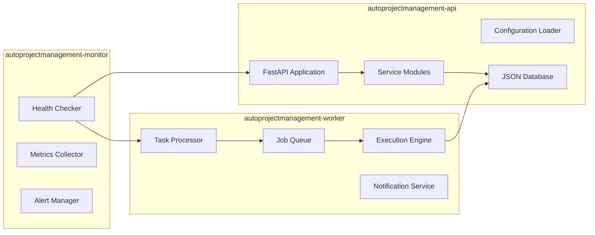
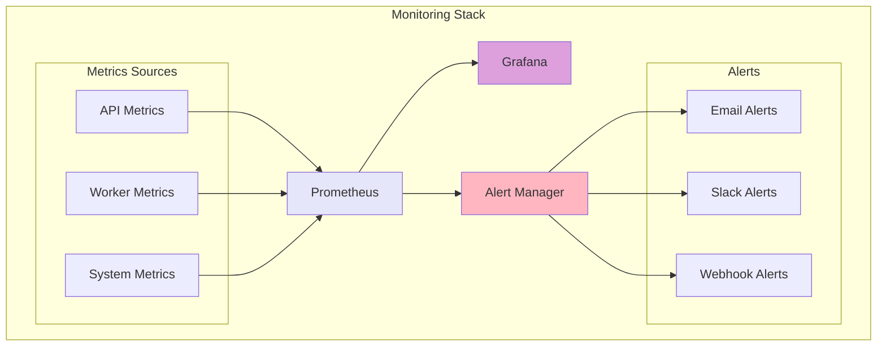

# AutoProjectManagement - Unified Docker Setup Guide

This comprehensive guide provides **both** automated zero-configuration deployment **and** detailed manual setup instructions for the AutoProjectManagement system. Choose your preferred approach or use both as needed.

## 🎯 Quick Navigation

- [**🚀 Automated Setup**](#automated-setup) - Zero-configuration deployment
- [**📋 Manual Setup**](#manual-setup) - Detailed step-by-step instructions
- [**🏗️ Architecture**](#architecture) - System design and components
- [**🔧 Configuration**](#configuration) - Environment and customization
- [**📊 Monitoring**](#monitoring) - Health checks and maintenance
- [**🐛 Troubleshooting**](#troubleshooting) - Common issues and solutions

---

## 🚀 Automated Setup

### One-Command Deployment

Choose your platform and run the appropriate command:

#### Linux/macOS
```bash
./scripts/one-command-deploy.sh
```

#### Windows Command Prompt
```cmd
scripts\auto-docker-setup.bat
```

#### Windows PowerShell
```powershell
.\scripts\auto-docker-setup.ps1
```

### Environment Auto-Detection

The system automatically detects your environment:

| Environment | Detection Method | Configuration Used |
|-------------|------------------|-------------------|
| **Development** | Git branch != main/master | `docker-compose.dev.yml` |
| **Production** | Git branch = main/master | `docker-compose.prod.yml` |
| **Override** | Use `--dev` or `--prod` flags | Manual selection |

### Available Commands

#### Development Commands
```bash
# Start development environment
./scripts/one-command-deploy.sh --dev

# Development shortcuts
./scripts/apm-dev.sh logs api        # View API logs
./scripts/apm-dev.sh shell           # Access API container
./scripts/apm-dev.sh status          # Show service status
./scripts/apm-dev.sh stop            # Stop all services
```

#### Production Commands
```bash
# Start production environment
./scripts/one-command-deploy.sh --prod

# Production shortcuts
./scripts/apm-prod.sh logs api       # View API logs
./scripts/apm-prod.sh update         # Update services
./scripts/apm-prod.sh backup         # Create backup
./scripts/apm-prod.sh stop           # Stop all services
```

### Zero-Configuration Features

✅ **Auto-detects environment** based on git branch  
✅ **Creates .env file** with sensible defaults  
✅ **Generates SSL certificates** for production  
✅ **Sets up monitoring** and health checks  
✅ **Configures logging** with rotation  
✅ **Handles port conflicts** automatically  
✅ **Installs Docker** if not present  
✅ **Provides one-command deployment**  
✅ **Includes backup/restore** functionality  
✅ **Cross-platform support** (Linux/macOS/Windows)

---

## 📋 Manual Setup

### Prerequisites

#### System Requirements

| Component | Minimum | Recommended |
|-----------|---------|-------------|
| Docker Engine | 20.10+ | 24.0+ |
| Docker Compose | 2.0+ | 2.20+ |
| CPU Cores | 2 | 4+ |
| RAM | 4GB | 8GB+ |
| Storage | 20GB | 50GB+ |
| OS | Linux/macOS/Windows | Linux (Ubuntu 22.04+) |

#### Installation Commands

```bash
# Check Docker installation
docker --version
docker compose version

# Install Docker (Ubuntu/Debian)
curl -fsSL https://get.docker.com -o get-docker.sh
sudo sh get-docker.sh
sudo usermod -aG docker $USER

# Install Docker Compose
sudo apt-get update
sudo apt-get install docker-compose-plugin
```

### Directory Structure

```
AutoProjectManagement/
├── docker/
│   ├── api/
│   │   ├── Dockerfile
│   │   ├── entrypoint.sh
│   │   └── healthcheck.sh
│   ├── worker/
│   │   ├── Dockerfile
│   │   └── entrypoint.sh
│   ├── monitor/
│   │   ├── Dockerfile
│   │   └── entrypoint.sh
│   └── nginx/
│       ├── Dockerfile
│       ├── nginx.conf
│       └── ssl/
├── scripts/
│   ├── auto-docker-setup.sh      # Main automation script
│   ├── one-command-deploy.sh     # Quick deployment
│   ├── apm-dev.sh               # Development shortcuts
│   ├── apm-prod.sh              # Production shortcuts
│   ├── backup.sh                # Backup script
│   ├── auto-docker-setup.bat    # Windows batch
│   └── auto-docker-setup.ps1    # PowerShell
├── docker-compose.yml
├── docker-compose.dev.yml
├── docker-compose.prod.yml
├── .dockerignore
├── .env.example
└── .gitignore
```

### Manual Deployment Steps

#### 1. Clone Repository
```bash
git clone <repository-url>
cd AutoProjectManagement
```

#### 2. Create Environment File
```bash
cp .env.example .env
# Edit .env with your configuration
nano .env
```

#### 3. Development Deployment
```bash
# Build and start services
docker-compose -f docker-compose.dev.yml up --build

# View logs
docker-compose logs -f api

# Scale workers
docker-compose up -d --scale worker=3
```

#### 4. Production Deployment
```bash
# Production deployment
docker-compose -f docker-compose.prod.yml pull
docker-compose -f docker-compose.prod.yml up -d --build

# Health check
./scripts/health_check.sh
```

---

## 🏗️ Architecture

### High-Level Architecture

```mermaid
graph TB
    subgraph "Docker Host"
        subgraph "Docker Network: apm_network"
            NGINX[nginx:alpine]
            API[autoprojectmanagement-api]
            WORKER1[autoprojectmanagement-worker-1]
            WORKER2[autoprojectmanagement-worker-2]
            MONITOR[autoprojectmanagement-monitor]
            REDIS[Redis Cache]
        end
        
        subgraph "Volumes"
            VOL_DATA[apm_data:/app/data]
            VOL_LOGS[apm_logs:/app/logs]
            VOL_CONFIG[apm_config:/app/config]
            REDIS_DATA[redis_data:/data]
        end
        
        subgraph "External Services"
            HOST[Host System]
            DOCKER_SOCK[/var/run/docker.sock]
        end
    end
    
    HOST -->|HTTP/HTTPS| NGINX
    NGINX -->|Proxy| API
    NGINX -->|Proxy| MONITOR
    API -->|Read/Write| VOL_DATA
    API -->|Write| VOL_LOGS
    API -->|Cache| REDIS
    WORKER1 -->|Read/Write| VOL_DATA
    WORKER2 -->|Read/Write| VOL_DATA
    MONITOR -->|Monitor| DOCKER_SOCK
    
    style NGINX fill:#90EE90
    style API fill:#87CEEB
    style WORKER1 fill:#DDA0DD
    style WORKER2 fill:#DDA0DD
    style MONITOR fill:#F0E68C
```

### Service Architecture Detail



---

## 🔧 Configuration

### Environment Variables

```bash
# .env.example
# Application Configuration
ENVIRONMENT=production
DEBUG=false
LOG_LEVEL=INFO

# API Configuration
API_HOST=0.0.0.0
API_PORT=8000
API_WORKERS=4

# Database Configuration
DATA_PATH=/app/data
BACKUP_INTERVAL=3600
MAX_BACKUPS=10

# Redis Configuration
REDIS_URL=redis://redis:6379
REDIS_DB=0

# Monitoring Configuration
MONITOR_INTERVAL=30
ALERT_WEBHOOK_URL=https://hooks.slack.com/services/YOUR/WEBHOOK/URL

# Security Configuration
SECRET_KEY=your-secret-key-here
JWT_SECRET=your-jwt-secret-here
ALLOWED_HOSTS=localhost,127.0.0.1

# SSL Configuration (Production)
SSL_CERT_PATH=/etc/nginx/ssl/cert.pem
SSL_KEY_PATH=/etc/nginx/ssl/key.pem
```

### Docker Compose Configuration

```yaml
# docker-compose.yml
version: '3.8'

services:
  nginx:
    build:
      context: .
      dockerfile: docker/nginx/Dockerfile
    ports:
      - "80:80"
      - "443:443"
    volumes:
      - ./docker/nginx/ssl:/etc/nginx/ssl:ro
      - apm_logs:/var/log/nginx
    depends_on:
      - api
    networks:
      - apm_network

  api:
    build:
      context: .
      dockerfile: docker/api/Dockerfile
    ports:
      - "8000:8000"
    environment:
      - PYTHONPATH=/app
      - ENVIRONMENT=production
    volumes:
      - apm_data:/app/data
      - apm_logs:/app/logs
      - apm_config:/app/config
    depends_on:
      - redis
    networks:
      - apm_network
    restart: unless-stopped
    healthcheck:
      test: ["CMD", "curl", "-f", "http://localhost:8000/health"]
      interval: 30s
      timeout: 10s
      retries: 3

  worker-1:
    build:
      context: .
      dockerfile: docker/worker/Dockerfile
    environment:
      - PYTHONPATH=/app
      - WORKER_ID=worker-1
    volumes:
      - apm_data:/app/data
      - apm_logs:/app/logs
      - /var/run/docker.sock:/var/run/docker.sock:ro
    depends_on:
      - api
    networks:
      - apm_network
    restart: unless-stopped

  worker-2:
    build:
      context: .
      dockerfile: docker/worker/Dockerfile
    environment:
      - PYTHONPATH=/app
      - WORKER_ID=worker-2
    volumes:
      - apm_data:/app/data
      - apm_logs:/app/logs
      - /var/run/docker.sock:/var/run/docker.sock:ro
    depends_on:
      - api
    networks:
      - apm_network
    restart: unless-stopped

  monitor:
    build:
      context: .
      dockerfile: docker/monitor/Dockerfile
    environment:
      - PYTHONPATH=/app
    volumes:
      - apm_logs:/app/logs
      - /var/run/docker.sock:/var/run/docker.sock:ro
    depends_on:
      - api
      - worker-1
      - worker-2
    networks:
      - apm_network
    restart: unless-stopped

  redis:
    image: redis:7-alpine
    ports:
      - "6379:6379"
    volumes:
      - redis_data:/data
    networks:
      - apm_network
    restart: unless-stopped
    command: redis-server --appendonly yes

volumes:
  apm_data:
    driver: local
  apm_logs:
    driver: local
  apm_config:
    driver: local
  redis_data:
    driver: local

networks:
  apm_network:
    driver: bridge
    ipam:
      config:
        - subnet: 172.20.0.0/16
```

---

## 📊 Monitoring & Maintenance

### Health Check Endpoints

| Service | Endpoint | Method | Expected Response | Timeout |
|---------|----------|--------|-------------------|---------|
| API | /health | GET | {"status": "healthy"} | 5s |
| Worker-1 | /health | GET | {"status": "healthy"} | 5s |
| Worker-2 | /health | GET | {"status": "healthy"} | 5s |
| Monitor | /metrics | GET | Prometheus metrics | 10s |

### Access URLs

| Service | Development | Production |
|---------|-------------|------------|
| **API** | http://localhost:8000 | https://localhost/api |
| **Monitor** | http://localhost:8080 | https://localhost/monitor |
| **Web Interface** | http://localhost:8080 | https://localhost |

### Monitoring Dashboard



### Maintenance Schedule

| Task | Frequency | Command | Duration |
|------|-----------|---------|----------|
| Log rotation | Daily | docker exec api logrotate | 1 min |
| Backup creation | Daily | ./scripts/backup.sh | 5-10 min |
| Image updates | Weekly | docker-compose pull | 2-5 min |
| Volume cleanup | Monthly | docker volume prune | 1-2 min |
| Security scan | Monthly | docker scan | 5-10 min |

---

## 🐛 Troubleshooting

### Common Issues and Solutions

| Issue | Symptoms | Solution | Prevention |
|-------|----------|----------|------------|
| Container won't start | Exit code 1 | Check logs: `docker logs container_name` | Validate configuration |
| Port conflicts | "Port already in use" | Change port mapping | Use dynamic ports |
| Volume permission denied | Permission errors | Fix volume permissions | Use proper user IDs |
| Out of disk space | "No space left on device" | Clean up images/volumes | Set up monitoring |
| Network issues | "Connection refused" | Check network configuration | Use docker networks |

### Debug Commands

```bash
# Check container status
docker ps -a

# View container logs
docker logs -f api --tail 100

# Execute commands in container
docker exec -it api bash

# Check resource usage
docker stats

# Inspect network
docker network inspect apm_network

# Check volume usage
docker system df

# Debug networking
docker run --rm -it --network apm_network nicolaka/netshoot
```

### Log Analysis

```bash
# Search for errors in logs
docker logs api 2>&1 | grep -i error

# Monitor real-time logs
docker-compose logs -f | grep -E "(ERROR|WARN)"

# Check specific service logs
docker-compose logs worker-1 | tail -50
```

---

## 🔐 Security Considerations

### Security Architecture

```mermaid
graph TB
    subgraph "Security Layers"
        L1[Network Security]
        L2[Container Security]
        L3[Application Security]
        L4[Data Security]
    end
    
    subgraph "Network Security"
        FIREWALL[Firewall Rules]
        VPN[VPN Access]
        TLS[TLS Encryption]
    end
    
    subgraph "Container Security"
        NONROOT[Non-root User]
        MINIMAL[Minimal Base Image]
        SCANNING[Vulnerability Scanning]
    end
    
    subgraph "Application Security"
        AUTH[Authentication]
        AUTHZ[Authorization]
        INPUT[Input Validation]
    end
    
    subgraph "Data Security"
        ENCRYPTION[Data Encryption]
        BACKUP[Secure Backups]
        ACCESS[Access Control]
    end
    
    L1 --> FIREWALL
    L1 --> VPN
    L1 --> TLS
    
    L2 --> NONROOT
    L2 --> MINIMAL
    L2 --> SCANNING
    
    L3 --> AUTH
    L3 --> AUTHZ
    L3 --> INPUT
    
    L4 --> ENCRYPTION
    L4 --> BACKUP
    L4 --> ACCESS
```



### Security Checklist

- [ ] Use non-root user in containers
- [ ] Keep base images updated
- [ ] Scan images for vulnerabilities
- [ ] Use secrets management
- [ ] Enable TLS/SSL
- [ ] Implement proper authentication
- [ ] Regular security updates
- [ ] Network segmentation
- [ ] Log security events
- [ ] Backup encryption

### Security Configuration

```yaml
# docker-compose.security.yml
version: '3.8'
services:
  api:
    security_opt:
      - no-new-privileges:true
    read_only: true
    tmpfs:
      - /tmp:noexec,nosuid,size=100m
    cap_drop:
      - ALL
    cap_add:
      - CHOWN
      - SETGID
      - SETUID
    user: "1000:1000"
```

---

## 📞 Support & Resources

### Quick Help Commands

```bash
# Check service health
./scripts/apm-dev.sh status

# View all logs
./scripts/apm-dev.sh logs

# Get system info
./scripts/apm-dev.sh info

# Create backup
./scripts/apm-prod.sh backup
```

### Additional Resources

- [Troubleshooting Guide](#troubleshooting)
- [Security Documentation](#security-considerations)
- [Performance Tuning](#maintenance-schedule)
- [Architecture Details](#architecture)

### Getting Help

1. **Check this guide** for your specific issue
2. **Run diagnostic commands** to gather system information
3. **Check logs** for error messages
4. **Create an issue** on the project repository with:
   - System information
   - Error messages
   - Steps to reproduce

---

## 🎉 Success!

You now have a **unified Docker setup** that provides both automated zero-configuration deployment and comprehensive manual setup instructions. Choose the approach that best fits your needs:

- **For quick deployment**: Use the [automated setup](#automated-setup)
- **For detailed control**: Use the [manual setup](#manual-setup)
- **For troubleshooting**: Refer to the [troubleshooting section](#troubleshooting)

The system is designed to be **scalable**, **maintainable**, and **production-ready** with proper separation of concerns and comprehensive monitoring.
