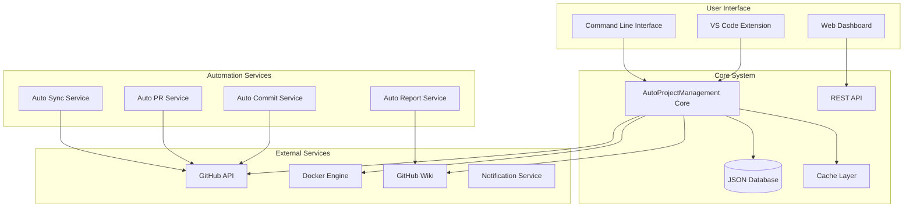
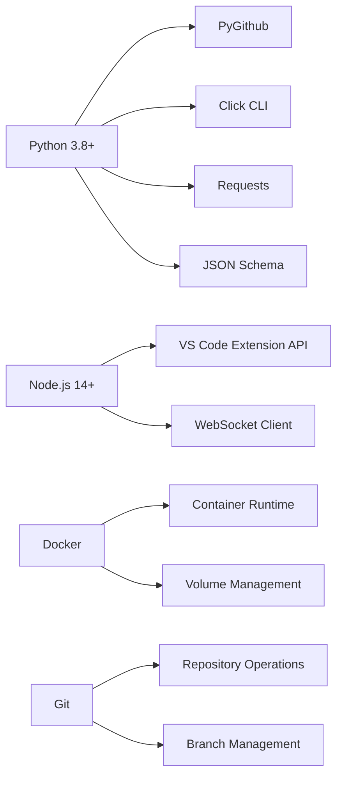
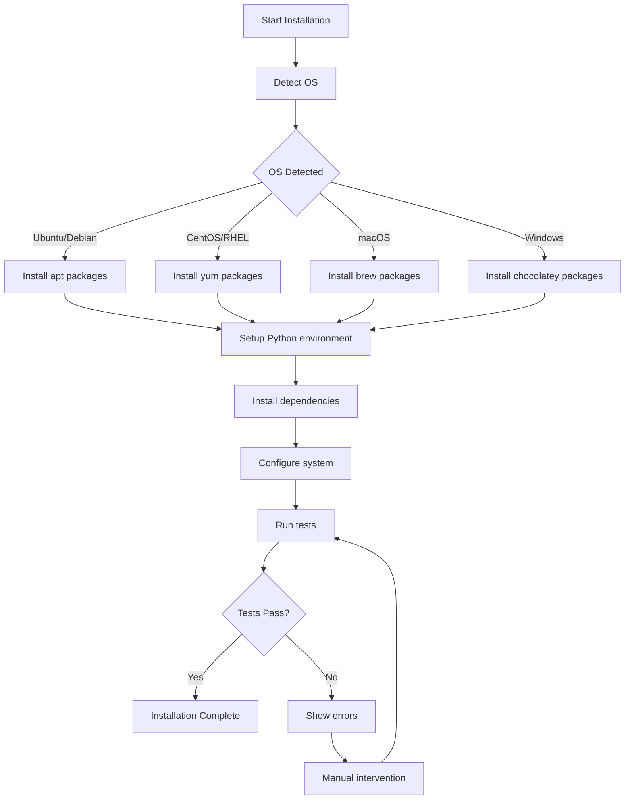

# AutoProjectManagement System - Comprehensive Installation Guide

## 📋 Table of Contents
1. [System Overview](#system-overview)
2. [Prerequisites & Requirements](#prerequisites--requirements)
3. [Installation Architecture](#installation-architecture)
4. [Pre-Installation Checklist](#pre-installation-checklist)
5. [Installation Methods](#installation-methods)
6. [Detailed Installation Steps](#detailed-installation-steps)
7. [Configuration & Setup](#configuration--setup)
8. [Verification & Testing](#verification--testing)
9. [Troubleshooting Guide](#troubleshooting-guide)
10. [Post-Installation Tasks](#post-installation-tasks)
11. [Security Configuration](#security-configuration)
12. [Performance Optimization](#performance-optimization)
13. [Backup & Recovery](#backup--recovery)
14. [Uninstallation](#uninstallation)

---

## 🎯 System Overview

The AutoProjectManagement system is a comprehensive project automation platform that integrates GitHub API, VS Code extensions, Docker containers, and automated workflows to streamline project management tasks.

### System Architecture


### Component Dependencies


---

## ✅ Prerequisites & Requirements

### Hardware Specifications

| Component | Minimum | Recommended | Enterprise |
|-----------|---------|-------------|------------|
| **CPU** | 2 cores @ 2.0GHz | 4 cores @ 2.5GHz | 8+ cores @ 3.0GHz |
| **RAM** | 4 GB | 8 GB | 16+ GB |
| **Storage** | 5 GB SSD | 10 GB SSD | 50+ GB SSD |
| **Network** | 10 Mbps | 100 Mbps | 1 Gbps |
| **GPU** | Not required | Optional for ML features | Recommended for AI features |

### Software Requirements Matrix

| Software | Minimum Version | Recommended Version | Installation Command |
|----------|-----------------|-------------------|---------------------|
| **Python** | 3.8.0 | 3.11.x | `sudo apt install python3.11` |
| **pip** | 21.0 | Latest | `python3 -m pip install --upgrade pip` |
| **Git** | 2.25.0 | 2.40.x | `sudo apt install git` |
| **Node.js** | 14.0.0 | 18.x LTS | `curl -fsSL https://deb.nodesource.com/setup_18.x` |
| **npm** | 6.0.0 | 9.x | Comes with Node.js |
| **Docker** | 20.10 | Latest | `sudo apt install docker.io` |
| **VS Code** | 1.60.0 | Latest | Download from code.visualstudio.com |

### Operating System Compatibility

| OS | Version | Support Status | Notes |
|----|---------|----------------|--------|
| **Ubuntu** | 20.04+ | ✅ Full Support | Primary development platform |
| **Debian** | 11+ | ✅ Full Support | Stable server deployment |
| **CentOS** | 8+ | ✅ Full Support | Enterprise environments |
| **RHEL** | 8+ | ✅ Full Support | Corporate deployments |
| **macOS** | 11+ | ✅ Full Support | Development workstations |
| **Windows** | 10/11 | ✅ Full Support | WSL2 recommended |
| **Fedora** | 35+ | ⚠️ Limited Support | Community maintained |

### Network Requirements

| Service | Protocol | Port | Security | Purpose |
|---------|----------|------|----------|---------|
| **GitHub API** | HTTPS | 443 | TLS 1.3 | Repository operations |
| **Docker Registry** | HTTPS | 443 | TLS 1.3 | Container images |
| **VS Code Extension** | HTTPS | 443 | TLS 1.3 | Extension marketplace |
| **Git Operations** | SSH/HTTPS | 22/443 | SSH keys/TLS | Code synchronization |

---

## 🏗️ Installation Architecture

### Directory Structure

```mermaid
graph TD
    A[AutoProjectManagement/] --> B[autoprojectmanagement/]
    A --> C[autoproject_management/]
    A --> D[tests/]
    A --> E[docs/]
    A --> F[docker/]
    A --> G[scripts/]
    A --> H[backups/]
    A --> I[JSonDataBase/]
    
    B --> B1[__init__.py]
    B --> B2[cli.py]
    B --> B3[api/]
    B --> B4[services/]
    B --> B5[templates/]
    
    C --> C1[services/]
    C --> C2[main_modules/]
    
    D --> D1[unit_tests/]
    D --> D2[integration_tests/]
    D --> D3[conftest.py]
    
    E --> E1[entire_project/]
    E --> E2[modules_docs/]
    E --> E3[UML/]
    
    F --> F1[api/]
    F --> F2[worker/]
    F --> F3[nginx/]
    
    G --> G1[setup_env.sh]
    G --> G2[one-command-deploy.sh]
    
    I --> I1[Inputs/]
    I --> I2[OutPuts/]
```


### Configuration Files Overview

| File | Purpose | Location | Required |
|------|---------|----------|----------|
| **config.json** | Main system configuration | `~/.autoprojectmanagement/` | ✅ |
| **project.json** | Project-specific settings | Project root | ✅ |
| **tasks.json** | Task definitions | `JSonDataBase/Inputs/` | ✅ |
| **progress.json** | Progress tracking | `JSonDataBase/OutPuts/` | ✅ |
| **reports.json** | Report configurations | `JSonDataBase/OutPuts/` | ✅ |
| **wiki_config.json** | Wiki synchronization | `~/.autoprojectmanagement/` | ❌ |
| **docker-compose.yml** | Container orchestration | Project root | ❌ |
| **requirements.txt** | Python dependencies | Project root | ✅ |

---

## 📋 Pre-Installation Checklist

### System Verification Script
```bash
#!/bin/bash
# Save as: pre_install_check.sh

echo "🔍 AutoProjectManagement Pre-Installation Check"
echo "=============================================="

# Check Python
python3 --version 2>/dev/null || { echo "❌ Python 3 not found"; exit 1; }
echo "✅ Python version: $(python3 --version)"

# Check pip
pip3 --version 2>/dev/null || { echo "❌ pip3 not found"; exit 1; }
echo "✅ pip version: $(pip3 --version)"

# Check Git
git --version 2>/dev/null || { echo "❌ Git not found"; exit 1; }
echo "✅ Git version: $(git --version)"

# Check Node.js
node --version 2>/dev/null || echo "⚠️ Node.js not found (optional)"
npm --version 2>/dev/null || echo "⚠️ npm not found (optional)"

# Check Docker
docker --version 2>/dev/null || echo "⚠️ Docker not found (optional)"

# Check VS Code
code --version 2>/dev/null || echo "⚠️ VS Code not found (optional)"

# Check disk space
available=$(df -BG . | awk 'NR==2{print $4}' | sed 's/G//')
if [ "$available" -lt 5 ]; then
    echo "❌ Insufficient disk space: ${available}GB available"
    exit 1
fi
echo "✅ Disk space: ${available}GB available"

# Check network connectivity
if ! curl -s https://api.github.com > /dev/null; then
    echo "❌ No internet connectivity to GitHub"
    exit 1
fi
echo "✅ Network connectivity verified"

echo ""
echo "🎉 All checks passed! Ready for installation."
```

### Permission Requirements

| Resource | Required Permissions | Verification Command |
|----------|---------------------|---------------------|
| **Project Directory** | Read/Write/Execute | `ls -la /path/to/project` |
| **Python Environment** | Package installation | `pip3 install --user` |
| **Git Repository** | Clone/Push/Pull | `git clone test-repo` |
| **GitHub API** | Repository access | Personal Access Token |
| **Docker** | Container management | `docker run hello-world` |
| **VS Code** | Extension installation | `code --install-extension` |

### Environment Variables Setup

```bash
# Create .env file
cat > .env << EOF
# GitHub Configuration
GITHUB_TOKEN=ghp_your_personal_access_token_here
GITHUB_OWNER=your-github-username
GITHUB_REPO=your-repository-name

# System Configuration
APM_LOG_LEVEL=INFO
APM_CACHE_ENABLED=true
APM_MAX_WORKERS=4
APM_BACKUP_RETENTION_DAYS=30

# Database Configuration
APM_DB_PATH=./JSonDataBase
APM_BACKUP_PATH=./backups

# Development Settings
APM_DEBUG=false
APM_TEST_MODE=false
EOF

# Load environment variables
source .env
```

---

## 🚀 Installation Methods

### Method 1: One-Command Automated Installation (Recommended)

```bash
# Download and run the automated installer
curl -fsSL https://raw.githubusercontent.com/autoprojectmanagement/AutoProjectManagement/main/scripts/one-command-deploy.sh | bash

# Or clone and run locally
git clone https://github.com/autoprojectmanagement/AutoProjectManagement.git
cd AutoProjectManagement
chmod +x scripts/one-command-deploy.sh
./scripts/one-command-deploy.sh
```

**Installation Process Flow:**


### Method 2: Manual Step-by-Step Installation

#### Step 1: System Preparation
```bash
# Update system packages
sudo apt update && sudo apt upgrade -y  # Ubuntu/Debian
sudo yum update -y                      # CentOS/RHEL
brew update && brew upgrade            # macOS

# Install system dependencies
sudo apt install -y python3 python3-pip python3-venv git curl wget
sudo apt install -y nodejs npm docker.io
```

#### Step 2: Repository Setup
```bash
# Clone repository
git clone https://github.com/autoprojectmanagement/AutoProjectManagement.git
cd AutoProjectManagement

# Verify repository integrity
git log --oneline -5
git status
```

#### Step 3: Python Environment Setup
```bash
# Create virtual environment
python3 -m venv venv

# Activate virtual environment
source venv/bin/activate  # Linux/macOS
# or
venv\Scripts\activate     # Windows

# Upgrade pip
pip install --upgrade pip setuptools wheel

# Install Python dependencies
pip install -r requirements.txt
pip install -r requirements-dev.txt  # Optional development tools
```

#### Step 4: Node.js Environment Setup
```bash
# Install Node.js dependencies (if frontend exists)
npm install

# Build frontend assets
npm run build

# Install VS Code extensions
npm run install-extensions
```

#### Step 5: Docker Setup
```bash
# Build Docker images
docker-compose build

# Start services
docker-compose up -d

# Verify services
docker-compose ps
```

### Method 3: Docker-Only Installation

#### Docker Compose Configuration
```yaml
# docker-compose.yml
version: '3.8'

services:
  autoprojectmanagement:
    build: .
    container_name: apm-app
    volumes:
      - ./JSonDataBase:/app/JSonDataBase
      - ./backups:/app/backups
      - ./logs:/app/logs
    environment:
      - GITHUB_TOKEN=${GITHUB_TOKEN}
      - GITHUB_OWNER=${GITHUB_OWNER}
      - GITHUB_REPO=${GITHUB_REPO}
    ports:
      - "8000:8000"
    restart: unless-stopped
    
  redis:
    image: redis:7-alpine
    container_name: apm-redis
    ports:
      - "6379:6379"
    restart: unless-stopped
    
  nginx:
    image: nginx:alpine
    container_name: apm-nginx
    ports:
      - "80:80"
      - "443:443"
    volumes:
      - ./docker/nginx/nginx.conf:/etc/nginx/nginx.conf
    depends_on:
      - autoprojectmanagement
    restart: unless-stopped
```

#### Docker Installation Commands
```bash
# Build and run with Docker Compose
docker-compose up -d --build

# View logs
docker-compose logs -f autoprojectmanagement

# Execute commands in container
docker-compose exec autoprojectmanagement python -m autoprojectmanagement.cli --help
```

---

## ⚙️ Configuration & Setup

### Initial Configuration Wizard
```bash
# Run interactive configuration wizard
python -m autoprojectmanagement.cli setup wizard

# Configuration steps:
# 1. GitHub authentication
# 2. Project settings
# 3. Notification preferences
# 4. Backup configuration
# 5. Performance tuning
```

### GitHub Configuration

#### Personal Access Token Setup
1. **Navigate to GitHub Settings**
   - Go to GitHub.com → Settings → Developer settings → Personal access tokens → Tokens (classic)

2. **Create New Token**
   - **Token name**: `AutoProjectManagement-System`
   - **Expiration**: 90 days (recommended)
   - **Select scopes**:
     ```
     ✅ repo (Full control of private repositories)
     ✅ workflow (Update GitHub Action workflows)
     ✅ user (Read user data)
     ✅ project (Full project control)
     ✅ gist (Create gists)
     ```

3. **Configure Token**
   ```bash
   # Set token in environment
   export GITHUB_TOKEN=ghp_your_token_here
   
   # Or configure via CLI
   python -m autoprojectmanagement.cli config set-github-token ghp_your_token_here
   ```

#### Repository Configuration
```bash
# Initialize repository connection
python -m autoprojectmanagement.cli github init \
  --owner your-username \
  --repo your-repository \
  --token $GITHUB_TOKEN

# Verify repository access
python -m autoprojectmanagement.cli github verify
```

### VS Code Extension Setup

#### Extension Installation
```bash
# Install via CLI
code --install-extension autoprojectmanagement.autoprojectmanagement

# Or install via marketplace
# 1. Open VS Code
# 2. Go to Extensions (Ctrl+Shift+X)
# 3. Search "AutoProjectManagement"
# 4. Click Install
```

#### Extension Configuration
```json
// .vscode/settings.json
{
  "autoprojectmanagement.enabled": true,
  "autoprojectmanagement.githubToken": "${env:GITHUB_TOKEN}",
  "autoprojectmanagement.autoCommit.enabled": true,
  "autoprojectmanagement.autoSync.enabled": true,
  "autoprojectmanagement.notifications.enabled": true,
  "autoprojectmanagement.statusBar.enabled": true
}
```

### Database Configuration

#### JSON Database Setup
```bash
# Initialize database structure
python -m autoprojectmanagement.cli db init

# Database structure:
# JSonDataBase/
# ├── Inputs/
# │   ├── SystemGeneratorInputs/
# │   │   ├── config.json
# │   │   └── templates.json
# │   └── UserInputs/
# │       ├── projects.json
# │       └── tasks.json
# └── OutPuts/
#     ├── progress.json
#     ├── reports.json
#     └── backups/
```

#### Backup Configuration
```bash
# Configure automatic backups
python -m autoprojectmanagement.cli backup configure \
  --frequency daily \
  --retention 30 \
  --location ./backups

# Manual backup
python -m autoprojectmanagement.cli backup create
```

---

## 🔍 Verification & Testing

### Installation Verification Suite

#### Automated Verification Script
```bash
#!/bin/bash
# Save as: verify_installation.sh

echo "🔍 Running Installation Verification..."
echo "======================================="

# Test 1: Python Environment
echo "1. Testing Python environment..."
python3 -c "import autoprojectmanagement; print('✅ Package imported successfully')"

# Test 2: CLI Functionality
echo "2. Testing CLI commands..."
python -m autoprojectmanagement.cli --help > /dev/null && echo "✅ CLI working"

# Test 3: GitHub Connectivity
echo "3. Testing GitHub API..."
python -c "from autoprojectmanagement.services.github_service import GitHubService; print('✅ GitHub service imported')"

# Test 4: Database Access
echo "4. Testing database access..."
python -c "from autoprojectmanagement.services.database_service import DatabaseService; print('✅ Database service imported')"

# Test 5: VS Code Extension
echo "5. Testing VS Code extension..."
code --list-extensions | grep -i autoprojectmanagement && echo "✅ Extension installed"

# Test 6: Docker (if applicable)
if command -v docker &> /dev/null; then
    echo "6. Testing Docker..."
    docker run --rm hello-world > /dev/null && echo "✅ Docker working"
fi

echo ""
echo "🎉 All verification tests completed!"
```

### Component Testing Matrix

| Component | Test Command | Expected Result | Troubleshooting |
|-----------|--------------|-----------------|-----------------|
| **Python Package** | `python -c "import autoprojectmanagement"` | No errors | Check PYTHONPATH |
| **CLI Interface** | `python -m autoprojectmanagement.cli --help` | Shows help | Check installation |
| **GitHub API** | `python -m autoprojectmanagement.cli github test` | "Connection OK" | Check token |
| **Database** | `python -m autoprojectmanagement.cli db test` | "Database OK" | Check file permissions |
| **VS Code** | `code --list-extensions` | Lists extension | Reinstall extension |
| **Docker** | `docker-compose ps` | Shows services | Check Docker daemon |

### Performance Benchmarks

#### System Performance Test
```bash
# Run performance benchmarks
python -m autoprojectmanagement.cli system benchmark

# Expected results:
# - GitHub API calls: < 1s per request
# - Database operations: < 100ms per query
# - File operations: < 50ms per operation
# - Memory usage: < 100MB baseline
```

---

## 🛠️ Troubleshooting Guide

### Common Issues & Solutions

#### Issue 1: Python Import Errors
```bash
# Error: ModuleNotFoundError: No module named 'autoprojectmanagement'
# Solution:
pip install -e .  # Install in development mode
# or
pip install -r requirements.txt
```

#### Issue 2: GitHub Authentication Failures
```bash
# Error: 401 Unauthorized
# Solutions:
# 1. Verify token
echo $GITHUB_TOKEN | cut -c1-10  # Should show ghp_

# 2. Check token permissions
python -m autoprojectmanagement.cli github verify-permissions

# 3. Regenerate token if needed
# Go to GitHub → Settings → Developer settings → Personal access tokens
```

#### Issue 3: Permission Denied Errors
```bash
# Error: PermissionError: [Errno 13] Permission denied
# Solutions:
sudo chown -R $USER:$USER /path/to/project
chmod -R 755 /path/to/project
```

#### Issue 4: Port Already in Use
```bash
# Error: Address already in use
# Solutions:
# Find process using port
lsof -i :8000
# Kill process
kill -9 <PID>
# Or use different port
export APM_PORT=8001
```

### Diagnostic Tools

#### System Health Check
```bash
# Comprehensive system health check
python -m autoprojectmanagement.cli system health

# Output includes:
# - Python version
# - Installed packages
# - GitHub connectivity
# - File system permissions
# - Memory usage
# - Network connectivity
```

#### Debug Mode
```bash
# Enable debug logging
export APM_DEBUG=true
export APM_LOG_LEVEL=DEBUG

# Run with verbose output
python -m autoprojectmanagement.cli --verbose system info
```

### Log Analysis

#### Log File Locations
| Component | Log File | Rotation | Retention |
|-----------|----------|----------|-----------|
| **Main Application** | `~/.autoprojectmanagement/logs/app.log` | Daily | 30 days |
| **GitHub API** | `~/.autoprojectmanagement/logs/github.log` | Daily | 30 days |
| **Database** | `~/.autoprojectmanagement/logs/database.log` | Daily | 30 days |
| **VS Code Extension** | `~/.autoprojectmanagement/logs/vscode.log` | Daily | 30 days |
| **Docker** | `~/.autoprojectmanagement/logs/docker.log` | Daily | 30 days |

#### Log Analysis Commands
```bash
# View recent logs
tail -f ~/.autoprojectmanagement/logs/app.log

# Search for errors
grep -i "error" ~/.autoprojectmanagement/logs/*.log

# Analyze performance
grep -i "duration" ~/.autoprojectmanagement/logs/*.log | sort -n -k 3
```

---

## 🎉 Post-Installation Tasks

### Initial Project Setup

#### Create First Project
```bash
# Initialize new project
python -m autoprojectmanagement.cli project create \
  --name "MyFirstProject" \
  --description "My first automated project" \
  --template "standard"

# Expected output:
# ✅ Project created: MyFirstProject
# ✅ GitHub repository initialized
# ✅ VS Code workspace configured
# ✅ Initial tasks created
```

#### Configure Automation Services
```bash
# Enable auto-commit
python -m autoprojectmanagement.cli auto-commit enable \
  --frequency "every 30 minutes" \
  --conditions "on_change" \
  --message-template "Auto-commit: {timestamp}"

# Enable auto-sync
python -m autoprojectmanagement.cli auto-sync enable \
  --frequency "daily" \
  --time "02:00" \
  --include-wiki true

# Enable auto-reports
python -m autoprojectmanagement.cli auto-report enable \
  --frequency "weekly" \
  --format "markdown" \
  --recipients "team@company.com"
```

### Team Onboarding

#### User Account Setup
```bash
# Add team member
python -m autoprojectmanagement.cli team add-user \
  --username "teammate" \
  --email "teammate@company.com" \
  --role "developer" \
  --permissions "read,write"

# Configure notifications
python -m autoprojectmanagement.cli notifications configure \
  --user "teammate" \
  --channels "email,slack" \
  --events "commit,pr,issue"
```

#### Workspace Setup
```bash
# Clone and setup workspace
python -m autoprojectmanagement.cli workspace setup \
  --project "MyFirstProject" \
  --user "teammate" \
  --ide "vscode" \
  --extensions "true"
```

---

## 🔐 Security Configuration

### Security Best Practices

#### Token Management
```bash
# Secure token storage
# 1. Use environment variables
export GITHUB_TOKEN=ghp_your_token_here

# 2. Use .env file (add to .gitignore)
echo ".env" >> .gitignore

# 3. Use system keychain
# macOS: security add-generic-password -s "APM-GitHub" -a "token" -w "ghp_..."
# Linux: secret-tool store --label="APM-GitHub" service APM-GitHub username token
```

#### File Permissions
```bash
# Set secure permissions
chmod 700 ~/.autoprojectmanagement/
chmod 600 ~/.autoprojectmanagement/config.json
chmod 644 ~/.autoprojectmanagement/logs/*.log
```

#### Network Security
```bash
# Configure firewall
sudo ufw allow 8000/tcp  # Application port
sudo ufw allow 22/tcp    # SSH
sudo ufw enable

# SSL/TLS Configuration
# Use reverse proxy (nginx) with SSL certificates
```

### Security Audit
```bash
# Run security audit
python -m autoprojectmanagement.cli security audit

# Checklist includes:
# - Token exposure
# - File permissions
# - Network security
# - Dependency vulnerabilities
# - Log security
```

---

## ⚡ Performance Optimization

### System Tuning

#### Python Performance
```bash
# Optimize Python environment
pip install --upgrade pip setuptools wheel
pip install ujson  # Faster JSON processing
pip install aiohttp  # Async HTTP requests

# Configure Python optimizations
export PYTHONOPTIMIZE=1
export PYTHONDONTWRITEBYTECODE=1
```

#### Database Optimization
```bash
# Enable caching
export APM_CACHE_ENABLED=true
export APM_CACHE_TTL=3600

# Optimize JSON operations
export APM_COMPRESSION_ENABLED=true
export APM_COMPRESSION_LEVEL=6
```

#### Network Optimization
```bash
# Configure connection pooling
export APM_MAX_CONNECTIONS=20
export APM_CONNECTION_TIMEOUT=30

# Enable HTTP/2
export APM_HTTP2_ENABLED=true
```

### Monitoring & Metrics

#### Performance Monitoring
```bash
# Enable metrics collection
python -m autoprojectmanagement.cli metrics enable

# View performance dashboard
python -m autoprojectmanagement.cli metrics dashboard

# Export metrics
python -m autoprojectmanagement.cli metrics export --format json
```

#### Resource Usage
| Metric | Warning | Critical | Monitoring Command |
|--------|---------|----------|-------------------|
| **Memory Usage** | > 500MB | > 1GB | `htop` |
| **CPU Usage** | > 70% | > 90% | `top` |
| **Disk Usage** | > 80% | > 90% | `df -h` |
| **Network Latency** | > 100ms | > 500ms | `ping github.com` |

---

## 💾 Backup & Recovery

### Backup Strategy

#### Automated Backup Configuration
```bash
# Configure backup schedule
python -m autoprojectmanagement.cli backup schedule \
  --frequency "daily" \
  --time "03:00" \
  --retention "30 days" \
  --compression "gzip" \
  --encryption "AES256"

# Backup locations
# Local: ./backups/
# Remote: GitHub releases
# Cloud: AWS S3 (optional)
```

#### Manual Backup
```bash
# Create full backup
python -m autoprojectmanagement.cli backup create \
  --type full \
  --include-logs \
  --include-cache \
  --compress

# Create incremental backup
python -m autoprojectmanagement.cli backup create \
  --type incremental \
  --since "2024-01-01"
```

### Recovery Procedures

#### Full System Recovery
```bash
# Restore from backup
python -m autoprojectmanagement.cli backup restore \
  --backup-id "2024-01-15-full" \
  --target-path ./recovery \
  --verify-checksums

# Recovery verification
python -m autoprojectmanagement.cli system verify
```

#### Partial Recovery
```bash
# Restore specific component
python -m autoprojectmanagement.cli backup restore \
  --component database \
  --date "2024-01-15" \
  --dry-run

# Restore configuration
python -m autoprojectmanagement.cli backup restore \
  --component config \
  --latest
```

---

## 🗑️ Uninstallation

### Complete Removal

#### Automated Uninstallation
```bash
# Run uninstall script
./scripts/uninstall.sh

# Script performs:
# 1. Stop all services
# 2. Remove Docker containers
# 3. Delete virtual environment
# 4. Remove configuration files
# 5. Clean up logs
# 6. Remove VS Code extension
```

#### Manual Uninstallation
```bash
# 1. Stop services
docker-compose down
pkill -f autoprojectmanagement

# 2. Remove virtual environment
deactivate 2>/dev/null || true
rm -rf venv/

# 3. Remove configuration
rm -rf ~/.autoprojectmanagement/

# 4. Remove logs
rm -rf ~/.autoprojectmanagement/logs/

# 5. Remove VS Code extension
code --uninstall-extension autoprojectmanagement.autoprojectmanagement

# 6. Remove project files
cd ..
rm -rf AutoProjectManagement/

# 7. Clean environment
unset GITHUB_TOKEN
unset APM_*
```

### Data Preservation

#### Export Data Before Removal
```bash
# Export all data
python -m autoprojectmanagement.cli export all \
  --format json \
  --output ./final-export.json

# Export specific projects
python -m autoprojectmanagement.cli export projects \
  --projects "MyFirstProject,MySecondProject" \
  --format csv

# Create final backup
python -m autoprojectmanagement.cli backup create \
  --type final \
  --include-all
```

---

## 📞 Support & Resources

### Getting Help

| Resource | Link | Response Time |
|----------|------|---------------|
| **GitHub Issues** | https://github.com/autoprojectmanagement/AutoProjectManagement/issues | 24-48 hours |
| **Documentation** | https://github.com/autoprojectmanagement/AutoProjectManagement/wiki | Instant |
| **Discord Community** | https://discord.gg/autoprojectmanagement | Real-time |
| **Stack Overflow** | Tag: autoprojectmanagement | 2-4 hours |
| **Email Support** | support@autoprojectmanagement.com | 1-2 business days |

### Additional Resources

#### Video Tutorials
- **Installation Guide**: [YouTube Playlist](https://youtube.com/playlist?list=installation)
- **Advanced Configuration**: [YouTube Playlist](https://youtube.com/playlist?list=advanced)
- **Team Onboarding**: [YouTube Playlist](https://youtube.com/playlist?list=team)

#### Example Projects
- **Starter Template**: https://github.com/autoprojectmanagement/starter-template
- **Advanced Configuration**: https://github.com/autoprojectmanagement/advanced-config
- **Team Setup**: https://github.com/autoprojectmanagement/team-setup

### Version Information

| Component | Current Version | Release Date | Support Status |
|-----------|-----------------|--------------|----------------|
| **Core System** | 1.0.0 | 2024-01-01 | ✅ Active |
| **VS Code Extension** | 1.0.0 | 2024-01-01 | ✅ Active |
| **Docker Images** | 1.0.0 | 2024-01-01 | ✅ Active |
| **Python Package** | 1.0.0 | 2024-01-01 | ✅ Active |

---

**🎉 Congratulations!** You have successfully installed and configured the AutoProjectManagement system. 

For next steps:
1. Review the [Quick Start Guide](Quick_Start_Guide.md)
2. Explore [Advanced Configuration](Configuration_Guide/Advanced_Configuration.md)
3. Join our [Discord community](https://discord.gg/autoprojectmanagement)
4. Check out [example projects](https://github.com/autoprojectmanagement/examples)

**Happy automating!** 🚀
