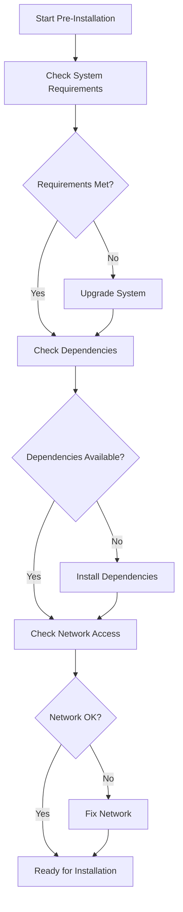
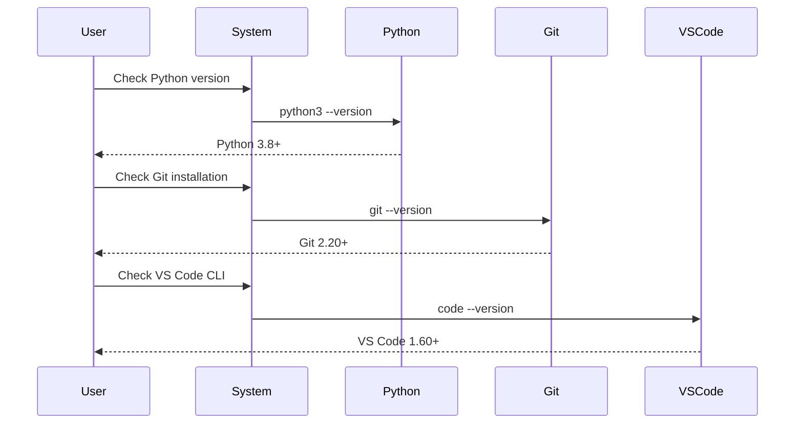
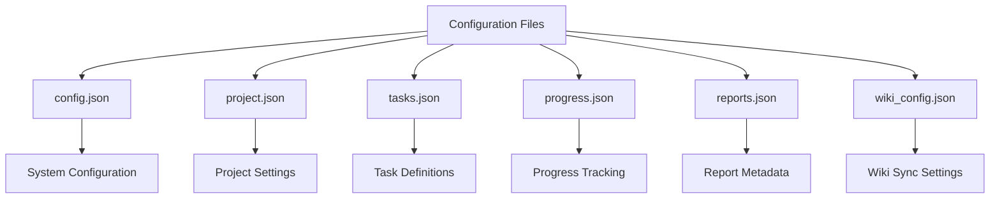
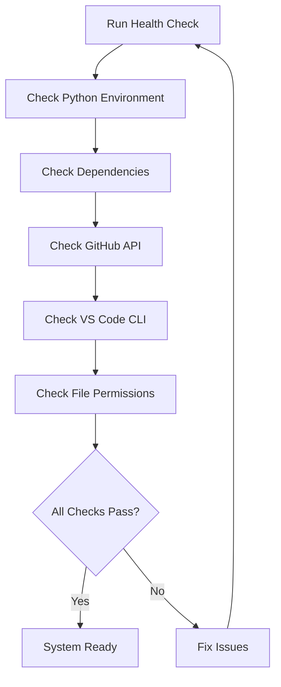

# AutoProjectManagement System - Installation Guide

## 📋 Table of Contents
1. [System Requirements](#system-requirements)
2. [Pre-Installation Checklist](#pre-installation-checklist)
3. [Installation Methods](#installation-methods)
4. [Step-by-Step Installation](#step-by-step-installation)
5. [Configuration Setup](#configuration-setup)
6. [Verification & Testing](#verification--testing)
7. [Troubleshooting](#troubleshooting)
8. [Post-Installation Tasks](#post-installation-tasks)
9. [Uninstallation](#uninstallation)

---

## 🎯 System Requirements

### Hardware Requirements
| Component | Minimum | Recommended |
|-----------|---------|-------------|
| **CPU** | 2 cores | 4+ cores |
| **RAM** | 4 GB | 8+ GB |
| **Storage** | 2 GB free space | 5+ GB free space |
| **Network** | Stable internet connection | High-speed broadband |

### Software Requirements
| Component | Version | Notes |
|-----------|---------|--------|
| **Python** | 3.8+ | Required for core functionality |
| **Git** | 2.20+ | Required for repository operations |
| **Node.js** | 14.x+ | Required for frontend components |
| **npm** | 6.x+ | Required for package management |
| **VS Code** | 1.60+ | Recommended IDE |

### Operating System Support
| OS | Version | Support Level |
|----|---------|---------------|
| **Ubuntu** | 18.04+ | ✅ Full Support |
| **Debian** | 10+ | ✅ Full Support |
| **CentOS** | 8+ | ✅ Full Support |
| **macOS** | 10.15+ | ✅ Full Support |
| **Windows** | 10+ | ✅ Full Support |
| **RHEL** | 8+ | ✅ Full Support |

---

## ✅ Pre-Installation Checklist

### Environment Preparation


### Required Permissions
| Permission | Description | Command |
|------------|-------------|---------|
| **File System** | Read/Write project directory | `chmod 755 /project/path` |
| **GitHub API** | Repository access | Personal Access Token |
| **Python** | Package installation | `pip install` permissions |
| **VS Code** | Extension installation | VS Code CLI access |

---

## 🚀 Installation Methods

### Method 1: Automated Installation (Recommended)
```bash
# Clone repository
git clone https://github.com/autoprojectmanagement/AutoProjectManagement.git
cd AutoProjectManagement

# Run automated setup
chmod +x setup_env.sh
./setup_env.sh
```

### Method 2: Manual Installation
```bash
# Step 1: Create virtual environment
python3 -m venv venv
source venv/bin/activate  # Windows: venv\Scripts\activate

# Step 2: Install Python dependencies
pip install --upgrade pip
pip install -r requirements.txt
pip install -r requirements-dev.txt  # Optional development tools

# Step 3: Install Node.js dependencies (if frontend exists)
npm install

# Step 4: Build frontend assets
npm run build
```

### Method 3: Docker Installation
```bash
# Build Docker image
docker build -t autoprojectmanagement:latest .

# Run container
docker run -it --name apm-container \
  -v $(pwd):/app \
  -p 8000:8000 \
  autoprojectmanagement:latest
```

---

## 📖 Step-by-Step Installation

### Phase 1: Environment Setup


### Phase 2: Repository Setup
```bash
# 1. Clone the repository
git clone https://github.com/autoprojectmanagement/AutoProjectManagement.git
cd AutoProjectManagement

# 2. Verify repository structure
ls -la
```

### Phase 3: Python Environment
```bash
# Create virtual environment
python3 -m venv venv

# Activate virtual environment
# Linux/macOS:
source venv/bin/activate
# Windows:
venv\Scripts\activate

# Verify activation
which python  # Should show venv path
```

### Phase 4: Dependencies Installation
```bash
# Install core dependencies
pip install -r requirements.txt

# Install development dependencies (optional)
pip install -r requirements-dev.txt

# Verify installation
pip list | grep -E "(requests|PyGithub|click)"
```

### Phase 5: Configuration Files


---

## ⚙️ Configuration Setup

### GitHub Configuration
```bash
# Create GitHub Personal Access Token
# 1. Go to GitHub Settings > Developer settings > Personal access tokens
# 2. Generate new token with these scopes:
#    - repo (full control)
#    - workflow (update GitHub Action workflows)
#    - user (read user data)

# Configure system
python -m autoprojectmanagement.cli config \
  --github-token YOUR_TOKEN_HERE \
  --repo-owner your-username \
  --repo-name your-repo
```

### VS Code Extension Setup
```bash
# Install required VS Code extensions
python -m autoprojectmanagement.cli vscode install-extensions

# Extensions include:
# - Python extension
# - GitHub Pull Requests
# - GitLens
# - Markdown All in One
```

### Environment Variables
| Variable | Description | Example |
|----------|-------------|---------|
| `GITHUB_TOKEN` | GitHub API access token | `ghp_xxxxxxxxxxxxxxxxxxxx` |
| `PROJECT_NAME` | Default project name | `MyAwesomeProject` |
| `LOG_LEVEL` | Logging level | `INFO`, `DEBUG`, `ERROR` |
| `WIKI_REPO` | GitHub wiki repository URL | `https://github.com/user/repo.wiki.git` |

---

## 🔍 Verification & Testing

### Installation Verification
```bash
# Check Python version
python3 --version

# Check package installation
python -c "import autoprojectmanagement; print('✓ Package installed')"

# Check CLI functionality
python -m autoprojectmanagement.cli --help

# Check GitHub connectivity
python -m autoprojectmanagement.cli github test-connection
```

### System Health Check


### Test Suite Execution
```bash
# Run unit tests
python -m pytest tests/code_tests/01_UnitTests/

# Run integration tests
python -m pytest tests/code_tests/02_IntegrationTests/

# Run full test suite
python -m pytest tests/ --verbose
```

---

## 🛠️ Troubleshooting

### Common Issues and Solutions

#### Issue 1: Python Version Mismatch
```bash
# Error: Python 3.8+ required
# Solution:
python3 --version  # Check version
# If < 3.8, install newer version
```

#### Issue 2: Permission Denied
```bash
# Error: Permission denied
# Solution:
sudo chmod -R 755 /path/to/project
# Or use virtual environment
```

#### Issue 3: GitHub API Rate Limit
```bash
# Error: API rate limit exceeded
# Solution:
# 1. Use authenticated requests
# 2. Add GITHUB_TOKEN environment variable
# 3. Wait for rate limit reset
```

### Diagnostic Commands
```bash
# Check system information
python -m autoprojectmanagement.cli system info

# Check configuration
python -m autoprojectmanagement.cli config show

# Check GitHub connectivity
python -m autoprojectmanagement.cli github test-connection

# Generate diagnostic report
python -m autoprojectmanagement.cli system diagnose
```

### Log Files Location
| Component | Log Location |
|-----------|--------------|
| **Main Application** | `~/.autoprojectmanagement/logs/app.log` |
| **GitHub Integration** | `~/.autoprojectmanagement/logs/github.log` |
| **Wiki Sync** | `~/.autoprojectmanagement/logs/wiki.log` |
| **VS Code Extension** | `~/.vscode/extensions/autoprojectmanagement/logs/` |

---

## 🎉 Post-Installation Tasks

### Initial Project Setup
```bash
# 1. Create your first project
python -m autoprojectmanagement.cli init --name "MyFirstProject"

# 2. Configure GitHub repository
python -m autoprojectmanagement.cli github setup --repo your-username/your-repo

# 3. Add initial tasks
python -m autoprojectmanagement.cli task add --title "Setup project structure" --priority high

# 4. Start progress tracking
python -m autoprojectmanagement.cli progress start
```

### Wiki Documentation Setup
```bash
# 1. Initialize wiki
python -m autoprojectmanagement.cli wiki init --repo-owner your-username --repo-name your-repo

# 2. Sync documentation
python -m autoprojectmanagement.cli wiki sync --repo-owner your-username --repo-name your-repo

# 3. Verify wiki access
python -m autoprojectmanagement.cli wiki verify --repo-owner your-username --repo-name your-repo
```

### Performance Optimization
```bash
# 1. Optimize Python environment
python -m pip install --upgrade pip setuptools wheel

# 2. Enable caching
export APM_CACHE_ENABLED=true

# 3. Configure parallel processing
export APM_MAX_WORKERS=4
```

---

## 🗑️ Uninstallation

### Complete Removal
```bash
# 1. Deactivate virtual environment
deactivate

# 2. Remove virtual environment
rm -rf venv/

# 3. Remove project files
rm -rf AutoProjectManagement/

# 4. Remove configuration
rm -rf ~/.autoprojectmanagement/

# 5. Remove logs
rm -rf ~/.autoprojectmanagement/logs/

# 6. Remove VS Code extensions
code --uninstall-extension autoprojectmanagement.autoprojectmanagement
```

### Docker Cleanup
```bash
# Remove Docker containers
docker rm -f apm-container

# Remove Docker images
docker rmi autoprojectmanagement:latest

# Remove Docker volumes
docker volume prune
```

### GitHub Cleanup
```bash
# Remove GitHub webhooks (if configured)
# Go to repository settings > Webhooks > Delete webhook

# Remove GitHub secrets (if configured)
# Go to repository settings > Secrets > Delete secrets
```

---

## 📞 Support & Resources

### Getting Help
| Resource | Link |
|----------|------|
| **GitHub Issues** | https://github.com/autoprojectmanagement/AutoProjectManagement/issues |
| **Documentation** | https://github.com/autoprojectmanagement/AutoProjectManagement/wiki |
| **Discussions** | https://github.com/autoprojectmanagement/AutoProjectManagement/discussions |
| **Email Support** | support@autoprojectmanagement.com |

### Community Resources
- **Discord**: Join our community Discord server
- **Stack Overflow**: Tag questions with `autoprojectmanagement`
- **Reddit**: r/AutoProjectManagement

### Version Information
- **Current Version**: 1.0.0
- **Release Date**: 2024-01-01
- **Python Compatibility**: 3.8+
- **License**: MIT

---

## 🔄 Update Process

### Checking for Updates
```bash
# Check current version
python -m autoprojectmanagement.cli system version

# Check for updates
python -m autoprojectmanagement.cli system check-updates
```

### Updating the System
```bash
# Update via git
git pull origin main

# Update dependencies
pip install -r requirements.txt --upgrade

# Update configuration
python -m autoprojectmanagement.cli config update
```

---

**Congratulations!** You have successfully installed the AutoProjectManagement system. For additional configuration options and advanced features, please refer to our [Advanced Configuration Guide](Advanced_Configuration.md) and [User Manual](User_Manual.md).
