# سیستم AutoProjectManagement - راهنمای جامع نصب

## 📋 فهرست مطالب
۱. [بررسی کلی سیستم](#بررسی-کلی-سیستم)
۲. [پیش‌نیازها و الزامات](#پیش‌نیازها-و-الزامات)
۳. [معماری نصب](#معماری-نصب)
۴. [چک‌لیست پیش از نصب](#چک‌لیست-پیش-از-نصب)
۵. [روش‌های نصب](#روش‌های-نصب)
۶. [مراحل دقیق نصب](#مراحل-دقیق-نصب)
۷. [پیکربندی و راه‌اندازی](#پیکربندی-و-راه‌اندازی)
۸. [تأیید و تست](#تأیید-و-تست)
۹. [راهنمای عیب‌یابی](#راهنمای-عیب‌یابی)
۱۰. [وظایف پس از نصب](#وظایف-پس-از-نصب)
۱۱. [پیکربندی امنیتی](#پیکربندی-امنیتی)
۱۲. [بهینه‌سازی عملکرد](#بهینه‌سازی-عملکرد)
۱۳. [پشتیبان‌گیری و بازیابی](#پشتیبان‌گیری-و-بازیابی)
۱۴. [حذف نصب](#حذف-نصب)

---

## 🎯 بررسی کلی سیستم

سیستم AutoProjectManagement یک پلتفرم جامع اتوماسیون پروژه است که API GitHub، افزونه‌های VS Code، کانتینرهای Docker و گردش کارهای خودکار را برای ساده‌سازی وظایف مدیریت پروژه یکپارچه می‌کند.

### معماری سیستم

```mermaid
graph TB
    subgraph "رابط کاربری"
        VS[افزونه VS Code]
        CLI[رابط خط فرمان]
        WEB[داشبورد وب]
    end
    
    subgraph "سیستم هسته"
        CORE[هسته AutoProjectManagement]
        API[REST API]
        DB[(پایگاه داده JSON)]
        CACHE[لایه کش]
    end
    
    subgraph "سرویس‌های خارجی"
        GH[API GitHub]
        DOCKER[موتور Docker]
        WIKI[ویکی GitHub]
        NOTIF[سرویس اطلاع‌رسانی]
    end
    
    subgraph "سرویس‌های اتوماسیون"
        AUTO_COMMIT[سرویس کامیت خودکار]
        AUTO_PR[سرویس PR خودکار]
        AUTO_SYNC[سرویس همگام‌سازی خودکار]
        AUTO_REPORT[سرویس گزارش‌دهی خودکار]
    end
    
    VS --> CORE
    CLI --> CORE
    WEB --> API
    
    CORE --> DB
    CORE --> CACHE
    CORE --> GH
    CORE --> DOCKER
    CORE --> WIKI
    
    AUTO_COMMIT --> GH
    AUTO_PR --> GH
    AUTO_SYNC --> GH
    AUTO_REPORT --> WIKI
```


---

## ✅ پیش‌نیازها و الزامات

### مشخصات سخت‌افزاری

| مولفه | حداقل | توصیه شده | سازمانی |
|-----------|---------|-------------|------------|
| **پردازنده** | ۲ هسته @ ۲.۰GHz | ۴ هسته @ ۲.۵GHz | ۸+ هسته @ ۳.۰GHz |
| **رم** | ۴ GB | ۸ GB | ۱۶+ GB |
| **ذخیره‌سازی** | ۵ GB SSD | ۱۰ GB SSD | ۵۰+ GB SSD |
| **شبکه** | ۱۰ Mbps | ۱۰۰ Mbps | ۱ Gbps |
| **GPU** | مورد نیاز نیست | اختیاری برای ویژگی‌های ML | توصیه شده برای ویژگی‌های AI |

### ماتریس الزامات نرم‌افزاری

| نرم‌افزار | حداقل نسخه | نسخه توصیه شده | دستور نصب |
|-----------|-----------------|-------------------|---------------------|
| **Python** | ۳.۸.۰ | ۳.۱۱.x | `sudo apt install python3.11` |
| **pip** | ۲۱.۰ | آخرین نسخه | `python3 -m pip install --upgrade pip` |
| **Git** | ۲.۲۵.۰ | ۲.۴۰.x | `sudo apt install git` |
| **Node.js** | ۱۴.۰.۰ | ۱۸.x LTS | `curl -fsSL https://deb.nodesource.com/setup_18.x` |
| **npm** | ۶.۰.۰ | ۹.x | همراه با Node.js |
| **VS Code** | ۱.۶۰.۰ | آخرین نسخه | دانلود از code.visualstudio.com |

### سازگاری سیستم‌عامل

| سیستم‌عامل | نسخه | وضعیت پشتیبانی | توضیحات |
|----|---------|----------------|--------|
| **Ubuntu** | ۲۰.۰۴+ | ✅ پشتیبانی کامل | پلتفرم توسعه اصلی |
| **Debian** | ۱۱+ | ✅ پشتیبانی کامل | استقرار سرور پایدار |
| **CentOS** | ۸+ | ✅ پشتیبانی کامل | محیط‌های سازمانی |
| **RHEL** | ۸+ | ✅ پشتیبانی کامل | استقرارهای شرکتی |
| **macOS** | ۱۱+ | ✅ پشتیبانی کامل | ایستگاه‌های کاری توسعه |
| **Windows** | ۱۰/۱۱ | ✅ پشتیبانی کامل | WSL2 توصیه می‌شود |
| **Fedora** | ۳۵+ | ⚠️ پشتیبانی محدود | نگهداری شده توسط جامعه |

---

## 🏗️ معماری نصب

### ساختار دایرکتوری


---

## 📋 چک‌لیست پیش از نصب

### اسکریپت تأیید سیستم
```bash
#!/bin/bash
# ذخیره به عنوان: pre_install_check.sh

echo "🔍 بررسی پیش از نصب AutoProjectManagement"
echo "======================================="

# بررسی Python
python3 --version 2>/dev/null || { echo "❌ Python 3 یافت نشد"; exit 1; }
echo "✅ نسخه Python: $(python3 --version)"

# بررسی pip
pip3 --version 2>/dev/null || { echo "❌ pip3 یافت نشد"; exit 1; }
echo "✅ نسخه pip: $(pip3 --version)"

# بررسی Git
git --version 2>/dev/null || { echo "❌ Git یافت نشد"; exit 1; }
echo "✅ نسخه Git: $(git --version)"

# بررسی Node.js
node --version 2>/dev/null || echo "⚠️ Node.js یافت نشد (اختیاری)"
npm --version 2>/dev/null || echo "⚠️ npm یافت نشد (اختیاری)"

# بررسی Docker
docker --version 2>/dev/null || echo "⚠️ Docker یافت نشد (اختیاری)"

# بررسی VS Code
code --version 2>/dev/null || echo "⚠️ VS Code یافت نشد (اختیاری)"

# بررسی فضای دیسک
available=$(df -BG . | awk 'NR==2{print $4}' | sed 's/G//')
if [ "$available" -lt 5 ]; then
    echo "❌ فضای دیسک کافی نیست: ${available}GB در دسترس"
    exit 1
fi
echo "✅ فضای دیسک: ${available}GB در دسترس"

# بررسی اتصال شبکه
if ! curl -s https://api.github.com > /dev/null; then
    echo "❌ اتصال به GitHub برقرار نیست"
    exit 1
fi
echo "✅ اتصال شبکه تأیید شد"

echo ""
echo "🎉 تمام بررسی‌ها با موفقیت انجام شد! آماده برای نصب."
```

---

## 🚀 روش‌های نصب

### روش ۱: نصب خودکار یک‌خطی (توصیه شده)

```bash
# دانلود و اجرای نصب‌کننده خودکار
curl -fsSL https://raw.githubusercontent.com/autoprojectmanagement/AutoProjectManagement/main/scripts/one-command-deploy.sh | bash

# یا کلون و اجرا به صورت محلی
git clone https://github.com/autoprojectmanagement/AutoProjectManagement.git
cd AutoProjectManagement
chmod +x scripts/one-command-deploy.sh
./scripts/one-command-deploy.sh
```

### روش ۲: نصب دستی گام به گام

#### گام ۱: آماده‌سازی سیستم
```bash
# به‌روزرسانی بسته‌های سیستم
sudo apt update && sudo apt upgrade -y  # Ubuntu/Debian
sudo yum update -y                      # CentOS/RHEL
brew update && brew upgrade            # macOS

# نصب وابستگی‌های سیستم
sudo apt install -y python3 python3-pip python3-venv git curl wget
sudo apt install -y nodejs npm docker.io
```

#### گام ۲: راه‌اندازی مخزن
```bash
# کلون مخزن
git clone https://github.com/autoprojectmanagement/AutoProjectManagement.git
cd AutoProjectManagement

# تأیید یکپارچگی مخزن
git log --oneline -5
git status
```

#### گام ۳: راه‌اندازی محیط Python
```bash
# ایجاد محیط مجازی
python3 -m venv venv

# فعال‌سازی محیط مجازی
source venv/bin/activate  # Linux/macOS
# یا
venv\Scripts\activate     # Windows

# ارتقاء pip
pip install --upgrade pip setuptools wheel

# نصب وابستگی‌های Python
pip install -r requirements.txt
pip install -r requirements-dev.txt  # ابزارهای توسعه اختیاری
```

---

## ⚙️ پیکربندی و راه‌اندازی

### جادوی پیکربندی اولیه
```bash
# اجرای جادوی پیکربندی تعاملی
python -m autoprojectmanagement.cli setup wizard

# مراحل پیکربندی:
# ۱. احراز هویت GitHub
# ۲. تنظیمات پروژه
# ۳. ترجیحات اطلاع‌رسانی
# ۴. پیکربندی پشتیبان‌گیری
# ۵. تنظیم عملکرد
```

---

## 🔍 تأیید و تست

### مجموعه تأیید نصب

#### اسکریپت تأیید خودکار
```bash
#!/bin/bash
# ذخیره به عنوان: verify_installation.sh

echo "🔍 اجرای تأیید نصب..."
echo "======================================="

# تست ۱: محیط Python
echo "۱. تست محیط Python..."
python3 -c "import autoprojectmanagement; print('✅ بسته با موفقیت وارد شد')"

# تست ۲: عملکرد CLI
echo "۲. تست دستورات CLI..."
python -m autoprojectmanagement.cli --help > /dev/null && echo "✅ CLI کار می‌کند"

# تست ۳: اتصال GitHub
echo "۳. تست اتصال API GitHub..."
python -c "from autoprojectmanagement.services.github_service import GitHubService; print('✅ سرویس GitHub وارد شد')"

# تست ۴: دسترسی به پایگاه داده
echo "۴. تست دسترسی به پایگاه داده..."
python -c "from autoprojectmanagement.services.database_service import DatabaseService; print('✅ سرویس پایگاه داده وارد شد')"

echo ""
echo "🎉 تمام تست‌های تأیید تکمیل شد!"
```

---

## 🛠️ راهنمای عیب‌یابی

### مشکلات رایج و راه‌حل‌ها

#### مشکل ۱: خطاهای وارد کردن Python
```bash
# خطا: ModuleNotFoundError: No module named 'autoprojectmanagement'
# راه‌حل:
pip install -e .  # نصب در حالت توسعه
# یا
pip install -r requirements.txt
```

#### مشکل ۲: خطاهای احراز هویت GitHub
```bash
# خطا: 401 Unauthorized
# راه‌حل‌ها:
# ۱. تأیید توکن
echo $GITHUB_TOKEN | cut -c1-10  # باید ghp_... را نشان دهد

# ۲. بررسی مجوزهای توکن
python -m autoprojectmanagement.cli github verify-permissions
```

---

## 🎉 تبریک!

شما با موفقیت سیستم AutoProjectManagement را نصب و پیکربندی کرده‌اید.

برای مراحل بعدی:
۱. بررسی [راهنمای شروع سریع](Quick_Start_Guide.md)
۲. کاوش در [پیکربندی پیشرفته](Configuration_Guide/Advanced_Configuration.md)
۳. پیوستن به [جامعه دیسکورد](https://discord.gg/autoprojectmanagement)
۴. بررسی [پروژه‌های نمونه](https://github.com/autoprojectmanagement/examples)

**اتوماسیون خوش!** 🚀
