# AutoProjectManagement - Comprehensive Quick Start Guide

## 🚀 Quick Start Guide

Welcome to **AutoProjectManagement** - your comprehensive automated project management solution. This guide provides detailed, step-by-step instructions to get you up and running with complete system understanding through comprehensive diagrams, tables, and practical examples.

---

## 📋 Table of Contents
1. [System Overview](#system-overview)
2. [Prerequisites](#prerequisites)
3. [Installation Methods](#installation-methods)
4. [First Project Setup](#first-project-setup)
5. [Configuration Deep Dive](#configuration-deep-dive)
6. [Core Architecture](#core-architecture)
7. [Module Specifications](#module-specifications)
8. [API Integration](#api-integration)
9. [Docker Deployment](#docker-deployment)
10. [Common Workflows](#common-workflows)
11. [Monitoring & Reporting](#monitoring--reporting)
12. [Troubleshooting](#troubleshooting)
13. [Performance Optimization](#performance-optimization)
14. [Next Steps](#next-steps)

---

## 🏗️ System Overview

### Complete System Architecture


### System Statistics & Capabilities

| Category | Metric | Value | Description |
|----------|--------|-------|-------------|
| **Core System** | Total Modules | 9 Core + 15 Sub-modules | Comprehensive coverage |
| **Codebase** | Lines of Code | ~15,000+ | Well-structured codebase |
| **Quality** | Test Coverage | 85%+ | High reliability |
| **Compatibility** | Python Version | 3.8+ | Broad compatibility |
| **Integration** | API Endpoints | 25+ | Extensive API surface |
| **Configuration** | Options | 50+ | Highly customizable |
| **Performance** | Response Time | < 2s | Fast operations |
| **Scalability** | Max Projects | 1000 | Enterprise-ready |

### Key Value Propositions

- **100% Automated Project Management**: Zero-touch project oversight with continuous monitoring
- **Real-time Risk Assessment**: Proactive issue identification and automated mitigation
- **Intelligent Resource Allocation**: ML-powered optimal task distribution and scheduling
- **Continuous Progress Tracking**: Live project health monitoring with real-time updates
- **GitHub-Native Integration**: Deep integration with GitHub Actions and APIs
- **Automatic Documentation**: Auto-sync to GitHub Wiki and comprehensive reporting
- **JSON-Driven Configuration**: All settings via structured JSON files
- **Multi-Interface Access**: CLI, API, and Web interface support

---

## 🔧 Prerequisites

### System Requirements Matrix

| Component | Minimum | Recommended | Enterprise |
|-----------|---------|-------------|------------|
| **Python Version** | 3.8+ | 3.9+ | 3.11+ |
| **Git Version** | 2.20+ | 2.30+ | 2.40+ |
| **Operating System** | Linux/Mac/Windows | Linux/Mac | Linux |
| **RAM** | 4GB | 8GB+ | 16GB+ |
| **Storage** | 1GB free | 5GB+ free | 20GB+ free |
| **CPU Cores** | 2 | 4 | 8+ |
| **Network** | Basic | Stable | High-speed |

### Required Tools & Dependencies

#### Core Dependencies
```bash
# Check Python version compatibility
python --version  # Should be 3.8+
python -c "import sys; print(f'Python {sys.version}')"

# Check Git installation and version
git --version     # Should be 2.20+
git config --global user.name "Your Name"
git config --global user.email "your.email@example.com"

# Essential system tools
pip --version
curl --version
docker --version  # Optional for container deployment
```

#### Python Package Dependencies
```bash
# Core required packages
pip install requests>=2.25.0        # HTTP client for API integration
pip install PyGithub>=1.55          # GitHub API integration
pip install click>=8.0.0            # CLI framework
pip install python-dateutil>=2.8.0  # Date/time utilities
pip install pytz>=2021.1            # Timezone support
pip install typing-extensions>=4.0.0 # Type hints support

# Optional development packages
pip install pytest>=6.0             # Testing framework
pip install black>=22.0             # Code formatting
pip install flake8>=4.0             # Linting
```

### Environment Setup Verification

```bash
# Create verification script
cat > check_environment.py << 'EOF'
#!/usr/bin/env python3
import sys
import subprocess
import importlib.util

def check_python_version():
    version = sys.version_info
    return version.major == 3 and version.minor >= 8

def check_git():
    try:
        result = subprocess.run(['git', '--version'], capture_output=True, text=True)
        return 'git version' in result.stdout
    except:
        return False

def check_package(package_name):
    return importlib.util.find_spec(package_name) is not None

print("Environment Check Results:")
print(f"Python 3.8+: {'✅' if check_python_version() else '❌'}")
print(f"Git installed: {'✅' if check_git() else '❌'}")
print(f"Requests package: {'✅' if check_package('requests') else '❌'}")
print(f"Click package: {'✅' if check_package('click') else '❌'}")
EOF

python check_environment.py
```

---

## 📦 Installation Methods

### Installation Comparison Matrix

| Method | Complexity | Setup Time | Best For | Limitations |
|--------|------------|------------|----------|-------------|
| **PyPI** | ⭐ | 2 minutes | Quick start, individual use | Limited customization |
| **Source** | ⭐⭐ | 5 minutes | Developers, customization | Manual dependency management |
| **Docker** | ⭐⭐⭐ | 3 minutes | Production, teams | Container management required |
| **Cloud** | ⭐⭐⭐⭐ | 10 minutes | Enterprise, scalability | Cloud provider dependency |

### Option 1: PyPI Installation (Recommended for Beginners)

```bash
# Install from PyPI (Python Package Index)
pip install autoprojectmanagement

# Verify installation and version
autoproject --version
autoproject --help

# Check available commands
autoproject --help-commands

# Test basic functionality
autoproject system-info
```

### Option 2: From Source (Recommended for Developers)

```bash
# Clone the repository
git clone https://github.com/autoprojectmanagement/autoprojectmanagement.git
cd autoprojectmanagement

# Create virtual environment (recommended)
python -m venv venv
source venv/bin/activate  # On Windows: venv\Scripts\activate

# Install development dependencies
pip install -r requirements.txt
pip install -r requirements-dev.txt  # For development tools

# Install in development mode (editable)
pip install -e .

# Verify installation
python -m autoprojectmanagement.cli --version
```

### Option 3: Docker Installation (Recommended for Production)

```bash
# Method 3A: Using Docker Compose (Full stack)
docker-compose up -d

# Method 3B: Single container
docker build -t autoprojectmanagement .
docker run -v $(pwd):/workspace autoprojectmanagement

# Method 3C: Using pre-built image
docker pull autoprojectmanagement/autoprojectmanagement:latest
docker run -p 8000:8000 -v $(pwd):/app autoprojectmanagement

# Verify Docker deployment
docker ps
docker logs <container_id>
curl http://localhost:8000/health
```

### Option 4: Cloud Deployment

```bash
# AWS ECS deployment example
aws ecr create-repository --repository-name autoprojectmanagement
docker tag autoprojectmanagement:latest 123456789012.dkr.ecr.region.amazonaws.com/autoprojectmanagement:latest
aws ecr get-login-password --region region | docker login --username AWS --password-stdin 123456789012.dkr.ecr.region.amazonaws.com
docker push 123456789012.dkr.ecr.region.amazonaws.com/autoprojectmanagement:latest

# Create ECS task definition and service
```

### Installation Verification Script

```bash
#!/bin/bash
# installation_verification.sh

echo "🔍 Verifying AutoProjectManagement Installation"

# Check Python installation
if ! command -v python &> /dev/null; then
    echo "❌ Python not found"
    exit 1
fi

# Check package installation
if ! python -c "import autoprojectmanagement" 2>/dev/null; then
    echo "❌ AutoProjectManagement package not installed"
    exit 1
fi

# Check CLI availability
if ! command -v autoproject &> /dev/null; then
    echo "❌ CLI command not available"
    exit 1
fi

# Test basic functionality
if autoproject --version; then
    echo "✅ Installation successful!"
    echo "Version: $(autoproject --version)"
else
    echo "❌ Installation failed"
    exit 1
fi
```

---

## 🎯 First Project Setup

### Project Initialization Workflow


### Step 1: Initialize Your Project

```bash
# Create new project directory
mkdir my-first-project && cd my-first-project

# Initialize git repository (if not already)
git init
git config user.name "Your Name"
git config user.email "your.email@example.com"

# Initialize AutoProjectManagement
autoproject init --name "My First Project" --description "Learning AutoProjectManagement"

# Alternative: Initialize with specific template
autoproject init --name "WebApp" --template "python-web" --verbose
```

### Step 2: Project Structure Analysis

After initialization, your project will have this comprehensive structure:


### Step 3: Comprehensive Configuration Setup

Create your first project configuration with detailed settings:

```json
// .auto_project/config/auto_config.json
{
  "system": {
    "version": "1.0.0",
    "environment": "development",
    "debug_mode": false,
    "log_level": "INFO",
    "max_file_size": 10485760,
    "backup_retention_days": 30
  },
  "project": {
    "id": "proj_001",
    "name": "My First Auto-Managed Project",
    "description": "Comprehensive project to learn AutoProjectManagement features",
    "version": "1.0.0",
    "team_size": 3,
    "start_date": "2024-08-14",
    "target_date": "2024-09-14",
    "status": "active",
    "priority": "high",
    "team_members": [
      {
        "id": "user_001",
        "name": "John Developer",
        "email": "john@example.com",
        "role": "lead_developer",
        "skills": ["python", "javascript", "devops"]
      },
      {
        "id": "user_002",
        "name": "Jane Designer",
        "email": "jane@example.com",
        "role": "ui_designer",
        "skills": ["ui/ux", "figma", "css"]
      }
    ],
    "milestones": [
      {
        "id": "milestone_1",
        "name": "Project Setup Complete",
        "description": "Initial project configuration and environment setup",
        "target_date": "2024-08-16",
        "status": "pending",
        "deliverables": ["environment setup", "initial config", "team onboarding"]
      },
      {
        "id": "milestone_2",
        "name": "Core Features Implementation",
        "description": "Development of main project features",
        "target_date": "2024-08-30",
        "status": "pending",
        "deliverables": ["feature A", "feature B", "integration testing"]
      }
    ]
  },
  "automation": {
    "auto_commit": {
      "enabled": true,
      "threshold": 5,
      "min_interval": 300,
      "max_interval": 3600,
      "exclude_patterns": ["*.log", "*.tmp", "*.cache", "node_modules/", ".git/"],
      "commit_message_template": "Auto commit: {changes_count} changes | {timestamp}"
    },
    "monitoring": {
      "enabled": true,
      "check_interval": 300,
      "file_extensions": [".py", ".js", ".java", ".html", ".css", ".md", ".json"],
      "max_depth": 5,
      "real_time": false
    },
    "reporting": {
      "enabled": true,
      "frequency": "daily",
      "format": "markdown",
      "recipients": ["team@company.com", "manager@company.com"],
      "include_metrics": true,
      "include_risks": true,
      "include_recommendations": true
    },
    "backup": {
      "enabled": true,
      "frequency": "daily",
      "retention_days": 7,
      "compression": true,
      "encryption": false
    }
  },
  "modules": {
    "enabled": ["all"],
    "communication_risk": {
      "enabled": true,
      "risk_threshold": 7,
      "check_interval": 3600,
      "notification_channels": ["slack", "email", "in_app"],
      "escalation_rules": {
        "high_risk": "notify_immediately",
        "medium_risk": "daily_digest",
        "low_risk": "weekly_summary"
      }
    },
    "quality_management": {
      "enabled": true,
      "code_quality_threshold": 80,
      "test_coverage_minimum": 70,
      "linting_enabled": true,
      "security_scanning": true,
      "performance_metrics": true
    },
    "resource_management": {
      "enabled": true,
      "allocation_algorithm": "balanced",
      "overload_threshold": 80,
      "underutilization_threshold": 20,
      "skill_matching": true
    },
    "planning_estimation": {
      "enabled": true,
      "ml_enabled": true,
      "historical_data_days": 90,
      "confidence_threshold": 0.7,
      "adjustment_factor": 1.2
    }
  },
  "integrations": {
    "github": {
      "enabled": false,
      "token": "your_github_token_here",
      "repo_owner": "your_username",
      "repo_name": "your_repository",
      "auto_sync": true,
      "webhook_enabled": false
    },
    "slack": {
      "enabled": false,
      "webhook_url": "your_slack_webhook_here",
      "channel": "#project-updates",
      "notify_on": ["risk", "completion", "blockers"]
    },
    "email": {
      "enabled": true,
      "smtp_server": "smtp.gmail.com",
      "smtp_port": 587,
      "username": "your_email@gmail.com",
      "password": "your_app_password",
      "from_address": "noreply@company.com"
    }
  },
  "notifications": {
    "levels": ["error", "warning", "info", "success"],
    "channels": ["console", "email", "slack"],
    "schedule": {
      "immediate": ["error", "critical_risk"],
      "daily": ["warning", "progress"],
      "weekly": ["info", "summary"]
    }
  }
}
```

### Step 4: Environment Configuration

```bash
# Set up environment variables
export AUTO_PROJECT_PATH="/path/to/your/project"
export AUTO_LOG_LEVEL="DEBUG"
export AUTO_GITHUB_TOKEN="your_github_token"
export AUTO_SLACK_WEBHOOK="your_slack_webhook"

# Or create environment file
cat > .auto_project/config/environment.env << 'EOF'
AUTO_PROJECT_PATH=/path/to/your/project
AUTO_LOG_LEVEL=INFO
AUTO_CHECK_INTERVAL=300
AUTO_COMMIT_THRESHOLD=5
AUTO_BACKUP_ENABLED=true
EOF

# Load environment
export $(cat .auto_project/config/environment.env | xargs)
```

---

## ⚙️ Configuration Deep Dive

### Configuration Architecture Overview


### Configuration Priority Hierarchy

| Level | Source | Priority | Scope | Examples |
|-------|--------|----------|-------|----------|
| **1** | CLI Arguments | Highest | Session | `--check-interval 600` |
| **2** | Environment Variables | High | Process | `AUTO_CHECK_INTERVAL=600` |
| **3** | Config File Overrides | Medium | Project | `"check_interval": 600` |
| **4** | Default Values | Low | System | `DEFAULT_CHECK_INTERVAL=300` |

### Key Configuration Sections Explained

#### 1. Project Configuration Schema
```json
{
  "project": {
    "id": "string:unique_identifier",
    "name": "string:project_name",
    "description": "string:detailed_description",
    "version": "string:semantic_version",
    "team_size": "integer:number_of_members",
    "start_date": "string:iso_date",
    "target_date": "string:iso_date",
    "status": "enum:active|paused|completed|archived",
    "priority": "enum:low|medium|high|critical",
    "team_members": [
      {
        "id": "string:unique_id",
        "name": "string:full_name",
        "email": "string:email_address",
        "role": "string:role_name",
        "skills": ["array:of_skills"],
        "capacity": "integer:hours_per_week",
        "timezone": "string:timezone"
      }
    ],
    "milestones": [
      {
        "id": "string:milestone_id",
        "name": "string:milestone_name",
        "description": "string:detailed_description",
        "target_date": "string:iso_date",
        "status": "enum:planned|in_progress|completed|delayed",
        "deliverables": ["array:deliverable_items"],
        "dependencies": ["array:milestone_ids"],
        "progress": "integer:0-100"
      }
    ],
    "budget": {
      "total": "number:total_budget",
      "currency": "string:currency_code",
      "allocated": "number:allocated_amount",
      "spent": "number:amount_spent",
      "forecast": "number:forecasted_total"
    }
  }
}
```

#### 2. Automation Settings Deep Dive
```json
{
  "automation": {
    "auto_commit": {
      "enabled": "boolean:true/false",
      "threshold": "integer:min_changes",
      "min_interval": "integer:seconds",
      "max_interval": "integer:seconds",
      "exclude_patterns": ["array:glob_patterns"],
      "commit_message_template": "string:template_with_variables",
      "push_strategy": "enum:immediate|scheduled|manual",
      "branch_protection": "boolean:true/false"
    },
    "monitoring": {
      "enabled": "boolean:true/false",
      "check_interval": "integer:seconds",
      "file_extensions": ["array:file_extensions"],
      "max_depth": "integer:directory_depth",
      "real_time": "boolean:true/false",
      "ignore_hidden": "boolean:true/false",
      "scan_strategy": "enum:full|incremental|smart"
    },
    "reporting": {
      "enabled": "boolean:true/false",
      "frequency": "enum:daily|weekly|monthly|custom",
      "format": "enum:markdown|html|pdf|json",
      "recipients": ["array:email_addresses"],
      "include_metrics": "boolean:true/false",
      "include_risks": "boolean:true/false",
      "include_recommendations": "boolean:true/false",
      "delivery_method": "enum:email|slack|webhook|file"
    },
    "backup": {
      "enabled": "boolean:true/false",
      "frequency": "enum:hourly|daily|weekly",
      "retention_days": "integer:days_to_keep",
      "compression": "boolean:true/false",
      "encryption": "boolean:true/false",
      "verification": "boolean:true/false",
      "storage_location": "string:path_or_url"
    }
  }
}
```

#### 3. Module Configuration Details
```json
{
  "modules": {
    "communication_risk": {
      "enabled": "boolean:true/false",
      "risk_threshold": "integer:1-10",
      "check_interval": "integer:seconds",
      "notification_channels": ["array:channel_names"],
      "escalation_rules": {
        "high_risk": "string:escalation_policy",
        "medium_risk": "string:escalation_policy",
        "low_risk": "string:escalation_policy"
      },
      "metrics": {
        "response_time": "boolean:true/false",
        "collaboration_score": "boolean:true/false",
        "knowledge_distribution": "boolean:true/false"
      }
    },
    "quality_management": {
      "enabled": "boolean:true/false",
      "code_quality_threshold": "integer:0-100",
      "test_coverage_minimum": "integer:0-100",
      "linting_enabled": "boolean:true/false",
      "security_scanning": "boolean:true/false",
      "performance_metrics": "boolean:true/false",
      "quality_gates": [
        {
          "metric": "string:metric_name",
          "threshold": "number:threshold_value",
          "action": "string:action_to_take"
        }
      ]
    },
    "resource_management": {
      "enabled": "boolean:true/false",
      "allocation_algorithm": "enum:balanced|priority_based|skill_based",
      "overload_threshold": "integer:0-100",
      "underutilization_threshold": "integer:0-100",
      "skill_matching": "boolean:true/false",
      "availability_tracking": "boolean:true/false",
      "capacity_planning": "boolean:true/false"
    }
  }
}
```

### Configuration Management Commands

```bash
# Interactive configuration wizard
autoproject config --interactive

# Set specific configuration values
autoproject config set --key project.name --value "New Project Name"
autoproject config set --key automation.auto_commit.threshold --value 10
autoproject config set --key modules.communication_risk.enabled --value true

# View current configuration
autoproject config show
autoproject config show --section automation
autoproject config show --key project.team_members

# Validate configuration
autoproject config --validate

# Reset to defaults
autoproject config --reset

# Export configuration
autoproject config --export > config_backup.json

# Import configuration
autoproject config --import config_backup.json

# Environment-specific configuration
autoproject config --environment development
autoproject config --environment production
```

---

## 🏗️ Core Architecture

### Complete System Architecture Diagram


### Data Flow Architecture


### Component Interaction Details

#### 1. AutoRunner Engine Architecture


#### 2. Project Management System Components
| Component | Responsibility | Key Methods | Dependencies |
|-----------|----------------|-------------|--------------|
| **ProjectManager** | Project lifecycle | create, update, delete, list | Storage, Validation |
| **TaskManager** | Task operations | add, remove, update, assign | ProjectManager, Scheduling |
| **ResourceAllocator** | Resource management | allocate, optimize, balance | TaskManager, SkillsDB |
| **ProgressTracker** | Progress monitoring | calculate, update, forecast | TaskManager, Analytics |
| **RiskAssessor** | Risk management | identify, evaluate, mitigate | Analytics, Notification |
| **ReportGenerator** | Reporting | create, format, distribute | DataAggregator, Templates |

#### 3. Data Storage Architecture


---

## 🧩 Module Specifications

### Module Architecture Overview

```mermaid
graph TB
    subgraph "Module Ecosystem"
        A[ProjectManagementSystem] --> B[Module Manager]
        B --> C[Module Loader]
        B --> D[Module Router]
        B --> E[Module Monitor]
        
        C --> F[Core Modules]
        C --> G[Custom Modules]
        C --> H[Third-party Modules]
        
        D --> I[Request Dispatcher]
        I --> J[Module Executor]
        J --> K[Result Aggregator]
        
        E --> L[Health Monitor]
        E --> M[Performance Tracker]
        E --> N[Error Handler]
    end
    
    subgraph "Core Module Suite"
        F --> O[Communication Risk]
        F --> P[Data Processing]
        F --> Q[Planning & Estimation]
        F --> R[Progress Reporting]
        F --> S[Quality Management]
        F --> T[Resource Management]
        F --> U[Task Workflow]
        F --> V[Utility Modules]
        
        O --> W[Git Integration]
        P --> X[Analytics Engine]
        Q --> Y[ML Algorithms]
        R --> Z[Report Generator]
        S --> AA[Auto Commit]
        T --> BB[Optimizer]
        U --> CC[Workflow Engine]
        V --> DD[Helper Utilities]
        
        %% Add dashboard components
        Z --> EE[Dashboard Engine]
        EE --> FF[Real-time Dashboard]
        EE --> GG[Visual Reports]
        EE --> HH[Alerts & Notifications]
    end
    
    subgraph "External Integrations"
        W --> II[GitHub API]
        AA --> JJ[Git Repository]
        Z --> KK[Markdown/PDF Reports]
        FF --> LL[Web Browser]
        FF --> MM[Mobile App]
    end
    
    subgraph "Dashboard Presentation"
        FF --> NN[📊 Project Health]
        FF --> OO[📈 Task Progress]
        FF --> PP[⚠️ Risk Assessment]
        FF --> QQ[👥 Team Performance]
        FF --> RR[🔧 Quality Metrics]
    end
```



### Module Interaction Details

#### 1. Communication Risk Module
- **Purpose**: Monitor team collaboration patterns and identify communication bottlenecks
- **Key Features**: Response time tracking, collaboration scoring, risk identification
- **Integration**: GitHub API, Slack/Email notifications

#### 2. Data Processing Module
- **Purpose**: Collect, process, and analyze project data in real-time
- **Key Features**: JSON data parsing, analytics computation, trend analysis
- **Integration**: File system monitoring, database connections

#### 3. Planning & Estimation Module
- **Purpose**: Provide intelligent task estimation and project planning
- **Key Features**: ML-based estimation, historical data analysis, confidence scoring
- **Integration**: Task management systems, calendar integration

#### 4. Progress Reporting Module
- **Purpose**: Generate comprehensive progress reports and visualizations
- **Key Features**: Automated reporting, customizable templates, multi-format export
- **Integration**: Dashboard engine, email/Slack delivery

#### 5. Quality Management Module
- **Purpose**: Monitor and maintain code quality standards
- **Key Features**: Code quality scoring, test coverage tracking, security scanning
- **Integration**: Auto commit service, quality gates

#### 6. Resource Management Module
- **Purpose**: Optimize team resource allocation and workload balancing
- **Key Features**: Skill matching, capacity planning, overload prevention
- **Integration**: Task assignment, calendar systems

#### 7. Task Workflow Module
- **Purpose**: Manage task lifecycle and workflow automation
- **Key Features**: Task creation/assignment, status tracking, dependency management
- **Integration**: Project management tools, notification systems

#### 8. Utility Modules
- **Purpose**: Provide supporting functionality and helper services
- **Key Features**: Logging, configuration management, error handling
- **Integration**: All other modules

---

## 🔌 API Integration

### REST API Architecture

```mermaid
graph TB
    subgraph "API Gateway Layer"
        A[HTTP Server] --> B[Request Router]
        B --> C[Authentication Middleware]
        B --> D[Rate Limiter]
        B --> E[Request Validator]
    end
    
    subgraph "Business Logic Layer"
        C --> F[Project Controller]
        D --> G[Task Controller]
        E --> H[Report Controller]
        E --> I[🆕 Dashboard Controller]
        
        F --> J[Project Service]
        G --> K[Task Service]
        H --> L[Report Service]
        I --> M[🆕 Dashboard Service]
    end
    
    subgraph "Data Access Layer"
        J --> N[Project Repository]
        K --> O[Task Repository]
        L --> P[Report Repository]
        M --> Q[🆕 Dashboard Repository]
        
        N --> R[JSON Database]
        O --> R
        P --> R
        Q --> R
    end
    
    subgraph "External Integration Layer"
        R --> S[File System Storage]
        M --> T[Real-time Data Stream]
        T --> U[WebSocket Connections]
        U --> V[Browser Clients]
        U --> W[Mobile Apps]
    end
```



### Core API Endpoints

#### Project Management APIs
```bash
# Get all projects
GET /api/v1/projects
# Response: List of all managed projects with basic info

# Get specific project
GET /api/v1/projects/{project_id}
# Response: Detailed project information including configuration

# Create new project
POST /api/v1/projects
# Body: Project configuration JSON
# Response: Created project with assigned ID

# Update project
PUT /api/v1/projects/{project_id}
# Body: Updated project configuration
# Response: Updated project

# Delete project
DELETE /api/v1/projects/{project_id}
# Response: Success confirmation
```

#### Task Management APIs
```bash
# Get project tasks
GET /api/v1/projects/{project_id}/tasks
# Response: List of tasks with current status

# Create new task
POST /api/v1/projects/{project_id}/tasks
# Body: Task definition JSON
# Response: Created task with ID

# Update task status
PATCH /api/v1/tasks/{task_id}
# Body: Status update JSON
# Response: Updated task

# Bulk task operations
POST /api/v1/projects/{project_id}/tasks/bulk
# Body: Array of task operations
# Response: Bulk operation results
```

#### Reporting APIs
```bash
# Generate report
POST /api/v1/reports/generate
# Body: Report configuration
# Response: Report data or file download

# Get report history
GET /api/v1/reports/history
# Query: period, type, format
# Response: List of available reports

# Schedule report
POST /api/v1/reports/schedule
# Body: Schedule configuration
# Response: Schedule confirmation
```

#### 🆕 Dashboard APIs
```bash
# Get dashboard overview
GET /api/v1/dashboard/overview
# Response: Comprehensive project overview with key metrics

# Get real-time metrics
GET /api/v1/dashboard/metrics
# Response: Current project metrics and performance indicators

# Get active alerts
GET /api/v1/dashboard/alerts
# Response: List of active alerts and warnings

# Get project health
GET /api/v1/dashboard/health
# Response: Project health score and component status

# Get team performance
GET /api/v1/dashboard/team-performance
# Response: Team performance metrics and individual contributions

# Real-time data stream
GET /api/v1/dashboard/stream
# Response: Server-sent events stream of real-time updates

# Customize dashboard layout
POST /api/v1/dashboard/layout
# Body: Layout configuration JSON
# Response: Layout confirmation

# Get dashboard configuration
GET /api/v1/dashboard/config
# Response: Current dashboard configuration

# Update dashboard settings
PUT /api/v1/dashboard/config
# Body: Updated configuration JSON
# Response: Update confirmation
```

### API Authentication & Security

#### Authentication Methods
```json
{
  "authentication": {
    "methods": ["api_key", "jwt", "oauth2"],
    "api_key": {
      "header": "X-API-Key",
      "env_var": "AUTO_API_KEY",
      "rotation_days": 90
    },
    "jwt": {
      "issuer": "autoprojectmanagement",
      "audience": "api-clients",
      "expiration_hours": 24
    },
    "rate_limiting": {
      "requests_per_minute": 100,
      "burst_capacity": 50,
      "ip_whitelist": ["192.168.1.0/24"]
    }
  }
}
```

#### API Response Format
```json
{
  "success": true,
  "data": {
    // Endpoint-specific data
  },
  "metadata": {
    "timestamp": "2024-08-14T10:30:00Z",
    "version": "1.0.0",
    "request_id": "req_123456789"
  },
  "pagination": {
    "total": 100,
    "page": 1,
    "per_page": 20,
    "total_pages": 5
  }
}
```

### WebSocket API for Real-time Updates

```javascript
// Connect to WebSocket
const ws = new WebSocket('ws://localhost:8000/ws/dashboard');

// Handle incoming messages
ws.onmessage = (event) => {
  const data = JSON.parse(event.data);
  console.log('Real-time update:', data);
  
  // Update UI based on message type
  switch(data.type) {
    case 'metrics_update':
      updateMetrics(data.payload);
      break;
    case 'alert_triggered':
      showAlert(data.payload);
      break;
    case 'progress_update':
      updateProgress(data.payload);
      break;
  }
};

// Subscribe to specific events
ws.send(JSON.stringify({
  action: 'subscribe',
  channels: ['metrics', 'alerts', 'progress']
}));
```

### API Usage Examples

#### Example 1: Project Setup via API
```bash
#!/bin/bash

# Create new project
PROJECT_ID=$(curl -X POST http://localhost:8000/api/v1/projects \
  -H "Content-Type: application/json" \
  -H "X-API-Key: $API_KEY" \
  -d '{
    "name": "Web Application",
    "description": "Full-stack web application development",
    "team_size": 5,
    "start_date": "2024-08-15",
    "target_date": "2024-12-15"
  }' | jq -r '.data.id')

echo "Created project with ID: $PROJECT_ID"

# Configure project settings
curl -X PUT http://localhost:8000/api/v1/projects/$PROJECT_ID \
  -H "Content-Type: application/json" \
  -H "X-API-Key: $API_KEY" \
  -d '{
    "automation": {
      "auto_commit": true,
      "commit_threshold": 5,
      "check_interval": 300
    },
    "reporting": {
      "frequency": "daily",
      "recipients": ["team@company.com"]
    }
  }'
```

#### Example 2: Dashboard Integration
```javascript
// Frontend dashboard integration
class ProjectDashboard {
  constructor(apiBaseUrl, apiKey) {
    this.apiBaseUrl = apiBaseUrl;
    this.apiKey = apiKey;
    this.metrics = {};
    this.alerts = [];
  }
  
  async initialize() {
    // Load initial data
    await this.loadOverview();
    await this.loadMetrics();
    await this.loadAlerts();
    
    // Connect to real-time stream
    this.connectWebSocket();
  }
  
  async loadOverview() {
    const response = await fetch(`${this.apiBaseUrl}/dashboard/overview`, {
      headers: { 'X-API-Key': this.apiKey }
    });
    this.overview = await response.json();
    this.renderOverview();
  }
  
  async loadMetrics() {
    const response = await fetch(`${this.apiBaseUrl}/dashboard/metrics`, {
      headers: { 'X-API-Key': this.apiKey }
    });
    this.metrics = await response.json();
    this.renderMetrics();
  }
  
  connectWebSocket() {
    this.ws = new WebSocket(`ws://${this.apiBaseUrl}/ws/dashboard`);
    this.ws.onmessage = this.handleWebSocketMessage.bind(this);
  }
  
  handleWebSocketMessage(event) {
    const data = JSON.parse(event.data);
    this.updateRealTime(data);
  }
}
```

#### Example 3: Automated Reporting
```python
import requests
import json
from datetime import datetime, timedelta

class AutoReporter:
    def __init__(self, api_url, api_key):
        self.api_url = api_url
        self.api_key = api_key
        self.headers = {'X-API-Key': api_key, 'Content-Type': 'application/json'}
    
    def generate_daily_report(self, project_id):
        """Generate and send daily report"""
        report_data = {
            'project_id': project_id,
            'report_type': 'daily',
            'format': 'markdown',
            'include_metrics': True,
            'include_risks': True,
            'recipients': ['pm@company.com', 'team@company.com']
        }
        
        response = requests.post(
            f'{self.api_url}/reports/generate',
            headers=self.headers,
            json=report_data
        )
        
        return response.json()
    
    def get_dashboard_snapshot(self, project_id):
        """Get current dashboard state for archiving"""
        response = requests.get(
            f'{self.api_url}/dashboard/overview?project_id={project_id}',
            headers=self.headers
        )
        
        snapshot = {
            'timestamp': datetime.now().isoformat(),
            'data': response.json(),
            'project_id': project_id
        }
        
        # Save to database or file system
        self.save_snapshot(snapshot)
        return snapshot
```

### API Error Handling

#### Standard Error Responses
```json
{
  "success": false,
  "error": {
    "code": "validation_error",
    "message": "Invalid project configuration",
    "details": {
      "field": "team_size",
      "issue": "Must be a positive integer"
    }
  },
  "metadata": {
    "timestamp": "2024-08-14T10:30:00Z",
    "request_id": "req_123456789"
  }
}
```

#### Common Error Codes
| Code | Description | HTTP Status | Resolution |
|------|-------------|-------------|------------|
| `validation_error` | Invalid input data | 400 | Check request body |
| `authentication_error` | Invalid API key or token | 401 | Verify credentials |
| `authorization_error` | Insufficient permissions | 403 | Check user roles |
| `not_found` | Resource doesn't exist | 404 | Verify resource ID |
| `rate_limit_exceeded` | Too many requests | 429 | Wait and retry |
| `internal_error` | Server-side issue | 500 | Contact support |

---

## 🐳 Docker Deployment

### Docker Architecture Overview


### Deployment Options

#### Option 1: Single Container Deployment
```dockerfile
# Dockerfile for single container deployment
FROM python:3.11-slim

# Install system dependencies
RUN apt-get update && apt-get install -y \
    git \
    curl \
    && rm -rf /var/lib/apt/lists/*

# Create application directory
WORKDIR /app

# Copy requirements and install dependencies
COPY requirements.txt .
RUN pip install --no-cache-dir -r requirements.txt

# Copy application code
COPY . .

# Create non-root user
RUN useradd --create-home --shell /bin/bash appuser
USER appuser

# Expose ports
EXPOSE 8000  # API port
EXPOSE 3000  # 🆕 Dashboard port

# Health check
HEALTHCHECK --interval=30s --timeout=30s --start-period=5s --retries=3 \
    CMD curl -f http://localhost:8000/health || exit 1

# Start application
CMD ["python", "-m", "autoprojectmanagement.api"]
```

#### Option 2: Multi-container Docker Compose
```yaml
# docker-compose.yml
version: '3.8'

services:
  # Main application service
  app:
    build: .
    ports:
      - "8000:8000"  # API
      - "3000:3000"  # 🆕 Dashboard
    environment:
      - DATABASE_URL=postgresql://db:5432/autoproject
      - REDIS_URL=redis://cache:6379
      - DASHBOARD_ENABLED=true
      - DASHBOARD_PORT=3000
    volumes:
      - ./data:/app/data
      - ./config:/app/config
    depends_on:
      - db
      - cache
    restart: unless-stopped
    healthcheck:
      test: ["CMD", "curl", "-f", "http://localhost:8000/health"]
      interval: 30s
      timeout: 10s
      retries: 3

  # Database service
  db:
    image: postgres:15
    environment:
      - POSTGRES_DB=autoproject
      - POSTGRES_USER=appuser
      - POSTGRES_PASSWORD=apppass
    volumes:
      - postgres_data:/var/lib/postgresql/data
    restart: unless-stopped
    healthcheck:
      test: ["CMD-SHELL", "pg_isready -U appuser"]
      interval: 30s
      timeout: 5s
      retries: 3

  # Cache service
  cache:
    image: redis:7
    volumes:
      - redis_data:/data
    restart: unless-stopped
    healthcheck:
      test: ["CMD", "redis-cli", "ping"]
      interval: 30s
      timeout: 5s
      retries: 3

  # 🆕 Dashboard service (optional separate service)
  dashboard:
    build: .
    ports:
      - "3000:3000"
    command: ["python", "-m", "autoprojectmanagement.dashboard"]
    environment:
      - API_URL=http://app:8000
      - DASHBOARD_PORT=3000
    depends_on:
      - app
    restart: unless-stopped
    healthcheck:
      test: ["CMD", "curl", "-f", "http://localhost:3000/health"]
      interval: 30s
      timeout: 10s
      retries: 3

  # Reverse proxy (optional)
  nginx:
    image: nginx:alpine
    ports:
      - "80:80"
      - "443:443"
    volumes:
      - ./nginx.conf:/etc/nginx/nginx.conf
      - ./ssl:/etc/ssl/certs
    depends_on:
      - app
      - dashboard
    restart: unless-stopped

volumes:
  postgres_data:
  redis_data:
```

#### Option 3: Production Docker Compose with Monitoring
```yaml
# docker-compose.prod.yml
version: '3.8'

services:
  app:
    build: 
      context: .
      target: production
    environment:
      - NODE_ENV=production
      - DATABASE_URL=postgresql://db:5432/autoproject
      - REDIS_URL=redis://cache:6379
      - DASHBOARD_ENABLED=true
      - PROMETHEUS_METRICS=true
    deploy:
      resources:
        limits:
          memory: 1G
          cpus: '0.5'
        reservations:
          memory: 512M
          cpus: '0.25'
    labels:
      - "traefik.enable=true"
      - "traefik.http.routers.app.rule=Host(`api.example.com`)"
      - "traefik.http.services.app.loadbalancer.server.port=8000"

  dashboard:
    build:
      context: .
      target: production
    environment:
      - NODE_ENV=production
      - API_URL=http://app:8000
    deploy:
      resources:
        limits:
          memory: 512M
          cpus: '0.25'
    labels:
      - "traefik.enable=true"
      - "traefik.http.routers.dashboard.rule=Host(`dashboard.example.com`)"
      - "traefik.http.services.dashboard.loadbalancer.server.port=3000"

  # Monitoring stack
  prometheus:
    image: prom/prometheus
    volumes:
      - ./prometheus.yml:/etc/prometheus/prometheus.yml
      - prometheus_data:/prometheus
    command:
      - '--config.file=/etc/prometheus/prometheus.yml'
      - '--storage.tsdb.path=/prometheus'
      - '--web.console.libraries=/etc/prometheus/console_libraries'
      - '--web.console.templates=/etc/prometheus/consoles'
      - '--storage.tsdb.retention.time=200h'
      - '--web.enable-lifecycle'
    restart: unless-stopped

  grafana:
    image: grafana/grafana
    environment:
      - GF_SECURITY_ADMIN_PASSWORD=admin
    volumes:
      - grafana_data:/var/lib/grafana
      - ./grafana/provisioning:/etc/grafana/provisioning
    restart: unless-stopped
    depends_on:
      - prometheus

volumes:
  prometheus_data:
  grafana_data:
```

### Docker Deployment Commands

#### Basic Deployment
```bash
# Build and start containers
docker-compose up -d

# View logs
docker-compose logs -f

# Stop containers
docker-compose down

# Build specific service
docker-compose build app

# Scale services
docker-compose up -d --scale app=3 --scale dashboard=2
```

#### Production Deployment
```bash
# Build production images
docker-compose -f docker-compose.prod.yml build

# Deploy to production
docker-compose -f docker-compose.prod.yml up -d

# View production logs
docker-compose -f docker-compose.prod.yml logs -f

# Monitor resource usage
docker-compose -f docker-compose.prod.yml stats

# Backup database
docker-compose exec db pg_dump -U appuser autoproject > backup.sql
```

#### 🆕 Dashboard-specific Commands
```bash
# Start only dashboard service
docker-compose up -d dashboard

# View dashboard logs
docker-compose logs -f dashboard

# Scale dashboard service
docker-compose up -d --scale dashboard=3

# Check dashboard health
curl http://localhost:3000/health

# Access dashboard
open http://localhost:3000/dashboard
```

### Environment Configuration for Docker

#### Environment Variables
```bash
# Application configuration
DATABASE_URL=postgresql://user:pass@db:5432/dbname
REDIS_URL=redis://cache:6379
LOG_LEVEL=INFO

# Dashboard configuration
DASHBOARD_ENABLED=true
DASHBOARD_PORT=3000
DASHBOARD_HOST=0.0.0.0
DASHBOARD_REFRESH_RATE=3000

# API configuration
API_PORT=8000
API_HOST=0.0.0.0
API_CORS_ORIGINS=*

# Security
SECRET_KEY=your-secret-key-here
JWT_SECRET=your-jwt-secret-here

# Monitoring
PROMETHEUS_METRICS=true
HEALTH_CHECK_ENABLED=true
```

#### Docker-specific Configuration
```dockerfile
# Multi-stage build for production
FROM python:3.11-slim as builder

# Install build dependencies
RUN apt-get update && apt-get install -y \
    gcc \
    python3-dev \
    && rm -rf /var/lib/apt/lists/*

# Create virtual environment
RUN python -m venv /opt/venv
ENV PATH="/opt/venv/bin:$PATH"

# Install dependencies
COPY requirements.txt .
RUN pip install --no-cache-dir -r requirements.txt

# Production stage
FROM python:3.11-slim as production

# Install runtime dependencies
RUN apt-get update && apt-get install -y \
    curl \
    && rm -rf /var/lib/apt/lists/*

# Copy virtual environment
COPY --from=builder /opt/venv /opt/venv
ENV PATH="/opt/venv/bin:$PATH"

# Create app user
RUN useradd --create-home --shell /bin/bash appuser
USER appuser

# Create app directory
WORKDIR /app

# Copy application code
COPY --chown=appuser:appuser . .

# Expose ports
EXPOSE 8000 3000

# Health check
HEALTHCHECK --interval=30s --timeout=30s --start-period=5s --retries=3 \
    CMD curl -f http://localhost:8000/health || exit 1

# Start application
CMD ["python", "-m", "autoprojectmanagement.api"]
```

### Monitoring and Logging

#### Docker Logging Configuration
```yaml
# docker-compose.logging.yml
version: '3.8'

services:
  app:
    logging:
      driver: "json-file"
      options:
        max-size: "10m"
        max-file: "3"
        tag: "autoproject-app"

  dashboard:
    logging:
      driver: "json-file"
      options:
        max-size: "10m"
        max-file: "3"
        tag: "autoproject-dashboard"

  # Centralized logging with ELK
  logstash:
    image: docker.elastic.co/logstash/logstash:8.8.0
    volumes:
      - ./logstash.conf:/usr/share/logstash/pipeline/logstash.conf
    ports:
      - "5000:5000"

  elasticsearch:
    image: docker.elastic.co/elasticsearch/elasticsearch:8.8.0
    environment:
      - discovery.type=single-node
      - xpack.security.enabled=false
    volumes:
      - elasticsearch_data:/usr/share/elasticsearch/data

  kibana:
    image: docker.elastic.co/kibana/kibana:8.8.0
    ports:
      - "5601:5601"
    depends_on:
      - elasticsearch

volumes:
  elasticsearch_data:
```

#### Performance Monitoring
```bash
# Monitor container performance
docker stats

# Check container resource usage
docker container stats

# View detailed container info
docker container inspect <container_id>

# Monitor dashboard performance specifically
docker exec -it autoproject-dashboard-1 \
  python -c "import psutil; print(f'CPU: {psutil.cpu_percent()}%, Memory: {psutil.virtual_memory().percent}%')"

# Check dashboard response times
curl -w "\nTime: %{time_total}s\n" http://localhost:3000/health
```

### Security Best Practices

#### Docker Security Configuration
```dockerfile
# Security-hardened Dockerfile
FROM python:3.11-slim

# Security updates
RUN apt-get update && \
    apt-get upgrade -y && \
    rm -rf /var/lib/apt/lists/*

# Non-root user
RUN useradd -r -s /bin/false appuser

# Copy application as non-root
COPY --chown=appuser:appuser . /app
WORKDIR /app
USER appuser

# Read-only filesystem where possible
VOLUME ["/tmp", "/data"]

# Security headers and limits
CMD ["python", "-m", "autoprojectmanagement.api", \
     "--disable-insecure-options", \
     "--enable-security-headers", \
     "--rate-limit-enabled"]
```

#### Network Security
```yaml
# docker-compose.security.yml
version: '3.8'

services:
  app:
    networks:
      - internal
      - proxy
    security_opt:
      - no-new-privileges:true
    read_only: true
    tmpfs:
      - /tmp:rw,size=64M

  dashboard:
    networks:
      - internal
      - proxy
    security_opt:
      - no-new-privileges:true

  db:
    networks:
      - internal
    read_only: true

networks:
  internal:
    internal: true
  proxy:
    driver: bridge
```

---

## 🔄 Common Workflows

### Workflow Architecture

```mermaid
graph TB
    subgraph "Workflow Management System"
        A[Workflow Engine] --> B[Workflow Definitions]
        A --> C[Task Scheduler]
        A --> D[State Manager]
        A --> E[🆕 Dashboard Integration]
        
        B --> F[Predefined Workflows]
        B --> G[Custom Workflows]
        B --> H[Workflow Templates]
        
        C --> I[Time-based Triggers]
        C --> J[Event-based Triggers]
        C --> K[Manual Triggers]
        
        D --> L[Workflow State Storage]
        D --> M[Progress Tracking]
        D --> N[Error Handling]
        
        E --> O[Real-time Visualization]
        E --> P[Workflow Analytics]
        E --> Q[Interactive Controls]
    end
    
    subgraph "Workflow Execution"
        R[Workflow Trigger] --> S[Task Execution]
        S --> T[State Update]
        T --> U[Next Task Decision]
        U --> V[Completion Check]
        V --> W[Workflow Complete]
        
        S --> X[🆕 Dashboard Update]
        T --> X
        U --> X
        V --> X
    end
    
    subgraph "Workflow Monitoring"
        Y[🆕 Dashboard Overview] --> Z[Active Workflows]
        Y --> AA[Completed Workflows]
        Y --> AB[Failed Workflows]
        
        Z --> AC[Real-time Progress]
        AA --> AD[Performance Analytics]
        AB --> AE[Error Analysis]
    end
```



### Workflow 1: New Project Setup with Dashboard

```mermaid
sequenceDiagram
    participant User
    participant CLI
    participant AutoRunner
    participant Config
    participant Git
    participant 🆕 Dashboard
    
    User->>CLI: autoproject init --name "MyProject"
    CLI->>AutoRunner: Initialize project
    AutoRunner->>Config: Create default configuration
    Config-->>AutoRunner: Configuration created
    AutoRunner->>Git: Initialize repository
    Git-->>AutoRunner: Git initialized
    AutoRunner->>Config: 🆕 Setup dashboard config
    Config-->>AutoRunner: Dashboard configured
    AutoRunner->>🆕 Dashboard: 🆕 Start dashboard service
    🆕 Dashboard-->>AutoRunner: Dashboard ready
    AutoRunner-->>CLI: Initialization complete
    CLI-->>User: Project ready with dashboard at http://localhost:3000
```



### Workflow 2: Daily Development Cycle with Dashboard

```mermaid
graph TD
    A[Start of Day] --> B[Review Real-time Dashboard]
    B --> C[Check Alerts & Key Metrics]
    C --> D[Plan Daily Tasks Based on Data]
    D --> E[Start Coding with Active Monitoring]
    E --> F[🆕 See Immediate Impact on Dashboard]
    F --> G[Auto Commit When Threshold Reached]
    G --> H[🆕 Live Dashboard Updates]
    H --> I[End of Day Summary with Integrated Reports]
```



### Workflow 3: Sprint Planning with Dashboard Analysis


### Workflow 4: Project Status Review with Stakeholders


### Workflow 5: Responding to Dashboard Alerts


### Workflow 6: Dashboard Customization & Optimization


### Key Dashboard Usage Tips in Workflows

#### 1. Continuous Monitoring
- **Always On**: Keep dashboard open on secondary monitor
- **Regular Checks**: Check status at least 3 times daily
- **Quick Response**: Respond to alerts promptly

#### 2. Data-Driven Decision Making
```bash
# Use dashboard data for decision making
autoproject dashboard metrics --period "7d" --format json
# Output: 7-day metric data for analysis

autoproject dashboard trends --metric "velocity" --window "4sprints"
# Output: Team velocity trend over 4 sprints
```

#### 3. Communication & Transparency
- **Auto Sharing**: Automatic daily reports for team and management
- **Controlled Access**: Different access levels for various roles
- **Documentation**: Save historical snapshots for future reference

#### 4. Continuous Improvement
```bash
# Analyze past performance
autoproject dashboard analyze --period "last-month"

# Identify patterns and improvement points
autoproject dashboard insights --category "efficiency"

# Plan improvements based on data
autoproject dashboard plan-improvements --based-on "last-quarter"
```

### Practical Example: Sprint Review Meeting with Dashboard

```markdown
# Sprint Review Meeting - Using Dashboard

## 1. Sprint Overview
- Open dashboard in presentation mode
- Display project health score: 82% → 88% 📈
- Review task completion: 18/20 (90%)
- Analyze team velocity: 22 points (target: 25)

## 2. Quality Metrics Review
- Test coverage: 78% → 82% 📈
- Code quality: 85% → 88% 📈
- Bug trends: ↓ 40% 📉

## 3. Risk Management
- Active risks: 2 items (low 🟢)
- Resolved alerts: 1 ✅
- Dependencies: All under control

## 4. Next Sprint Planning
- Velocity target: 24 points (based on historical data)
- Focus on improving test coverage to 85%
- Reduce external dependencies

## 5. Action Items
- [ ] Improve documentation (Development Team)
- [ ] Optimize tests (QA Team)
- [ ] Security review (Security Team)
```

### Workflow 7: Integration with Existing Tools


### Useful Dashboard Workflow Commands

```bash
# Quick setup for meetings
autoproject dashboard --start --port 8080 --theme presentation

# Create snapshot of current state
autoproject dashboard snapshot --name "sprint-review-2024-08"

# Share with team
autoproject dashboard share --view "executive" --recipients "team@company.com"

# Schedule automated reports
autoproject dashboard schedule --report "daily-summary" --time "09:00"

# Review historical performance
autoproject dashboard history --period "30d" --metric "velocity"
```

#### Key Performance Indicators (KPIs) in Dashboard

```mermaid
graph LR
    A[Main KPIs] --> B[🎯 Project Health]
    A --> C[📊 Task Progress]
    A --> D[⚠️ Risk Level]
    A --> E[👥 Team Performance]
    A --> F[🔧 Technical Quality]
    
    B --> G[Overall Score: 85%]
    B --> H[Goal Achievement: 78%]
    B --> I[Stakeholder Satisfaction: 90%]
    
    C --> J[Tasks Completed: 15/20]
    C --> K[Sprint Velocity: 25 points]
    C --> L[Delay: 2 days]
    
    D --> M[Active Risks: 3 items]
    D --> N[Risk Score: 2/10]
    D --> O[Alerts: 1 active]
    
    E --> P[Productivity: +15%]
    E --> Q[Collaboration: 92%]
    E --> R[Team Satisfaction: 88%]
    
    F --> S[Test Coverage: 75%]
    F --> T[Code Quality: 82%]
    F --> U[Bug Trend: ↓ 30%]
```



#### Available Dashboard Types

##### 1. Executive Dashboard
```json
{
  "type": "executive",
  "focus": ["health", "progress", "risks", "budget"],
  "refresh_rate": 10000,
  "widgets": [
    "project_health_score",
    "milestone_timeline", 
    "risk_heatmap",
    "budget_vs_actual"
  ]
}
```

##### 2. Development Team Dashboard
```json
{
  "type": "development",
  "focus": ["tasks", "code", "quality", "velocity"],
  "refresh_rate": 5000,
  "widgets": [
    "sprint_burndown",
    "code_contributions",
    "test_coverage",
    "pull_request_metrics"
  ]
}
```

##### 3. Risk Management Dashboard
```json
{
  "type": "risk",
  "focus": ["issues", "dependencies", "blockers", "mitigation"],
  "refresh_rate": 3000,
  "widgets": [
    "risk_matrix",
    "dependency_map",
    "issue_trends",
    "mitigation_progress"
  ]
}
```

##### 4. Quality Dashboard
```json
{
  "type": "quality",
  "focus": ["testing", "bugs", "performance", "security"],
  "refresh_rate": 8000,
  "widgets": [
    "test_results",
    "bug_triage",
    "performance_metrics",
    "security_scans"
  ]
}
```

### Advanced Dashboard Features

#### 1. Real-time Data Visualization
- **Live Updates**: Every 3 seconds without refresh needed
- **Interactive Charts**: Zoom, pan, and filter directly on charts
- **Historical Data**: Compare with previous periods and trends

#### 2. Intelligent Alerts
```json
{
  "alerts": {
    "risk_threshold": {
      "enabled": true,
      "threshold": 7,
      "notify": ["dashboard", "email", "slack"]
    },
    "progress_stall": {
      "enabled": true,
      "hours_without_progress": 24,
      "notify": ["dashboard", "sms"]
    },
    "quality_drop": {
      "enabled": true,
      "drop_percentage": 10,
      "time_window": "24h",
      "notify": ["dashboard", "email"]
    }
  }
}
```

#### 3. Advanced Customization
```bash
# Create custom view
autoproject dashboard create-view --name "MyCustomView" \
  --widgets "health,progress,risks,team" \
  --layout "grid-2x2" \
  --refresh-rate 2000

# Share dashboard view
autoproject dashboard share-view --name "MyCustomView" \
  --recipients "team@company.com" \
  --access-level "view"

# Schedule automated reports
autoproject dashboard schedule-report --name "DailyExecutive" \
  --time "08:00" \
  --recipients "executives@company.com" \
  --format "pdf"
```

#### 4. External Integrations
- **Slack**: Real-time notifications in team channels
- **Email**: Scheduled reports and alerts
- **Microsoft Teams**: Full integration with Teams environment
- **JIRA**: Automatic task and status synchronization
- **GitHub**: Display commit and pull request activities

### Dashboard Access

```bash
# Start dashboard server
autoproject dashboard --start --port 3000

# Access via browser
open http://localhost:3000/dashboard

# Or use built-in command
autoproject dashboard --open

# Check dashboard status
autoproject dashboard --status

# Stop dashboard server
autoproject dashboard --stop
```

### Professional Dashboard Usage Tips

1. **Second Monitor Installation**: Keep dashboard always open for continuous monitoring
2. **Full-screen Mode**: Use for review meetings and stakeholder presentations
3. **Personalized Alerts**: Set for project-specific metrics
4. **Tool Integration**: For seamless workflow
5. **Daily Review**: Minimum 5 minutes daily for project status check

---

## 📊 Monitoring & Reporting

### Comprehensive Monitoring Architecture

```mermaid
graph TB
    subgraph "Monitoring Ecosystem"
        A[Monitoring Engine] --> B[Metric Collectors]
        A --> C[Alert System]
        A --> D[Report Generator]
        A --> E[🆕 Dashboard Integration]
        
        B --> F[File System Monitor]
        B --> G[Git Activity Tracker]
        B --> H[Performance Metrics]
        B --> I[Quality Indicators]
        
        C --> J[Alert Rules Engine]
        C --> K[Notification System]
        C --> L[Escalation Policies]
        
        D --> M[Report Templates]
        D --> N[Data Aggregator]
        D --> O[Format Converter]
        
        E --> P[Real-time Visualization]
        E --> Q[Interactive Analytics]
        E --> R[Historical Trends]
    end
    
    subgraph "Data Sources"
        S[Project Files] --> T[Change Detection]
        U[Git Repository] --> V[Commit Analysis]
        W[System Resources] --> X[Performance Metrics]
        Y[Quality Tools] --> Z[Quality Scores]
    end
    
    subgraph "Output Channels"
        AA[🆕 Live Dashboard] --> AB[Real-time Updates]
        AC[Email Reports] --> AD[Scheduled Delivery]
        AE[Slack Notifications] --> AF[Instant Alerts]
        AG[File Exports] --> AH[PDF/Excel/JSON]
    end
```

### Monitoring Configuration

#### Comprehensive Monitoring Setup
```json
{
  "monitoring": {
    "enabled": true,
    "check_interval": 300,
    "real_time": false,
    
    "file_monitoring": {
      "enabled": true,
      "extensions": [".py", ".js", ".java", ".html", ".css", ".md", ".json"],
      "max_depth": 5,
      "ignore_patterns": ["*.log", "*.tmp", "node_modules/", ".git/"],
      "change_detection": "content_hash"
    },
    
    "git_monitoring": {
      "enabled": true,
      "track_commits": true,
      "track_branches": true,
      "track_prs": true,
      "analysis_depth": 50
    },
    
    "performance_monitoring": {
      "enabled": true,
      "cpu_usage": true,
      "memory_usage": true,
      "disk_usage": true,
      "network_usage": true,
      "thresholds": {
        "cpu_warning": 80,
        "cpu_critical": 95,
        "memory_warning": 85,
        "memory_critical": 95
      }
    },
    
    "quality_monitoring": {
      "enabled": true,
      "test_coverage": true,
      "code_quality": true,
      "security_issues": true,
      "performance_metrics": true,
      "thresholds": {
        "test_coverage_min": 70,
        "code_quality_min": 80,
        "security_issues_max": 0
      }
    },
    
    "🆕 dashboard_monitoring": {
      "enabled": true,
      "refresh_rate": 3000,
      "retention_period": "30d",
      "anomaly_detection": true,
      "trend_analysis": true,
      "custom_metrics": [
        {
          "name": "team_velocity",
          "calculation": "points_completed / days_elapsed",
          "threshold": 20
        },
        {
          "name": "risk_score",
          "calculation": "active_risks * severity",
          "threshold": 50
        }
      ]
    }
  }
}
```

### Reporting System
