# AutoProjectManagement - Comprehensive Quick Start Guide

## 🚀 Quick Start Guide

Welcome to **AutoProjectManagement** - your comprehensive automated project management solution. This guide provides detailed, step-by-step instructions to get you up and running with complete system understanding through comprehensive diagrams, tables, and practical examples.

---

## 📋 Table of Contents
1. [System Overview](#system-overview)
2. [Prerequisites](#prerequisites)
3. [Installation Methods](#installation-methods)
4. [First Project Setup](#first-project-setup)
5. [Configuration Deep Dive](#configuration-deep-dive)
6. [Core Architecture](#core-architecture)
7. [Module Specifications](#module-specifications)
8. [API Integration](#api-integration)
9. [Docker Deployment](#docker-deployment)
10. [Common Workflows](#common-workflows)
11. [Monitoring & Reporting](#monitoring--reporting)
12. [Troubleshooting](#troubleshooting)
13. [Performance Optimization](#performance-optimization)
14. [Next Steps](#next-steps)

---

## 🏗️ System Overview

### Complete System Architecture


### System Statistics & Capabilities

| Category | Metric | Value | Description |
|----------|--------|-------|-------------|
| **Core System** | Total Modules | 9 Core + 15 Sub-modules | Comprehensive coverage |
---

## 🎯 First Project Setup

### Step 1: Initialize Your Project

```bash
# Create new project directory
mkdir my-first-project && cd my-first-project

# Initialize git repository
git init

# Initialize AutoProjectManagement
autoproject init
```

### Step 2: Project Structure

After initialization, your project will have this structure:


### Step 3: Basic Configuration

Create your first project configuration:

```json
// .auto_project/config/auto_config.json
{
  "project": {
    "name": "My First Auto-Managed Project",
    "description": "Learning AutoProjectManagement",
    "version": "1.0.0",
    "team_size": 1,
    "start_date": "2024-08-14",
    "target_date": "2024-09-14"
  },
  "automation": {
    "auto_commit": true,
    "commit_threshold": 5,
    "check_interval": 300,
    "generate_reports": true
  },
  "modules": {
    "enabled": ["all"]
  }
}
```

---

## ⚙️ Configuration

### Configuration Overview


### Key Configuration Sections

#### 1. Project Configuration
```json
{
  "project": {
    "name": "string",
    "description": "string",
    "version": "string",
    "team_members": ["member1", "member2"],
    "milestones": [
      {
        "name": "Phase 1",
        "target_date": "2024-09-01",
        "deliverables": ["feature1", "feature2"]
      }
    ]
  }
}
```

#### 2. Automation Settings
```json
{
  "automation": {
    "auto_commit": {
      "enabled": true,
      "threshold": 5,
      "exclude_patterns": ["*.log", "*.tmp"]
    },
    "monitoring": {
      "check_interval": 300,
      "file_extensions": ["*.py", "*.js", "*.md"]
    },
    "reporting": {
      "frequency": "daily",
      "format": "markdown",
      "recipients": ["team@company.com"]
    }
  }
}
```

#### 3. Module Configuration
```json
{
  "modules": {
    "communication_risk": {
      "enabled": true,
      "risk_threshold": 7,
      "notification_channels": ["slack", "email"]
    },
    "quality_management": {
      "enabled": true,
      "code_quality_threshold": 80,
      "test_coverage_minimum": 70
    }
  }
}
```

---

## 🎮 Basic Usage

### Command Line Interface

#### Essential Commands

```bash
# Initialize a new project
autoproject init

# Start monitoring
autoproject start

# Stop monitoring
autoproject stop

# Check status
autoproject status

# Generate report
autoproject report --type daily

# Update configuration
autoproject config --edit

# View logs
autoproject logs --follow
```

#### Interactive Mode
```bash
# Launch interactive CLI
autoproject interactive

# Available commands:
# - create-project
# - add-task
# - view-progress
# - generate-report
# - configure-modules
```

### API Usage

#### REST API Examples

```bash
# Start API server
autoproject api --port 8000

# Get project status
curl http://localhost:8000/api/v1/projects/status

# Add new task
curl -X POST http://localhost:8000/api/v1/tasks \
  -H "Content-Type: application/json" \
  -d '{
    "title": "Implement new feature",
    "description": "Add user authentication",
    "priority": "high",
    "estimated_hours": 8
  }'

# Get progress report
curl http://localhost:8000/api/v1/reports/progress
```

---

## 🧠 Understanding the System

### System Architecture Overview


### Data Flow


### Key Components Explained

#### 1. AutoRunner Engine
- **Purpose**: Continuous monitoring and automation
- **Frequency**: Every 5 minutes (configurable)
- **Actions**: File scanning, progress calculation, auto-commit, report generation

#### 2. Project Management System
- **Purpose**: Central orchestrator for all project operations
- **Features**: Task management, resource allocation, progress tracking
- **Integration**: Connects all modules and services

#### 3. AutoCommit Service
- **Purpose**: Automatic git commits based on progress
- **Triggers**: File changes, task completion, time intervals
- **Configuration**: Threshold-based and time-based triggers

---

## 🔄 Common Workflows

### Workflow 1: New Project Setup


### Workflow 2: Daily Development Cycle


### Workflow 3: Sprint Planning


---

## 📊 Monitoring and Reports

### Available Reports

#### 1. Daily Progress Report
```markdown
# Daily Progress Report - 2024-08-14

## Summary
- **Tasks Completed**: 3/5
- **Code Changes**: 47 lines added
- **Risk Level**: Low (2/10)
- **Next Milestone**: 2 days away

## Detailed Breakdown
- **Feature Development**: 60% complete
- **Bug Fixes**: 80% complete
- **Documentation**: 30% complete

## Recommendations
- Focus on documentation
- Review test coverage
```

#### 2. Weekly Summary
```markdown
# Weekly Summary - Week 33

## Achievements
- ✅ Completed user authentication feature
- ✅ Fixed 5 critical bugs
- ✅ Updated documentation

## Metrics
- **Velocity**: 15 story points/week
- **Quality Score**: 85/100
- **Team Productivity**: ↑ 20%

## Next Week
- Implement payment processing
- Performance optimization
- Security review
```

### Monitoring Dashboard

```mermaid
graph TD
    A[Real-time Dashboard] --> B[Project Health]
    A --> C[Task Progress]
    A --> D[Risk Assessment]
    A --> E[Team Performance]
    
    B --> F[Overall Score: 85/100]
    C --> G[Tasks: 15/20 Complete]
    D --> H[Risk Level: Low]
    E --> I[Productivity: ↑ 15%]
```



---

## 🔍 Troubleshooting

### Common Issues

#### Issue 1: "Command not found"
```bash
# Solution
pip install autoprojectmanagement
# or
export PATH=$PATH:~/.local/bin
```

#### Issue 2: "Permission denied"
```bash
# Solution
chmod +x ~/.local/bin/autoproject
# or use virtual environment
python -m venv venv
source venv/bin/activate
pip install autoprojectmanagement
```

#### Issue 3: "Git repository not found"
```bash
# Solution
git init
git config user.name "Your Name"
git config user.email "your.email@example.com"
```

#### Issue 4: "Configuration errors"
```bash
# Validate configuration
autoproject config --validate

# Reset to defaults
autoproject config --reset

# Edit configuration
autoproject config --edit
```

### Debug Mode

Enable detailed logging:
```bash
# Enable debug mode
export AUTOPROJECT_DEBUG=1
autoproject start

# View logs
autoproject logs --level debug --follow
```

---

## 🎯 Next Steps

### Learning Path

#### Beginner (Week 1-2)
1. ✅ Complete this quick start guide
2. Set up your first project
3. Understand basic commands
4. Review daily reports

#### Intermediate (Week 3-4)
1. Configure advanced modules
2. Set up team collaboration
3. Customize reports
4. Integrate with external tools

#### Advanced (Month 2+)
1. Create custom modules
2. Set up CI/CD integration
3. Implement custom workflows
4. Contribute to the project

### Resources for Continued Learning

| Resource | Description | Link |
|----------|-------------|------|
| **Full Documentation** | Complete system documentation | [ReadTheDocs](https://autoprojectmanagement.readthedocs.io) |
| **API Reference** | Detailed API documentation | [API Docs](https://autoprojectmanagement.readthedocs.io/api) |
| **Video Tutorials** | Step-by-step video guides | [YouTube Channel](https://youtube.com/autoprojectmanagement) |
| **Community Forum** | Get help from community | [Discord](https://discord.gg/autoprojectmanagement) |
| **GitHub Repository** | Source code and issues | [GitHub](https://github.com/autoprojectmanagement/autoprojectmanagement) |

### Quick Commands Reference

```bash
# Essential commands cheat sheet
autoproject init              # Initialize new project
autoproject start             # Start monitoring
autoproject status            # Check current status
autoproject report --daily    # Generate daily report
autoproject config --edit     # Edit configuration
autoproject logs --follow     # View live logs
autoproject stop              # Stop monitoring
autoproject --help            # Show all commands
```

---

## 🎉 Congratulations!

You've successfully completed the AutoProjectManagement Quick Start Guide! Your system is now ready to automatically manage your projects with intelligent automation.

### Quick Checklist
- [ ] System installed and configured
- [ ] First project initialized
- [ ] Basic configuration set up
- [ ] Monitoring started
- [ ] First reports generated

### Support
If you need help:
- Check the [troubleshooting section](#troubleshooting)
- Join our [Discord community](https://discord.gg/autoprojectmanagement)
- Open an issue on [GitHub](https://github.com/autoprojectmanagement/issues)

---

*Happy automating! 🚀*

---
*Last updated: 2025-08-14*
