# AutoProjectManagement - Quick Start Guide

## 🚀 Quick Start Guide

Welcome to **AutoProjectManagement** - your comprehensive automated project management solution with **advanced real-time dashboards**. This guide will get you set up in minutes with detailed explanations, diagrams, practical examples, and **visual project management through smart dashboards**.

> 💡 **Key Insight**: AutoProjectManagement dashboards are the heart of your project management system, providing complete visibility into project health, progress, and performance.

---

## 📋 Table of Contents
1. [Prerequisites](#prerequisites)
2. [Installation](#installation)
3. [Setting Up Your First Project](#setting-up-your-first-project)
4. [Configuration](#configuration)
5. [Basic Usage](#basic-usage)
6. [Understanding the System](#understanding-the-system)
7. [Common Workflows](#common-workflows)
8. [Troubleshooting](#troubleshooting)
9. [Next Steps](#next-steps)

---

## 🔧 Prerequisites

### System Requirements

| Component           | Minimum         | Recommended |
| ------------------- | --------------- | ----------- |
| **Python**          | 3.8+            | 3.9+        |
| **Git**             | 2.20+           | 2.30+       |
| **Operating System**| Linux/Mac/Windows | Linux/Mac  |
| **RAM**             | 4GB             | 8GB+        |
| **Storage**         | 1GB free        | 5GB+ free   |

### Required Tools

```bash
# Check Python version
python --version  # Should be 3.8+

# Check Git version
git --version     # Should be 2.20+

# Check pip
pip --version
```

---

## 📦 Installation

### Option 1: Install from PyPI (Recommended)

```bash
# Install from PyPI
pip install autoprojectmanagement

# Verify installation
autoproject --version
```

### Option 2: From Source

```bash
# Clone repository
git clone https://github.com/autoprojectmanagement/autoprojectmanagement.git
cd autoprojectmanagement

# Install dependencies
pip install -r requirements.txt

# Install in development mode
pip install -e .
```

### Option 3: Docker Installation

```bash
# Pull Docker image
docker pull autoprojectmanagement/autoprojectmanagement:latest

# Run container
docker run -v $(pwd):/workspace autoprojectmanagement/autoprojectmanagement
```

---

## 🎯 Setting Up Your First Project

### Step 1: Initialize Your Project

```bash
# Create new project directory
mkdir my-first-project && cd my-first-project

# Initialize Git repository
git init

# Initialize AutoProjectManagement
autoproject init
```

### Step 2: Project Structure

After initialization, your project will have this structure:


### Step 3: Basic Configuration

Create your first project configuration:

```json
// .auto_project/config/auto_config.json
{
  "project": {
    "name": "My First Project with Auto Management",
    "description": "Learning AutoProjectManagement",
    "version": "1.0.0",
    "team_size": 1,
    "start_date": "2024-08-14",
    "target_date": "2024-09-14"
  },
  "automation": {
    "auto_commit": true,
    "commit_threshold": 5,
    "check_interval": 300,
    "generate_reports": true
  },
  "modules": {
    "enabled": ["all"]
  }
}
```

---

## ⚙️ Configuration

### Configuration Overview

```mermaid
graph LR
    A[Configuration Files] --> B[System Settings]
    A --> C[Module Settings]
    A --> D[User Preferences]
    A --> E[🆕 Dashboard Settings]
    
    B --> F[Auto Commit Rules]
    B --> G[Monitoring Intervals]
    B --> H[Report Generation]
    
    C --> I[Communication Risk]
    C --> J[Quality Management]
    C --> K[Resource Allocation]
    
    D --> L[Notification Preferences]
    D --> M[UI Themes]
    D --> N[Language Settings]
    
    E --> O[Dashboard Widgets]
    E --> P[Refresh Rates]
    E --> Q[Alert Thresholds]
    E --> R[Custom Layouts]
    E --> S[External Integrations]
```



### Key Configuration Sections

#### 1. Project Configuration
```json
{
  "project": {
    "name": "string",
    "description": "string",
    "version": "string",
    "team_members": ["member1", "member2"],
    "milestones": [
      {
        "name": "Phase 1",
        "target_date": "2024-09-01",
        "deliverables": ["feature1", "feature2"]
      }
    ]
  }
}
```

#### 2. Automation Settings
```json
{
  "automation": {
    "auto_commit": {
      "enabled": true,
      "threshold": 5,
      "exclude_patterns": ["*.log", "*.tmp"]
    },
    "monitoring": {
      "check_interval": 300,
      "file_extensions": ["*.py", "*.js", "*.md"]
    },
    "reporting": {
      "frequency": "daily",
      "format": "markdown",
      "recipients": ["team@company.com"]
    }
  }
}
```

#### 3. Module Configuration
```json
{
  "modules": {
    "communication_risk": {
      "enabled": true,
      "risk_threshold": 7,
      "notification_channels": ["slack", "email"]
    },
    "quality_management": {
      "enabled": true,
      "code_quality_threshold": 80,
      "test_coverage_minimum": 70
    }
  }
}
```

#### 4. 🆕 Dashboard Configuration
```json
{
  "dashboard": {
    "enabled": true,
    "port": 3000,
    "refresh_rate": 3000,
    "default_layout": "standard",
    
    "widgets": {
      "project_health": {
        "enabled": true,
        "position": "top-left",
        "refresh_interval": 5000,
        "metrics": ["completion", "quality", "risk"]
      },
      "task_progress": {
        "enabled": true,
        "position": "top-right",
        "show_burndown": true,
        "show_velocity": true
      },
      "team_performance": {
        "enabled": true,
        "position": "bottom-left",
        "show_individual_stats": true,
        "privacy_mode": false
      },
      "risk_assessment": {
        "enabled": true,
        "position": "bottom-right",
        "alert_threshold": 7,
        "notification_channels": ["dashboard", "email"]
      },
      "quality_metrics": {
        "enabled": true,
        "position": "center",
        "include": ["test_coverage", "code_quality", "bug_density"]
      }
    },
    
    "alerts": {
      "enabled": true,
      "risk_above_threshold": true,
      "progress_stalled": true,
      "quality_below_minimum": true,
      "milestone_approaching": true,
      "team_performance_issues": true
    },
    
    "integrations": {
      "slack": {
        "enabled": false,
        "webhook_url": "",
        "channel": "#project-alerts"
      },
      "email": {
        "enabled": true,
        "recipients": ["pm@company.com", "team@company.com"],
        "frequency": "daily"
      },
      "teams": {
        "enabled": false,
        "webhook_url": ""
      }
    },
    
    "appearance": {
      "theme": "light",
      "chart_style": "modern",
      "animation_enabled": true,
      "high_contrast_mode": false
    },
    
    "access_control": {
      "public_access": false,
      "allowed_ips": ["192.168.1.0/24"],
      "require_authentication": true,
      "session_timeout": 3600
    }
  }
}
```

### Dashboard Customization

Use these commands for quick dashboard customization:

```bash
# Change default layout
autoproject config --set dashboard.default_layout="minimal"

# Enable specific widget
autoproject config --set dashboard.widgets.team_performance.enabled=true

# Set refresh rate
autoproject config --set dashboard.refresh_rate=2000

# Change dashboard port
autoproject config --set dashboard.port=8080

# Apply changes
autoproject config --apply
```
---

## 🎮 Basic Usage

### Command Line Interface

#### Essential Commands

```bash
# Initialize new project
autoproject init

# Start monitoring
autoproject start

# Stop monitoring
autoproject stop

# Check status
autoproject status

# Generate report
autoproject report --type daily

# Update configuration
autoproject config --edit

# View logs
autoproject logs --follow

# 🆕 Dashboard Commands
autoproject dashboard --start    # Start dashboard server
autoproject dashboard --stop     # Stop dashboard server
autoproject dashboard --status   # Check dashboard status
autoproject dashboard --open     # Open dashboard in browser
autoproject dashboard --export   # Export dashboard data
```

#### Interactive Mode
```bash
# Launch interactive CLI
autoproject interactive

# Available commands:
# - create-project
# - add-task
# - view-progress
# - generate-report
# - configure-modules
# - 🆕 open-dashboard    # Open interactive dashboard
# - 🆕 customize-dashboard # Customize dashboard
# - 🆕 dashboard-metrics # View dashboard metrics
```

### API Usage

#### REST API Examples

```bash
# Start API server
autoproject api --port 8000

# Get project status
curl http://localhost:8000/api/v1/projects/status

# Add new task
curl -X POST http://localhost:8000/api/v1/tasks \
  -H "Content-Type: application/json" \
  -d '{
    "title": "Implement New Feature",
    "description": "Add user authentication",
    "priority": "high",
    "estimated_hours": 8
  }'

# Get progress report
curl http://localhost:8000/api/v1/reports/progress

# 🆕 Dashboard APIs
curl http://localhost:8000/api/v1/dashboard/overview      # Dashboard overview
curl http://localhost:8000/api/v1/dashboard/metrics      # Real-time metrics
curl http://localhost:8000/api/v1/dashboard/alerts       # Active alerts
curl http://localhost:8000/api/v1/dashboard/health       # Project health
curl http://localhost:8000/api/v1/dashboard/team-performance # Team performance

# Get dashboard data stream
curl http://localhost:8000/api/v1/dashboard/stream

# Customize dashboard
curl -X POST http://localhost:8000/api/v1/dashboard/layout \
  -H "Content-Type: application/json" \
  -d '{
    "layout": "custom",
    "widgets": ["health", "progress", "risks", "team"],
    "refresh_rate": 5000
  }'
```

### Web Dashboard Access

After starting the dashboard server, you can access it through your browser:

```bash
# Default dashboard address
http://localhost:3000/dashboard

# Or use built-in command
autoproject dashboard --open
```

Web Dashboard Features:
- ✅ Live updates every 3 seconds
- ✅ Interactive and clickable charts
- ✅ Advanced filters by date, task, members
- ✅ Custom view save and share capability
- ✅ Visual alerts and push notifications
- ✅ Dark and light theme support

---

## 🧠 Understanding the System

### System Architecture Overview

```mermaid
graph TB
    subgraph "AutoProjectManagement Core"
        A[CLI Interface] --> B[AutoRunner Engine]
        C[API Server] --> B
        B --> D[Project Management System]
        
        D --> E[9 Core Modules]
        E --> F[Communication Risk]
        E --> G[Data Processing]
        E --> H[Planning & Estimation]
        E --> I[Progress Reporting]
        E --> J[Quality Management]
        E --> K[Resource Management]
        E --> L[Task Workflow]
        E --> M[Utility Modules]
        
        F --> N[Git Services]
        G --> O[JSON Storage]
        H --> P[ML Algorithms]
        I --> Q[Report Generator]
        J --> R[Auto Commit]
        K --> S[Resource Optimizer]
        L --> T[Workflow Engine]
        
        %% Add dashboard components
        Q --> U[Dashboard Engine]
        U --> V[Real-time Dashboard]
        U --> W[Visual Reports]
        U --> X[Alerts & Notifications]
    end
    
    subgraph "External Integrations"
        N --> Y[GitHub API]
        R --> Z[Git Repository]
        Q --> AA[Markdown Reports]
        V --> AB[Web Browser]
        V --> AC[Mobile App]
    end
    
    subgraph "Dashboard Presentation"
        V --> AD[📊 Project Health]
        V --> AE[📈 Task Progress]
        V --> AF[⚠️ Risk Assessment]
        V --> AG[👥 Team Performance]
        V --> AH[🔧 Quality Metrics]
    end
```



### Dashboard Architecture


### Data Flow


### Key Components Explained

#### 1. AutoRunner Engine
- **Purpose**: Continuous monitoring and automation
- **Frequency**: Every 5 minutes (configurable)
- **Actions**: File scanning, progress calculation, auto commit, report generation

#### 2. Project Management System
- **Purpose**: Central coordinator for all project operations
- **Features**: Task management, resource allocation, progress tracking
- **Integration**: Connects all modules and services

#### 3. AutoCommit Service
- **Purpose**: Automatic Git commits based on progress
- **Triggers**: File changes, task completion, time intervals
- **Configuration**: Threshold-based and time-based triggers

---

## 🔄 Common Workflows

### Workflow 1: New Project Setup with Dashboard

```mermaid
graph LR
    A[Create Project Directory] --> B[Initialize Git]
    B --> C[Install AutoProjectManagement]
    C --> D[Run autoproject init]
    D --> E[Configure Settings]
    E --> F[🆕 Configure Dashboard]
    F --> G[Start Monitoring]
    G --> H[🆕 Launch Dashboard]
    H --> I[Start Development with Visual Monitoring]
```



### Workflow 2: Daily Development Cycle Using Dashboard

```mermaid
graph TD
    A[Start Day] --> B[Check Real-time Dashboard]
    B --> C[Review Alerts & Key Metrics]
    C --> D[Plan Daily Tasks Based on Data]
    D --> E[Start Coding with Active Monitoring]
    E --> F[🆕 See Immediate Impact on Dashboard]
    F --> G[Auto Commit When Threshold Reached]
    G --> H[🆕 Live Dashboard Updates]
    H --> I[End Day Summary with Integrated Reports]
```



### Workflow 3: Sprint Planning with Dashboard Analysis


### Workflow 4: Project Status Review with Stakeholders


### Workflow 5: Responding to Dashboard Alerts


### Workflow 6: Dashboard Customization & Optimization


### Key Dashboard Usage Tips

#### 1. Continuous Monitoring
- **Always Open**: Keep dashboard on second monitor
- **Regular Checks**: Check status at least 3 times daily
- **Quick Response**: Respond to alerts promptly

#### 2. Data-Driven Decision Making
```bash
# Use dashboard data for decisions
autoproject dashboard metrics --period "7d" --format json
# Output: 7-day metrics data for analysis

autoproject dashboard trends --metric "velocity" --window "4sprints"
# Output: Team velocity trends over last 4 sprints
```

#### 3. Communication & Transparency
- **Automatic Sharing**: Daily reports for team and management
- **Controlled Access**: Different access levels for different roles
- **Documentation**: Save historical snapshots for future reference

#### 4. Continuous Improvement
```bash
# Analyze past performance
autoproject dashboard analyze --period "last-month"

# Identify patterns and improvement points
autoproject dashboard insights --category "efficiency"

# Plan improvements based on data
autoproject dashboard plan-improvements --based-on "last-quarter"
```

### Practical Example: Sprint Review Meeting with Dashboard

```markdown
# Sprint Review Meeting - Using Dashboard

## 1. Sprint Overview
- Open dashboard in presentation mode
- Show project health score: 82% → 88% 📈
- Review task completion: 18/20 (90%)
- Analyze team velocity: 22 points (target: 25)

## 2. Quality Metrics Review
- Test coverage: 78% → 82% 📈
- Code quality: 85% → 88% 📈
- Bug trends: ↓ 40% 📉

## 3. Risk Management
- Active risks: 2 items (low 🟢)
- Alerts: 1 resolved ✅
- Dependencies: All under control

## 4. Next Sprint Planning
- Velocity target: 24 points (based on historical data)
- Focus on improving test coverage to 85%
- Reduce external dependencies

## 5. Action Items
- [ ] Improve documentation (Dev Team)
- [ ] Optimize tests (QA Team)
- [ ] Security review (Security Team)
```

### Workflow 7: Integration with Existing Tools


### Useful Dashboard Workflow Commands

```bash
# Quick setup for meetings
autoproject dashboard --start --port 8080 --theme presentation

# Create snapshot of current status
autoproject dashboard snapshot --name "sprint-review-2024-08"

# Share with team
autoproject dashboard share --view "executive" --recipients "team@company.com"

# Schedule automated reports
autoproject dashboard schedule --report "daily-summary" --time "09:00"

# Review historical performance
autoproject dashboard history --period "30d" --metric "velocity"
```

#### Key Performance Indicators (KPIs) in Dashboard

```mermaid
graph LR
    A[Main KPIs] --> B[🎯 Project Health]
    A --> C[📊 Task Progress]
    A --> D[⚠️ Risk Level]
    A --> E[👥 Team Performance]
    A --> F[🔧 Technical Quality]
    
    B --> G[Overall Score: 85%]
    B --> H[Goal Achievement: 78%]
    B --> I[Stakeholder Satisfaction: 90%]
    
    C --> J[Tasks Completed: 15/20]
    C --> K[Sprint Velocity: 25 points]
    C --> L[Delay: 2 days]
    
    D --> M[Active Risks: 3 items]
    D --> N[Risk Score: 2/10]
    D --> O[Alerts: 1 active]
    
    E --> P[Productivity: +15%]
    E --> Q[Collaboration: 92%]
    E --> R[Team Satisfaction: 88%]
    
    F --> S[Test Coverage: 75%]
    F --> T[Code Quality: 82%]
    F --> U[Bug Trend: ↓ 30%]
```



#### Available Dashboard Types

##### 1. Executive Dashboard
```json
{
  "type": "executive",
  "focus": ["health", "progress", "risks", "budget"],
  "refresh_rate": 10000,
  "widgets": [
    "project_health_score",
    "milestone_timeline", 
    "risk_heatmap",
    "budget_vs_actual"
  ]
}
```

##### 2. Development Team Dashboard
```json
{
  "type": "development",
  "focus": ["tasks", "code", "quality", "velocity"],
  "refresh_rate": 5000,
  "widgets": [
    "sprint_burndown",
    "code_contributions",
    "test_coverage",
    "pull_request_metrics"
  ]
}
```

##### 3. Risk Management Dashboard
```json
{
  "type": "risk",
  "focus": ["issues", "dependencies", "blockers", "mitigation"],
  "refresh_rate": 3000,
  "widgets": [
    "risk_matrix",
    "dependency_map",
    "issue_trends",
    "mitigation_progress"
  ]
}
```

##### 4. Quality Dashboard
```json
{
  "type": "quality",
  "focus": ["testing", "bugs", "performance", "security"],
  "refresh_rate": 8000,
  "widgets": [
    "test_results",
    "bug_triage",
    "performance_metrics",
    "security_scans"
  ]
}
```

### Advanced Dashboard Features

#### 1. Real-time Data Visualization
- **Live Updates**: Every 3 seconds without refresh needed
- **Interactive Charts**: Direct zoom, pan, and filter capabilities
- **Historical Data**: Comparison with previous periods and trends

#### 2. Smart Alerts
```json
{
  "alerts": {
    "risk_threshold": {
      "enabled": true,
      "threshold": 7,
      "notify": ["dashboard", "email", "slack"]
    },
    "progress_stall": {
      "enabled": true,
      "hours_without_progress": 24,
      "notify": ["dashboard", "sms"]
    },
    "quality_drop": {
      "enabled": true,
      "drop_percentage": 10,
      "time_window": "24h",
      "notify": ["dashboard", "email"]
    }
  }
}
```

#### 3. Advanced Customization
```bash
# Create custom view
autoproject dashboard create-view --name "MyCustomView" \
  --widgets "health,progress,risks,team" \
  --layout "grid-2x2" \
  --refresh-rate 2000

# Share dashboard view
autoproject dashboard share-view --name "MyCustomView" \
  --recipients "team@company.com" \
  --access-level "view"

# Schedule automated reports
autoproject dashboard schedule-report --name "DailyExecutive" \
  --time "08:00" \
  --recipients "executives@company.com" \
  --format "pdf"
```

#### 4. External Integrations
- **Slack**: Real-time notifications in team channels
- **Email**: Scheduled reports and alerts
- **Microsoft Teams**: Full integration with Teams environment
- **JIRA**: Automatic task and status synchronization
- **GitHub**: Display commit and pull request activities

### Dashboard Access

```bash
# Start dashboard server
autoproject dashboard --start --port 3000

# Access via browser
open http://localhost:3000/dashboard

# Or use built-in command
autoproject dashboard --open

# Check dashboard status
autoproject dashboard --status

# Stop dashboard server
autoproject dashboard --stop
```

### Professional Dashboard Usage Tips

1. **Install on Second Monitor**: Keep dashboard always open for continuous monitoring
2. **Use Fullscreen Mode**: For review meetings and stakeholder presentations
3. **Set Personal Alerts**: For project-specific metrics
4. **Integrate with Existing Tools**: For seamless workflow
5. **Daily Review**: At least 5 minutes daily for project status review

---

## 🔍 Troubleshooting

### Common Issues

#### Issue 1: "Command not found"
```bash
# Solution
pip install autoprojectmanagement
# or
export PATH=$PATH:~/.local/bin
```

#### Issue 2: "Permission denied"
```bash
# Solution
chmod +x ~/.local/bin/autoproject
# or use virtual environment
python -m venv venv
source venv/bin/activate
pip install autoprojectmanagement
```

#### Issue 3: "Git repository not found"
```bash
# Solution
git init
git config user.name "Your Name"
git config user.email "your.email@example.com"
```

#### Issue 4: "Configuration errors"
```bash
# Validate configuration
autoproject config --validate

# Reset to defaults
autoproject config --reset

# Edit configuration
autoproject config --edit
```

### Debug Mode

Enable detailed logging:
```bash
# Enable debug mode
export AUTOPROJECT_DEBUG=1
autoproject start

# View logs
autoproject logs --level debug --follow
```

---

## 🎯 Next Steps

### Learning Path

#### Beginner (Week 1-2)
1. ✅ Complete this Quick Start Guide
2. Set up your first project
3. Understand basic commands
4. Review daily reports

#### Intermediate (Week 3-4)
1. Configure advanced modules
2. Set up team collaboration
3. Customize reports
4. Integrate with external tools

#### Advanced (Month 2+)
1. Create custom modules
2. Set up CI/CD integration
3. Implement custom workflows
4. Contribute to the project

### Continuing Learning Resources

| Resource              | Description                   | Link                                                                     |
| --------------------- | ----------------------------- | ------------------------------------------------------------------------ |
| **Full Documentation**| Complete system documentation | [ReadTheDocs](https://autoprojectmanagement.readthedocs.io)              |
| **API Reference**     | Detailed API documentation    | [API Docs](https://autoprojectmanagement.readthedocs.io/api)             |
| **Video Tutorials**   | Step-by-step video guides     | [YouTube Channel](https://youtube.com/autoprojectmanagement)             |
| **Community Forum**   | Get help from community       | [Discord](https://discord.gg/autoprojectmanagement)                      |
| **GitHub Repository** | Source code and issues        | [GitHub](https://github.com/autoprojectmanagement/autoprojectmanagement) |

### Quick Command Reference

```bash
# Essential commands cheat sheet
autoproject init              # Initialize new project
autoproject start             # Start monitoring
autoproject status            # Check current status
autoproject report --daily    # Generate daily report
autoproject config --edit     # Edit configuration
autoproject logs --follow     # View live logs
autoproject stop              # Stop monitoring
autoproject --help            # Show all commands
```

---

## 🎉 Congratulations!

You have successfully completed the AutoProjectManagement Quick Start Guide! Your system is now ready to automatically manage your projects with smart automation.

### Quick Checklist
- [ ] System installed and configured
- [ ] First project initialized
- [ ] Basic configuration set
- [ ] Monitoring started
- [ ] First reports generated

### Support
If you need help:
- Check the [Troubleshooting](#troubleshooting) section
- Join our [Discord community](https://discord.gg/autoprojectmanagement)
- Open an issue on [GitHub](https://github.com/autoprojectmanagement/issues)

---

*Automation success! 🚀*

---
*Last updated: 2025-22*
