# AutoProjectManagement - Comprehensive Quick Start Guide

## 🚀 Quick Start Guide

Welcome to **AutoProjectManagement** - your comprehensive automated project management solution. This guide provides detailed, step-by-step instructions to get you up and running with complete system understanding through comprehensive diagrams, tables, and practical examples.

---

## 📋 Table of Contents
1. [System Overview](#system-overview)
2. [Prerequisites](#prerequisites)
3. [Installation Methods](#installation-methods)
4. [First Project Setup](#first-project-setup)
5. [Configuration Deep Dive](#configuration-deep-dive)
6. [Core Architecture](#core-architecture)
7. [Module Specifications](#module-specifications)
8. [API Integration](#api-integration)
9. [Docker Deployment](#docker-deployment)
10. [Common Workflows](#common-workflows)
11. [Monitoring & Reporting](#monitoring--reporting)
12. [Troubleshooting](#troubleshooting)
13. [Performance Optimization](#performance-optimization)
14. [Next Steps](#next-steps)

---

## 🏗️ System Overview

### Complete System Architecture


### System Statistics & Capabilities

| Category | Metric | Value | Description |
|----------|--------|-------|-------------|
| **Core System** | Total Modules | 9 Core + 15 Sub-modules | Comprehensive coverage |
| **Codebase** | Lines of Code | ~15,000+ | Well-structured codebase |
| **Quality** | Test Coverage | 85%+ | High reliability |
| **Compatibility** | Python Version | 3.8+ | Broad compatibility |
| **Integration** | API Endpoints | 25+ | Extensive API surface |
| **Configuration** | Options | 50+ | Highly customizable |
| **Performance** | Response Time | < 2s | Fast operations |
| **Scalability** | Max Projects | 1000 | Enterprise-ready |

### Key Value Propositions

- **100% Automated Project Management**: Zero-touch project oversight with continuous monitoring
- **Real-time Risk Assessment**: Proactive issue identification and automated mitigation
- **Intelligent Resource Allocation**: ML-powered optimal task distribution and scheduling
- **Continuous Progress Tracking**: Live project health monitoring with real-time updates
- **GitHub-Native Integration**: Deep integration with GitHub Actions and APIs
- **Automatic Documentation**: Auto-sync to GitHub Wiki and comprehensive reporting
- **JSON-Driven Configuration**: All settings via structured JSON files
- **Multi-Interface Access**: CLI, API, and Web interface support

---

## 🔧 Prerequisites

### System Requirements Matrix

| Component | Minimum | Recommended | Enterprise |
|-----------|---------|-------------|------------|
| **Python Version** | 3.8+ | 3.9+ | 3.11+ |
| **Git Version** | 2.20+ | 2.30+ | 2.40+ |
| **Operating System** | Linux/Mac/Windows | Linux/Mac | Linux |
| **RAM** | 4GB | 8GB+ | 16GB+ |
| **Storage** | 1GB free | 5GB+ free | 20GB+ free |
| **CPU Cores** | 2 | 4 | 8+ |
| **Network** | Basic | Stable | High-speed |

### Required Tools & Dependencies

#### Core Dependencies
```bash
# Check Python version compatibility
python --version  # Should be 3.8+
python -c "import sys; print(f'Python {sys.version}')"

# Check Git installation and version
git --version     # Should be 2.20+
git config --global user.name "Your Name"
git config --global user.email "your.email@example.com"

# Essential system tools
pip --version
curl --version
docker --version  # Optional for container deployment
```

#### Python Package Dependencies
```bash
# Core required packages
pip install requests>=2.25.0        # HTTP client for API integration
pip install PyGithub>=1.55          # GitHub API integration
pip install click>=8.0.0            # CLI framework
pip install python-dateutil>=2.8.0  # Date/time utilities
pip install pytz>=2021.1            # Timezone support
pip install typing-extensions>=4.0.0 # Type hints support

# Optional development packages
pip install pytest>=6.0             # Testing framework
pip install black>=22.0             # Code formatting
pip install flake8>=4.0             # Linting
```

### Environment Setup Verification

```bash
# Create verification script
cat > check_environment.py << 'EOF'
#!/usr/bin/env python3
import sys
import subprocess
import importlib.util

def check_python_version():
    version = sys.version_info
    return version.major == 3 and version.minor >= 8

def check_git():
    try:
        result = subprocess.run(['git', '--version'], capture_output=True, text=True)
        return 'git version' in result.stdout
    except:
        return False

def check_package(package_name):
    return importlib.util.find_spec(package_name) is not None

print("Environment Check Results:")
print(f"Python 3.8+: {'✅' if check_python_version() else '❌'}")
print(f"Git installed: {'✅' if check_git() else '❌'}")
print(f"Requests package: {'✅' if check_package('requests') else '❌'}")
print(f"Click package: {'✅' if check_package('click') else '❌'}")
EOF

python check_environment.py
```

---

## 📦 Installation Methods

### Installation Comparison Matrix

| Method | Complexity | Setup Time | Best For | Limitations |
|--------|------------|------------|----------|-------------|
| **PyPI** | ⭐ | 2 minutes | Quick start, individual use | Limited customization |
| **Source** | ⭐⭐ | 5 minutes | Developers, customization | Manual dependency management |
| **Docker** | ⭐⭐⭐ | 3 minutes | Production, teams | Container management required |
| **Cloud** | ⭐⭐⭐⭐ | 10 minutes | Enterprise, scalability | Cloud provider dependency |

### Option 1: PyPI Installation (Recommended for Beginners)

```bash
# Install from PyPI (Python Package Index)
pip install autoprojectmanagement

# Verify installation and version
autoproject --version
autoproject --help

# Check available commands
autoproject --help-commands

# Test basic functionality
autoproject system-info
  }
}
```

#### 3. Module Configuration
```json
{
  "modules": {
    "communication_risk": {
      "enabled": true,
      "risk_threshold": 7,
      "notification_channels": ["slack", "email"]
    },
    "quality_management": {
      "enabled": true,
      "code_quality_threshold": 80,
      "test_coverage_minimum": 70
    }
  }
}
```

---

## 🎮 Basic Usage

### Command Line Interface

#### Essential Commands

```bash
# Initialize a new project
autoproject init

# Start monitoring
autoproject start

# Stop monitoring
autoproject stop

# Check status
autoproject status

# Generate report
autoproject report --type daily

# Update configuration
autoproject config --edit

# View logs
autoproject logs --follow
```

#### Interactive Mode
```bash
# Launch interactive CLI
autoproject interactive

# Available commands:
# - create-project
# - add-task
# - view-progress
# - generate-report
# - configure-modules
```

### API Usage

#### REST API Examples

```bash
# Start API server
autoproject api --port 8000

# Get project status
curl http://localhost:8000/api/v1/projects/status

# Add new task
curl -X POST http://localhost:8000/api/v1/tasks \
  -H "Content-Type: application/json" \
  -d '{
    "title": "Implement new feature",
    "description": "Add user authentication",
    "priority": "high",
    "estimated_hours": 8
  }'

# Get progress report
curl http://localhost:8000/api/v1/reports/progress
```

---

## 🧠 Understanding the System

### System Architecture Overview


### Data Flow


### Key Components Explained

#### 1. AutoRunner Engine
- **Purpose**: Continuous monitoring and automation
- **Frequency**: Every 5 minutes (configurable)
- **Actions**: File scanning, progress calculation, auto-commit, report generation

#### 2. Project Management System
- **Purpose**: Central orchestrator for all project operations
- **Features**: Task management, resource allocation, progress tracking
- **Integration**: Connects all modules and services

#### 3. AutoCommit Service
- **Purpose**: Automatic git commits based on progress
- **Triggers**: File changes, task completion, time intervals
- **Configuration**: Threshold-based and time-based triggers

---

## 🔄 Common Workflows

### Workflow 1: New Project Setup


### Workflow 2: Daily Development Cycle


### Workflow 3: Sprint Planning


---

## 📊 Monitoring and Reports

### Available Reports

#### 1. Daily Progress Report
```markdown
# Daily Progress Report - 2024-08-14

## Summary
- **Tasks Completed**: 3/5
- **Code Changes**: 47 lines added
- **Risk Level**: Low (2/10)
- **Next Milestone**: 2 days away

## Detailed Breakdown
- **Feature Development**: 60% complete
- **Bug Fixes**: 80% complete
- **Documentation**: 30% complete

## Recommendations
- Focus on documentation
- Review test coverage
```

#### 2. Weekly Summary
```markdown
# Weekly Summary - Week 33

## Achievements
- ✅ Completed user authentication feature
- ✅ Fixed 5 critical bugs
- ✅ Updated documentation

## Metrics
- **Velocity**: 15 story points/week
- **Quality Score**: 85/100
- **Team Productivity**: ↑ 20%

## Next Week
- Implement payment processing
- Performance optimization
- Security review
```

### Monitoring Dashboard

```mermaid
graph TD
    A[Real-time Dashboard] --> B[Project Health]
    A --> C[Task Progress]
    A --> D[Risk Assessment]
    A --> E[Team Performance]
    
    B --> F[Overall Score: 85/100]
    C --> G[Tasks: 15/20 Complete]
    D --> H[Risk Level: Low]
    E --> I[Productivity: ↑ 15%]
```



---

## 🔍 Troubleshooting

### Common Issues

#### Issue 1: "Command not found"
```bash
# Solution
pip install autoprojectmanagement
# or
export PATH=$PATH:~/.local/bin
```

#### Issue 2: "Permission denied"
```bash
# Solution
chmod +x ~/.local/bin/autoproject
# or use virtual environment
python -m venv venv
source venv/bin/activate
pip install autoprojectmanagement
```

#### Issue 3: "Git repository not found"
```bash
# Solution
git init
git config user.name "Your Name"
git config user.email "your.email@example.com"
```

#### Issue 4: "Configuration errors"
```bash
# Validate configuration
autoproject config --validate

# Reset to defaults
autoproject config --reset

# Edit configuration
autoproject config --edit
```

### Debug Mode

Enable detailed logging:
```bash
# Enable debug mode
export AUTOPROJECT_DEBUG=1
autoproject start

# View logs
autoproject logs --level debug --follow
```

---

## 🎯 Next Steps

### Learning Path

#### Beginner (Week 1-2)
1. ✅ Complete this quick start guide
2. Set up your first project
3. Understand basic commands
4. Review daily reports

#### Intermediate (Week 3-4)
1. Configure advanced modules
2. Set up team collaboration
3. Customize reports
4. Integrate with external tools

#### Advanced (Month 2+)
1. Create custom modules
2. Set up CI/CD integration
3. Implement custom workflows
4. Contribute to the project

### Resources for Continued Learning

| Resource | Description | Link |
|----------|-------------|------|
| **Full Documentation** | Complete system documentation | [ReadTheDocs](https://autoprojectmanagement.readthedocs.io) |
| **API Reference** | Detailed API documentation | [API Docs](https://autoprojectmanagement.readthedocs.io/api) |
| **Video Tutorials** | Step-by-step video guides | [YouTube Channel](https://youtube.com/autoprojectmanagement) |
| **Community Forum** | Get help from community | [Discord](https://discord.gg/autoprojectmanagement) |
| **GitHub Repository** | Source code and issues | [GitHub](https://github.com/autoprojectmanagement/autoprojectmanagement) |

### Quick Commands Reference

```bash
# Essential commands cheat sheet
autoproject init              # Initialize new project
autoproject start             # Start monitoring
autoproject status            # Check current status
autoproject report --daily    # Generate daily report
autoproject config --edit     # Edit configuration
autoproject logs --follow     # View live logs
autoproject stop              # Stop monitoring
autoproject --help            # Show all commands
```

---

## 🎉 Congratulations!

You've successfully completed the AutoProjectManagement Quick Start Guide! Your system is now ready to automatically manage your projects with intelligent automation.

### Quick Checklist
- [ ] System installed and configured
- [ ] First project initialized
- [ ] Basic configuration set up
- [ ] Monitoring started
- [ ] First reports generated

### Support
If you need help:
- Check the [troubleshooting section](#troubleshooting)
- Join our [Discord community](https://discord.gg/autoprojectmanagement)
- Open an issue on [GitHub](https://github.com/autoprojectmanagement/issues)

---

*Happy automating! 🚀*

---
*Last updated: 2025-08-14*
