# AutoProjectManagement - Quick Start Guide

## 🚀 Quick Start Guide

Welcome to **AutoProjectManagement** - your comprehensive automated project management solution with **advanced real-time dashboards**. This guide will get you set up in minutes with detailed explanations, diagrams, practical examples, and **visual project management through smart dashboards**.

> 💡 **Key Insight**: AutoProjectManagement dashboards are the heart of your project management system, providing complete visibility into project health, progress, and performance.

---

## 📋 Table of Contents
1. [Prerequisites](#prerequisites)
2. [Installation](#installation)
3. [Setting Up Your First Project](#setting-up-your-first-project)
4. [Configuration](#configuration)
5. [Basic Usage](#basic-usage)
6. [Understanding the System](#understanding-the-system)
7. [Common Workflows](#common-workflows)
8. [Troubleshooting](#troubleshooting)
9. [Next Steps](#next-steps)

---

## 🔧 Prerequisites

### System Requirements

| Component           | Minimum         | Recommended |
| ------------------- | --------------- | ----------- |
| **Python**          | 3.8+            | 3.9+        |
| **Git**             | 2.20+           | 2.30+       |
| **Operating System**| Linux/Mac/Windows | Linux/Mac  |
| **RAM**             | 4GB             | 8GB+        |
| **Storage**         | 1GB free        | 5GB+ free   |

### Required Tools

```bash
# Check Python version
python --version  # Should be 3.8+

# Check Git version
git --version     # Should be 2.20+

# Check pip
pip --version
```

---

## 📦 Installation

### Option 1: Install from PyPI (Recommended)

```bash
# Install from PyPI
pip install autoprojectmanagement

# Verify installation
autoproject --version
```

### Option 2: From Source

```bash
# Clone repository
git clone https://github.com/autoprojectmanagement/autoprojectmanagement.git
cd autoprojectmanagement

# Install dependencies
pip install -r requirements.txt

# Install in development mode
pip install -e .
```

### Option 3: Docker Installation

```bash
# Pull Docker image
docker pull autoprojectmanagement/autoprojectmanagement:latest

# Run container
docker run -v $(pwd):/workspace autoprojectmanagement/autoprojectmanagement
```

---

## 🎯 Setting Up Your First Project

### Step 1: Initialize Your Project

```bash
# Create new project directory
mkdir my-first-project && cd my-first-project

# Initialize Git repository
git init

# Initialize AutoProjectManagement
autoproject init
```

### Step 2: Project Structure

After initialization, your project will have this structure:


### Step 3: Basic Configuration

Create your first project configuration:

```json
// .auto_project/config/auto_config.json
{
  "project": {
    "name": "My First Project with Auto Management",
    "description": "Learning AutoProjectManagement",
    "version": "1.0.0",
    "team_size": 1,
    "start_date": "2024-08-14",
    "target_date": "2024-09-14"
  },
  "automation": {
    "auto_commit": true,
    "commit_threshold": 5,
    "check_interval": 300,
    "generate_reports": true
  },
  "modules": {
    "enabled": ["all"]
  }
}
```

---

## ⚙️ Configuration

### Configuration Overview

```mermaid
graph LR
    A[Configuration Files] --> B[System Settings]
    A --> C[Module Settings]
    A --> D[User Preferences]
    A --> E[🆕 Dashboard Settings]
    
    B --> F[Auto Commit Rules]
    B --> G[Monitoring Intervals]
    B --> H[Report Generation]
    
    C --> I[Communication Risk]
    C --> J[Quality Management]
    C --> K[Resource Allocation]
    
    D --> L[Notification Preferences]
    D --> M[UI Themes]
    D --> N[Language Settings]
    
    E --> O[Dashboard Widgets]
    E --> P[Refresh Rates]
    E --> Q[Alert Thresholds]
    E --> R[Custom Layouts]
    E --> S[External Integrations]
```



### Key Configuration Sections

#### 1. Project Configuration
```json
{
  "project": {
    "name": "string",
    "description": "string",
    "version": "string",
    "team_members": ["member1", "member2"],
    "milestones": [
      {
        "name": "Phase 1",
        "target_date": "2024-09-01",
        "deliverables": ["feature1", "feature2"]
      }
    ]
  }
}
```

#### 2. Automation Settings
```json
{
  "automation": {
    "auto_commit": {
      "enabled": true,
      "threshold": 5,
      "exclude_patterns": ["*.log", "*.tmp"]
    },
    "monitoring": {
      "check_interval": 300,
      "file_extensions": ["*.py", "*.js", "*.md"]
    },
    "reporting": {
      "frequency": "daily",
      "format": "markdown",
      "recipients": ["team@company.com"]
    }
  }
}
```

#### 3. Module Configuration
```json
{
  "modules": {
    "communication_risk": {
      "enabled": true,
      "risk_threshold": 7,
      "notification_channels": ["slack", "email"]
    },
    "quality_management": {
      "enabled": true,
      "code_quality_threshold": 80,
      "test_coverage_minimum": 70
    }
  }
}
```

#### 4. 🆕 Dashboard Configuration
```json
{
  "dashboard": {
    "enabled": true,
    "port": 3000,
    "refresh_rate": 3000,
    "default_layout": "standard",
    
    "widgets": {
      "project_health": {
        "enabled": true,
        "position": "top-left",
        "refresh_interval": 5000,
        "metrics": ["completion", "quality", "risk"]
      },
      "task_progress": {
        "enabled": true,
        "position": "top-right",
        "show_burndown": true,
        "show_velocity": true
      },
      "team_performance": {
        "enabled": true,
        "position": "bottom-left",
        "show_individual_stats": true,
        "privacy_mode": false
      },
      "risk_assessment": {
        "enabled": true,
        "position": "bottom-right",
        "alert_threshold": 7,
        "notification_channels": ["dashboard", "email"]
      },
      "quality_metrics": {
        "enabled": true,
        "position": "center",
        "include": ["test_coverage", "code_quality", "bug_density"]
      }
    },
    
    "alerts": {
      "enabled": true,
      "risk_above_threshold": true,
      "progress_stalled": true,
      "quality_below_minimum": true,
      "milestone_approaching": true,
      "team_performance_issues": true
    },
    
    "integrations": {
      "slack": {
        "enabled": false,
        "webhook_url": "",
        "channel": "#project-alerts"
      },
      "email": {
        "enabled": true,
        "recipients": ["pm@company.com", "team@company.com"],
        "frequency": "daily"
      },
      "teams": {
        "enabled": false,
        "webhook_url": ""
      }
    },
    
    "appearance": {
      "theme": "light",
      "chart_style": "modern",
      "animation_enabled": true,
      "high_contrast_mode": false
    },
    
    "access_control": {
      "public_access": false,
      "allowed_ips": ["192.168.1.0/24"],
      "require_authentication": true,
      "session_timeout": 3600
    }
  }
}
```

### Dashboard Customization

Use these commands for quick dashboard customization:

```bash
# Change default layout
autoproject config --set dashboard.default_layout="minimal"

# Enable specific widget
autoproject config --set dashboard.widgets.team_performance.enabled=true

# Set refresh rate
autoproject config --set dashboard.refresh_rate=2000

# Change dashboard port
autoproject config --set dashboard.port=8080

# Apply changes
autoproject config --apply
```
---

## 🎮 Basic Usage

### Command Line Interface

#### Essential Commands

```bash
# Initialize new project
autoproject init

# Start monitoring
autoproject start

# Stop monitoring
autoproject stop

# Check status
autoproject status

# Generate report
autoproject report --type daily

# Update configuration
autoproject config --edit

# View logs
autoproject logs --follow

# 🆕 Dashboard Commands
autoproject dashboard --start    # Start dashboard server
autoproject dashboard --stop     # Stop dashboard server
autoproject dashboard --status   # Check dashboard status
autoproject dashboard --open     # Open dashboard in browser
autoproject dashboard --export   # Export dashboard data
```

#### Interactive Mode
```bash
# Launch interactive CLI
autoproject interactive

# Available commands:
# - create-project
# - add-task
# - view-progress
# - generate-report
# - configure-modules
# - 🆕 open-dashboard    # Open interactive dashboard
# - 🆕 customize-dashboard # Customize dashboard
# - 🆕 dashboard-metrics # View dashboard metrics
```

### API Usage

#### REST API Examples

```bash
# Start API server
autoproject api --port 8000

# Get project status
curl http://localhost:8000/api/v1/projects/status

# Add new task
curl -X POST http://localhost:8000/api/v1/tasks \
  -H "Content-Type: application/json" \
  -d '{
    "title": "Implement New Feature",
    "description": "Add user authentication",
    "priority": "high",
    "estimated_hours": 8
  }'

# Get progress report
curl http://localhost:8000/api/v1/reports/progress

# 🆕 Dashboard APIs
curl http://localhost:8000/api/v1/dashboard/overview      # Dashboard overview
curl http://localhost:8000/api/v1/dashboard/metrics      # Real-time metrics
curl http://localhost:8000/api/v1/dashboard/alerts       # Active alerts
curl http://localhost:8000/api/v1/dashboard/health       # Project health
curl http://localhost:8000/api/v1/dashboard/team-performance # Team performance

# Get dashboard data stream
curl http://localhost:8000/api/v1/dashboard/stream

# Customize dashboard
curl -X POST http://localhost:8000/api/v1/dashboard/layout \
  -H "Content-Type: application/json" \
  -d '{
    "layout": "custom",
    "widgets": ["health", "progress", "risks", "team"],
    "refresh_rate": 5000
  }'
```

### Web Dashboard Access

After starting the dashboard server, you can access it through your browser:

```bash
# Default dashboard address
http://localhost:3000/dashboard

# Or use built-in command
autoproject dashboard --open
```

Web Dashboard Features:
- ✅ Live updates every 3 seconds
- ✅ Interactive and clickable charts
- ✅ Advanced filters by date, task, members
- ✅ Custom view save and share capability
- ✅ Visual alerts and push notifications
- ✅ Dark and light theme support

---

## 🧠 Understanding the System

### System Architecture Overview

```mermaid
graph TB
    subgraph "AutoProjectManagement Core"
        A[CLI Interface] --> B[AutoRunner Engine]
        C[API Server] --> B
        B --> D[Project Management System]
        
        D --> E[9 Core Modules]
        E --> F[Communication Risk]
        E --> G[Data Processing]
        E --> H[Planning & Estimation]
        E --> I[Progress Reporting]
        E --> J[Quality Management]
        E --> K[Resource Management]
        E --> L[Task Workflow]
        E --> M[Utility Modules]
        
        F --> N[Git Services]
        G --> O[JSON Storage]
        H --> P[ML Algorithms]
        I --> Q[Report Generator]
        J --> R[Auto Commit]
        K --> S[Resource Optimizer]
        L --> T[Workflow Engine]
        
        %% Add dashboard components
        Q --> U[Dashboard Engine]
        U --> V[Real-time Dashboard]
        U --> W[Visual Reports]
        U --> X[Alerts & Notifications]
    end
    
    subgraph "External Integrations"
        N --> Y[GitHub API]
        R --> Z[Git Repository]
        Q --> AA[Markdown Reports]
        V --> AB[Web Browser]
        V --> AC[Mobile App]
    end
    
    subgraph "Dashboard Presentation"
        V --> AD[📊 Project Health]
        V --> AE[📈 Task Progress]
        V --> AF[⚠️ Risk Assessment]
        V --> AG[👥 Team Performance]
        V --> AH[🔧 Quality Metrics]
    end
```



### Dashboard Architecture

```mermaid
graph LR
    subgraph "Data Layer"
        A[JSON Storage] --> B[Real-time Data Processing]
        B --> C[Metrics & KPI Calculation]
    end
    
    subgraph "Business Logic Layer"
        C --> D[Data Visualization Engine]
        D --> E[Dashboard Widget Generation]
        E --> F[Smart Alert System]
    end
    
    subgraph "Presentation Layer"
        F --> G[Dashboard API]
        G --> H[Real-time Web Service]
        H --> I[Interactive Web Interface]
        H --> J[PDF/Excel Reports]
        H --> K[Third-party Tool Integration]
    end
    
    subgraph "Dashboard Features"
        I --> L[Live Updates]
        I --> M[Advanced Filters & Search]
        I --> N[Layout Customization]
