# AutoProjectManagement - Quick Start Guide

## 🚀 Quick Start Guide

Welcome to **AutoProjectManagement** - your comprehensive automated project management solution with **advanced real-time dashboards**. This guide will get you set up in minutes with detailed explanations, diagrams, practical examples, and **visual project management through smart dashboards**.

> 💡 **Key Insight**: AutoProjectManagement dashboards are the heart of your project management system, providing complete visibility into project health, progress, and performance.

---

## 📋 Table of Contents
1. [Prerequisites](#prerequisites)
2. [Installation](#installation)
3. [Setting Up Your First Project](#setting-up-your-first-project)
4. [Configuration](#configuration)
5. [Basic Usage](#basic-usage)
6. [Understanding the System](#understanding-the-system)
7. [Common Workflows](#common-workflows)
8. [Troubleshooting](#troubleshooting)
9. [Next Steps](#next-steps)

---

## 🔧 Prerequisites

### System Requirements

| Component           | Minimum         | Recommended |
| ------------------- | --------------- | ----------- |
| **Python**          | 3.8+            | 3.9+        |
| **Git**             | 2.20+           | 2.30+       |
| **Operating System**| Linux/Mac/Windows | Linux/Mac  |
| **RAM**             | 4GB             | 8GB+        |
| **Storage**         | 1GB free        | 5GB+ free   |

### Required Tools

```bash
# Check Python version
python --version  # Should be 3.8+

# Check Git version
git --version     # Should be 2.20+

# Check pip
pip --version
```

---

## 📦 Installation

### Option 1: Install from PyPI (Recommended)

```bash
# Install from PyPI
pip install autoprojectmanagement

# Verify installation
autoproject --version
```

### Option 2: From Source

```bash
# Clone repository
git clone https://github.com/autoprojectmanagement/autoprojectmanagement.git
cd autoprojectmanagement

# Install dependencies
pip install -r requirements.txt

# Install in development mode
pip install -e .
```

### Option 3: Docker Installation

```bash
# Pull Docker image
docker pull autoprojectmanagement/autoprojectmanagement:latest

# Run container
docker run -v $(pwd):/workspace autoprojectmanagement/autoprojectmanagement
```

---

## 🎯 Setting Up Your First Project

### Step 1: Initialize Your Project

```bash
# Create new project directory
mkdir my-first-project && cd my-first-project

# Initialize Git repository
git init

# Initialize AutoProjectManagement
autoproject init
```

### Step 2: Project Structure

After initialization, your project will have this structure:


### Step 3: Basic Configuration

Create your first project configuration:

```json
// .auto_project/config/auto_config.json
{
  "project": {
    "name": "My First Project with Auto Management",
    "description": "Learning AutoProjectManagement",
    "version": "1.0.0",
    "team_size": 1,
    "start_date": "2024-08-14",
    "target_date": "2024-09-14"
  },
  "automation": {
    "auto_commit": true,
    "commit_threshold": 5,
    "check_interval": 300,
    "generate_reports": true
  },
  "modules": {
    "enabled": ["all"]
  }
}
```

---

## ⚙️ Configuration

### Configuration Overview

```mermaid
graph LR
    A[Configuration Files] --> B[System Settings]
    A --> C[Module Settings]
    A --> D[User Preferences]
    A --> E[🆕 Dashboard Settings]
    
    B --> F[Auto Commit Rules]
    B --> G[Monitoring Intervals]
    B --> H[Report Generation]
    
    C --> I[Communication Risk]
    C --> J[Quality Management]
    C --> K[Resource Allocation]
    
    D --> L[Notification Preferences]
    D --> M[UI Themes]
    D --> N[Language Settings]
    
    E --> O[Dashboard Widgets]
    E --> P[Refresh Rates]
    E --> Q[Alert Thresholds]
    E --> R[Custom Layouts]
    E --> S[External Integrations]
```



### Key Configuration Sections

#### 1. Project Configuration
```json
{
  "project": {
    "name": "string",
    "description": "string",
    "version": "string",
    "team_members": ["member1", "member2"],
    "milestones": [
      {
        "name": "Phase 1",
        "target_date": "2024-09-01",
        "deliverables": ["feature1", "feature2"]
      }
    ]
  }
}
```

#### 2. Automation Settings
```json
{
  "automation": {
    "auto_commit": {
      "enabled": true,
      "threshold": 5,
      "exclude_patterns": ["*.log", "*.tmp"]
    },
    "monitoring": {
      "check_interval": 300,
