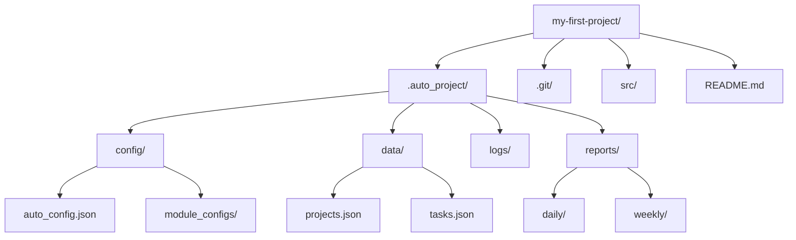
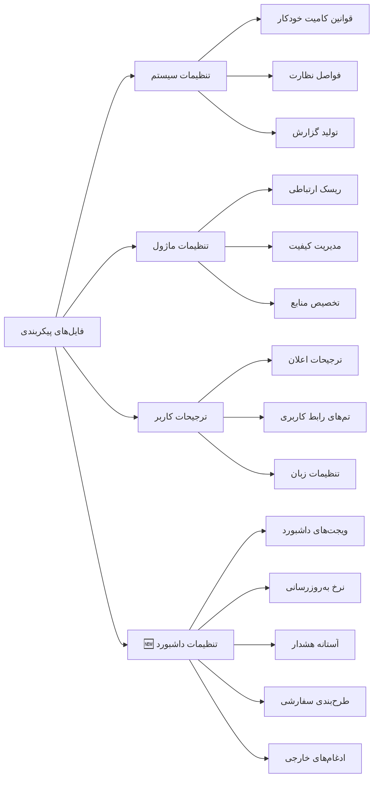
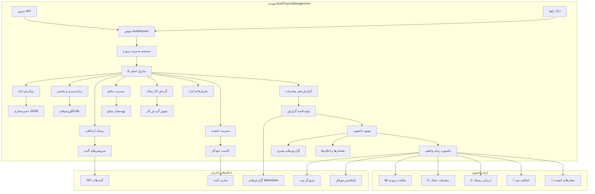
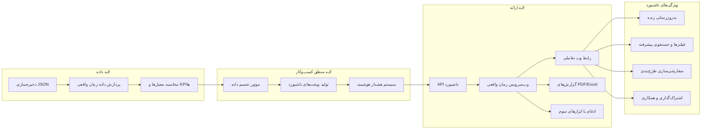
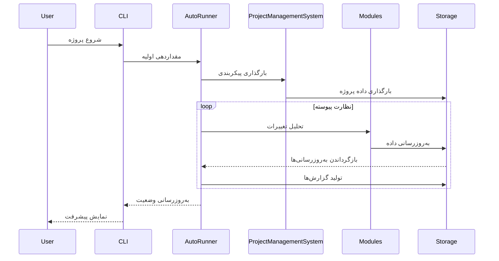
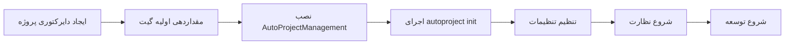
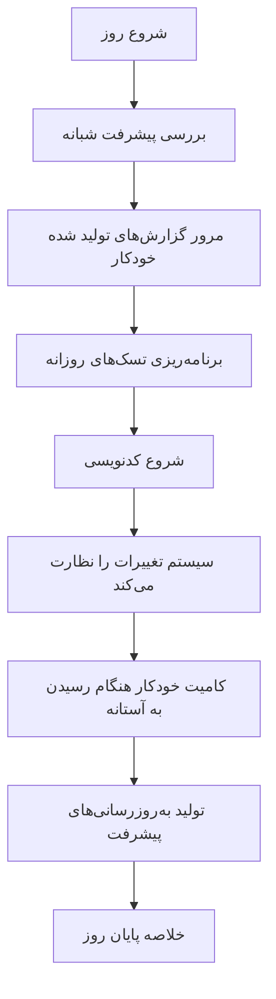
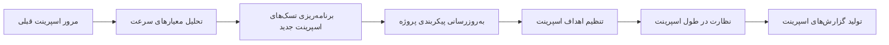

# AutoProjectManagement - راهنمای شروع سریع

## 🚀 راهنمای شروع سریع

به **AutoProjectManagement** خوش آمدید - راه حل جامع مدیریت پروژه خودکار شما با **داشبوردهای پیشرفته زمان واقعی**. این راهنما شما را در عرض چند دقیقه با توضیحات دقیق، نمودارها، مثال‌های عملی و **مدیریت بصری پروژه از طریق داشبوردهای هوشمند** راه‌اندازی می‌کند.

> 💡 **نکته کلیدی**: داشبوردهای AutoProjectManagement قلب سیستم مدیریت پروژه شما هستند و دید کاملی از سلامت، پیشرفت و عملکرد پروژه ارائه می‌دهند.

---

## 📋 فهرست مطالب
1. [پیش‌نیازها](#پیش‌نیازها)
2. [نصب](#نصب)
3. [راه‌اندازی اولین پروژه](#راه‌اندازی-اولین-پروژه)
4. [پیکربندی](#پیکربندی)
5. [استفاده پایه](#استفاده-پایه)
6. [درک سیستم](#درک-سیستم)
7. [گردش کارهای رایج](#گردش-کارهای-رایج)
8. [عیب‌یابی](#عیب‌یابی)
9. [مراحل بعدی](#مراحل-بعدی)

---

## 🔧 پیش‌نیازها

### نیازمندی‌های سیستم

| مؤلفه              | حداقل            | توصیه شده |
| ------------------ | ---------------- | --------- |
| **پایتون**         | 3.8+             | 3.9+      |
| **گیت**            | 2.20+            | 2.30+     |
| **سیستم عامل**     | لینوکس/مک/ویندوز | لینوکس/مک |
| **رم**             | 4GB              | 8GB+      |
| **فضای ذخیره‌سازی** | 1GB آزاد         | 5GB+ آزاد |

### ابزارهای مورد نیاز

```bash
# بررسی نسخه پایتون
python --version  # باید 3.8+ باشد

# بررسی نسخه گیت
git --version     # باید 2.20+ باشد

# بررسی pip
pip --version
```

---

## 📦 نصب

### گزینه 1: نصب از PyPI (توصیه شده)

```bash
# نصب از PyPI
pip install autoprojectmanagement

# تأیید نصب
autoproject --version
```

### گزینه 2: از منبع

```bash
# کلون کردن مخزن
git clone https://github.com/autoprojectmanagement/autoprojectmanagement.git
cd autoprojectmanagement

# نصب وابستگی‌ها
pip install -r requirements.txt

# نصب در حالت توسعه
pip install -e .
```

### گزینه 3: نصب داکر

```bash
# کشیدن تصویر داکر
docker pull autoprojectmanagement/autoprojectmanagement:latest

# اجرای کانتینر
docker run -v $(pwd):/workspace autoprojectmanagement/autoprojectmanagement
```

---

## 🎯 راه‌اندازی اولین پروژه

### مرحله 1: مقداردهی اولیه پروژه شما

```bash
# ایجاد دایرکتوری پروژه جدید
mkdir my-first-project && cd my-first-project

# مقداردهی اولیه مخزن گیت
git init

# مقداردهی اولیه AutoProjectManagement
autoproject init
```

### مرحله 2: ساختار پروژه

پس از مقداردهی اولیه، پروژه شما این ساختار را خواهد داشت:



### مرحله 3: پیکربندی پایه

اولین پیکربندی پروژه خود را ایجاد کنید:

```json
// .auto_project/config/auto_config.json
{
  "project": {
    "name": "اولین پروژه من با مدیریت خودکار",
    "description": "یادگیری AutoProjectManagement",
    "version": "1.0.0",
    "team_size": 1,
    "start_date": "2024-08-14",
    "target_date": "2024-09-14"
  },
  "automation": {
    "auto_commit": true,
    "commit_threshold": 5,
    "check_interval": 300,
    "generate_reports": true
  },
  "modules": {
    "enabled": ["all"]
  }
}
```

---

## ⚙️ پیکربندی

### نمای کلی پیکربندی



### بخش‌های کلیدی پیکربندی

#### 1. پیکربندی پروژه
```json
{
  "project": {
    "name": "string",
    "description": "string",
    "version": "string",
    "team_members": ["member1", "member2"],
    "milestones": [
      {
        "name": "فاز 1",
        "target_date": "2024-09-01",
        "deliverables": ["feature1", "feature2"]
      }
    ]
  }
}
```

#### 2. تنظیمات اتوماسیون
```json
{
  "automation": {
    "auto_commit": {
      "enabled": true,
      "threshold": 5,
      "exclude_patterns": ["*.log", "*.tmp"]
    },
    "monitoring": {
      "check_interval": 300,
      "file_extensions": ["*.py", "*.js", "*.md"]
    },
    "reporting": {
      "frequency": "daily",
      "format": "markdown",
      "recipients": ["team@company.com"]
    }
  }
}
```

#### 3. پیکربندی ماژول
```json
{
  "modules": {
    "communication_risk": {
      "enabled": true,
      "risk_threshold": 7,
      "notification_channels": ["slack", "email"]
    },
    "quality_management": {
      "enabled": true,
      "code_quality_threshold": 80,
      "test_coverage_minimum": 70
    }
  }
}
```

#### 4. 🆕 پیکربندی داشبورد
```json
{
  "dashboard": {
    "enabled": true,
    "port": 3000,
    "refresh_rate": 3000,
    "default_layout": "standard",
    
    "widgets": {
      "project_health": {
        "enabled": true,
        "position": "top-left",
        "refresh_interval": 5000,
        "metrics": ["completion", "quality", "risk"]
      },
      "task_progress": {
        "enabled": true,
        "position": "top-right",
        "show_burndown": true,
        "show_velocity": true
      },
      "team_performance": {
        "enabled": true,
        "position": "bottom-left",
        "show_individual_stats": true,
        "privacy_mode": false
      },
      "risk_assessment": {
        "enabled": true,
        "position": "bottom-right",
        "alert_threshold": 7,
        "notification_channels": ["dashboard", "email"]
      },
      "quality_metrics": {
        "enabled": true,
        "position": "center",
        "include": ["test_coverage", "code_quality", "bug_density"]
      }
    },
    
    "alerts": {
      "enabled": true,
      "risk_above_threshold": true,
      "progress_stalled": true,
      "quality_below_minimum": true,
      "milestone_approaching": true,
      "team_performance_issues": true
    },
    
    "integrations": {
      "slack": {
        "enabled": false,
        "webhook_url": "",
        "channel": "#project-alerts"
      },
      "email": {
        "enabled": true,
        "recipients": ["pm@company.com", "team@company.com"],
        "frequency": "daily"
      },
      "teams": {
        "enabled": false,
        "webhook_url": ""
      }
    },
    
    "appearance": {
      "theme": "light",
      "chart_style": "modern",
      "animation_enabled": true,
      "high_contrast_mode": false
    },
    
    "access_control": {
      "public_access": false,
      "allowed_ips": ["192.168.1.0/24"],
      "require_authentication": true,
      "session_timeout": 3600
    }
  }
}
```

### سفارشی‌سازی داشبورد

برای سفارشی‌سازی سریع داشبورد از دستورات زیر استفاده کنید:

```bash
# تغییر طرح‌بندی پیش‌فرض
autoproject config --set dashboard.default_layout="minimal"

# فعال‌سازی ویجت خاص
autoproject config --set dashboard.widgets.team_performance.enabled=true


autoproject config --set dashboard.refresh_rate=2000

# تغییر پورت داشبورد
autoproject config --set dashboard.port=8080

# اعمال تغییرات
autoproject config --apply
```
---

## 🎮 استفاده پایه

### رابط خط فرمان

#### دستورات ضروری

```bash
# مقداردهی اولیه پروژه جدید
autoproject init

# شروع نظارت
autoproject start

# توقف نظارت
autoproject stop

# بررسی وضعیت
autoproject status

# تولید گزارش
autoproject report --type daily

# به‌روزرسانی پیکربندی
autoproject config --edit

# مشاهده لاگ‌ها
autoproject logs --follow

# 🆕 دستورات داشبورد
autoproject dashboard --start    # راه‌اندازی سرور داشبورد
autoproject dashboard --stop     # توقف سرور داشبورد
autoproject dashboard --status   # بررسی وضعیت داشبورد
autoproject dashboard --open     # باز کردن داشبورد در مرورگر
autoproject dashboard --export   # خروجی گرفتن از داده‌های داشبورد
```

#### حالت تعاملی
```bash
# راه‌اندازی CLI تعاملی
autoproject interactive

# دستورات موجود:
# - create-project
# - add-task
# - view-progress
# - generate-report
# - configure-modules
# - 🆕 open-dashboard    # باز کردن داشبورد تعاملی
# - 🆕 customize-dashboard # سفارشی‌سازی داشبورد
# - 🆕 dashboard-metrics # مشاهده معیارهای داشبورد
```

### استفاده از API

#### مثال‌های REST API

```bash
# راه‌اندازی سرور API
autoproject api --port 8000

# دریافت وضعیت پروژه
curl http://localhost:8000/api/v1/projects/status

# افزودن تسک جدید
curl -X POST http://localhost:8000/api/v1/tasks \
  -H "Content-Type: application/json" \
  -d '{
    "title": "پیاده‌سازی ویژگی جدید",
    "description": "افزودن احراز هویت کاربر",
    "priority": "high",
    "estimated_hours": 8
  }'

# دریافت گزارش پیشرفت
curl http://localhost:8000/api/v1/reports/progress

# 🆕 APIهای داشبورد
curl http://localhost:8000/api/v1/dashboard/overview      # نمای کلی داشبورد
curl http://localhost:8000/api/v1/dashboard/metrics      # معیارهای زمان واقعی
curl http://localhost:8000/api/v1/dashboard/alerts       # هشدارهای فعال
curl http://localhost:8000/api/v1/dashboard/health       # سلامت پروژه
curl http://localhost:8000/api/v1/dashboard/team-performance # عملکرد تیم

# دریافت داده‌های داشبورد به صورت جریان
curl http://localhost:8000/api/v1/dashboard/stream

# سفارشی‌سازی داشبورد
curl -X POST http://localhost:8000/api/v1/dashboard/layout \
  -H "Content-Type: application/json" \
  -d '{
    "layout": "custom",
    "widgets": ["health", "progress", "risks", "team"],
    "refresh_rate": 5000
  }'
```

### دسترسی به داشبورد وب

پس از راه‌اندازی سرور داشبورد، می‌توانید از طریق مرورگر به آدرس زیر دسترسی پیدا کنید:

```bash
# آدرس پیش‌فرض داشبورد
http://localhost:3000/dashboard

# یا استفاده از دستور داخلی
autoproject dashboard --open
```

ویژگی‌های داشبورد وب:
- ✅ به‌روزرسانی زنده هر 3 ثانیه
- ✅ نمودارهای تعاملی و قابل کلیک
- ✅ فیلترهای پیشرفته بر اساس تاریخ، تسک، اعضا
- ✅ قابلیت ذخیره و اشتراک‌گذاری نمای سفارشی
- ✅ هشدارهای بصری و اعلان‌های push
- ✅ پشتیبانی از تم‌های تاریک و روشن

---

## 🧠 درک سیستم

### نمای کلی معماری سیستم



### معماری داشبورد



### جریان داده



### مؤلفه‌های کلیدی توضیح داده شده

#### 1. موتور AutoRunner
- **هدف**: نظارت پیوسته و اتوماسیون
- **فرکانس**: هر 5 دقیقه (قابل پیکربندی)
- **اقدامات**: اسکن فایل، محاسبه پیشرفت، کامیت خودکار، تولید گزارش

#### 2. سیستم مدیریت پروژه
- **هدف**: هماهنگ‌کننده مرکزی برای تمام عملیات پروژه
- **ویژگی‌ها**: مدیریت تسک، تخصیص منابع، ردیابی پیشرفت
- **ادغام**: اتصال تمام ماژول‌ها و سرویس‌ها

#### 3. سرویس AutoCommit
- **هدف**: کامیت‌های گیت خودکار بر اساس پیشرفت
- **تریگرها**: تغییرات فایل، تکمیل تسک، فواصل زمانی
- **پیکربندی**: تریگرهای مبتنی بر آستانه و زمان

---

## 🔄 گردش کارهای رایج

### گردش کار 1: راه‌اندازی پروژه جدید



### گردش کار 2: چرخه توسعه روزانه



### گردش کار 3: برنامه‌ریزی اسپرینت



---

## 📊 نظارت و گزارش‌ها

### گزارش‌های موجود

#### 1. گزارش پیشرفت روزانه
```markdown
# گزارش پیشرفت روزانه - 2024-08-14

## خلاصه
- **تسک‌های تکمیل شده**: 3/5
- **تغییرات کد**: 47 خط اضافه شده
- **سطح ریسک**: کم (2/10)
- **مایل‌استون بعدی**: 2 روز دیگر

## تجزیه دقیق
- **توسعه ویژگی**: 60% تکمیل شده
- **رفع باگ**: 80% تکمیل شده
- **مستندات**: 30% تکمیل شده

## توصیه‌ها
- تمرکز بر مستندات
- مرور پوشش تست
```

#### 2. خلاصه هفتگی
```markdown
# خلاصه هفتگی - هفته 33

## دستاوردها
- ✅ تکمیل ویژگی احراز هویت کاربر
- ✅ رفع 5 باگ بحرانی
- ✅ به‌روزرسانی مستندات

## معیارها
- **سرعت**: 15 استوری پوینت/هفته
- **امتیاز کیفیت**: 85/100
- **بهره‌وری تیم**: ↑ 20%

## هفته آینده
- پیاده‌سازی پردازش پرداخت
- بهینه‌سازی عملکرد
- بررسی امنیتی
```

### 🎯 داشبوردهای پیشرفته

#### نمای کلی داشبورد زمان واقعی

```mermaid
graph TB
    subgraph "داشبورد اصلی"
        A[📊 نمای کلی پروژه] --> B[📈 پیشرفت و معیارها]
        A --> C[⚠️ مدیریت ریسک]
        A --> D[👥 عملکرد تیم]
        A --> E[🔧 کیفیت کد]
    end
    
    subgraph "ویجت‌های تعاملی"
        B --> F[نمودار بورن‌داون]
        B --> G[سرعت اسپرینت]
        B --> H[تکمیل مایل‌استون]
        
        C --> I[هشدارهای ریسک]
        C --> 